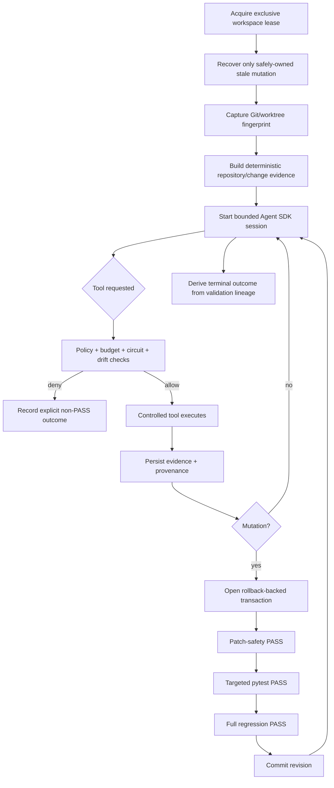

<div align="center">

# ƳƤ AI QA Automation Framework

### Evidence-First Agentic Quality Engineering

**Designed and engineered by Ƴunior Ƥortal (ƳƤ)**


**A production-oriented AI quality engineering framework that gives an LLM room to reason without giving it authority to invent evidence, weaken tests, bypass policy, or certify its own work.**

</div>

---

## The engineering thesis

The framework is built around one non-negotiable rule:

> **Model reasoning is not test evidence.**

Claude can investigate failures, form hypotheses, interpret change risk, select authorized tools, propose repairs, and design tests. Controlled systems independently own execution, evidence, authorization, mutation safety, validation, recovery, and the final runtime outcome.

```text
Claude reasons.
Controlled tools observe and execute.
Deterministic policy authorizes.
Validation decides what is proven.
```

This separation turns an LLM from an all-powerful test bot into a **bounded reasoning component inside a quality-engineering control system**.

## What the framework is designed to prevent

Agentic testing becomes dangerous when the same component can both change the evidence and judge whether its change succeeded. The ƳƤ AI QA Automation Framework is explicitly designed against that failure mode.

| Risk | Framework response |
|---|---|
| False product-defect attribution | Evidence-weighted deterministic classification before test-side repair |
| Model-declared success | Terminal truth is derived from deterministic validation lineage |
| Test weakening disguised as self-healing | Patch rules reject skip/xfail, assertion erosion, arbitrary sleeps, timeout inflation, tautologies, and broad suppression |
| Wrong-element locator repair | Same-DOM Playwright measurement + deterministic locator semantics + transactional validation |
| Meaningless generated tests | Coverage provenance + same-run plan binding + meaningful-assertion checks + execution closure |
| Regression under-selection | Mandatory coverage preservation; uncertainty broadens rather than shrinks regression |
| Prompt injection from target content | SUT/source/DOM/log/API/MCP content remains untrusted data |
| Tool or integration privilege expansion | Explicit tool inventory, fail-closed hooks, server identity checks, and action-level authorization |
| Concurrent or stale mutation | OS-backed workspace lease + content-sensitive fingerprint + revision-bound transactions |
| Evidence tampering or cross-run contamination | Confined run roots, immutable evidence identities, hashes, manifests, and hash-chained journals |
| Unbounded agent loops | Independent turn/tool/network/mutation/repetition/time/cost budgets and per-tool circuits |
| Production load accident | Explicit non-production policy, production-like hostname denial, controlled k6 script rules, and infrastructure-egress prerequisite |

## Architecture at a glance


### Trust boundaries

| Boundary | Trust posture | Examples |
|---|---|---|
| **Control plane** | Trusted authority | runtime package, policy, hooks, Skills, tool schemas, thresholds |
| **Target/SUT** | Untrusted evidence source | source, tests, DOM, logs, API responses, target `CLAUDE.md`, `.claude/`, `.mcp.json` |
| **External providers** | Approved transport/provider; returned content remains untrusted | GitHub MCP, Atlassian Rovo MCP |
| **Deployment infrastructure** | Independent enforcement boundary | process/container isolation, egress, identity, secrets, retention, devices, real targets |

Deep dives: [`ARCHITECTURE.md`](docs/ARCHITECTURE.md) · [`RUNTIME_CONTROL.md`](docs/RUNTIME_CONTROL.md) · [`SECURITY.md`](docs/SECURITY.md) · [`THREAT_MODEL.md`](docs/THREAT_MODEL.md)

## Production-grade control model

The live path uses the official Claude Agent SDK, pinned to `claude-agent-sdk==0.2.143`, with `claude-sonnet-5` as the default model identifier.

The runtime deliberately narrows authority:

- generic built-in tools are not exposed as the working surface;
- Bash/Edit/Write/Web-style built-ins are explicitly denied;
- exactly five trusted Claude Skills are allowlisted;
- `strict_mcp_config=True` prevents ambient MCP inheritance;
- every tool request passes deterministic authorization and runtime hooks;
- approval-required operations fail closed during unattended execution;
- tool, network, mutation, repetition, wall-time, per-tool-time, turn, and model-cost limits remain independent;
- canonical QA state is persisted separately from conversational history;
- process-control state is persisted separately from QA decision state.

### Narrow internal QA surface

The framework exposes 18 purpose-built in-process tools covering:

| Domain | Controlled capability |
|---|---|
| Repository | Git/worktree inspection and change context |
| Tests | bounded pytest execution and evidence capture |
| API | allowlisted HTTP probing with read-only default |
| Browser | Playwright accessibility, screenshot, console, network, and locator evidence |
| Failure intelligence | deterministic first-pass causal classification |
| Source context | bounded test-file reads and coverage search |
| Test design | evidence-bound generation planning |
| Regression | risk-based prioritization with mandatory coverage preservation |
| Test quality | deterministic Python test-quality review |
| Generation | guarded Python/JavaScript/TypeScript test creation |
| Self-healing | same-DOM locator verification, proposal, and locator-only patching |
| Contracts | JSON Schema validation |
| CI | normalized CI-failure analysis |
| Mobile | Appium runtime/capability inspection |
| Performance | controlled k6 execution and threshold assessment |

There is intentionally **no generic existing-test rewrite tool** in the live agent surface.

## Evidence-first runtime lifecycle



The model never gets a shortcut around this lifecycle.

## Runtime result contract

The framework distinguishes terminal outcomes from validation outcomes and provider-health outcomes. Those values describe **live framework behavior**, not development-progress labels.

Key terminal outcomes include:

- `SUCCESS` — deterministic closure exists for every active gate required by the revision;
- `FAILURE` — a definitive active validation or execution failure exists;
- `BLOCKED` — a safety/integrity prerequisite prevented continuation;
- `POLICY_DENIED` — requested authority is outside policy;
- `INFRASTRUCTURE_FAILURE` — runtime integrity cannot be guaranteed;
- `BUDGET_EXCEEDED` / `CANCELLED` — bounded execution terminated explicitly;
- `NOT_VERIFIED` — evidence is absent, incomplete, or contradictory, so success cannot be proven.

Individual validations additionally preserve `NOT_EXECUTED` and `NOT_OBSERVED` rather than translating absence into green.

For the complete semantics, revision supersession rules, provider outcomes, and mutation closure contract, see **[`docs/RESULT_CONTRACT.md`](docs/RESULT_CONTRACT.md)**.

## Deterministic change intelligence

Before model reasoning, the bootstrap layer can persist:

- target Git `HEAD` and content-sensitive worktree fingerprint;
- trusted base ref and immutable merge-base provenance;
- committed plus dirty/untracked change union;
- changed domains and recommended test layers;
- repository/test/API/data/container/IaC/mobile/CI topology;
- dependency-manifest paths, sizes, and hashes;
- CODEOWNERS routing context;
- explainable test-impact candidates;
- conservative OpenAPI/Swagger compatibility drift.

With `AI_QA_BASE_REF=origin/main`, a clean feature branch is still analyzed against its committed merge-base delta. A clean worktree is never confused with “no change.”

Test-impact output is advisory. Low confidence, truncated scans, or incomplete dependency knowledge broaden the regression recommendation.

See [`docs/CHANGE_INTELLIGENCE.md`](docs/CHANGE_INTELLIGENCE.md).

## Evidence-driven failure investigation

The deterministic classifier distinguishes evidence patterns for:

- application defects;
- test automation defects;
- locator/UI-contract changes;
- test-data failures;
- timing/flakiness;
- environment failures;
- external dependency failures;
- authentication/configuration failures;
- performance regressions;
- insufficient evidence.

A missing element therefore does **not** automatically trigger locator repair. If network evidence shows the application failed to render the expected state, the framework preserves the application/network failure instead of “fixing” the test first.

## Safe self-healing

Self-healing is intentionally narrow: **semantic locator maintenance only**.

Candidate preference is conservative:

```text
stable test id
    > accessible role/name
    > label
    > placeholder
    > exact text
    > semantic CSS
    >>> positional / XPath-style structure
```

The authorization chain requires:

1. a deterministic failure class compatible with locator repair;
2. Playwright measurement of original and candidate locators in the same DOM;
3. a unique candidate;
4. supported literal locator syntax;
5. **deterministic semantic-intent overlap** between the original and replacement locator;
6. policy-owned stability scoring rather than model-supplied confidence;
7. exact file-hash binding;
8. locator-only mutation;
9. patch-safety, targeted pytest, and full-regression closure.

A model can propose a candidate and assign confidence to it, but that confidence cannot authorize the mutation.

## Coverage-aware test generation

Generation is provenance-bound:

```text
observed repository coverage
→ identified gap
→ same-run test plan
→ guarded test creation
→ deterministic quality review
→ targeted execution
→ regression closure
```

Generated tests are checked for meaningful assertions and common intent-eroding shortcuts. Assertion-looking text in comments or strings does not satisfy observability requirements. Unknown product behavior is not invented merely to create a passing test.

## API, browser, performance, and mobile controls

### API

- explicit trusted host allowlist;
- host-only configuration is canonicalized and rejects wildcards/URL-shaped entries;
- `GET`, `HEAD`, and `OPTIONS` are the default method surface;
- mutating methods require separate explicit enablement;
- redirects are disabled;
- ambient proxy inheritance is disabled;
- response size is bounded and evidence is sanitized.

### Browser / Playwright

- initial navigation is host-authorized;
- HTTP(S) subresources are routed through the host policy;
- WebSockets are routed through the same host boundary;
- service workers are disabled in the evidence context so routing remains observable;
- final navigation is rechecked against the allowlist;
- screenshots are retained as hashed `RAW` artifacts rather than mislabeled as sanitized text.

### Performance / k6

- production and production-like targets are denied;
- the script must consume injected `BASE_URL` / `TARGET_URL`;
- remote modules, `k6/x/*`, local `open()`, unrelated literal hosts, and unsupported imports are rejected;
- runtime duration is bounded;
- non-local execution requires an explicit infrastructure-egress prerequisite;
- PASS/FAIL comes from predefined thresholds and measured metrics.

### Mobile / Appium

Appium is integrated through controlled runtime/capability inspection, with device/emulator/cloud/application execution kept inside the target deployment's explicit mobile test boundary.

## Transactional mutation and crash recovery

Autonomous writes use optimistic concurrency plus rollback ownership:

- the target must be a Git-backed isolated worktree;
- an exclusive OS-backed lease prevents cooperating runs from sharing mutation authority;
- the workspace fingerprint must still match the analyzed baseline;
- absolute, traversal, workspace-escape, and symlink mutation paths are rejected;
- prior bytes are snapshotted outside the SUT;
- rollback backups are path-confined and hash-verified;
- a new mutation cannot begin while the prior revision is unresolved;
- stale crash recovery requires an exact fingerprint match and the same non-symlink ownership rules;
- newer human/out-of-band work wins over automated rollback when ownership is ambiguous.

See [`docs/RUNTIME_CONTROL.md`](docs/RUNTIME_CONTROL.md).

## Evidence, traceability, and observability

Every run has a durable evidence surface under:

```text
artifacts/<run_id>/
```

The framework can persist:

- canonical `state.json`;
- separate `runtime.json` process-control state;
- `evidence-manifest.json`;
- content-addressed artifacts;
- append-only `journal.jsonl` with hash chaining;
- optional regulated traceability records;
- evidence-to-validation lineage;
- model/SDK/configuration/target provenance;
- token/cost information when supplied by the provider;
- unsigned content-integrity attestations.

Inspection commands:

```bash
ai-qa recover artifacts/run-<id>
ai-qa lineage artifacts/run-<id>
ai-qa lineage artifacts/run-<id> --format dot
ai-qa attest artifacts/run-<id>
ai-qa contract-diff --baseline old-openapi.yaml --current new-openapi.yaml
```

Hashes and attestations prove integrity properties of the persisted record; they do not become identity signatures, compliance certificates, or test results.

See [`docs/TRACEABILITY.md`](docs/TRACEABILITY.md).

## Vendor-official MCP integrations

External MCP is restricted to explicitly approved vendor integrations.

| Integration | Trusted path | Runtime posture |
|---|---|---|
| GitHub | `github/github-mcp-server:v1.0.5` | disabled by default; server-side read-only defense in depth |
| Jira / Confluence | Atlassian Rovo MCP `/v1/mcp/authv2` | disabled by default; action-level policy still applies |

Server identity never grants blanket tool authority. External action names are normalized conservatively so destructive verbs dominate writes, writes dominate reads, and mixed names cannot smuggle higher authority behind a read prefix. Provider content remains untrusted evidence after retrieval.

See [`docs/MCP.md`](docs/MCP.md).

## Evaluation architecture

The framework is evaluated as software—not by whether its prose sounds convincing.

The repository defines:

- unit tests for models, policy, redaction, evidence, state, budgets, recovery, and intelligence;
- deterministic integration tests for evidence/runtime flows;
- dedicated policy and security tests;
- a fixed **34-scenario primary adversarial corpus**;
- a physically separate **H-series holdout corpus**;
- Playwright-marked tests separated from the default pytest path;
- credentialed model tests separated behind explicit configuration;
- predefined hard-safety thresholds that are not rewritten to accommodate a failing implementation.

Repository commands:

```bash
make quality
make test
make eval
make security
make verify-local
make holdout
```

See [`docs/EVALUATION.md`](docs/EVALUATION.md).

## Deterministic reference SUT

`examples/reference_sut/` is a compact FastAPI application that makes important evidence paths reproducible:

| Mode | Purpose |
|---|---|
| `pass` | normal checkout behavior |
| `app-defect` | controlled business/application defect |
| `outdated-locator` | stale locator while business behavior remains intact |
| `api-failure` | controlled HTTP 500 |
| `timing` | bounded deterministic delay |
| `invalid-data` | out-of-contract data produces validation failure |
| `prompt-injection` | instruction-shaped DOM content remains untrusted evidence |

The reference SUT is test data for the control architecture, never part of the trusted control plane.

## Quick start

### Local tooling

```bash
python -m venv .venv
source .venv/bin/activate
python -m pip install --upgrade pip
python -m pip install -e '.[dev]'

ai-qa doctor
ai-qa demo
```

On Windows PowerShell, activate with `.venv\Scripts\Activate.ps1`.

`.env.example` is a reference template only; runtime settings do not automatically load a repository `.env` file.

### Live Claude Agent SDK session

```bash
export ANTHROPIC_API_KEY='...'
export AI_QA_CONTROL_ROOT='/path/to/ai-qa-automation'
export AI_QA_ARTIFACT_ROOT='/path/to/ai-qa-artifacts'
export AI_QA_BASE_REF='origin/main'

ai-qa agent \
  --control-root "$AI_QA_CONTROL_ROOT" \
  --workspace /path/to/isolated/sut-worktree \
  'Investigate the failing checkout test. Do not modify tests unless evidence proves a test defect.'
```

The control root, artifact root, and target workspace are separate trust domains. Exact configuration and credential boundaries are documented in [`docs/SETUP.md`](docs/SETUP.md).

## Operating modes

| Mode | Purpose | Primary authority |
|---|---|---|
| Local deterministic tooling | inspection, demo, tests, evaluations, security tooling | repository-contained deterministic code |
| Live Claude session | bounded agentic investigation and authorized QA actions | Agent SDK reasoning + deterministic runtime authority |
| GitHub MCP | vendor-official repository context | external provider + local action policy |
| Atlassian MCP | vendor-official Jira/Confluence context | external provider + local action policy |
| Browser/API/load/mobile target | target-specific validation | controlled adapter + deployment environment |
| Regulated traceability mode | additional engineering audit/retention labeling | deterministic persistence controls |

## Repository layout

```text
.
├── CLAUDE.md                       # trusted engineering/agent rules
├── README.md
├── LICENSE
├── SECURITY.md
├── CONTRIBUTING.md
├── .env.example
├── .claude/
│   ├── settings.json
│   ├── hooks/
│   └── skills/                     # five trusted QA Skills
├── .mcp.json
├── .github/
│   ├── CODEOWNERS
│   └── workflows/ci.yml            # operator-dispatched workflow
├── src/ai_qa_automation/
│   ├── agent.py                    # Agent SDK orchestration + terminal truth
│   ├── models.py                   # state/evidence/result contracts
│   ├── policy.py                   # deterministic authorization
│   ├── evidence.py                 # immutable evidence/artifact registry
│   ├── intelligence/               # classification/healing/generation/change logic
│   ├── integrations/               # approved external MCP adapters
│   ├── runtime/                    # leases, budgets, hooks, recovery, lineage
│   └── tools/                      # narrow execution/evidence adapters
├── tests/
├── evals/
├── examples/reference_sut/
├── performance/
└── docs/
```

## Documentation

| Topic | Document |
|---|---|
| Architectural authority, trust, and execution flow | [`ARCHITECTURE.md`](docs/ARCHITECTURE.md) |
| Runtime terminal/validation/provider semantics | **[`RESULT_CONTRACT.md`](docs/RESULT_CONTRACT.md)** |
| Transactional mutation and crash recovery | [`RUNTIME_CONTROL.md`](docs/RUNTIME_CONTROL.md) |
| Security architecture | [`SECURITY.md`](docs/SECURITY.md) |
| Threat model and adversarial assumptions | [`THREAT_MODEL.md`](docs/THREAT_MODEL.md) |
| Trusted setup and credentials | [`SETUP.md`](docs/SETUP.md) |
| Operating the framework | [`OPERATIONS.md`](docs/OPERATIONS.md) |
| Change intelligence and regression evidence | [`CHANGE_INTELLIGENCE.md`](docs/CHANGE_INTELLIGENCE.md) |
| Evaluation and holdout governance | [`EVALUATION.md`](docs/EVALUATION.md) |
| Claude Skill contracts | [`SKILLS.md`](docs/SKILLS.md) |
| External MCP policy | [`MCP.md`](docs/MCP.md) |
| Evidence lineage and attestations | [`TRACEABILITY.md`](docs/TRACEABILITY.md) |
| Evidence/deployment trust boundaries | [`VERIFICATION_BOUNDARIES.md`](docs/VERIFICATION_BOUNDARIES.md) |
| Production-readiness architecture | [`PRODUCTION_READINESS.md`](docs/PRODUCTION_READINESS.md) |
| Design boundaries and non-claims | [`LIMITATIONS.md`](docs/LIMITATIONS.md) |
| Failure diagnosis without weakening controls | [`TROUBLESHOOTING.md`](docs/TROUBLESHOOTING.md) |
| End-to-end technical review path | [`TECHNICAL_WALKTHROUGH.md`](docs/TECHNICAL_WALKTHROUGH.md) |

## GitHub Actions

`.github/workflows/ci.yml` is operator-dispatched with `workflow_dispatch`. It defines quality/type checks, deterministic pytest, the primary adversarial evaluator, holdout evaluation, security scanning, Playwright reference-SUT coverage, and an optional credentialed Agent SDK smoke path under explicit operator control.

## Security and contributions

Security reports should follow [`SECURITY.md`](SECURITY.md). Engineering changes should preserve the authority hierarchy and test-integrity rules in [`CONTRIBUTING.md`](CONTRIBUTING.md) and [`CLAUDE.md`](CLAUDE.md).

The governing rule for every extension is:

> **Add capability without silently adding authority. Add intelligence without weakening evidence. Add automation without weakening test intent.**

## License

The **ƳƤ AI QA Automation Framework** is licensed under the [MIT License](LICENSE).

**Copyright (c) 2026 Ƴunior Ƥortal (ƳƤ).**
