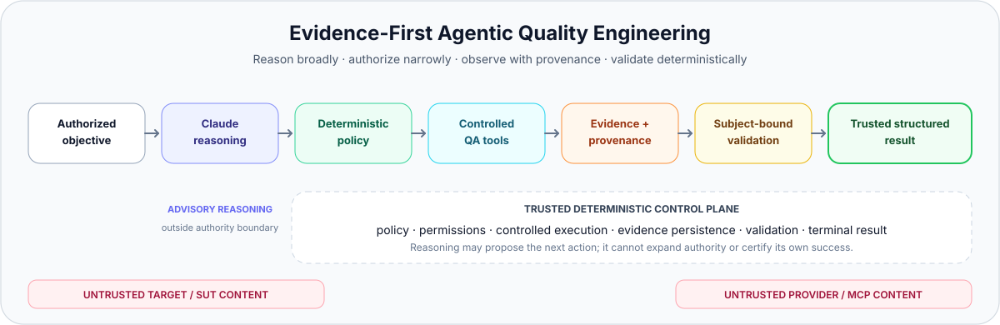
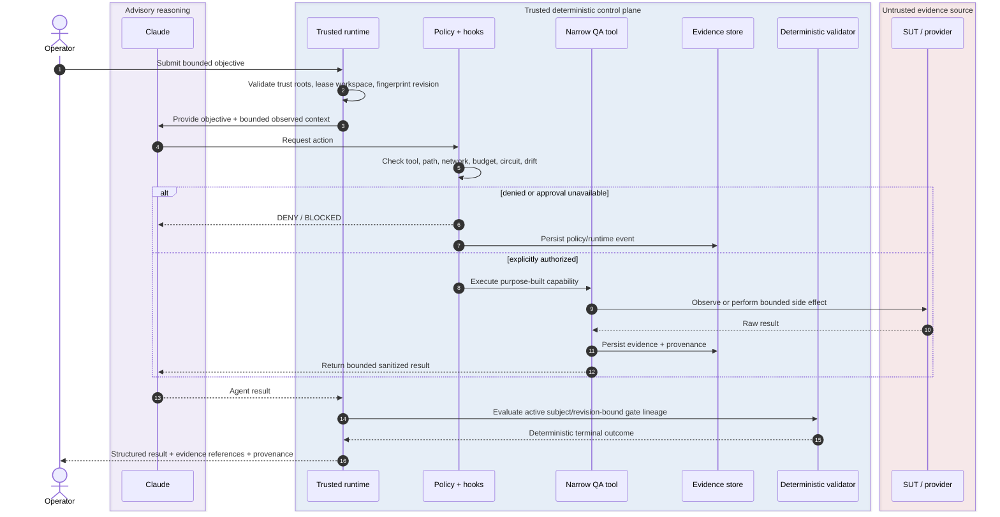
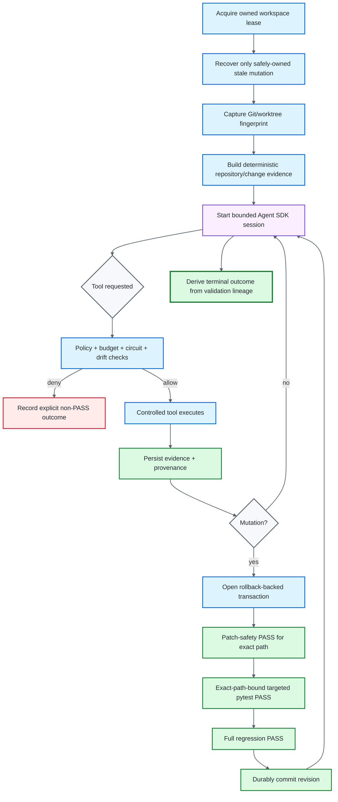

<div align="center">

# ƳƤ AI QA Automation Framework

### Evidence-First Agentic Quality Engineering

**Designed and engineered by Ƴunior Ƥortal (ƳƤ)**

[](pyproject.toml)
[](LICENSE)
[](docs/SETUP.md)
[](docs/ARCHITECTURE.md)

**A production-oriented agentic quality engineering control system where Claude can plan, investigate, and adapt while deterministic policy governs authority, controlled tools produce provenance-bound evidence, and subject-bound validation retains terminal authority.**

[Documentation](docs/README.md) · [Architecture](docs/ARCHITECTURE.md) · [Runtime Result Contract](docs/RESULT_CONTRACT.md) · [Runtime Control](docs/RUNTIME_CONTROL.md) · [Security](docs/SECURITY.md) · [CI/CD](docs/CI_CD.md) · [Setup](docs/SETUP.md) · [Technical Walkthrough](docs/TECHNICAL_WALKTHROUGH.md)

</div>

---

> [!IMPORTANT]
> **The model is a reasoner, not the test oracle. Reasoning is advisory. Observations are provenance-bound. Authority is deterministic. Success requires closure.**
>
> Claude may interpret observations, form hypotheses, rank risk, and choose among explicitly authorized actions. It cannot convert untrusted context into authority, self-approve a side effect, weaken the validation contract, or certify terminal success. Controlled tools observe and execute; policy authorizes; deterministic validators decide what the system can prove.[^industry]

## At a glance

| Engineering surface | Framework contract |
|---|---|
| **Runtime** | Python 3.11+ · `claude-agent-sdk==0.2.136` · default model identifier `claude-sonnet-5` |
| **Reasoning boundary** | the LLM acts as planner and diagnostician; it is neither the test oracle nor terminal authority |
| **Controlled tool surface** | 18 least-privilege, purpose-built in-process QA tools; no generic autonomous Bash/Edit/Write/Web authority |
| **Trusted Skills** | exactly five allowlisted Claude Skills |
| **Live mutation boundary** | Python/pytest-backed test mutation only; reusable libraries may understand additional test syntaxes without widening runtime authority |
| **Mutation closure** | exact-path patch safety + exact-path targeted pytest + full regression at one revision |
| **Evidence** | run-confined state, immutable identities, manifests, content hashes, artifacts, lineage, append-only hash-chained journal, optional regulated audit chain |
| **Security posture** | fail-closed authorization, explicit trust roots, bounded resources, untrusted external context, independent deployment controls |
| **Network posture** | exact host allowlists, read-only API default, browser routing controls, independent k6 egress prerequisite |
| **External MCP** | explicitly approved vendor integrations; server identity never grants blanket authority and returned content remains untrusted evidence |
| **Evaluation** | deterministic tests, adversarial primary corpus, repository-visible sequestered H-series readiness corpus, frozen safety thresholds |
| **Workflow governance** | automatic PR validation is read-only development evidence; owner trusted dispatch validates exact prospective merges, while protected `Trusted PR Gate` is designed for a main-only dedicated GitHub App identity with exact live subject revalidation |
| **License** | MIT |

**On this page:** [Engineering thesis](#engineering-thesis) · [Architecture](#architecture-at-a-glance) · [Quick start](#quick-start) · [Control model](#production-control-model) · [Runtime truth](#runtime-result-contract) · [AI-assisted QA](#ai-assisted-qa-with-deterministic-closure) · [Safety boundaries](#safety-critical-boundaries) · [Evidence](#evidence-traceability-and-attestation) · [Evaluation](#evaluation-architecture) · [Documentation](#documentation-map)

> [!TIP]
> **Reviewing the engineering rather than installing it?** Read [Architecture](docs/ARCHITECTURE.md) → [Runtime Result Contract](docs/RESULT_CONTRACT.md) → [Runtime Control](docs/RUNTIME_CONTROL.md) → [Security](docs/SECURITY.md) → [CI/CD](docs/CI_CD.md) → [Technical Walkthrough](docs/TECHNICAL_WALKTHROUGH.md). The [documentation hub](docs/README.md) provides additional role-specific paths.

<details>
<summary><strong>Reviewer checklist — trace the trust model in code</strong></summary>

Use these as inspection prompts; the checkboxes are not runtime results.

- [ ] Trace one bounded objective from `agent.py` through permission handling to a purpose-built QA tool.
- [ ] Verify that SUT, repository, DOM, API, log, and MCP content can contribute evidence without acquiring control-plane authority.
- [ ] Follow one mutation from proposal through exact-path patch safety, targeted pytest, full regression, and durable commit/rollback closure.
- [ ] Confirm that terminal `SUCCESS` is derived from active validation lineage rather than model prose or provider health.
- [ ] Inspect independent budgets, tool circuits, workspace ownership, path confinement, and network boundaries for fail-closed behavior.
- [ ] Compare the primary adversarial corpus with the repository-visible sequestered H-series readiness cases and frozen safety thresholds.

</details>

---

## Engineering thesis

```text
Claude reasons.
Deterministic policy authorizes.
Controlled tools observe and act.
Evidence carries provenance.
Subject-bound validation owns terminal truth.
```

The ƳƤ AI QA Automation Framework treats an LLM as a **bounded planner and diagnostician inside a quality-engineering control system**—not as the test oracle, authorization engine, or system of record. Model reasoning is intentionally separated from the systems that own execution, evidence acquisition, side-effect authorization, mutation persistence, recovery, and terminal outcome.

That separation of duties is the central design decision. Agentic testing becomes unsafe when the same component can modify the subject, interpret the evidence, grant itself permission, and declare its own work successful. Here, the component that proposes an action cannot manufacture the authority or proof required to close it.

### Four contracts govern the framework

| Contract | Question | Authority |
|---|---|---|
| **Authority** | What may the agent do? | deterministic policy, hooks, permissions, budgets |
| **Evidence** | What was actually observed? | controlled tools, manifests, artifacts, hashes, provider responses |
| **Mutation** | When may automated code changes persist? | path ownership, rollback transaction, revision-bound validation closure |
| **Outcome** | What may be called successful? | deterministic validation lineage and terminal evaluation |

> [!NOTE]
> The architecture is deliberately fail-closed: **uncertainty reduces authority**. Missing evidence does not become green. Ambiguous ownership does not become permission. Incomplete validation does not become success.

### What the architecture is designed to prevent

| Failure mode | Deterministic response |
|---|---|
| Model-declared success | terminal truth comes from deterministic gate lineage, never persuasive prose |
| False product-defect attribution | evidence-weighted deterministic classification before test-side repair |
| Test weakening disguised as self-healing | patch rules reject skip/xfail, assertion erosion, arbitrary sleeps, timeout inflation, tautologies, and broad suppression |
| Wrong-element locator repair | same-DOM Playwright measurement + deterministic semantic intent + transactional validation |
| Meaningless generated tests | coverage provenance + conservative planning + meaningful-assertion checks + execution closure |
| Regression under-selection | mandatory coverage is preserved; uncertainty broadens rather than shrinking regression |
| Prompt injection from target or provider content | instruction-shaped SUT/source/DOM/log/API/MCP/repository content remains untrusted data and cannot redefine policy |
| Tool or integration privilege expansion | least-privilege tool inventory + fail-closed hooks + vendor identity checks + action-level authorization |
| Concurrent or stale mutation | OS-backed workspace lease + content-sensitive fingerprint + rollback-backed revision transaction |
| Wrong-subject validation | targeted pytest must explicitly select the exact pending mutation path and revision |
| Filesystem alias/tamper attacks | non-symlink ownership checks cover mutation, rollback, evidence, journal, lease, recovery, and attestation paths |
| Cross-run evidence contamination | confined run roots + immutable evidence identities + manifests + hashes + hash-chained journals |
| Unbounded agent loops | independent turn/tool/network/mutation/repetition/time/cost budgets + per-tool circuits |
| Production load accident / k6 egress | non-production target policy + script restrictions + independently enforced egress |

---

## Architecture at a glance

<picture>
  <source media="(prefers-color-scheme: dark)" srcset="docs/assets/architecture-banner-dark.svg">
  <source media="(prefers-color-scheme: light)" srcset="docs/assets/architecture-banner-light.svg">
  
</picture>

The banner summarizes the control contract. The graph below exposes the structural trust boundaries in a source-reviewable form.


**Diagram key:** purple = advisory reasoning · blue = deterministic authority · green = evidence/validation · red dashed = untrusted evidence source. Labels and boundaries carry the same meaning so color is never the only signal.

<details>
<summary><strong>Expand the runtime request → evidence → validation sequence</strong></summary>



</details>

### Trust boundaries

| Boundary | Trust posture | Examples |
|---|---|---|
| **Control plane** | trusted authority | runtime package, policy, hooks, Skills, tool schemas, deterministic thresholds |
| **Target / SUT** | untrusted data and evidence source | source, tests, DOM, logs, API responses, target `CLAUDE.md`, `.claude/`, `.mcp.json` |
| **External providers** | approved transport/provider; privileges remain tool-gated and returned content remains untrusted | GitHub MCP, Atlassian Rovo MCP |
| **Deployment infrastructure** | independent enforcement boundary | process/container isolation, egress, identity, secrets, retention, devices, real targets, GitHub App/Environment/ruleset configuration |

> [!WARNING]
> Application-layer guardrails are defense in depth, not a substitute for deployment controls. High-assurance process isolation, network egress, secret management, provider identity, retention, devices, real target environments, and repository merge controls remain deployment-owned enforcement boundaries rather than claims manufactured by repository code.

Deep dives: [Architecture](docs/ARCHITECTURE.md) · [Runtime Control](docs/RUNTIME_CONTROL.md) · [Security](docs/SECURITY.md) · [Threat Model](docs/THREAT_MODEL.md)

---

## Quick start
### Local deterministic tooling

Repository verification is intentionally bound to the committed interpreter-specific development lock. For the shortest reproducible path on macOS/Linux, use an exact supported interpreter and the repository-owned installer:

```bash
python3.11 -m venv .venv
source .venv/bin/activate
make install

ai-qa doctor
ai-qa demo
```

`make install` selects the matching committed `requirements/dev-py311.lock` or `requirements/dev-py313.lock`, enforces package hashes, installs the project non-editably without dependency resolution, and runs `pip check`. Windows PowerShell and deliberate lock-update procedures are documented in [Setup](docs/SETUP.md) and [Supply-Chain Integrity](docs/SUPPLY_CHAIN.md).

`.env.example` is a reference template only; runtime settings do not automatically load a repository `.env` file.

### Live Claude Agent SDK session

```bash
export ANTHROPIC_API_KEY='...'
export AI_QA_CONTROL_ROOT='/path/to/ai-qa-automation'
export AI_QA_ARTIFACT_ROOT='/path/to/ai-qa-artifacts'
export AI_QA_BASE_REF='origin/main'

ai-qa agent \
  --control-root "$AI_QA_CONTROL_ROOT" \
  --workspace /path/to/isolated/sut-worktree \
  'Investigate the failing checkout test. Do not modify tests unless evidence proves a test defect.'
```

The control root, artifact root, and target workspace are separate trust domains. Exact configuration and credential boundaries are documented in [Setup and Configuration](docs/SETUP.md).

### Controlled k6 execution

Because a JavaScript workload can construct destinations dynamically, every k6 execution requires a separately enforced egress boundary:

```bash
export AI_QA_K6_EXTERNAL_EGRESS_ENFORCED=true
```

Set that assertion only when the runtime environment actually enforces the intended outbound-network policy. The variable records an external prerequisite; it does not create a firewall.

---

## Production control model

The live path uses `claude-agent-sdk==0.2.136` with `claude-sonnet-5` as the default model identifier. It is built around **least privilege and fail-closed authorization**: model capability is deliberately broader than runtime authority.

The runtime narrows that authority explicitly:

- generic built-in tools are removed from the working authority surface;
- Bash/Edit/Write/Web-style built-ins are explicitly denied;
- exactly five trusted Claude Skills are allowlisted;
- `strict_mcp_config=True` prevents ambient MCP inheritance;
- every controlled tool request passes deterministic authorization and runtime hooks;
- approval-required operations fail closed during unattended execution;
- tool, network, mutation, repetition, wall-time, per-tool-time, turn, and model-cost limits remain independent;
- canonical QA decision state is persisted separately from conversation history;
- process-control state is persisted separately from QA decision state.

### Narrow internal QA surface

The framework exposes 18 purpose-built in-process tools:

| Domain | Controlled capability |
|---|---|
| Repository | Git/worktree inspection and change context |
| Tests | bounded pytest execution and evidence capture |
| API | allowlisted HTTP probing with read-only default |
| Browser | Playwright accessibility, screenshot, console, network, and locator evidence |
| Failure intelligence | deterministic first-pass causal classification |
| Source context | bounded test-file reads and coverage search |
| Test design | evidence-bound generation planning |
| Regression | risk-based prioritization with mandatory coverage preservation |
| Test quality | deterministic Python test-quality review |
| Generation | guarded live Python test creation; reusable patch utilities also understand JS/TS test artifacts |
| Self-healing | same-DOM locator verification, proposal, and Python locator-only live mutation |
| Contracts | JSON Schema validation |
| CI | normalized CI-failure analysis |
| Mobile | Appium runtime/capability inspection |
| Performance | controlled k6 execution and deterministic threshold assessment |

> [!NOTE]
> **Library capability is not runtime authority.** The reusable patching library can validate Python/JavaScript/TypeScript test artifacts, but **live autonomous mutation is intentionally Python/pytest-backed** because that is the language path with deterministic commit closure. The runtime does not claim deterministic commit closure for a language it cannot execute through its controlled validation adapter.

There is intentionally **no generic existing-test rewrite tool** in the live agent surface.

---

## Evidence-first runtime lifecycle



A targeted run against an unrelated file is diagnostic evidence; it cannot certify the pending mutation.

### Mutation persistence is a transaction, not an edit

For a changed revision to persist, the runtime requires all of the following at the **same revision**:

1. deterministic patch-safety `PASS` bound to the exact changed path;
2. targeted pytest `PASS` explicitly selecting that same path;
3. full-regression pytest `PASS`;
4. no conflicting active validation at that revision; and
5. durable transaction metadata that can be safely committed.

Pending transaction metadata is persisted before the mutation tool may execute. Commit/rollback closure is persisted before rollback-backup cleanup. The design prefers an orphan cleanup artifact over the unsafe inverse: discarded rollback bytes while durable metadata still says the mutation is pending.

```mermaid
stateDiagram-v2
    direction LR
    accTitle: Transactional mutation and crash-recovery state machine
    accDescr: A mutation starts only from an owned baseline. It must pass exact-path patch safety, exact-path-bound targeted pytest, and full regression before commit. Failure or incomplete proof rolls back. A crash can recover automatically only when workspace ownership, fingerprint, paths, and backup integrity remain provable; otherwise the runtime blocks for manual review.

    [*] --> Baseline: owned lease + fingerprint

    Baseline --> Pending: authorized mutation + owned rollback snapshot
    Baseline --> Blocked: drift / policy denial / path ambiguity

    Pending --> PatchSafe: exact-path patch-safety PASS
    Pending --> Rollback: tool failure / terminal without closure

    PatchSafe --> Targeted: exact-path-bound pytest PASS
    PatchSafe --> Rollback: safety FAIL / incomplete

    Targeted --> Regression: full-regression pytest PASS
    Targeted --> Rollback: targeted FAIL / unbound / incomplete

    Regression --> Committed: deterministic revision closure
    Regression --> Rollback: regression FAIL / incomplete

    Rollback --> Baseline: prior bytes restored / new file removed
    Rollback --> IntegrityFailure: restore ownership/integrity uncertain

    Pending --> Crashed: process exit
    PatchSafe --> Crashed
    Targeted --> Crashed
    Regression --> Crashed

    Crashed --> Recovered: fingerprint + ownership + backup verified
    Recovered --> Baseline: stale mutation reverted
    Crashed --> ManualReview: newer work / ownership ambiguity

    classDef active fill:#ddf4ff,stroke:#0969da,color:#24292f,stroke-width:2px
    classDef verified fill:#dafbe1,stroke:#1a7f37,color:#24292f,stroke-width:2px
    classDef recovery fill:#fbefff,stroke:#8250df,color:#24292f,stroke-width:2px
    classDef blocked fill:#ffebe9,stroke:#cf222e,color:#24292f,stroke-width:2px

    class Baseline,Pending active
    class PatchSafe,Targeted,Regression,Committed verified
    class Rollback,Crashed,Recovered recovery
    class Blocked,IntegrityFailure,ManualReview blocked
```

<details>
<summary><strong>Expand the transactional mutation + crash-recovery state machine</strong></summary>



</details>

See [Runtime Control and Recovery](docs/RUNTIME_CONTROL.md).

---

## Runtime result contract

The framework distinguishes **terminal outcomes**, **validation outcomes**, and **provider-health outcomes**. They are separate namespaces because “the provider responded,” “a validator passed,” and “the run is successful” are not equivalent claims.

| Terminal outcome | Meaning |
|---|---|
| `SUCCESS` | every active deterministic gate required by the objective/revision is closed |
| `FAILURE` | a definitive active execution or validation failure exists |
| `BLOCKED` | a safety or integrity prerequisite prevented continuation |
| `POLICY_DENIED` | requested authority is outside policy |
| `INFRASTRUCTURE_FAILURE` | runtime integrity cannot be guaranteed |
| `BUDGET_EXCEEDED` / `CANCELLED` | bounded execution terminated explicitly |
| `NOT_VERIFIED` | evidence is absent, incomplete, stale, contradictory, unbound, or validator execution was inconclusive |

Individual validations preserve values such as `NOT_EXECUTED` and `NOT_OBSERVED` rather than translating absence into green. For pytest, exit `0` can support `PASS`, exit `1` represents an observed test failure, and timeout/interruption/usage/internal/no-tests/integrity failures remain `NOT_VERIFIED` rather than being mislabeled as SUT defects.

> [!IMPORTANT]
> A model result subtype of `success` is only an input to terminal evaluation. It is never sufficient to produce framework `SUCCESS` on its own. An unrelated green check is also insufficient: trusted deterministic validation must be bound to the run objective and, for mutation, to the exact revision and subject.

### Deterministic closure invariant

The terminal-safety contract can be summarized as a one-way invariant:

$$
\operatorname{SUCCESS}(s,r) \Rightarrow
\operatorname{IntegrityOK}(r)
\land \bigwedge_{g \in G_{\mathrm{required}}(s,r)} \operatorname{PASS}(g,s,r)
\land \neg \operatorname{Conflict}(s,r)
$$

Here, $s$ is the validated subject/objective and $r$ is the active revision. This expression is conceptual—not executable pseudocode—and intentionally does not replace the authoritative gate-selection, supersession, and outcome-precedence rules.

For revision supersession, provider-health semantics, conflicting evidence, and complete closure rules, see the authoritative [Runtime Result Contract](docs/RESULT_CONTRACT.md).

---

## AI-assisted QA with deterministic closure

### Evidence-driven failure investigation

The deterministic classifier distinguishes evidence patterns for application defects, test automation defects, locator/UI-contract changes, test-data failures, timing/flakiness, environment failures, external dependency failures, authentication/configuration failures, performance regressions, and insufficient evidence.

For locator-contract classification, **“the old locator is missing and some other element is unique” is not enough**. The replacement candidate must also preserve deterministic semantic intent from the original locator.

A missing element therefore does not automatically become a locator defect. If network/application evidence indicates that the expected UI state never rendered, the framework preserves the higher-order root-cause evidence instead of “healing” the test first.

### Safe self-healing

Self-healing is intentionally narrow: **semantic locator maintenance only**.

```text
stable test id
    > accessible role/name
    > label
    > placeholder
    > exact text
    > semantic CSS
    >>> positional / XPath-style structure
```

The autonomous authorization chain requires:

1. a deterministic failure class compatible with locator repair;
2. Playwright measurement of original and candidate locators in the same DOM;
3. a unique candidate;
4. supported literal locator syntax;
5. deterministic semantic-intent overlap between original and replacement;
6. policy-owned stability scoring rather than model-supplied confidence;
7. exact file-hash and proposal binding;
8. Python locator-only live mutation;
9. patch-safety `PASS` for the exact changed path;
10. targeted pytest `PASS` explicitly selecting that path; and
11. full-regression pytest `PASS` at the same change revision.

Model-provided semantic/stability scores may inform reasoning, but they are overwritten before autonomous eligibility is decided.

### Coverage-aware test generation

Generation is conservative and provenance-bound:

```text
observed repository coverage
→ interpreted gap
→ same-run plan
→ conservative candidate scenarios
→ evidence reconciliation
→ guarded live Python test creation
→ exact-path targeted execution
→ full regression closure
```

Model-supplied “already covered” labels are advisory. They **cannot suppress deterministic candidate scenarios** by themselves. Before implementation, the candidate is reconciled against the same-run repository observation so the framework avoids both unsafe under-coverage and careless duplication.

Generated tests are checked for meaningful assertions and common intent-eroding shortcuts. Assertion-looking text in comments or strings does not satisfy observability requirements. **Unknown product behavior is not invented merely to create a test.**

### Deterministic change intelligence

Before model reasoning, bootstrap can persist:

- target Git `HEAD` and content-sensitive worktree fingerprint;
- trusted base ref and immutable merge-base provenance;
- committed plus dirty/untracked change union;
- changed domains and recommended test layers;
- repository/test/API/data/container/IaC/mobile/CI topology;
- dependency-manifest paths, sizes, and bounded hashes when safely readable;
- CODEOWNERS routing context;
- explainable test-impact candidates;
- conservative OpenAPI/Swagger compatibility drift.

With `AI_QA_BASE_REF=origin/main`, a clean feature branch is still analyzed against its committed merge-base delta. A clean worktree is never confused with “no change.”

Test-impact output is advisory. Low confidence, truncated scans, or incomplete dependency knowledge broaden regression rather than justify aggressive omission.

See [Change Intelligence](docs/CHANGE_INTELLIGENCE.md).

---

## Safety-critical boundaries

The runtime follows a **zero-trust input posture**: external content may contribute evidence, but it cannot acquire authority merely by entering model context. Privileged actions remain explicit, narrow, bounded, and independently checked.[^industry]

### Boundary summary

| Surface | Deterministic boundary |
|---|---|
| **API** | exact host allowlist; read-only method default; redirects and ambient proxy inheritance disabled; bounded sanitized response evidence |
| **Browser / Playwright** | allowlisted navigation/subresources/WebSockets; service workers disabled in evidence context; final URL rechecked; bounded diagnostic buffers; viewport-scoped screenshots |
| **Performance / k6** | production-like targets denied; target injection required; remote modules/`k6/x/*`/local `open()`/unrelated literal hosts rejected; bounded subprocess output; infrastructure-level egress required for every run |
| **Mutation** | Git-backed isolated worktree; owned non-symlink path; baseline fingerprint; rollback snapshot; one unresolved transaction at a time; revision-bound validation closure |
| **Recovery** | prior run, journal, target, rollback path, backup hash, fingerprint, and ownership revalidated before any stale rollback |
| **External MCP** | explicit vendor integrations only; conservative action authorization; provider results sanitized; error-shaped results cannot become successful remote evidence |
| **Persistence** | confined run roots; bounded state/runtime/manifest/journal/artifacts; immutable evidence identities; hash verification; symlink ownership rejection |

### API

- trusted host-only allowlist;
- canonical DNS/IP normalization with duplicate removal;
- wildcards, URL-shaped entries, ports, user-info, scoped IPv6, malformed dotted IPv4, paths, query strings, and fragments are rejected;
- `GET`, `HEAD`, and `OPTIONS` are the default method surface;
- mutating methods require separate explicit enablement;
- redirects are disabled;
- ambient proxy inheritance is disabled;
- response size is bounded and evidence is sanitized.

### Browser / Playwright

- initial navigation is host-authorized;
- HTTP(S) subresources are routed through the host policy;
- WebSockets are routed through the same host boundary;
- service workers are disabled in the evidence context so routing remains observable;
- final navigation is rechecked against the allowlist;
- diagnostic event buffers are bounded;
- screenshots are viewport-scoped to prevent hostile page height from creating unbounded in-memory captures;
- screenshots remain hashed `RAW` artifacts rather than being falsely represented as sanitized text.

### Performance / k6

- production and production-like targets are denied;
- the script must consume injected `BASE_URL` / `TARGET_URL`;
- remote modules, `k6/x/*`, local `open()`, unrelated literal hosts, and unsupported imports are rejected;
- runtime duration and retained subprocess output are bounded;
- **every k6 execution requires independently enforced infrastructure-level egress**, including localhost targets;
- required summary measurements must actually exist and be finite numeric values;
- only successfully parsed measurements can produce threshold `PASS`/`FAIL`; malformed/missing telemetry and execution infrastructure failures remain `NOT_VERIFIED`.

> [!CAUTION]
> Static JavaScript inspection is deliberately **not** treated as a network sandbox. The application requires independent infrastructure-level egress enforcement even for localhost targets.

### Mobile / Appium

Appium is represented through controlled runtime/capability inspection, with device/emulator/cloud/application execution kept inside the target deployment's explicit mobile test boundary.

### Transactional mutation and crash recovery

Autonomous writes use optimistic concurrency plus owned rollback state:

- target must be a Git-backed isolated worktree;
- an OS-backed workspace lease prevents cooperating runs from sharing mutation authority;
- lease directory/file ownership is protected against symlink substitution;
- workspace fingerprint must still match the analyzed baseline and must be complete;
- absolute, traversal, workspace-escape, and symlink mutation paths are rejected by both orchestration and the reusable safe patcher;
- prior bytes are snapshotted outside the SUT;
- pending transaction metadata becomes durable before the mutation tool may execute;
- rollback directory and backup ownership are revalidated before restore/commit;
- rollback bytes are hash-verified;
- a new mutation cannot begin while the previous revision is unresolved;
- deterministic commit closure is bound to the exact changed path and revision;
- commit/rollback closure becomes durable before rollback-backup cleanup;
- stale recovery validates prior run, journal, target, rollback directory, backup, fingerprint, and ownership before touching the target;
- newer human/out-of-band work wins over automated rollback when ownership is ambiguous.

See [Runtime Control and Recovery](docs/RUNTIME_CONTROL.md).

### Vendor-official MCP integrations

External MCP is restricted to explicitly approved vendor integrations.

| Integration | Trusted path | Runtime posture |
|---|---|---|
| GitHub | `ghcr.io/github/github-mcp-server:v1.0.4@sha256:e3816a476a977cfb836e7d221510011436c654d11861db66ecfd826601aba6a4` | disabled by default; server-side read-only defense in depth |
| Jira / Confluence | Atlassian Rovo MCP `/v1/mcp/authv2` | disabled by default; action-level policy still applies |

Server identity never grants blanket tool authority. External action names are normalized conservatively so destructive verbs dominate writes, writes dominate reads, and mixed names cannot smuggle higher authority behind a read prefix. Numeric business identifiers are not interpreted as HTTP/provider failure codes unless the surrounding evidence actually identifies them as such.

Provider content remains untrusted evidence after retrieval, configuration alone never becomes observed provider availability, and error-shaped provider results cannot become successful remote evidence.

See [MCP Integration Policy](docs/MCP.md).

---

## Evidence, traceability, and attestation

Each run has an isolated durable evidence surface beneath:

```text
artifacts/<run_id>/
```

The framework can persist:

- canonical `state.json`;
- separate `runtime.json` process-control state;
- `evidence-manifest.json`;
- content-addressed artifacts;
- append-only `journal.jsonl` with SHA-256 hash chaining;
- optional regulated audit records;
- evidence-to-validation lineage;
- model/SDK/configuration/target provenance;
- token/cost information when supplied by the provider;
- unsigned run-integrity attestations.

Evidence control files, journal files, registered artifacts, rollback paths, lease paths, recovery inputs, and attestation subjects reject ambiguous symlink ownership where the framework owns the filesystem boundary. State, runtime metadata, manifests, journal events, artifacts, restore operations, lineage materialization, and attestation reads are also size-bounded so malformed run data cannot silently become an unbounded recovery operation.

`ai-qa attest` verifies owned persisted subjects, the runtime journal chain, pending-mutation state, and registered artifact hashes before reporting `integrity_verified=true`.

```bash
ai-qa recover artifacts/run-<id>
ai-qa lineage artifacts/run-<id>
ai-qa lineage artifacts/run-<id> --format dot
ai-qa attest artifacts/run-<id>
ai-qa contract-diff --baseline old-openapi.yaml --current new-openapi.yaml
```

> [!CAUTION]
> The attestation is deliberately **unsigned**. Content-addressed integrity proves byte relationships, not actor identity, notarization, compliance certification, a trusted timestamp, business correctness, or evidence that tests passed.[^integrity]

See [Traceability and Run Attestation](docs/TRACEABILITY.md).

---

## Evaluation architecture

The framework is evaluated as software—not by whether its prose sounds convincing.

The repository defines:

- unit tests for models, policy, redaction, evidence, state, budgets, recovery, ownership, attestation, and intelligence;
- deterministic integration tests for evidence/runtime flows;
- dedicated policy and security tests;
- a fixed **34-scenario primary adversarial corpus**;
- a repository-visible, separately executed **H-series readiness corpus**;
- frozen evaluation-threshold schema and hard-safety limits;
- Playwright-marked tests separated from the default pytest path;
- credentialed model tests separated behind explicit configuration;
- predefined hard-safety thresholds that are not rewritten to accommodate a failing implementation.

The H-series corpus is excluded from routine primary execution to preserve execution separation, but its committed fixtures are not blind or independent evidence. Frozen hard-safety thresholds are policy artifacts, not post-hoc knobs for making a weak implementation look green.

```bash
make quality
make test
make eval
make security
make verify-local
make holdout
```

The evaluation runners validate their own threshold schema and required scenario-family coverage before aggregate metrics can be treated as meaningful.

See [Evaluation Strategy](docs/EVALUATION.md).

---

## Deterministic reference SUT

`examples/reference_sut/` is a compact FastAPI application that makes important evidence paths reproducible:

| Mode | Purpose |
|---|---|
| `pass` | normal checkout behavior |
| `app-defect` | controlled business/application defect |
| `outdated-locator` | stale locator while business behavior remains intact |
| `api-failure` | controlled HTTP 500 |
| `timing` | bounded deterministic delay |
| `invalid-data` | out-of-contract data produces validation failure |
| `prompt-injection` | instruction-shaped DOM content remains untrusted evidence |

The reference SUT is test data for the control architecture, never part of the trusted control plane.
---

## Operating modes

| Mode | Purpose | Primary authority |
|---|---|---|
| Local deterministic tooling | inspection, demo, tests, evaluations, security tooling | repository-contained deterministic code |
| Live Claude session | bounded agentic investigation and authorized QA actions | Agent SDK reasoning + deterministic runtime authority |
| GitHub MCP | vendor-official repository context | external provider + local action policy |
| Atlassian MCP | vendor-official Jira/Confluence context | external provider + local action policy |
| Browser/API/load/mobile target | target-specific validation | controlled adapter + deployment environment |
| Regulated traceability mode | additional engineering audit/retention labeling | deterministic persistence controls |

---

## Repository layout

```text
.
├── CLAUDE.md                       # trusted engineering/agent rules
├── README.md
├── LICENSE
├── SECURITY.md
├── CONTRIBUTING.md
├── .env.example
├── .claude/
│   ├── settings.json
│   ├── hooks/
│   └── skills/                     # five trusted QA Skills
├── .mcp.json
├── .github/
│   ├── CODEOWNERS
│   └── workflows/
│       ├── ci.yml                  # automatic read-only PR validation + trusted dispatch/App reporter
│       └── manual-validation.yml   # workflow_dispatch-only H-series + optional model path
├── src/ai_qa_automation/
│   ├── agent.py                    # Agent SDK orchestration + terminal truth
│   ├── models.py                   # state/evidence/result contracts
│   ├── policy.py                   # deterministic authorization
│   ├── evidence.py                 # evidence/artifact registry + ownership
│   ├── intelligence/               # classification/healing/generation/change logic
│   ├── integrations/               # approved external MCP adapters
│   ├── runtime/                    # leases, budgets, hooks, recovery, lineage, attestation
│   └── tools/                      # narrow execution/evidence adapters
├── tests/
├── evals/
├── examples/reference_sut/
├── performance/
└── docs/
```

---

## Documentation map

Start with the [documentation hub](docs/README.md) for reviewer-specific reading paths.

| Topic | Document |
|---|---|
| Architectural authority, trust, and execution flow | [Architecture](docs/ARCHITECTURE.md) |
| Runtime terminal/validation/provider semantics | **[Runtime Result Contract](docs/RESULT_CONTRACT.md)** |
| Transactional mutation and crash recovery | [Runtime Control](docs/RUNTIME_CONTROL.md) |
| Security architecture | [Security](docs/SECURITY.md) |
| Threat model and adversarial assumptions | [Threat Model](docs/THREAT_MODEL.md) |
| Trusted setup and credentials | [Setup](docs/SETUP.md) |
| CI/CD execution and repository governance | [CI/CD](docs/CI_CD.md) |
| Operating the framework | [Operations](docs/OPERATIONS.md) |
| Change intelligence and regression evidence | [Change Intelligence](docs/CHANGE_INTELLIGENCE.md) |
| Evaluation and readiness-corpus governance | [Evaluation](docs/EVALUATION.md) |
| Claude Skill contracts | [Skills](docs/SKILLS.md) |
| External MCP policy | [MCP](docs/MCP.md) |
| Evidence lineage and attestations | [Traceability](docs/TRACEABILITY.md) |
| Evidence/deployment trust boundaries | [Verification Boundaries](docs/VERIFICATION_BOUNDARIES.md) |
| Production-readiness architecture | [Production Readiness](docs/PRODUCTION_READINESS.md) |
| Design boundaries and non-claims | [Limitations](docs/LIMITATIONS.md) |
| Failure diagnosis without weakening controls | [Troubleshooting](docs/TROUBLESHOOTING.md) |
| End-to-end technical review path | [Technical Walkthrough](docs/TECHNICAL_WALKTHROUGH.md) |

---

## GitHub Actions

`.github/workflows/ci.yml` keeps automatic `pull_request` validation as read-only, secret-free development evidence and also defines the owner-controlled `repository_dispatch` event `trusted-pr-validation` for protected exact-subject validation. Ordinary PR green—including `Required PR Gate`—does not by itself authorize merge because candidate workflow bytes are not an independent trust root.

The trusted dispatch path executes the exact prospective merge subject from the default-branch workflow definition, verifies its expected base/head parentage, and requires an exact owner-supplied base/subject Git-object manifest for any changed protected control-plane root before repository scripts run.

Terminal `Trusted PR Gate` publication is designed for a separate status identity. The main-only reporter enters Environment `trusted-pr-gate`, keeps its native GitHub Actions token read-only, mints a short-lived least-privilege dedicated GitHub App installation token, and publishes only after `scripts/trusted_pr_control.py` revalidates the live PR/head/base/merge ref and exact merge parents.

That independent identity is deployment-owned until observed. Repository source cannot prove the App installation/permissions, Environment trusted-ref restriction, App credential, Actions Policy, or `Protect Main` expected status source. Historical activation evidence using GitHub Actions integration ID `15368` remains evidence for the earlier dispatch-only control plane and does not certify the dedicated-App migration.

`.github/workflows/manual-validation.yml` remains `workflow_dispatch` only and outside protected merge evidence. H-series/model validation stays separately scoped; credentialed model execution does not gain protected status authority by succeeding. See [CI/CD and Repository Governance](docs/CI_CD.md) and [Trusted PR Control Plane](docs/TRUSTED_PR_CONTROL_PLANE.md).

## Security and contributions

Security reports should follow [Security Policy](SECURITY.md). Engineering changes should preserve the authority hierarchy and test-integrity rules in [Contributing](CONTRIBUTING.md) and [Engineering Rules](CLAUDE.md).

> **Add capability without silently adding authority. Add intelligence without weakening evidence. Add automation without weakening test intent.**

## License

The **ƳƤ AI QA Automation Framework** is licensed under the [MIT License](LICENSE).

**Copyright (c) 2026 Ƴunior Ƥortal (ƳƤ).**

[^industry]: The architecture's least-privilege, externalized-control, untrusted-content, adversarial-testing, and provenance vocabulary is intentionally aligned with guidance from [OWASP LLM01: Prompt Injection](https://genai.owasp.org/llmrisk/llm01-prompt-injection/), [OWASP LLM07: System Prompt Leakage](https://genai.owasp.org/llmrisk/llm072025-system-prompt-leakage/), and the [NIST AI RMF Generative AI Profile (NIST AI 600-1)](https://nvlpubs.nist.gov/nistpubs/ai/NIST.AI.600-1.pdf). This is architectural alignment, not certification or compliance attestation.

[^integrity]: The attestation is intentionally unsigned. Its purpose is deterministic integrity accounting across framework-owned persisted subjects, not independent identity or compliance certification.