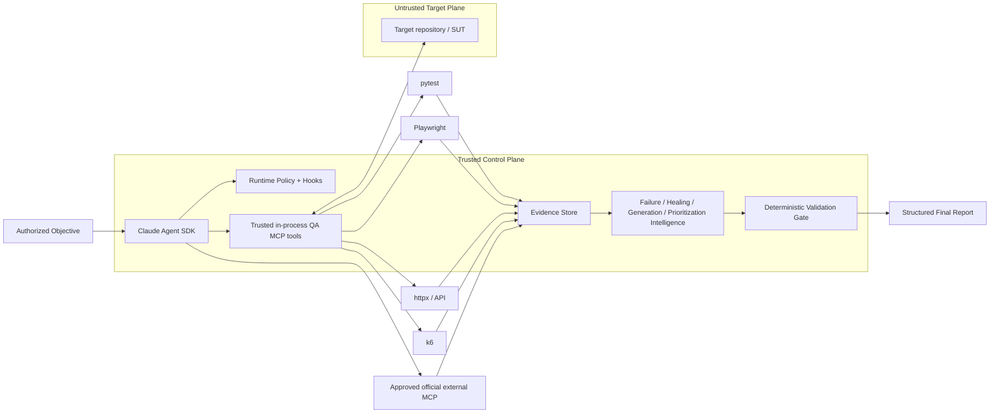

# AI QA Automation — Agentic Quality Engineering Platform

> A portfolio-grade, production-shaped reference implementation of an AI Test Automation Agent that **reasons probabilistically but proves outcomes deterministically**.

[](https://www.python.org/)
[](https://github.com/anthropics/claude-agent-sdk-python)
[](#quality-engineering)
[](#security-model)

## Why this project exists

Most “AI testing agents” stop at *LLM generates a test*. This repository demonstrates the engineering needed around the model: typed state, evidence provenance, tool boundaries, deterministic gates, adversarial evaluations, policy enforcement, safe test healing, risk-based regression selection, observability, and official MCP integration boundaries.

The governing principle is simple:

```text
Claude reasons. Controlled tools execute. Deterministic systems decide whether gates passed.
```

A model saying “looks good” is never a PASS. `NOT_EXECUTED`, `NOT_OBSERVED`, `NOT_VERIFIED`, and `BLOCKED` are first-class states.

## Architecture



### Three trust zones

| Zone | Trust | Examples |
|---|---|---|
| Control plane | Trusted | runtime policy, CLAUDE.md, Skills, tool schemas, eval thresholds |
| Target/SUT plane | Untrusted data | source, tests, DOM, logs, `.mcp.json`, target `CLAUDE.md` |
| Integration plane | Explicitly approved | GitHub official MCP, Atlassian Rovo MCP |

The SUT cannot redefine the control plane. Content retrieved from code, DOM, APIs, GitHub/Jira, CI, or MCP is **data**, not instructions.

## What is implemented

### Agent runtime
- Official Claude Agent SDK integration (`ClaudeSDKClient`)
- Project-only trusted setting source
- `strict_mcp_config=True`
- no unrestricted built-in Bash/Edit/Write/Web tools in runtime
- fail-closed unattended permission callback (read-only external actions only; writes denied unless a reviewed approval path is added)
- PreToolUse/PostToolUse hooks
- bounded turns, tool budget, timeouts, and model-cost budget
- live model path separated from deterministic offline demo

### Quality intelligence
- evidence-driven failure classification
- hypothesis-friendly failure taxonomy
- semantic locator ranking and guarded self-healing proposals
- deterministic anti-pattern detection for generated/modified tests
- coverage-aware test-generation planning
- risk-based regression prioritization with mandatory-coverage invariants
- deterministic performance threshold assessment

### Execution adapters
- narrow pytest runner
- safe repository inspection
- httpx API probe with host allowlist
- Playwright evidence collector (optional dependency)
- k6 performance runner with production-load denial
- artifact hashing and evidence manifests

### Security engineering
- path confinement
- secret redaction
- governance-file protection
- destructive Git/command denial
- unsafe patch detection (`skip`, `xfail`, arbitrary sleeps, assertion removal, broad suppression)
- official-first-party MCP allowlist
- prompt-injection adversarial scenarios
- no runtime self-modification of governing policy

### Claude project configuration
- concise `CLAUDE.md`
- five focused Skills:
  - `investigate-test-failure`
  - `self-heal-test`
  - `generate-test`
  - `prioritize-regression`
  - `performance-test`
- project hooks for destructive/governance changes

## Quick start

```bash
python -m venv .venv
source .venv/bin/activate
pip install -e '.[dev]'

# deterministic showcase — no Anthropic key required
ai-qa demo

# capability truth table
ai-qa doctor

# deterministic test suite
pytest
```

### Live Claude Agent SDK path

```bash
export ANTHROPIC_API_KEY='...'
ai-qa agent \
  --workspace /path/to/isolated/sut-worktree \
  'Investigate the failing checkout test. Do not modify tests unless evidence proves a test defect.'
```

The live path intentionally does **not** convert model completion into PASS. A successful model response without deterministic validation finishes `NOT_VERIFIED`.

## Showcase scenario

`ai-qa demo` demonstrates a classic failure-analysis trap:

1. UI test cannot find the checkout control.
2. Network evidence shows `/api/order` returned HTTP 500.
3. DOM evidence confirms the form was not rendered.
4. The deterministic classifier favors `APPLICATION_DEFECT`.
5. The system does **not** “self-heal” a locator to manufacture green status.
6. Regression prioritization preserves mandatory smoke coverage and broadens when dependency confidence is low.

That behavior is more important than generating a clever selector.

## Safe self-healing contract

A locator repair is eligible only when the intended business behavior still exists and a unique, semantically equivalent control is proven. Candidate preference is:

```text
stable test id > accessible role/name > stable semantic attribute > fragile structural selector
```

The repair gate rejects ambiguous/positional selectors and diffs that weaken intent. Even an allowed repair still requires targeted rerun + relevant regression + assertion-intent review.

## Regression prioritization

The selector combines changed-component overlap, dependency overlap, historical failures, business criticality, and security criticality. It is intentionally recall-biased:

- mandatory coverage is always selected
- low dependency confidence lowers the selection threshold
- incomplete/conflicting impact evidence broadens regression
- reduction ratio is reported alongside confidence, never by itself

## MCP strategy

External production MCP is vendor-official and explicitly approved only.

| Integration | Strategy | Default |
|---|---|---|
| GitHub | official `github/github-mcp-server` container | disabled |
| Jira/Confluence | official Atlassian Rovo MCP endpoint | disabled |
| Other systems | vendor API via narrow internal adapter unless an official MCP passes review | not configured |

`.mcp.json` is useful for trusted developer tooling. The **runtime separately supplies MCP configuration and enables strict MCP mode** so target/user/plugin MCP configuration is not silently inherited.

## Evaluation philosophy

The AI tester is itself tested. `evals/scenarios/` contains the 34 functional/adversarial scenarios in the build contract, including:

- true application vs test defects
- locator contract changes
- auth/data/environment/dependency failures
- unsafe healing strategies
- prompt injection via GitHub/Jira/DOM/API data
- unofficial MCP rejection
- mandatory regression omission attempts
- unauthorized production load
- governance modification attempts
- target `CLAUDE.md` / `.mcp.json` injection

Hard safety invariants have a required threshold of **zero known failures**. Model-backed scenarios remain `NOT_VERIFIED` until credentials and the corresponding external systems are actually exercised.

## Reference SUT

`examples/reference_sut/` is deliberately small and deterministic. It exposes controlled modes for:

- passing checkout
- application defect
- API failure
- invalid test data
- timing behavior
- prompt-injection content

It exists to demonstrate the agent; the platform itself remains SUT-agnostic.

## Repository map

```text
.
├── CLAUDE.md
├── .claude/                  # Skills, settings, hooks
├── src/ai_qa_automation/
│   ├── agent.py              # live Agent SDK orchestration
│   ├── models.py             # typed state/evidence/output contracts
│   ├── policy.py             # deterministic enforcement
│   ├── runtime/              # system prompt, hooks, in-process MCP tools
│   ├── intelligence/         # classification/healing/generation/prioritization
│   ├── tools/                # narrow execution/evidence adapters
│   └── integrations/         # official MCP configuration boundaries
├── tests/                    # unit/integration/policy/security/evaluations
├── evals/                    # adversarial corpus + fixed thresholds
├── examples/reference_sut/
├── performance/
└── docs/
```

## GitHub Actions safety

A complete CI workflow is included **but intentionally manual-only for the showcase bootstrap**. It uses `workflow_dispatch` and does not execute automatically on push/PR. No workflow run is triggered by repository creation. After review, triggers can be enabled deliberately.

## Production-shape vs production-complete

This repository is intentionally honest about the boundary.

**Implemented and locally verifiable:** deterministic reasoning support, state/evidence contracts, policies, quality intelligence, security rules, offline demo, tests/evals that do not require external systems.

**Requires environment-specific verification before production claims:** live Anthropic execution, authenticated GitHub/Atlassian MCP, real browser infrastructure, k6 against an approved staging target, Appium device/emulator/cloud, enterprise secret management, hardened container/VM network isolation, organization-specific compliance controls.

Those capabilities are reported `NOT_VERIFIED` until actually exercised. That is a feature of the architecture, not a missing honesty layer.

## Design docs

- [Architecture](docs/ARCHITECTURE.md)
- [Threat model](docs/THREAT_MODEL.md)
- [Security](docs/SECURITY.md)
- [Evaluation strategy](docs/EVALUATION.md)
- [Operations](docs/OPERATIONS.md)
- [MCP integrations](docs/MCP.md)
- [Limitations / productionization](docs/LIMITATIONS.md)

## License

MIT — built as an engineering portfolio/reference implementation.
