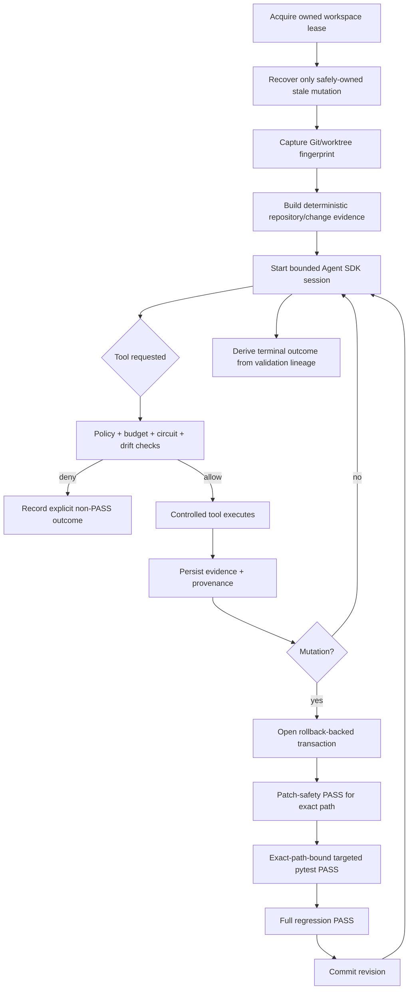

<div align="center">

# ƳƤ AI QA Automation Framework

### Evidence-First Agentic Quality Engineering

**Designed and engineered by Ƴunior Ƥortal (ƳƤ)**

[](pyproject.toml)
[](LICENSE)
[](docs/SETUP.md)
[](docs/ARCHITECTURE.md)

**A production-oriented AI quality engineering framework that gives an LLM room to reason without giving it authority to invent evidence, weaken tests, bypass policy, or certify its own work.**

[Documentation](docs/README.md) · [Architecture](docs/ARCHITECTURE.md) · [Result Contract](docs/RESULT_CONTRACT.md) · [Security](docs/SECURITY.md) · [Setup](docs/SETUP.md) · [Technical Walkthrough](docs/TECHNICAL_WALKTHROUGH.md)

</div>

---

> [!IMPORTANT]
> **Model reasoning is not test evidence.** Claude may interpret observations, form hypotheses, rank risk, and choose among authorized actions. Controlled tools collect facts and perform bounded operations. Deterministic policy and validation decide what is proven.

**On this page:** [Engineering thesis](#engineering-thesis) · [Architecture](#architecture-at-a-glance) · [Quick start](#quick-start) · [Runtime truth](#runtime-result-contract) · [Safety boundaries](#safety-critical-boundaries) · [Evaluation](#evaluation-architecture) · [Documentation](#documentation-map)

> [!TIP]
> **Reviewing the engineering rather than installing it?** Start with the [Architecture](docs/ARCHITECTURE.md), then the [Runtime Result Contract](docs/RESULT_CONTRACT.md), [Security Architecture](docs/SECURITY.md), and [Technical Walkthrough](docs/TECHNICAL_WALKTHROUGH.md). The [documentation hub](docs/README.md) also provides role-specific review paths.

## Engineering thesis

```text
Claude reasons.
Controlled tools observe and execute.
Deterministic policy authorizes.
Validation decides what is proven.
```

The ƳƤ AI QA Automation Framework treats an LLM as a **bounded reasoning component inside a quality-engineering control system**. The model is intentionally separated from the systems that own execution, evidence, authorization, mutation safety, recovery, and terminal truth.

That distinction matters because agentic testing becomes unsafe when the same component can change evidence **and** decide that its own change succeeded.

### Four contracts govern the framework

| Contract | Question it answers | Authority |
|---|---|---|
| **Authority** | What may the agent do? | deterministic policy, hooks, permissions, budgets |
| **Evidence** | What was actually observed? | controlled tools, manifests, artifacts, hashes, provider responses |
| **Mutation** | When may automated code changes persist? | path ownership, rollback transaction, exact-path validation closure |
| **Outcome** | What may be called successful? | revision-aware deterministic validation lineage |

## What the architecture is designed to prevent

| Failure mode | Control response |
|---|---|
| False product-defect attribution | Evidence-weighted deterministic classification before test-side repair |
| Model-declared success | Terminal truth comes from deterministic gate lineage, never persuasive prose |
| Test weakening disguised as self-healing | Patch rules reject skip/xfail, assertion erosion, arbitrary sleeps, timeout inflation, tautologies, and broad suppression |
| Wrong-element locator repair | Same-DOM Playwright measurement + deterministic semantic intent + transactional validation |
| Meaningless generated tests | Coverage provenance + conservative planning + meaningful-assertion checks + execution closure |
| Regression under-selection | Mandatory coverage is preserved; uncertainty broadens instead of shrinking regression |
| Prompt injection from target or provider content | SUT/source/DOM/log/API/MCP content remains untrusted data |
| Tool or integration privilege expansion | Explicit tool inventory, fail-closed hooks, vendor identity checks, action-level authorization |
| Concurrent or stale mutation | OS-backed workspace lease + content-sensitive fingerprint + rollback-backed revision transaction |
| Wrong-subject validation | Targeted pytest must explicitly select the exact pending mutation path |
| Filesystem alias/tamper attacks | Non-symlink ownership checks cover mutation, rollback, evidence, journal, lease, recovery, and attestation paths |
| Cross-run evidence contamination | Confined run roots, immutable evidence identities, manifests, hashes, and hash-chained journals |
| Unbounded agent loops | Independent turn/tool/network/mutation/repetition/time/cost budgets + per-tool circuits |
| Production load accident / k6 egress | Non-production target policy + script restrictions + mandatory infrastructure-level egress enforcement |

---

## Architecture at a glance


### Trust boundaries

| Boundary | Trust posture | Examples |
|---|---|---|
| **Control plane** | trusted authority | runtime package, policy, hooks, Skills, tool schemas, thresholds |
| **Target / SUT** | untrusted evidence source | source, tests, DOM, logs, API responses, target `CLAUDE.md`, `.claude/`, `.mcp.json` |
| **External providers** | approved transport/provider; returned content remains untrusted | GitHub MCP, Atlassian Rovo MCP |
| **Deployment infrastructure** | independent enforcement boundary | process/container isolation, egress, identity, secrets, retention, devices, real targets |

> [!NOTE]
> Application-layer controls are defense in depth. High-assurance process isolation, network egress, secret management, identity, and retention remain deployment-owned controls rather than claims manufactured by repository code.

Deep dives: [Architecture](docs/ARCHITECTURE.md) · [Runtime control](docs/RUNTIME_CONTROL.md) · [Security](docs/SECURITY.md) · [Threat model](docs/THREAT_MODEL.md)

---

## Quick start

### Local deterministic tooling

```bash
python -m venv .venv
source .venv/bin/activate
python -m pip install --upgrade pip
python -m pip install -e '.[dev]'

ai-qa doctor
ai-qa demo
```

On Windows PowerShell, activate with `.venv\Scripts\Activate.ps1`.

`.env.example` is a reference template only; runtime settings do not automatically load a repository `.env` file.

### Live Claude Agent SDK session

```bash
export ANTHROPIC_API_KEY='...'
export AI_QA_CONTROL_ROOT='/path/to/ai-qa-automation'
export AI_QA_ARTIFACT_ROOT='/path/to/ai-qa-artifacts'
export AI_QA_BASE_REF='origin/main'

ai-qa agent \
  --control-root "$AI_QA_CONTROL_ROOT" \
  --workspace /path/to/isolated/sut-worktree \
  'Investigate the failing checkout test. Do not modify tests unless evidence proves a test defect.'
```

The control root, artifact root, and target workspace are separate trust domains. Exact configuration and credential boundaries are documented in [Setup and Configuration](docs/SETUP.md).

### Controlled k6 execution

Because a JavaScript workload can construct destinations dynamically, k6 requires a separately enforced egress boundary:

```bash
export AI_QA_K6_EXTERNAL_EGRESS_ENFORCED=true
```

Set that assertion only when the runtime environment actually enforces the intended outbound-network policy. The flag documents an external prerequisite; it does not create a firewall.

---

## Production control model

The live path uses the Claude Agent SDK pinned to `claude-agent-sdk==0.2.143`, with `claude-sonnet-5` as the default model identifier.

The runtime deliberately narrows authority:

- generic built-in tools are not the working surface;
- Bash/Edit/Write/Web-style built-ins are explicitly denied;
- exactly five trusted Claude Skills are allowlisted;
- `strict_mcp_config=True` prevents ambient MCP inheritance;
- every tool request passes deterministic authorization and runtime hooks;
- approval-required operations fail closed during unattended execution;
- tool, network, mutation, repetition, wall-time, per-tool-time, turn, and model-cost limits remain independent;
- canonical QA decision state is persisted separately from conversation history;
- process-control state is persisted separately from QA decision state.

### Narrow internal QA surface

The framework exposes 18 purpose-built in-process tools:

| Domain | Controlled capability |
|---|---|
| Repository | Git/worktree inspection and change context |
| Tests | bounded pytest execution and evidence capture |
| API | allowlisted HTTP probing with read-only default |
| Browser | Playwright accessibility, screenshot, console, network, and locator evidence |
| Failure intelligence | deterministic first-pass causal classification |
| Source context | bounded test-file reads and coverage search |
| Test design | evidence-bound generation planning |
| Regression | risk-based prioritization with mandatory coverage preservation |
| Test quality | deterministic Python test-quality review |
| Generation | guarded live Python test creation; reusable patch utilities also understand JS/TS test artifacts |
| Self-healing | same-DOM locator verification, proposal, and Python locator-only live mutation |
| Contracts | JSON Schema validation |
| CI | normalized CI-failure analysis |
| Mobile | Appium runtime/capability inspection |
| Performance | controlled k6 execution and deterministic threshold assessment |

> [!TIP]
> The reusable patching library can validate Python/JavaScript/TypeScript test artifacts, but **live autonomous mutation is intentionally Python/pytest-backed**. The runtime does not claim deterministic commit closure for a language it cannot execute through its controlled validation adapter.

There is intentionally **no generic existing-test rewrite tool** in the live agent surface.

## Evidence-first runtime lifecycle



A targeted run against an unrelated file is diagnostic evidence; it cannot certify the pending mutation.

## Runtime result contract

The framework distinguishes **terminal outcomes**, **validation outcomes**, and **provider-health outcomes**. Those values describe live framework behavior—not repository-development progress labels.

| Terminal outcome | Meaning |
|---|---|
| `SUCCESS` | every active deterministic gate required by the revision is closed |
| `FAILURE` | a definitive active execution or validation failure exists |
| `BLOCKED` | a safety/integrity prerequisite prevented continuation |
| `POLICY_DENIED` | requested authority is outside policy |
| `INFRASTRUCTURE_FAILURE` | runtime integrity cannot be guaranteed |
| `BUDGET_EXCEEDED` / `CANCELLED` | bounded execution terminated explicitly |
| `NOT_VERIFIED` | evidence is absent, incomplete, stale, or contradictory, so success cannot be proven |

Individual validations preserve values such as `NOT_EXECUTED` and `NOT_OBSERVED` rather than translating absence into green.

> [!IMPORTANT]
> A model result subtype of `success` is only an input to terminal evaluation. It is never sufficient to produce framework `SUCCESS` on its own.

For complete semantics, revision supersession, provider outcomes, and mutation closure, see the authoritative [Runtime Result Contract](docs/RESULT_CONTRACT.md).

---

## AI-assisted QA with deterministic closure

### Evidence-driven failure investigation

The deterministic classifier distinguishes evidence patterns for application defects, test automation defects, locator/UI-contract changes, test-data failures, timing/flakiness, environment failures, external dependency failures, authentication/configuration failures, performance regressions, and insufficient evidence.

For locator-contract classification, “the old locator is missing and some other element is unique” is **not** enough. The replacement candidate must also preserve deterministic semantic intent from the original locator.

A missing element therefore does not automatically trigger selector repair. If network/application evidence shows the expected UI state never rendered, the framework preserves that root-cause evidence instead of “healing” the test first.

### Safe self-healing

Self-healing is intentionally narrow: **semantic locator maintenance only**.

```text
stable test id
    > accessible role/name
    > label
    > placeholder
    > exact text
    > semantic CSS
    >>> positional / XPath-style structure
```

The authorization chain requires:

1. a deterministic failure class compatible with locator repair;
2. Playwright measurement of original and candidate locators in the same DOM;
3. a unique candidate;
4. supported literal locator syntax;
5. deterministic semantic-intent overlap between original and replacement;
6. policy-owned stability scoring rather than model-supplied confidence;
7. exact file-hash and proposal binding;
8. Python locator-only live mutation;
9. patch-safety PASS for the exact changed path;
10. targeted pytest PASS explicitly selecting that path; and
11. full-regression pytest PASS at the same change revision.

Model-provided semantic/stability scores can inform reasoning, but they are overwritten before autonomous eligibility is decided.

### Coverage-aware test generation

Generation is conservative and provenance-bound:

```text
observed repository coverage
→ interpreted gap
→ same-run plan
→ conservative candidate scenarios
→ evidence reconciliation
→ guarded live Python test creation
→ exact-path targeted execution
→ full regression closure
```

Model-supplied “already covered” labels are advisory. They **cannot suppress deterministic candidate scenarios** by themselves. Before implementation, the candidate is reconciled against the same-run repository observation so the framework avoids both unsafe under-coverage and careless duplication.

Generated tests are checked for meaningful assertions and common intent-eroding shortcuts. Assertion-looking text in comments or strings does not satisfy observability requirements. Unknown product behavior is not invented merely to create a test.

---

## Deterministic change intelligence

Before model reasoning, bootstrap can persist:

- target Git `HEAD` and content-sensitive worktree fingerprint;
- trusted base ref and immutable merge-base provenance;
- committed plus dirty/untracked change union;
- changed domains and recommended test layers;
- repository/test/API/data/container/IaC/mobile/CI topology;
- dependency-manifest paths, sizes, and hashes;
- CODEOWNERS routing context;
- explainable test-impact candidates;
- conservative OpenAPI/Swagger compatibility drift.

With `AI_QA_BASE_REF=origin/main`, a clean feature branch is still analyzed against its committed merge-base delta. A clean worktree is never confused with “no change.”

Test-impact output is advisory. Low confidence, truncated scans, or incomplete dependency knowledge broaden regression rather than justify aggressive omission.

See [Change Intelligence](docs/CHANGE_INTELLIGENCE.md).

---

## Safety-critical boundaries

### API

- trusted host-only allowlist;
- canonical DNS/IP normalization with duplicate removal;
- wildcards, URL-shaped entries, ports, user-info, scoped IPv6, malformed dotted IPv4, paths, query strings, and fragments are rejected;
- `GET`, `HEAD`, and `OPTIONS` are the default method surface;
- mutating methods require separate explicit enablement;
- redirects are disabled;
- ambient proxy inheritance is disabled;
- response size is bounded and evidence is sanitized.

### Browser / Playwright

- initial navigation is host-authorized;
- HTTP(S) subresources are routed through the host policy;
- WebSockets are routed through the same host boundary;
- service workers are disabled in the evidence context so routing remains observable;
- final navigation is rechecked against the allowlist;
- screenshots remain hashed `RAW` artifacts rather than being falsely represented as sanitized text.

### Performance / k6

- production and production-like targets are denied;
- the script must consume injected `BASE_URL` / `TARGET_URL`;
- remote modules, `k6/x/*`, local `open()`, unrelated literal hosts, and unsupported imports are rejected;
- runtime duration is bounded;
- **every k6 execution requires independently enforced infrastructure-level egress**, including localhost targets;
- static JavaScript inspection is explicitly not treated as a network sandbox;
- PASS/FAIL comes from predefined thresholds and measured metrics.

### Mobile / Appium

Appium is represented through controlled runtime/capability inspection, with device/emulator/cloud/application execution kept inside the target deployment's explicit mobile test boundary.

### Transactional mutation and crash recovery

Autonomous writes use optimistic concurrency plus owned rollback state:

- target must be a Git-backed isolated worktree;
- an OS-backed workspace lease prevents cooperating runs from sharing mutation authority;
- lease directory/file ownership is protected against symlink substitution;
- workspace fingerprint must still match the analyzed baseline;
- absolute, traversal, workspace-escape, and symlink mutation paths are rejected by both orchestration and the reusable safe patcher;
- prior bytes are snapshotted outside the SUT;
- rollback directory and backup ownership are revalidated before restore/commit;
- rollback bytes are hash-verified;
- a new mutation cannot begin while the previous revision is unresolved;
- stale recovery validates prior run, journal, target, rollback directory, backup, fingerprint, and ownership before touching the target;
- newer human/out-of-band work wins over automated rollback when ownership is ambiguous.

See [Runtime Control and Recovery](docs/RUNTIME_CONTROL.md).

### Vendor-official MCP integrations

External MCP is restricted to explicitly approved vendor integrations.

| Integration | Trusted path | Runtime posture |
|---|---|---|
| GitHub | `github/github-mcp-server:v1.0.5` | disabled by default; server-side read-only defense in depth |
| Jira / Confluence | Atlassian Rovo MCP `/v1/mcp/authv2` | disabled by default; action-level policy still applies |

Server identity never grants blanket tool authority. External action names are normalized conservatively so destructive verbs dominate writes, writes dominate reads, and mixed names cannot smuggle higher authority behind a read prefix. Numeric business identifiers are not interpreted as HTTP/provider failure codes unless the surrounding evidence actually identifies them as such.

Provider content remains untrusted evidence after retrieval, and configuration alone never becomes observed provider availability.

See [MCP Integration Policy](docs/MCP.md).

---

## Evidence, traceability, and attestation

Each run has a durable evidence surface beneath:

```text
artifacts/<run_id>/
```

The framework can persist:

- canonical `state.json`;
- separate `runtime.json` process-control state;
- `evidence-manifest.json`;
- content-addressed artifacts;
- append-only `journal.jsonl` with SHA-256 hash chaining;
- optional regulated traceability records;
- evidence-to-validation lineage;
- model/SDK/configuration/target provenance;
- token/cost information when supplied by the provider;
- unsigned run-integrity attestations.

Evidence control files, journal files, registered artifacts, rollback paths, and lease paths reject ambiguous symlink ownership where the framework owns the filesystem boundary.

`ai-qa attest` verifies owned core persisted subjects, the runtime journal chain, pending-mutation state, and the SHA-256 of every artifact registered in the manifest before reporting `integrity_verified=true`.

```bash
ai-qa recover artifacts/run-<id>
ai-qa lineage artifacts/run-<id>
ai-qa lineage artifacts/run-<id> --format dot
ai-qa attest artifacts/run-<id>
ai-qa contract-diff --baseline old-openapi.yaml --current new-openapi.yaml
```

> [!CAUTION]
> The attestation is deliberately **unsigned**. Content integrity is not actor identity, notarization, compliance certification, a trusted timestamp, or evidence that tests passed.

See [Traceability and Run Attestation](docs/TRACEABILITY.md).

---

## Evaluation architecture

The framework is evaluated as software—not by whether its prose sounds convincing.

The repository defines:

- unit tests for models, policy, redaction, evidence, state, budgets, recovery, ownership, attestation, and intelligence;
- deterministic integration tests for evidence/runtime flows;
- dedicated policy and security tests;
- a fixed **34-scenario primary adversarial corpus**;
- a physically separate **H-series holdout corpus**;
- Playwright-marked tests separated from the default pytest path;
- credentialed model tests separated behind explicit configuration;
- predefined hard-safety thresholds that are not rewritten to accommodate a failing implementation.

```bash
make quality
make test
make eval
make security
make verify-local
make holdout
```

See [Evaluation Strategy](docs/EVALUATION.md).

## Deterministic reference SUT

`examples/reference_sut/` is a compact FastAPI application that makes important evidence paths reproducible:

| Mode | Purpose |
|---|---|
| `pass` | normal checkout behavior |
| `app-defect` | controlled business/application defect |
| `outdated-locator` | stale locator while business behavior remains intact |
| `api-failure` | controlled HTTP 500 |
| `timing` | bounded deterministic delay |
| `invalid-data` | out-of-contract data produces validation failure |
| `prompt-injection` | instruction-shaped DOM content remains untrusted evidence |

The reference SUT is test data for the control architecture, never part of the trusted control plane.

---

## Operating modes

| Mode | Purpose | Primary authority |
|---|---|---|
| Local deterministic tooling | inspection, demo, tests, evaluations, security tooling | repository-contained deterministic code |
| Live Claude session | bounded agentic investigation and authorized QA actions | Agent SDK reasoning + deterministic runtime authority |
| GitHub MCP | vendor-official repository context | external provider + local action policy |
| Atlassian MCP | vendor-official Jira/Confluence context | external provider + local action policy |
| Browser/API/load/mobile target | target-specific validation | controlled adapter + deployment environment |
| Regulated traceability mode | additional engineering audit/retention labeling | deterministic persistence controls |

## Repository layout

```text
.
├── CLAUDE.md                       # trusted engineering/agent rules
├── README.md
├── LICENSE
├── SECURITY.md
├── CONTRIBUTING.md
├── .env.example
├── .claude/
│   ├── settings.json
│   ├── hooks/
│   └── skills/                     # five trusted QA Skills
├── .mcp.json
├── .github/
│   ├── CODEOWNERS
│   └── workflows/ci.yml            # operator-dispatched workflow
├── src/ai_qa_automation/
│   ├── agent.py                    # Agent SDK orchestration + terminal truth
│   ├── models.py                   # state/evidence/result contracts
│   ├── policy.py                   # deterministic authorization
│   ├── evidence.py                 # evidence/artifact registry + ownership
│   ├── intelligence/               # classification/healing/generation/change logic
│   ├── integrations/               # approved external MCP adapters
│   ├── runtime/                    # leases, budgets, hooks, recovery, lineage, attestation
│   └── tools/                      # narrow execution/evidence adapters
├── tests/
├── evals/
├── examples/reference_sut/
├── performance/
└── docs/
```

## Documentation map

Start with the [documentation hub](docs/README.md) for reviewer-specific reading paths.

| Topic | Document |
|---|---|
| Architectural authority, trust, and execution flow | [Architecture](docs/ARCHITECTURE.md) |
| Runtime terminal/validation/provider semantics | **[Runtime Result Contract](docs/RESULT_CONTRACT.md)** |
| Transactional mutation and crash recovery | [Runtime Control](docs/RUNTIME_CONTROL.md) |
| Security architecture | [Security](docs/SECURITY.md) |
| Threat model and adversarial assumptions | [Threat Model](docs/THREAT_MODEL.md) |
| Trusted setup and credentials | [Setup](docs/SETUP.md) |
| Operating the framework | [Operations](docs/OPERATIONS.md) |
| Change intelligence and regression evidence | [Change Intelligence](docs/CHANGE_INTELLIGENCE.md) |
| Evaluation and holdout governance | [Evaluation](docs/EVALUATION.md) |
| Claude Skill contracts | [Skills](docs/SKILLS.md) |
| External MCP policy | [MCP](docs/MCP.md) |
| Evidence lineage and attestations | [Traceability](docs/TRACEABILITY.md) |
| Evidence/deployment trust boundaries | [Verification Boundaries](docs/VERIFICATION_BOUNDARIES.md) |
| Production-readiness architecture | [Production Readiness](docs/PRODUCTION_READINESS.md) |
| Design boundaries and non-claims | [Limitations](docs/LIMITATIONS.md) |
| Failure diagnosis without weakening controls | [Troubleshooting](docs/TROUBLESHOOTING.md) |
| End-to-end technical review path | [Technical Walkthrough](docs/TECHNICAL_WALKTHROUGH.md) |

## GitHub Actions

`.github/workflows/ci.yml` is operator-dispatched with `workflow_dispatch`. It defines quality/type checks, deterministic pytest, the primary adversarial evaluator, holdout evaluation, security scanning, Playwright reference-SUT coverage, and an optional credentialed Agent SDK smoke path under explicit operator control.

## Security and contributions

Security reports should follow [Security Policy](SECURITY.md). Engineering changes should preserve the authority hierarchy and test-integrity rules in [Contributing](CONTRIBUTING.md) and [Engineering Rules](CLAUDE.md).

> **Add capability without silently adding authority. Add intelligence without weakening evidence. Add automation without weakening test intent.**

## License

The **ƳƤ AI QA Automation Framework** is licensed under the [MIT License](LICENSE).

**Copyright (c) 2026 Ƴunior Ƥortal (ƳƤ).**
