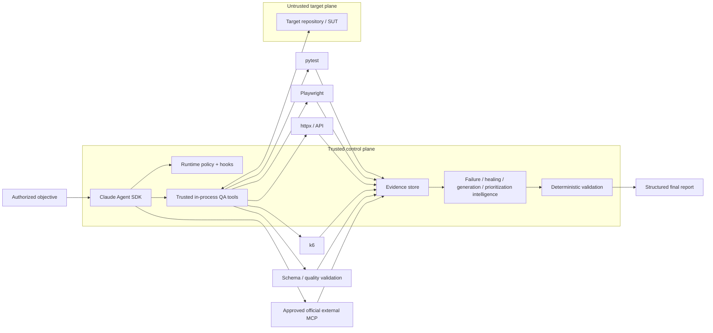

# AI QA Automation — Evidence-First Agentic Quality Engineering

I built this project around one non-negotiable rule:

> **Model reasoning is not test evidence.**

Claude can interpret failures, form hypotheses, assess change risk, select controlled actions, propose repairs, and design tests. It does **not** get to declare software correct because its reasoning sounds plausible. Controlled tools collect facts and perform bounded operations; deterministic policy and validation decide what is verified.

```text
Claude reasons. Controlled tools execute. Deterministic systems decide whether gates passed.
```

AI QA Automation is a production-shaped engineering reference/portfolio platform for agentic quality engineering. Its distinguishing feature is not simply that it can use an LLM—it is that the architecture is designed to keep probabilistic reasoning useful **without making the model the source of truth**.

## Current status

| Area | Current state |
|---|---|
| Architecture / implementation | Production-shaped; pre-execution static architecture, code/config, documentation, and contract-completeness audit completed |
| Ruff / Mypy / full pytest | `NOT_VERIFIED` on the current head until deliberately executed |
| Primary 34-scenario evaluation | `NOT_VERIFIED` on the current head until deliberately executed |
| H-series holdout evaluation | `NOT_VERIFIED` on the current head until deliberately executed |
| Static security gates | `NOT_VERIFIED` on the current head until deliberately executed |
| GitHub Actions | Implemented and **manual-only** (`workflow_dispatch`); workflow presence is not an execution result |
| Live Claude Agent SDK | Implemented; credentialed provider execution is `ENVIRONMENT_REQUIRED` / `NOT_VERIFIED` |
| GitHub / Atlassian MCP | Vendor-official integrations configured but disabled by default; authenticated behavior is `ENVIRONMENT_REQUIRED` |
| Real external browser/load/mobile/infrastructure controls | Environment-dependent and never implied verified by source presence |

The authoritative readiness vocabulary and matrix live in [`docs/PRODUCTION_READINESS.md`](docs/PRODUCTION_READINESS.md).

## Why this architecture is different

Many AI test agents optimize for “make the test pass.” That can be unsafe when the agent is also allowed to reinterpret failures, rewrite tests, trust hostile application content, or declare its own work successful.

This platform instead optimizes for **defensible evidence, bounded authority, and visible uncertainty**:

- a failed test is not automatically a product defect;
- model interpretation is distinct from observed evidence;
- missing or contradictory evidence remains unresolved rather than becoming an optimistic verdict;
- the agent receives narrow QA tools rather than general shell/edit/web authority;
- target source, tests, DOM, logs, API responses, `CLAUDE.md`, `.claude/`, and `.mcp.json` are untrusted data;
- autonomous test mutations are fingerprint-safe, transactional, rollback-capable, and revision-gated;
- self-healing cannot simply skip tests, weaken assertions, add sleeps, inflate timeouts, or suppress failures;
- coverage-aware generation requires observed repository evidence and same-run planning provenance;
- low-confidence test impact **broadens** regression instead of justifying omission;
- external MCP configuration does not equal provider availability;
- interrupted runs persist canonical evidence/state outside conversation history;
- current-head readiness is never inferred from historical green results.

## Architecture



The README intentionally contains only the overview diagram. Three deeper diagrams explain mechanisms that are materially easier to understand visually:

- **execution / verification sequence** — [`docs/ARCHITECTURE.md`](docs/ARCHITECTURE.md);
- **transactional mutation / crash-recovery state machine** — [`docs/RUNTIME_CONTROL.md`](docs/RUNTIME_CONTROL.md);
- **persisted evidence / validation lineage** — [`docs/TRACEABILITY.md`](docs/TRACEABILITY.md).

Adding diagrams beyond those would mostly duplicate prose rather than improve architectural comprehension.

### Trust boundaries

| Zone | Treatment | Examples |
|---|---|---|
| Control plane | Trusted | runtime package, policy, `CLAUDE.md`, Skills, hooks, tool schemas, evaluation thresholds |
| Target/SUT plane | Untrusted data | source, tests, DOM, logs, target `.mcp.json`, target `CLAUDE.md`, target `.claude/` |
| Integration plane | Explicitly approved provider; returned content still untrusted | GitHub official MCP, Atlassian Rovo MCP |
| Deployment infrastructure | Must be verified independently | OS/container isolation, egress, identity, secrets, retention, real targets/devices |

## Live Agent SDK runtime

The live path uses the official Claude Agent SDK, pinned to `claude-agent-sdk==0.2.143`, with `claude-sonnet-5` as the default model identifier.

The runtime uses:

- `tools=[]` for the generic built-in tool set;
- an explicit 18-tool internal QA inventory;
- explicit denial of Bash/Edit/Write/Web-style built-ins;
- `setting_sources=["project"]` and a fixed five-Skill allowlist;
- `strict_mcp_config=True`;
- deterministic `PreToolUse`, `PostToolUse`, and tool-failure hooks;
- a fail-closed programmatic permission handler;
- independent turn, total-tool, network, mutation, repetition, per-tool-time, wall-time, and model-cost bounds;
- an exclusive OS-backed workspace lease;
- content-sensitive Git/worktree fingerprints before autonomous mutation;
- transactional test mutations with trusted rollback snapshots;
- per-tool failure circuits;
- canonical QA state outside conversation history;
- separate process-control state;
- an append-only SHA-256 hash-chained operational journal;
- run-scoped evidence/artifact manifests;
- deterministic repository/change intelligence before model execution.

### Narrow QA tool surface

The project-owned in-process tools cover repository inspection, pytest, API probing, Playwright browser evidence, failure classification, bounded test reads, test-coverage discovery/planning, regression prioritization, test-quality review/creation, browser-proven locator verification/healing, JSON Schema validation, CI analysis, Appium runtime inspection, and controlled k6 assessment.

There is deliberately **no generic existing-test rewrite tool** in the live runtime.

## Deterministic bootstrap and change intelligence

Before Claude receives an objective, deterministic code can persist:

- Git `HEAD` and a content-sensitive worktree fingerprint;
- an optional trusted base ref and merge base;
- committed plus dirty/untracked changes;
- change-risk domains and recommended test layers;
- detected language/test/API/data/container/IaC/mobile/CI surfaces;
- dependency-manifest inventory and hashes;
- CODEOWNERS routing;
- explainable test-impact candidates;
- changed OpenAPI/Swagger compatibility drift.

With `AI_QA_BASE_REF=origin/main`, a clean feature branch is analyzed relative to its committed merge-base delta instead of being mistaken for “no changes.”

Test-impact analysis remains advisory. Low confidence, incomplete dependency evidence, or scan truncation broadens regression; it cannot prove omitted tests are safe.

See [`docs/CHANGE_INTELLIGENCE.md`](docs/CHANGE_INTELLIGENCE.md).

## Failure investigation

The classifier distinguishes outcomes including application defect, test automation defect, locator/UI-contract change, test-data failure, timing/flakiness, environment failure, external dependency failure, authentication failure, configuration failure, performance regression, and insufficient evidence.

A missing UI element therefore does not automatically trigger selector repair. If the page's API is returning HTTP 500 and the expected UI never rendered, the platform preserves that network/application evidence rather than “healing” the test first.

## Safe self-healing

Locator repair is a guarded maintenance transaction, not a search for any selector that makes a suite green.

Candidate quality favors:

```text
stable test id > accessible role/name > stable semantic attribute > fragile structural selector
```

Playwright measures the original and candidate locators in the same DOM. A repair proposal is bound to observed evidence, the current deterministic failure classification, the exact test path, and the expected file hash.

The patch path rejects common shortcuts such as:

- skip / xfail / focused-only tests;
- arbitrary sleeps;
- indiscriminate timeout inflation;
- assertion removal or weakening;
- tautological assertions;
- broad exception suppression.

An approved mutation remains pending until the new revision closes patch-safety, targeted pytest, and full-regression validation. Failed or unverified work rolls back. If the process crashes and a developer subsequently changes the workspace, stale recovery refuses to overwrite the newer human work.

See [`docs/RUNTIME_CONTROL.md`](docs/RUNTIME_CONTROL.md).

## Coverage-aware test generation

Generation follows an explicit provenance chain:

```text
observed repository coverage
→ interpreted gap / same-run plan
→ guarded test creation
→ deterministic quality / execution / regression validation
```

Generated Python/JavaScript/TypeScript tests are checked for meaningful assertions and unsafe shortcuts. Assertion-like text inside comments or strings does not count as real assertion coverage. Unknown expected behavior is not invented merely to produce a test.

## API, browser, performance, and mobile boundaries

**API** probes are host-allowlisted and read-only by default (`GET`, `HEAD`, `OPTIONS`). Mutating methods require separate explicit enablement.

**Playwright** validates initial navigation, HTTP(S) subresources, and WebSockets against the configured host allowlist. Service workers are disabled in the evidence context. Binary screenshots remain `RAW` hashed artifacts rather than being falsely described as sanitized text.

**k6** requires an explicitly non-production target, injected target binding, bounded script analysis, predefined thresholds, and—when non-local—an explicit trusted prerequisite that infrastructure-level egress enforcement exists. The repository does not pretend an application flag creates a firewall.

**Appium** currently provides runtime/capability inspection; real application/device execution remains environment-required rather than being overstated as complete mobile validation.

## Evidence, state, recovery, and traceability

`AgentRunState` is canonical QA decision state and records objective, model/SDK/config provenance, target SHA, change revision, evidence references, hypotheses, classifications, validation lineage, modified files, MCP status, cost, duration, and terminal status.

Process-control data lives separately in `runtime.json`, including workspace fingerprint, lease identity, budgets, tool circuits, pending mutation metadata, and journal head.

Each run stores evidence under:

```text
artifacts/<run_id>/
```

with an `evidence-manifest.json` and content hashes. `journal.jsonl` is append-only and hash-chained. Regulated mode adds additional engineering traceability records/classification; it is **not a compliance certification**.

Useful inspection commands:

```bash
ai-qa recover artifacts/run-<id>
ai-qa lineage artifacts/run-<id>
ai-qa lineage artifacts/run-<id> --format dot
ai-qa attest artifacts/run-<id>
ai-qa contract-diff --baseline old-openapi.yaml --current new-openapi.yaml
```

The attestation is deliberately unsigned. Content integrity is not a trusted digital signature and does not change a test result.

See [`docs/TRACEABILITY.md`](docs/TRACEABILITY.md).

## Official MCP integration

External MCP is restricted to explicitly enabled vendor-official integrations.

| Integration | Trusted configuration | Default |
|---|---|---|
| GitHub | `github/github-mcp-server` `v1.0.5`, container read-only mode | disabled |
| Jira / Confluence | Atlassian Rovo MCP `/v1/mcp/authv2` endpoint | disabled |
| Other systems | approved vendor path or `NOT_CONFIGURED` | not configured |

Server identity is only the first gate. Runtime policy separately classifies read, write, destructive, and unknown actions. Configuration alone never changes an integration to `AVAILABLE`; availability requires an observed successful call.

TestRail is intentionally `NOT_CONFIGURED` rather than being connected through an unapproved community MCP.

See [`docs/MCP.md`](docs/MCP.md) and [`docs/SETUP.md`](docs/SETUP.md).

## Evaluation architecture

The agent is evaluated as software, not by whether its prose sounds intelligent.

The repository contains:

- unit tests;
- deterministic integration tests;
- policy/security tests;
- a fixed **34-scenario primary adversarial corpus**;
- a physically separate **H-series holdout corpus**;
- browser-marked tests isolated from default pytest;
- model-marked tests isolated behind credentials.

Routine repository commands are:

```bash
make quality
make test
make eval
make security

# aggregate routine repository-contained gate
make verify-local
```

The H-series is deliberately excluded from `verify-local` so routine development does not repeatedly tune against the holdout. At an intentional readiness checkpoint:

```bash
make holdout
```

Hard-safety scenarios use a predefined zero-known-failure threshold. A failing implementation is not repaired by weakening the benchmark after seeing its result.

See [`docs/EVALUATION.md`](docs/EVALUATION.md).

## Complete deterministic reference SUT

`examples/reference_sut/` is a deliberately small FastAPI target with the controlled scenarios required by the build contract:

| Mode | Purpose |
|---|---|
| `pass` | normal checkout behavior |
| `app-defect` | controlled business/application defect |
| `outdated-locator` | historical test id changes while the stable accessible control and business behavior remain intact |
| `api-failure` | controlled HTTP 500 |
| `timing` | bounded deterministic delay |
| `invalid-data` | out-of-contract request data produces real validation failure |
| `prompt-injection` | malicious instruction-shaped DOM content remains untrusted evidence |

The reference application is test data, not part of the trusted control plane, and does not prove behavior against an external application.

## Setup

### Credential-free inspection and deterministic demo

```bash
python -m venv .venv
source .venv/bin/activate
python -m pip install --upgrade pip
python -m pip install -e '.[dev]'

ai-qa doctor
ai-qa demo
```

`.env.example` is a **reference template only**. Runtime settings deliberately do not auto-load a repository `.env` file.

`ai-qa doctor` inspects local capability and configuration posture without contacting external providers. It can report that a credential variable is present, but it never reveals or validates the secret and therefore reports that state as configured-but-not-verified.

### Live Claude path

Only when live model execution is intentionally desired:

```bash
export ANTHROPIC_API_KEY='...'

ai-qa agent \
  --control-root /path/to/ai-qa-automation \
  --workspace /path/to/isolated/sut-worktree \
  'Investigate the failing checkout test. Do not modify tests unless evidence proves a test defect.'
```

The trusted control root, artifact root, and target workspace must satisfy the runtime isolation rules. Model completion is never translated directly into PASS.

For every environment variable, credential boundary, and operating mode, see [`docs/SETUP.md`](docs/SETUP.md).

## Repository map

```text
.
├── CLAUDE.md
├── LICENSE
├── SECURITY.md
├── CONTRIBUTING.md
├── .env.example             # reference only; not automatically loaded
├── .claude/                 # trusted settings, hooks, five Skills
├── .mcp.json                # trusted developer MCP configuration
├── .github/workflows/       # manual-only CI during bootstrap
├── src/ai_qa_automation/
│   ├── agent.py             # Agent SDK orchestration + terminal truth rules
│   ├── models.py            # state/evidence/result contracts
│   ├── policy.py            # deterministic authorization
│   ├── runtime/             # tools, leases, budgets, journal, hooks, recovery
│   ├── intelligence/        # failure/healing/generation/change/topology analysis
│   ├── tools/               # execution and evidence adapters
│   └── integrations/        # approved MCP configuration/health mapping
├── tests/                   # unit/integration/policy/security/evaluation tests
├── evals/                   # 34 primary scenarios + separate H-series holdout
├── examples/reference_sut/  # seven controlled deterministic scenarios
├── performance/
└── docs/
```

## Documentation map

| Question | Document |
|---|---|
| How does authority and evidence flow? | [`ARCHITECTURE.md`](docs/ARCHITECTURE.md) |
| How do the five Claude Skills fit the control model? | [`SKILLS.md`](docs/SKILLS.md) |
| How do I configure it safely? | [`SETUP.md`](docs/SETUP.md) |
| How should gates and live operation be staged? | [`OPERATIONS.md`](docs/OPERATIONS.md) |
| How do mutation/recovery safeguards work? | [`RUNTIME_CONTROL.md`](docs/RUNTIME_CONTROL.md) |
| How are changes, tests, owners, and contracts mapped? | [`CHANGE_INTELLIGENCE.md`](docs/CHANGE_INTELLIGENCE.md) |
| How are primary/holdout evaluations governed? | [`EVALUATION.md`](docs/EVALUATION.md) |
| What is the security architecture and threat model? | [`SECURITY.md`](docs/SECURITY.md) / [`THREAT_MODEL.md`](docs/THREAT_MODEL.md) |
| What is repository-contained vs. environment-dependent? | [`VERIFICATION_BOUNDARIES.md`](docs/VERIFICATION_BOUNDARIES.md) |
| What are the explicit non-claims and limits? | [`LIMITATIONS.md`](docs/LIMITATIONS.md) |
| How do I diagnose failures without weakening safety? | [`TROUBLESHOOTING.md`](docs/TROUBLESHOOTING.md) |
| What is the authoritative readiness status? | [`PRODUCTION_READINESS.md`](docs/PRODUCTION_READINESS.md) |
| How is evidence lineage/attestation represented? | [`TRACEABILITY.md`](docs/TRACEABILITY.md) |
| How should I present the project technically? | [`SHOWCASE.md`](docs/SHOWCASE.md) |
| Where is the full code-path tour? | [`TECHNICAL_WALKTHROUGH.md`](docs/TECHNICAL_WALKTHROUGH.md) |

## GitHub Actions

`.github/workflows/ci.yml` is intentionally **manual-only** (`workflow_dispatch`) during the current bootstrap stage. It has no `push`, `pull_request`, or scheduled trigger.

It defines quality, primary evaluation, security, browser-reference, optional holdout, and optional live-model jobs. The model and holdout jobs are opt-in. `ANTHROPIC_API_KEY` is needed only when the model job is deliberately selected.

A workflow definition is not execution evidence. Current-head gates remain `NOT_VERIFIED` until an authorized run is actually inspected.

## Portfolio walkthrough

[`docs/SHOWCASE.md`](docs/SHOWCASE.md) provides a five-minute and fifteen-minute technical narrative focused on the project's central engineering differentiator:

> **The model is useful, but it is not the source of truth.**

## License

This project is licensed under the [MIT License](LICENSE).

Copyright (c) 2026 Yunior Portal.
