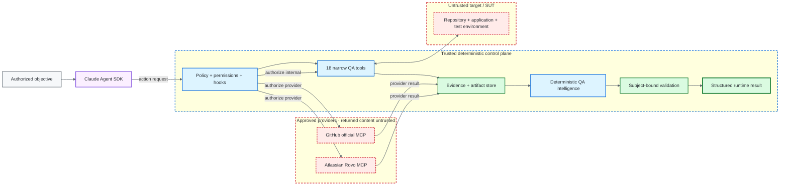

<div align="center">

# ƳƤ AI QA Automation Framework

### Evidence-First Agentic Quality Engineering

**Designed and engineered by Ƴunior Ƥortal (ƳƤ)**

[](pyproject.toml)
[](LICENSE)
[](docs/SETUP.md)
[](docs/ARCHITECTURE.md)

**A production-oriented agentic quality-engineering control system where Claude can plan, investigate, and adapt while deterministic policy governs authority, controlled tools produce provenance-bound evidence, and subject-bound validation retains terminal authority.**

[Documentation](docs/README.md) · [Architecture](docs/ARCHITECTURE.md) · [Runtime Lifecycle](docs/RUNTIME_LIFECYCLE.md) · [Result Contract](docs/RESULT_CONTRACT.md) · [Runtime Control](docs/RUNTIME_CONTROL.md) · [Security](docs/SECURITY.md) · [CI/CD](docs/CI_CD.md) · [Setup](docs/SETUP.md)

</div>

---

> [!IMPORTANT]
> **The model is a reasoner, not the test oracle. Reasoning is advisory. Observations are provenance-bound. Authority is deterministic. Success requires closure.** Claude may interpret evidence and propose actions; it cannot convert untrusted context into authority, self-approve a side effect, weaken the validation contract, or certify terminal success.

## At a glance

| Surface | Framework contract |
|---|---|
| **Runtime** | Python 3.11+ · `claude-agent-sdk==0.2.136` · default model identifier `claude-sonnet-5` |
| **Reasoning** | LLM planner/diagnostician; never test oracle, authorization engine, or terminal authority |
| **Controlled tools** | 18 least-privilege, purpose-built in-process QA tools; no generic autonomous Bash/Edit/Write/Web authority |
| **Trusted Skills** | exactly five allowlisted Claude Skills |
| **Live mutation** | Python/pytest-backed test mutation only; exact-path/revision closure is required before persistence |
| **Evidence** | run-confined state, immutable identities, manifests, hashes, artifacts, lineage, hash-chained journal, optional regulated audit chain |
| **Network** | exact host allowlists, read-only API default, browser routing controls, independent k6 egress prerequisite |
| **External MCP** | explicitly approved vendor integrations; provider identity never grants blanket authority and returned content remains untrusted evidence |
| **Evaluation** | deterministic tests, 34-scenario primary adversarial corpus, separately executed H-series readiness corpus, frozen safety thresholds |
| **Merge governance** | ordinary CI is development evidence; protected merge authority is independently admitted and identity-bound |

## Architecture



**Diagram key:** purple = advisory reasoning · blue = deterministic authority · green = evidence/validation · red dashed = untrusted evidence source. Color is never the only signal.

The detailed request sequence, evidence-first runtime flow, and transactional mutation/crash-recovery state machine have moved to [Runtime Lifecycle](docs/RUNTIME_LIFECYCLE.md). Deeper trust-zone and component ownership lives in [Architecture](docs/ARCHITECTURE.md).

## Engineering thesis

```text
Claude reasons.
Deterministic policy authorizes.
Controlled tools observe and act.
Evidence carries provenance.
Subject-bound validation owns terminal truth.
```

Four contracts keep those responsibilities separate:

| Contract | Question | Authority |
|---|---|---|
| **Authority** | What may the agent do? | deterministic policy, hooks, permissions, budgets |
| **Evidence** | What was actually observed? | controlled tools, manifests, artifacts, hashes, provider responses |
| **Mutation** | When may automated code changes persist? | path ownership, rollback transaction, revision-bound validation closure |
| **Outcome** | What may be called successful? | deterministic validation lineage and terminal evaluation |

The system is intentionally fail-closed: **uncertainty reduces authority**. Missing evidence does not become green, ambiguous ownership does not become permission, and incomplete validation does not become success.

## Quick start

### Deterministic local tooling

```bash
python3.11 -m venv .venv
source .venv/bin/activate
make install

ai-qa doctor
ai-qa demo
```

`make install` selects the matching committed interpreter-specific lock, enforces package hashes, installs without dependency resolution, and runs `pip check`. Windows and deliberate lock-update procedures are in [Setup](docs/SETUP.md) and [Supply-Chain Integrity](docs/SUPPLY_CHAIN.md).

### Live Claude Agent SDK session

```bash
export ANTHROPIC_API_KEY='...'
export AI_QA_CONTROL_ROOT='/path/to/ai-qa-automation'
export AI_QA_ARTIFACT_ROOT='/path/to/ai-qa-artifacts'
export AI_QA_BASE_REF='origin/main'

ai-qa agent \
  --control-root "$AI_QA_CONTROL_ROOT" \
  --workspace /path/to/isolated/sut-worktree \
  'Investigate the failing checkout test. Do not modify tests unless evidence proves a test defect.'
```

The control root, artifact root, and target workspace are separate trust domains. Exact configuration/credential policy lives in [Setup](docs/SETUP.md).

## Production control model

Model capability is deliberately broader than runtime authority. The live path removes generic write/shell/web authority, uses strict MCP configuration, requires deterministic authorization for controlled tools/provider actions, fails closed when approval is unavailable, and keeps independent turn/tool/network/mutation/repetition/time/cost budgets and per-tool circuits.

The runtime exposes **18 least-privilege, purpose-built in-process QA tools** across repository inspection, pytest evidence, API/browser observation, deterministic failure intelligence, source/coverage context, test design/regression/test-quality analysis, bounded generation proposals, locator-only self-healing, contracts, CI, mobile, and controlled performance execution. It also loads **exactly five allowlisted Claude Skills** from the trusted control root.

**Library capability is not runtime authority.** Reusable patch logic can understand multiple test syntaxes, while live autonomous mutation remains intentionally Python/pytest-backed because that path owns the execution and revision-binding contracts. There is no generic existing-test rewrite tool in the live agent surface.

See [Runtime Control](docs/RUNTIME_CONTROL.md), [Skills](docs/SKILLS.md), and [Production Readiness](docs/PRODUCTION_READINESS.md).

## Runtime truth and mutation closure

Terminal outcomes are distinct from individual validations and provider health. `SUCCESS` means every active deterministic gate required by the objective/revision is closed; `FAILURE`, `BLOCKED`, `POLICY_DENIED`, `INFRASTRUCTURE_FAILURE`, `BUDGET_EXCEEDED`, `CANCELLED`, and `NOT_VERIFIED` preserve materially different failure/uncertainty states.

A model result subtype of `success` can never produce framework `SUCCESS` by itself. For a changed test revision to persist, the mutation path requires exact-path patch-safety, exact-path targeted execution diagnostics, independently trusted targeted executed-test semantics, full-regression diagnostics, independently trusted full-regression semantics, no conflicting validation, and durable transaction closure at the same revision.

The current live pytest adapter deliberately does **not** promote target-controlled collection/output/report/exit data into independent positive semantic authority. That keeps autonomous mutation fail-closed rather than manufacturing green.

See the authoritative [Runtime Result Contract](docs/RESULT_CONTRACT.md), the visual lifecycle in [Runtime Lifecycle](docs/RUNTIME_LIFECYCLE.md), and the implementation mechanics in [Runtime Control](docs/RUNTIME_CONTROL.md).

## AI-assisted QA with deterministic closure

The framework uses AI where interpretation helps while keeping acceptance deterministic:

- **Failure investigation:** evidence-weighted classification distinguishes application, automation, locator/UI-contract, data, timing, environment, dependency, auth/configuration, performance, and insufficient-evidence classes.
- **Self-healing:** restricted to semantic locator maintenance; uniqueness alone is insufficient, and live mutation is further subject to exact-path/revision closure.
- **Test generation:** coverage-aware, provenance-bound planning/proposal; unknown product behavior is not invented and current generic proposals do not claim a coverage gap is closed.
- **Change intelligence:** merge-base-aware committed/dirty/untracked change analysis, ownership/risk/test-impact context, and conservative OpenAPI/Swagger drift evidence.

Deep dives: [Change Intelligence](docs/CHANGE_INTELLIGENCE.md), [Contract Drift Boundary](docs/CONTRACT_DRIFT_BOUNDARY.md), and [Technical Walkthrough](docs/TECHNICAL_WALKTHROUGH.md).

## Safety-critical boundaries

| Surface | Deterministic boundary |
|---|---|
| **API** | exact host allowlist; read-only default; redirects/proxy inheritance disabled; bounded sanitized observation |
| **Browser** | allowlisted navigation/subresources/WebSockets; service workers disabled for evidence context; final URL rechecked; bounded diagnostics/screenshots |
| **Performance / k6** | production-like targets denied; script restrictions; bounded execution/output; independently enforced external egress required for every run |
| **Mutation** | isolated Git worktree, lease/fingerprint, non-symlink owned path, rollback snapshot, one unresolved transaction, exact revision closure |
| **Recovery** | prior run/journal/target/rollback/backup/fingerprint/ownership revalidated before automatic stale recovery |
| **External MCP** | explicit vendor integrations only; conservative action authorization; provider output remains untrusted evidence |
| **Persistence** | confined run roots, bounded state/runtime/manifest/journal/artifacts, immutable evidence identities, hash verification, symlink rejection |

Application-level controls are defense in depth, not substitutes for deployment isolation, egress, identity, secret management, device/provider configuration, retention, or repository settings. Detailed boundaries live in [Security](docs/SECURITY.md), [Threat Model](docs/THREAT_MODEL.md), [API Observation Boundary](docs/API_OBSERVATION_BOUNDARY.md), [Browser Validation](docs/BROWSER_VALIDATION.md), [Pytest Execution Isolation](docs/PYTEST_EXECUTION_ISOLATION.md), and [MCP](docs/MCP.md).

## Evidence and traceability

Each run receives a confined durable evidence surface under `artifacts/<run_id>/` with canonical QA state, separate process-control state, evidence manifests, content-addressed artifacts, an append-only SHA-256 hash-chained journal, validation lineage, provenance, optional provider usage/cost, and unsigned run-integrity attestations.

```bash
ai-qa recover artifacts/run-<id>
ai-qa lineage artifacts/run-<id>
ai-qa attest artifacts/run-<id>
ai-qa contract-diff --baseline old-openapi.yaml --current new-openapi.yaml
```

An attestation is deliberately **unsigned**: content-addressed integrity proves byte relationships, not actor identity, notarization, compliance certification, trusted timestamp, business correctness, or test success. See [Traceability](docs/TRACEABILITY.md) and [Verification Boundaries](docs/VERIFICATION_BOUNDARIES.md).

## Evaluation architecture

The framework is evaluated as software, not by persuasive prose. Repository qualification includes deterministic unit/integration/policy/security tests, a fixed **34-scenario primary adversarial corpus**, a repository-visible but separately executed **H-series readiness corpus**, frozen threshold schema/hard-safety limits, and separated credentialed/model/browser execution boundaries.

```bash
make quality
make test
make eval
make security
make verify-local
make holdout
```

The H-series corpus is execution-separated but not blind/independent evidence because its fixtures remain repository-visible. Frozen hard-safety thresholds are policy artifacts rather than post-hoc knobs. See [Evaluation Strategy](docs/EVALUATION.md).

## CI and merge authority

`.github/workflows/ci.yml` provides read-only, secret-free deterministic evidence for pull requests, pushes to `main`, and merge groups, including **Required PR Gate**. That candidate-controlled workflow is development evidence, not protected merge authority.

Routine same-repository source-only admission uses the trusted default-branch `workflow_run` path in `trusted-pr-auto.yml`, which independently re-fetches the triggering run and live PR/base/head/merge subject and requires zero protected-root drift. Protected maintenance uses an independently deployed exact one-shot gate. Terminal **Trusted PR Gate** status remains bound to the dedicated GitHub App identity rather than to a same-named candidate workflow.

Manual H-series/model validation and release-candidate preparation are separately scoped and do not silently acquire publishing or protected-merge authority. See [CI/CD](docs/CI_CD.md), [Trusted PR Control Plane](docs/TRUSTED_PR_CONTROL_PLANE.md), [Release Candidate](docs/RELEASE_CANDIDATE.md), and [Supply Chain](docs/SUPPLY_CHAIN.md).

## Repository map

```text
.
├── .claude/
├── .github/
├── artifacts/
├── docs/
├── evals/
├── examples/
├── performance/
├── requirements/
├── scripts/
├── src/
└── tests/
```

Only top-level ownership boundaries are shown here; the technical docs own file-level structure.

## Documentation

Start with the [documentation hub](docs/README.md). Key review paths:

| Topic | Document |
|---|---|
| Architectural authority/trust | [Architecture](docs/ARCHITECTURE.md) |
| Runtime request/mutation/recovery flows | [Runtime Lifecycle](docs/RUNTIME_LIFECYCLE.md) |
| Terminal/validation/provider semantics | [Runtime Result Contract](docs/RESULT_CONTRACT.md) |
| Transaction/recovery implementation | [Runtime Control](docs/RUNTIME_CONTROL.md) |
| Security/threat boundaries | [Security](docs/SECURITY.md) · [Threat Model](docs/THREAT_MODEL.md) |
| Trusted setup/credentials | [Setup](docs/SETUP.md) |
| CI and protected merge governance | [CI/CD](docs/CI_CD.md) · [Trusted PR Control Plane](docs/TRUSTED_PR_CONTROL_PLANE.md) |
| Change/regression intelligence | [Change Intelligence](docs/CHANGE_INTELLIGENCE.md) |
| Evaluation/readiness governance | [Evaluation](docs/EVALUATION.md) |
| Evidence lineage/attestation | [Traceability](docs/TRACEABILITY.md) |
| External MCP | [MCP](docs/MCP.md) |
| Production control model | [Production Readiness](docs/PRODUCTION_READINESS.md) |
| Explicit non-claims | [Limitations](docs/LIMITATIONS.md) |
| End-to-end implementation review | [Technical Walkthrough](docs/TECHNICAL_WALKTHROUGH.md) |

## Scope and non-claims

The repository does **not** claim that application flags create a firewall/process sandbox, hashes authenticate publishers, reproducible artifacts create signed provenance, provider configuration proves provider availability, one browser/API/load/mobile observation proves target correctness, ordinary PR CI creates protected merge authority, or model reasoning can replace deterministic controls.

Those boundaries are intentional and are documented in [Limitations](docs/LIMITATIONS.md) and [Verification Boundaries](docs/VERIFICATION_BOUNDARIES.md).

---

## License

MIT — see [LICENSE](LICENSE).
