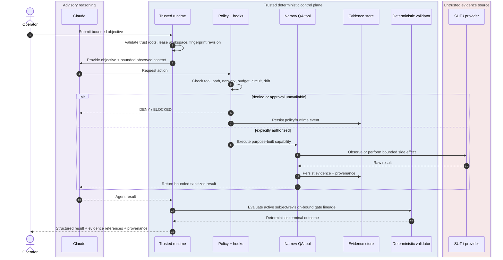
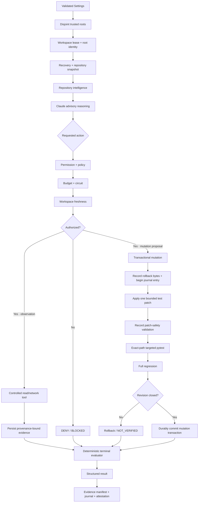
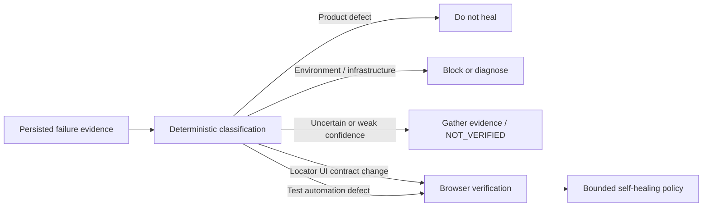

<div align="center">

# ƳƤ AI QA Automation Framework

### Evidence-First Agentic Quality Engineering

**Designed and engineered by Ƴunior Ƥortal (ƳƤ)**

[](pyproject.toml)
[](LICENSE)
[](docs/SETUP.md)
[](docs/ARCHITECTURE.md)

**A production-oriented agentic quality engineering control system where Claude can plan, investigate, and adapt while deterministic policy governs authority, controlled tools produce provenance-bound evidence, and subject-bound validation retains terminal authority.**

[Documentation](docs/README.md) · [Architecture](docs/ARCHITECTURE.md) · [Runtime Result Contract](docs/RESULT_CONTRACT.md) · [Runtime Control](docs/RUNTIME_CONTROL.md) · [Security](docs/SECURITY.md) · [CI/CD](docs/CI_CD.md) · [Setup](docs/SETUP.md) · [Technical Walkthrough](docs/TECHNICAL_WALKTHROUGH.md)

</div>

---

> [!IMPORTANT]
> **The model is a reasoner, not the test oracle. Reasoning is advisory. Observations are provenance-bound. Authority is deterministic. Success requires closure.**
>
> Claude may interpret observations, form hypotheses, rank risk, and choose among explicitly authorized actions. It cannot convert untrusted context into authority, self-approve a side effect, weaken the validation contract, or certify terminal success. Controlled tools observe and execute; policy authorizes; deterministic validators decide what the system can prove.[^industry]

## At a glance

| Engineering surface | Framework contract |
|---|---|
| **Runtime** | CPython 3.11 or 3.13 · `claude-agent-sdk==0.2.136` · default model identifier `claude-sonnet-5` |
| **Reasoning boundary** | the LLM acts as planner and diagnostician; it is neither the test oracle nor terminal authority |
| **Controlled tool surface** | 18 least-privilege, purpose-built in-process QA tools; no generic autonomous Bash/Edit/Write/Web authority |
| **Trusted Skills** | exactly five allowlisted Claude Skills |
| **Live mutation boundary** | Python/pytest-backed test mutation only; reusable libraries may understand additional test syntaxes without widening runtime authority |
| **Mutation closure** | exact-path patch safety + exact-path targeted pytest + full regression at one revision |
| **Evidence** | run-confined state, immutable identities, manifests, content hashes, artifacts, lineage, append-only hash-chained journal, optional regulated audit chain |
| **Security posture** | fail-closed authorization, explicit trust roots, bounded resources, untrusted external context, independent deployment controls |
| **Network posture** | exact host allowlists, read-only API default, browser routing controls, independent k6 egress prerequisite |
| **External MCP** | explicitly approved vendor integrations; server identity never grants blanket authority and returned content remains untrusted evidence |
| **Evaluation** | deterministic tests, adversarial primary corpus, repository-visible sequestered H-series readiness corpus, frozen safety thresholds |
| **Workflow governance** | owner-authorized trusted `repository_dispatch` validates exact prospective merges behind protected `Trusted PR Gate`; ordinary PR/push/merge-group execution is externally denied, and H-series/model validation remains separately scoped |
| **License** | MIT |

**On this page:** [Engineering thesis](#engineering-thesis) · [Architecture](#architecture-at-a-glance) · [Quick start](#quick-start) · [Control model](#production-control-model) · [Runtime truth](#runtime-result-contract) · [AI-assisted QA](#ai-assisted-qa-with-deterministic-closure) · [Safety boundaries](#safety-critical-boundaries) · [Evidence](#evidence-traceability-and-attestation) · [Evaluation](#evaluation-architecture) · [Documentation](#documentation-map)

> [!TIP]
> **Reviewing the engineering rather than installing it?** Read [Architecture](docs/ARCHITECTURE.md) → [Runtime Result Contract](docs/RESULT_CONTRACT.md) → [Runtime Control](docs/RUNTIME_CONTROL.md) → [Security](docs/SECURITY.md) → [CI/CD](docs/CI_CD.md) → [Technical Walkthrough](docs/TECHNICAL_WALKTHROUGH.md). The [documentation hub](docs/README.md) provides additional role-specific paths.

<details>
<summary><strong>Reviewer checklist — trace the trust model in code</strong></summary>

Use these as inspection prompts; the checkboxes are not runtime results.

- [ ] Trace one bounded objective from `agent.py` through permission handling to a purpose-built QA tool.
- [ ] Verify that SUT, repository, DOM, API, log, and MCP content can contribute evidence without acquiring control-plane authority.
- [ ] Follow one mutation from proposal through exact-path patch safety, targeted pytest, full regression, and durable commit/rollback closure.
- [ ] Confirm that terminal `SUCCESS` is derived from active validation lineage rather than model prose or provider health.
- [ ] Inspect independent budgets, tool circuits, workspace ownership, path confinement, and network boundaries for fail-closed behavior.
- [ ] Compare the primary adversarial corpus with the repository-visible sequestered H-series readiness cases and frozen safety thresholds.

</details>

---

## Engineering thesis

```text
Claude reasons.
Deterministic policy authorizes.
Controlled tools observe and act.
Evidence carries provenance.
Subject-bound validation owns terminal truth.
```

The ƳƤ AI QA Automation Framework treats an LLM as a **bounded planner and diagnostician inside a quality-engineering control system**—not as the test oracle, authorization engine, or system of record. Model reasoning is intentionally separated from the systems that own execution, evidence acquisition, side-effect authorization, mutation persistence, recovery, and terminal outcome.

That separation of duties is the central design decision. Agentic testing becomes unsafe when the same component can modify the subject, interpret the evidence, grant itself permission, and declare its own work successful. Here, the component that proposes an action cannot manufacture the authority or proof required to close it.

### Four contracts govern the framework

| Contract | Question | Authority |
|---|---|---|
| **Authority** | What may the agent do? | deterministic policy, hooks, permissions, budgets |
| **Evidence** | What was actually observed? | controlled tools, manifests, artifacts, hashes, provider responses |
| **Mutation** | When may automated code changes persist? | path ownership, rollback transaction, revision-bound validation closure |
| **Outcome** | What may be called successful? | deterministic validation lineage and terminal evaluation |

> [!NOTE]
> The architecture is deliberately fail-closed: **uncertainty reduces authority**. Missing evidence does not become green. Ambiguous ownership does not become permission. Incomplete validation does not become success.

### What the architecture is designed to prevent

| Failure mode | Deterministic response |
|---|---|
| Model-declared success | terminal truth comes from deterministic gate lineage, never persuasive prose |
| False product-defect attribution | evidence-weighted deterministic classification before test-side repair |
| Test weakening disguised as self-healing | patch rules reject skip/xfail, assertion erosion, arbitrary sleeps, timeout inflation, tautologies, and broad suppression |
| Wrong-element locator repair | same-DOM Playwright measurement + deterministic semantic intent + transactional validation |
| Meaningless generated tests | coverage provenance + conservative planning + meaningful-assertion checks + execution closure |
| Regression under-selection | mandatory coverage is preserved; uncertainty broadens rather than shrinking regression |
| Prompt injection from target or provider content | instruction-shaped SUT/source/DOM/log/API/MCP/repository content remains untrusted data and cannot redefine policy |
| Tool or integration privilege expansion | least-privilege tool inventory + fail-closed hooks + vendor identity checks + action-level authorization |
| Concurrent or stale mutation | OS-backed workspace lease + content-sensitive fingerprint + rollback-backed revision transaction |
| Wrong-subject validation | targeted pytest must explicitly select the exact pending mutation path and revision |
| Filesystem alias/tamper attacks | non-symlink ownership checks cover mutation, rollback, evidence, journal, lease, recovery, and attestation paths |
| Cross-run evidence contamination | confined run roots + immutable evidence identities + manifests + hashes + hash-chained journals |
| Unbounded agent loops | independent turn/tool/network/mutation/repetition/time/cost budgets + per-tool circuits |
| Production load accident / k6 egress | non-production target policy + script restrictions + independently enforced egress |

---

## Architecture at a glance

<picture>
  <source media="(prefers-color-scheme: dark)" srcset="docs/assets/architecture-banner-dark.svg">
  <source media="(prefers-color-scheme: light)" srcset="docs/assets/architecture-banner-light.svg">
  
</picture>

The banner summarizes the control contract. The graph below exposes the structural trust boundaries in a source-reviewable form.


**Diagram key:** purple = advisory reasoning · blue = deterministic authority · green = evidence/validation · red dashed = untrusted evidence source. Labels and boundaries carry the same meaning so color is never the only signal.

<details>
<summary><strong>Expand the runtime request → evidence → validation sequence</strong></summary>



</details>

### Trust boundaries

| Boundary | Trust posture | Examples |
|---|---|---|
| **Control plane** | trusted authority | runtime package, policy, hooks, Skills, tool schemas, deterministic thresholds |
| **Target / SUT** | untrusted data and evidence source | source, tests, DOM, logs, API responses, target `CLAUDE.md`, `.claude/`, `.mcp.json` |
| **External providers** | approved transport/provider; privileges remain tool-gated and returned content remains untrusted | GitHub MCP, Atlassian Rovo MCP |
| **Deployment infrastructure** | independent enforcement boundary | process/container isolation, egress, identity, secrets, retention, devices, real targets |

> [!WARNING]
> Application-layer guardrails are defense in depth, not a substitute for deployment controls. High-assurance process isolation, network egress, secret management, provider identity, retention, devices, and real target environments remain deployment-owned enforcement boundaries rather than claims manufactured by repository code.

Deep dives: [Architecture](docs/ARCHITECTURE.md) · [Runtime Control](docs/RUNTIME_CONTROL.md) · [Security](docs/SECURITY.md) · [Threat Model](docs/THREAT_MODEL.md)

---

## Quick start

### Local deterministic tooling

Repository verification is intentionally bound to the committed interpreter-specific development lock. For the shortest reproducible path on macOS/Linux, use an exact supported interpreter and the repository-owned installer:

```bash
python3.11 -m venv .venv
source .venv/bin/activate
make install

ai-qa doctor
ai-qa demo
```

`make install` selects the matching committed `requirements/dev-py311.lock` or `requirements/dev-py313.lock`, enforces package hashes, installs the project non-editably without dependency resolution, and runs `pip check`. Windows PowerShell and deliberate lock-update procedures are documented in [Setup](docs/SETUP.md) and [Supply-Chain Integrity](docs/SUPPLY_CHAIN.md).

The repository-certified Python matrix is deliberately exact: CPython 3.11 and 3.13. Package metadata rejects 3.12 and versions outside that range until a matching lock, clean install, and trusted CI evidence are added; installer acceptance is not treated as evidence of support.

`.env.example` is a reference template only; runtime settings do not automatically load a repository `.env` file.

### Live Claude Agent SDK session

```bash
export ANTHROPIC_API_KEY='...'
export AI_QA_CONTROL_ROOT='/path/to/ai-qa-automation'
export AI_QA_ARTIFACT_ROOT='/path/to/ai-qa-artifacts'
export AI_QA_BASE_REF='origin/main'

ai-qa agent \
  --control-root "$AI_QA_CONTROL_ROOT" \
  --workspace /path/to/isolated/sut-worktree \
  'Investigate the failing checkout test. Do not modify tests unless evidence proves a test defect.'
```

The control root, artifact root, and target workspace are separate trust domains. Exact configuration and credential boundaries are documented in [Setup and Configuration](docs/SETUP.md).

### Controlled k6 execution

Because a JavaScript workload can construct destinations dynamically, every k6 execution requires a separately enforced egress boundary:

```bash
export AI_QA_K6_EXTERNAL_EGRESS_ENFORCED=true  # only after trusted infrastructure actually enforces it
ai-qa performance-reference --workspace /path/to/isolated/sut-worktree --url http://127.0.0.1:8000
```

This variable records a deployment assertion; it does not create a sandbox or egress control. The command remains fail-closed unless that assertion is present and the runtime can bind the script, target, environment, and thresholds into the validation subject.

---

## Production control model

### Runtime flow



### Runtime authority layers

| Layer | Implementation | Purpose |
|---|---|---|
| Configuration | `config.Settings` | validates trusted settings and defaults to deny |
| Objective boundary | `runtime.objective_bounds` | bounds the operator objective before persistence, prompt use, or hashing |
| Trust roots | `agent.validate_runtime_roots` | prevents overlap between control, artifact, and target roots |
| Workspace lease | `runtime.workspace_lease` | blocks concurrent authority over one workspace |
| Recovery | `runtime.stale_recovery` | resolves or blocks abandoned pending mutation before new model execution |
| Repository snapshot | `tools.repository.RepositoryInspector` | binds execution to observed target state and content-sensitive fingerprint |
| Repository intelligence | `runtime.bootstrap` | change impact, test impact, ownership, contract drift, dependency inventory |
| Policy | `policy.PolicyEngine` | authorizes tools, paths, network actions, API methods, mutations, provider actions |
| Permissions | `runtime.runtime_hooks` | pre-dispatch and post-dispatch enforcement; no model bypass |
| Budgets | `runtime.budget.ExecutionBudget` | independent wall/tool/network/mutation limits |
| Circuits | `runtime.run_control` | tool repetition and operational authority |
| Controlled QA tools | `runtime.internal_tools` | all model-facing execution/observation capabilities |
| Mutation transaction | `runtime.run_control` + `mutation_lineage` | begin → apply → validate → durable commit, otherwise rollback |
| Evidence | `evidence.EvidenceStore` | immutable per-run evidence identity and manifest |
| Journal | `runtime.journal.RunJournal` | append-only hash-chained operational history |
| Terminal validation | `runtime.validation_truth` | requires active revision/gate lineage before `SUCCESS` |
| Reporting | `reporting` + `attestation` | terminal output derives from deterministic state, not model narrative |

### Default-deny posture

The framework starts from no external trust and no mutation privilege:

```dotenv
AI_QA_ALLOW_EXTERNAL_NETWORK=false
AI_QA_ALLOW_TEST_WRITES=false
AI_QA_ALLOW_MUTATING_API_METHODS=false
AI_QA_PYTEST_PROCESS_ISOLATION_ENFORCED=false
AI_QA_PYTEST_EXTERNAL_EGRESS_ENFORCED=false
AI_QA_K6_EXTERNAL_EGRESS_ENFORCED=false
AI_QA_ENABLE_GITHUB_MCP=false
AI_QA_ENABLE_ATLASSIAN_MCP=false
```

`allowed_network_hosts` defaults only to loopback names. External integrations remain disabled until explicitly enabled. Live pytest execution of target-controlled code additionally fails closed unless trusted deployment infrastructure asserts both process/filesystem containment and independent outbound-egress containment; those settings record external guarantees rather than creating them.

---

## Runtime result contract

A model statement such as `"tests passed"` is never terminal evidence.

The runtime ends in exactly one deterministic status:

| Status | Meaning |
|---|---|
| `SUCCESS` | the required objective validation gate and revision closure are satisfied |
| `FAILURE` | a deterministic gate executed and observed a product/test failure |
| `NOT_VERIFIED` | execution or evidence is insufficient to certify the objective |
| `POLICY_DENIED` | a requested action violated deterministic policy |
| `BUDGET_EXCEEDED` | an independent runtime budget was exhausted |
| `BLOCKED` | progress requires authority or infrastructure the runtime does not have |
| `INFRASTRUCTURE_FAILURE` | provider, process, filesystem, network, browser, or runtime infrastructure prevented proof |
| `CANCELLED` | operator/runtime cancellation interrupted execution |

A successful outcome additionally requires terminal workspace freshness: the current target fingerprint must still match authorized lineage, the workspace root identity must remain the same, and no mutation transaction may remain pending.

See [Runtime Result Contract](docs/RESULT_CONTRACT.md) and [Runtime Control](docs/RUNTIME_CONTROL.md).

---

## AI-assisted QA with deterministic closure

### Failure classification

A failure is never “healed” merely because a model suggests a patch. The system first builds evidence and classifies likely cause using deterministic features.



The taxonomy distinguishes product defects, locator/UI-contract changes, test-automation defects, environment problems, infrastructure failures, and unknown causes. Uncertainty does not create mutation privilege.

### Locator self-healing

Locator repair is deliberately narrower than generic code editing.

A candidate must satisfy all of the following before it can be considered:

1. The current failure classification must support repair with sufficient confidence.
2. Playwright must verify the original locator and candidates against the **same current DOM**.
3. Context evidence must include screenshot and accessibility observations from that same verification.
4. Candidate uniqueness and rejected reasons must come from measured evidence rather than model claims.
5. Semantic intent must be preserved.
6. The proposal must remain low/medium risk under deterministic policy.
7. The exact source file hash must still match.
8. The patcher may change only the locator string, and deterministic unsafe-diff rules must pass.
9. The new revision must pass exact-path targeted pytest and full regression before the mutation can persist.

The model may generate hypotheses; the trusted tool verifies the DOM truth and the runtime owns the mutation transaction.

### Test generation

Test generation is coverage-aware rather than greenfield-by-default:

1. `search_test_coverage` inspects bounded test-code files and records observed coverage evidence.
2. `plan_tests` requires that same canonical evidence identifier.
3. Existing coverage incompleteness propagates into the plan instead of disappearing.
4. The planner produces candidate cases without writing files.
5. `create_test_file` requires a closed prior revision and a plan from the same run.
6. The safe patcher rejects non-test paths, unsafe code, missing meaningful assertions, and existing-file overwrite.
7. The resulting revision remains unverified until execution closure.

### Regression prioritization

Regression selection uses risk, changed-area overlap, business criticality, failure history, runtime cost, and dependency confidence. Low dependency confidence **broadens** selection rather than reducing it. Mandatory coverage is never discarded merely to optimize runtime.

---

## Safety-critical boundaries

### Target-controlled pytest requires real isolation

A test file is executable code. The framework therefore refuses to treat a configuration flag as a sandbox.

The live runtime requires two independent deployment assertions before `run_pytest` may execute target-controlled code:

- process/filesystem containment is actually enforced;
- outbound egress containment is actually enforced.

If either is missing, execution records a denied/non-executed result. A production deployment must establish those properties outside the target workspace before setting the corresponding trusted runtime values.

### API and browser boundaries

Network tools enforce exact host allowlists. API mutation methods are independently denied by default. Browser evidence records deterministic screenshots, DOM/accessibility context, console errors, failed requests, and HTTP failures. Provider content does not become policy.

### Performance testing

k6 execution is subject to three independent checks:

1. deterministic script/path restrictions;
2. non-production target policy;
3. independently enforced egress asserted by trusted infrastructure.

A target being localhost does not remove the egress requirement because the JavaScript module itself is executable code.

### Prompt injection

The target may contain instruction-shaped content in source, logs, DOM, API bodies, `CLAUDE.md`, `.claude/`, `.mcp.json`, issue text, or provider results. The runtime treats all of those as data. Trusted Claude settings, Skills, and MCP configuration come only from the separately controlled control root.

### Mutation ownership

Mutation is a transaction, not a file write:

```text
begin mutation
→ persist rollback bytes + pre-image identity
→ apply one policy-approved bounded patch
→ record patch safety
→ advance revision
→ exact-path targeted validation
→ full regression
→ durable commit
```

If validation fails, state drifts, the tool returns an error, or the run terminates with a pending transaction, the runtime rolls back. A process crash is handled by stale-run reconciliation before a new model session may start.

---

## Evidence, traceability, and attestation

### Evidence model

Evidence records carry source, kind, nature, summary, structured data, timestamps, content hashes, and run identity. The runtime distinguishes **observed facts** from **model interpretations** so advisory reasoning cannot masquerade as observation.

Representative evidence kinds include:

- source observations;
- test execution results;
- API responses;
- screenshots and accessibility snapshots;
- Git diffs;
- policy decisions;
- performance metrics;
- healing proposals;
- test-generation plans.

### Persistence model

Run evidence is stored below a run-confined artifact root. The evidence store maintains immutable evidence identity, an atomic manifest, bounded durable writes, and a filesystem-observation layer that rejects symlink and special-file aliases.

The journal records operational authority transitions as an append-only hash chain. Regulated mode can add a separate chained audit surface. State, runtime metadata, lease ownership, mutation lineage, and attestation each use their own bounded durable representation.

### Provenance

Final reporting records, where available:

- model identifier;
- Agent SDK version;
- configuration fingerprint;
- target Git SHA;
- objective gate identity;
- change revision;
- validation results and evidence identifiers;
- MCP capability state;
- tool/network/mutation counts;
- retry count, duration, and cost/token usage;
- per-run attestation identity.

An attestation describes what the runtime observed and validated. It is not a cryptographic publisher signature and does not replace external artifact signing, deployment identity, or release provenance.

---

## Evaluation architecture

The repository uses multiple evaluation layers with distinct authority:

| Layer | Purpose | Can prove |
|---|---|---|
| Deterministic Python tests | correctness of bounded application-controlled logic | the tested code path under the tested environment |
| Primary adversarial corpus | deterministic safety and decision behavior | expected behavior against repository-visible scenarios |
| H-series readiness corpus | separately-invoked, repository-visible readiness cases | readiness against a sequestered but **not truly blind** corpus |
| Live model smoke | provider/SDK integration only when credentials are supplied | actual observed provider/session behavior for that run |

Primary evaluations cover locator failures, assertion weakening, timeout inflation, duplicate requests, prompt injection, secret-read attempts, MCP outages, malformed model results, blocked load execution, and unsafe mutation patterns.

The readiness thresholds are intentionally frozen in `evals/thresholds.json`. Lowering them is not an accepted path to green.

> [!NOTE]
> Repository-visible holdouts are not claimed to be blind. Genuine blind evaluation requires an external or access-separated authority boundary.

---

## CI/CD and trusted validation

The repository's GitHub validation design treats workflow authority as part of the supply chain.

### Trusted automatic PR validation

Automatic validation is performed only through an owner-authorized `repository_dispatch` carrying the exact prospective merge SHA, PR head SHA, and base SHA. The workflow validates that subject before running build, test, evaluation, documentation, browser, security, dependency, reproducibility, and container gates.

A protected-control preflight compares critical paths against trusted default-branch objects. If a PR changes protected control-plane files, the trusted run refuses to validate those PR-controlled bytes until the repository owner explicitly bootstraps the trusted control change through the documented process.

The final `Trusted PR Gate` status is posted by a narrow, trusted reporter job and is the required status on `main`. Strict freshness is enforced by the repository ruleset; stale status on an older subject cannot satisfy a newer merge.

### Automatic validation matrix

The trusted workflow runs, among other gates:

- Python 3.11 and 3.13 deterministic suites;
- Ruff format/lint and strict Mypy;
- `compileall`;
- deterministic primary evaluations;
- local docs/reference verification;
- Mermaid rendering through a digest-pinned container;
- Bandit;
- `pip-audit` against hash-locked dependency graphs;
- secret scanning;
- browser/reference-SUT execution;
- two clean-source wheel builds and byte comparison;
- runtime SBOM generation;
- digest-pinned container build + non-root runtime smoke.

### Intentionally separate validation

Credentialed provider tests, the H-series readiness corpus, live target execution requiring deployment isolation, and privileged external integrations remain manual or environment-protected. Absence of those external prerequisites is reported as blocked/unverified rather than converted into automatic green.

See [CI/CD](docs/CI_CD.md), [Production Readiness](docs/PRODUCTION_READINESS.md), and [Supply-Chain Integrity](docs/SUPPLY_CHAIN.md).

---

## Dependency and build integrity

The build pipeline separates dependency resolution from installation.

Committed lockfiles are interpreter-specific and hash-pinned. CI installs exact development/runtime/build graphs with `--require-hashes`. Build authority is re-verified before and after dependency installation. The Python build backend is pinned. GitHub Actions are pinned to immutable commit SHAs. The runtime Docker base is digest-pinned.

Reproducibility evidence is intentionally scoped: two wheel builds from separate fresh Git archives are compared byte-for-byte in the same trusted CI environment. That proves same-environment repeatability for the validated subject; it does not prove independent-builder reproducibility or publisher identity.

Runtime dependencies receive a CycloneDX SBOM and independent vulnerability audit before container construction.

---

## Operating model

### Development loop

```bash
make install
make lint
make type
make test
make eval
make security
make docs
```

Browser/reference-SUT execution, reproducible builds, runtime dependency audit/SBOM, container construction, trusted prospective-merge validation, and manual live/H-series validation remain explicit workflow stages rather than hidden local assumptions.

### Change discipline

For a material runtime change:

1. update implementation and deterministic tests;
2. validate failure paths and denial semantics;
3. update architecture/security/runtime documentation if the contract changed;
4. run the applicable local deterministic checks;
5. open a PR;
6. obtain trusted exact-subject CI evidence;
7. inspect required status freshness and mergeability;
8. merge only the validated revision.

For control-plane changes, follow the bootstrap procedure in [CI/CD](docs/CI_CD.md) instead of attempting to let PR-controlled workflow bytes validate themselves.

---

## Repository structure

```text
.
├── .claude/                 # trusted hooks, Skills, Claude runtime settings
├── .github/                 # trusted CI, CODEOWNERS, dependency automation
├── docs/                    # architecture, security, operations, result contract
├── evals/                   # primary and sequestered readiness scenarios
├── examples/reference_sut/  # deterministic reference application
├── performance/             # constrained k6 reference module
├── requirements/            # interpreter-specific dev + build/runtime lock graphs
├── scripts/                 # CI/supply/docs/build authority verifiers
├── src/ai_qa_automation/    # framework implementation
└── tests/                   # unit, integration, policy, security, evaluation suites
```

Key source areas:

- `agent.py` — Agent SDK lifecycle, trusted options, bounded retries, terminal orchestration;
- `runtime/run_control.py` — operational budgets, workspace freshness, mutation transaction authority;
- `runtime/internal_tools.py` — the 18 model-facing QA tools;
- `runtime/runtime_hooks.py` — pre/post dispatch control and closure;
- `runtime/validation_truth.py` — deterministic terminal/revision authority;
- `evidence.py` / `state.py` / `runtime/journal.py` — persisted truth;
- `policy.py` — deterministic authorization;
- `tools/` — narrowly scoped test/API/browser/repository/performance/mutation primitives.

---

## Documentation map

| Document | Focus |
|---|---|
| [Documentation Hub](docs/README.md) | navigation and reading paths |
| [Architecture](docs/ARCHITECTURE.md) | control plane, trust boundaries, component model |
| [Runtime Control](docs/RUNTIME_CONTROL.md) | budgets, leases, freshness, mutation transactions, recovery |
| [Runtime Result Contract](docs/RESULT_CONTRACT.md) | terminal statuses, validation authority, provenance |
| [Security](docs/SECURITY.md) | secure defaults and enforcement boundaries |
| [Threat Model](docs/THREAT_MODEL.md) | assets, adversaries, abuse cases, mitigations |
| [MCP](docs/MCP.md) | provider trust and action authorization |
| [Setup](docs/SETUP.md) | trusted configuration and credential setup |
| [Operations](docs/OPERATIONS.md) | artifacts, triage, recovery, rollback |
| [CI/CD](docs/CI_CD.md) | trusted prospective-merge validation and bootstrap procedure |
| [Supply-Chain Integrity](docs/SUPPLY_CHAIN.md) | locks, pins, reproducibility, SBOM, scan scope |
| [Production Readiness](docs/PRODUCTION_READINESS.md) | claim/evidence boundaries and readiness caveats |
| [Technical Walkthrough](docs/TECHNICAL_WALKTHROUGH.md) | end-to-end code path walkthrough |

---

## Design scope and explicit non-goals

The framework is intentionally production-oriented without pretending to be a hosted platform.

### In scope

- bounded Agent SDK orchestration;
- deterministic policy, evidence, and validation authority;
- transactional Python test mutation;
- API/browser/contract/performance QA evidence;
- repository intelligence and regression planning;
- optional read-oriented MCP integrations;
- secure/reproducible repository validation.

### Not claimed by repository code alone

- a production process/container sandbox;
- independent outbound egress enforcement;
- a customer identity/RBAC platform;
- a persistent multi-tenant service plane;
- managed secrets infrastructure;
- cryptographic publisher signing;
- real mobile-device execution without an externally provisioned Appium environment;
- production performance/load qualification without a safe isolated target.

The project adds infrastructure only when it closes a concrete authority, evidence, safety, or operational gap.

---

## License

MIT License. See [LICENSE](LICENSE).

Copyright © Yunior Portal.

---

<div align="center">

**ƳƤ AI QA Automation Framework** · **Ƴunior Ƥortal**

Evidence first. Authority explicit. Validation deterministic.

</div>

[^industry]: Selected public reference points used to orient terminology and integration boundaries: Anthropic [Claude Agent SDK](https://platform.claude.com/docs/en/agent-sdk/overview), Anthropic [Agent Skills](https://platform.claude.com/docs/en/agents-and-tools/agent-skills/overview), Model Context Protocol [Architecture](https://modelcontextprotocol.io/docs/learn/architecture), GitHub [official MCP server](https://github.com/github/github-mcp-server), Playwright [auto-waiting](https://playwright.dev/docs/actionability), OpenTelemetry [documentation](https://opentelemetry.io/docs/), OWASP [LLM Prompt Injection](https://genai.owasp.org/llmrisk/llm01-prompt-injection/), and NIST [AI Risk Management Framework](https://www.nist.gov/itl/ai-risk-management-framework).
