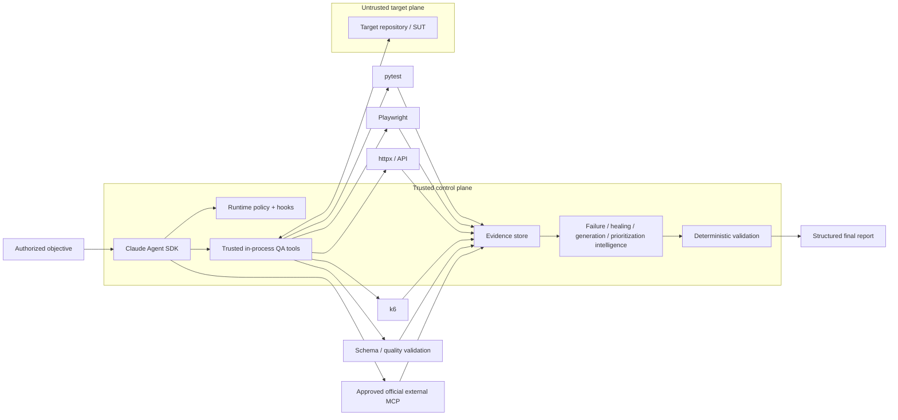

# AI QA Automation — Agentic Quality Engineering Platform

I built this project around one rule: **model reasoning is not test evidence**.

Claude can interpret failures, form hypotheses, select controlled actions, propose repairs, design tests, and assess risk. Test runners, policy checks, schemas, exit codes, performance thresholds, and other deterministic controls decide whether a result is actually verified.

```text
Claude reasons. Controlled tools execute. Deterministic systems decide whether gates passed.
```

`NOT_EXECUTED`, `NOT_OBSERVED`, `NOT_VERIFIED`, and `BLOCKED` are explicit states. A successful model response by itself is never converted into PASS.

## Architecture



### Trust boundaries

| Zone | Treatment | Examples |
|---|---|---|
| Control plane | Trusted | runtime policy, `CLAUDE.md`, Skills, hooks, tool schemas, eval thresholds |
| Target/SUT plane | Untrusted data | source, tests, DOM, logs, target `.mcp.json`, target `CLAUDE.md` |
| Integration plane | Explicitly approved | GitHub official MCP, Atlassian Rovo MCP |

Source comments, DOM text, API responses, CI logs, GitHub/Jira content, and MCP responses are evidence inputs. They cannot redefine control-plane policy.

## Implemented runtime

The live runtime uses the official Claude Agent SDK and a narrow in-process QA tool server. Its configuration includes:

- `tools=[]` so generic built-in tools are not part of the base runtime surface
- explicit internal QA tool names
- explicit `disallowed_tools` for Bash/Edit/Write/Web capabilities
- `setting_sources=["project"]` plus an explicit allowlist of the five project Skills
- `strict_mcp_config=True`
- deterministic `PreToolUse`, `PostToolUse`, and failure hooks
- a fail-closed permission handler
- bounded turns, tool calls, repeated actions, network operations, autonomous mutations, execution time, and model cost
- an exclusive OS-backed workspace lease so concurrent agent runs cannot mutate the same SUT worktree
- deterministic repository fingerprints that block autonomous writes after out-of-band workspace drift
- transactional test mutations with trusted rollback snapshots until targeted + regression validation closes the revision
- per-tool failure circuits that stop repeatedly failing integrations without widening tool authority
- canonical QA state persisted outside conversation history, with separate runtime-control metadata
- an append-only hash-chained run journal plus run-scoped evidence/artifact manifests
- bounded repository profiling, change-impact analysis, and dependency-manifest inventory before model execution

### Internal QA tools

The Agent SDK tool surface currently includes:

- repository inspection
- pytest execution
- API probing
- Playwright browser evidence collection
- deterministic failure classification
- policy-approved bounded test-file reads
- observed repository test-coverage search
- coverage-evidence-bound test planning
- regression prioritization
- deterministic Python test-quality review
- plan-bound guarded test-file creation
- Playwright locator verification, semantic healing proposals, and locator-only repair
- JSON Schema validation
- CI failure analysis
- Appium runtime inspection
- controlled k6 execution and threshold assessment

These are project-owned application tools. They are separate from external third-party MCP integrations.

## Failure investigation

Failure analysis starts with evidence rather than a product-defect assumption. The classifier distinguishes categories such as:

- application defect
- test automation defect
- locator/UI contract change
- test-data failure
- timing/flakiness
- environment failure
- external dependency failure
- authentication failure
- configuration failure
- performance regression
- insufficient evidence

A missing UI element does not automatically trigger locator repair. For example, if the page API returns HTTP 500 and the expected form never renders, the evidence points toward an application/API failure instead of a test locator defect.

## Safe self-healing

Locator repair is treated as a guarded maintenance operation, not a search for any selector that makes a test green.

Candidate ranking favors:

```text
stable test id > accessible role/name > stable semantic attribute > fragile structural selector
```

The repair path does not accept Claude's claim that a candidate is unique. Playwright measures the original and replacement locator counts in the same DOM, and the proposal is bound to that observed evidence, the current deterministic failure classification, the exact test path, and the expected file hash. The live agent can apply only the approved locator expression; it does not expose a generic existing-test text replacement tool.

After a repair, patch safety, a targeted pytest run, and a full regression must pass at the new change revision before another mutation can occur. Historical failures stay recorded, while only a newer approved revision of the same deterministic gate can supersede an older failure. Conflicting PASS/FAIL results at the same revision remain `NOT_VERIFIED` rather than being treated as a successful retry.

The repair path also blocks common shortcuts such as:

- skipped or xfailed tests
- arbitrary sleeps
- indiscriminate timeout inflation
- assertion removal or weakening
- tautological assertions
- broad exception suppression

Test writes are disabled by default. When explicitly enabled, writes remain restricted to approved test directories and pass deterministic patch-quality checks.

## Coverage-aware test generation

Test generation starts with a bounded read-only repository coverage search. That observed search is stored as evidence; `plan_tests` must reference its evidence ID, and a new test file can be created only from a same-run plan bound to that search. This keeps coverage discovery, planning, and mutation connected by provenance instead of accepting an ungrounded model claim that coverage is missing.

Generated Python/JavaScript/TypeScript tests are checked for meaningful assertions and unsafe shortcuts before creation. Comments or strings containing assertion-like text do not count as assertion coverage.

## API and browser controls

API probes are host-allowlisted and read-only by default. `GET`, `HEAD`, and `OPTIONS` are permitted; mutating methods require explicit runtime configuration.

Playwright checks initial navigation, HTTP(S) subresources, and WebSocket connections against the host allowlist. Service workers are disabled in the evidence-collection context so they cannot silently extend the network surface. Off-allowlist requests are blocked and recorded. Screenshot files are retained as `RAW` binary evidence and are not inserted into model context as sanitized text.

## Performance controls

k6 execution is restricted to an explicitly classified non-production environment and the runtime network allowlist. The runner requires the script to consume an injected `BASE_URL` or `TARGET_URL`, recursively inspects bounded relative JavaScript imports, rejects remote modules, `k6/x/*` extensions, local-file reads, and unapproved hard-coded external hosts, disables k6 usage reporting, and keeps runtime summary files outside the SUT workspace.

Localhost/reference-SUT execution can use those application controls directly. A non-local k6 target additionally requires trusted configuration to assert infrastructure-level egress enforcement (`AI_QA_K6_EXTERNAL_EGRESS_ENFORCED=true`). This is an explicit precondition rather than a claim that static script inspection creates an OS/network sandbox. Performance assessment supports p50/p90/p95/p99, request rate, error rate, and deterministic thresholds.

## Evidence, state, and runtime control

`AgentRunState` is the canonical QA decision state. It tracks the objective, model/SDK/policy versions, a SHA-256 fingerprint of the trusted runtime configuration, target SHA, change revision, iterations, tool calls, hypotheses, evidence IDs, classifications, modified files, validation lineage, MCP status, cost, duration, and terminal status.

Process-level controls are intentionally separate from that decision model. Each run also maintains `runtime.json` for the workspace lease identifier, current workspace fingerprint, execution-budget counters, open tool circuits, pending mutation transaction, and journal head. `journal.jsonl` is append-only and SHA-256 hash chained so interrupted runs can be inspected without relying on conversational memory.

Before Claude receives the objective, the runtime deterministically captures the Git/worktree fingerprint, changed-file risk, repository technology/test topology, and dependency-manifest inventory. Only a bounded sanitized summary is added to model context; the underlying observations are persisted as evidence.

Autonomous test mutations are transactional. The pre-tool hook snapshots the target file into the trusted artifact area, a mutation remains pending while the new revision is validated, and the rollback point is committed only after patch-safety, targeted pytest, and full-regression closure. A failed/interrupted/unverified run restores the previous file (or removes an unverified newly created test) before the terminal report. A mutation is also blocked if the Git-backed target worktree differs from the fingerprint captured by the runtime.

`EvidenceStore` keeps evidence and artifacts under:

```text
artifacts/<run_id>/
```

Artifacts are content-hashed and recorded in `evidence-manifest.json`. Text emitted by test execution is redacted before it is returned to the model or persisted as a sanitized artifact.

When `AI_QA_REGULATED_MODE=true`, the store additionally writes `audit-log.jsonl` with a SHA-256 hash chain and marks newly registered artifacts with the `regulated` retention classification. This is an engineering traceability control; it is not a compliance certification.

## MCP integration

External MCP is restricted to first-party/vendor-official integrations that are explicitly enabled.

| Integration | Runtime configuration | Default |
|---|---|---|
| GitHub | official `github/github-mcp-server` v1.0.5 container in read-only mode | disabled |
| Jira / Confluence | official Atlassian Rovo MCP endpoint | disabled |
| Other services | narrow vendor API adapter or `NOT_CONFIGURED` | not configured |

The runtime supplies its MCP configuration explicitly and enables strict MCP mode. Target-repository, user, plugin, and unrelated local MCP configuration are not accepted as runtime authority.

External read operations can be allowed by tool-level policy. The GitHub server is also configured read-only. External writes from other approved integrations require approval and fail closed in unattended execution; destructive external actions are denied by default. MCP `AVAILABLE` is recorded only after an observed successful tool call, not merely because configuration exists.

See [`docs/MCP.md`](docs/MCP.md).

## Evaluation

The agent is tested as software. The repository includes unit, integration, policy, security, and evaluation tests plus a 34-scenario adversarial corpus.

The scenario set covers:

- application versus automation defects
- locator changes and flaky behavior
- auth/data/environment/dependency failures
- unsafe healing attempts
- assertion weakening, sleeps, timeout inflation, and skipping
- malformed structured model output
- bounded-loop behavior
- Claude SDK transient failure classification
- GitHub/Atlassian MCP outage and authorization states
- prompt injection through GitHub, Jira, DOM, and API/test data
- regression-selection false negatives and mandatory-test preservation
- performance regression and production-load denial
- governance-file modification attempts
- target `CLAUDE.md` and `.mcp.json` injection

Hard-safety scenarios use zero known failures as their threshold.

```bash
pytest
python evals/runner.py
```

See [`docs/EVALUATION.md`](docs/EVALUATION.md).

## Reference SUT

`examples/reference_sut/` is a small deterministic FastAPI application with controlled modes for:

- passing checkout
- application defect
- API failure
- timing behavior
- prompt-injection content

It gives the deterministic tooling a stable target without coupling the agent architecture to one application.

## Quick start

```bash
python -m venv .venv
source .venv/bin/activate
python -m pip install -e '.[dev]'

# Environment capability report
ai-qa doctor

# Deterministic local scenario; no Anthropic key required
ai-qa demo

# Inspect an interrupted run without claiming conversation replay
ai-qa recover /path/to/artifacts/run-<id>

# Repository-contained deterministic tests/evaluations
pytest
python evals/runner.py
```

### Live Claude Agent SDK path

```bash
export ANTHROPIC_API_KEY='...'
ai-qa agent \
  --control-root /path/to/ai-qa-automation \
  --workspace /path/to/isolated/sut-worktree \
  'Investigate the failing checkout test. Do not modify tests unless evidence proves a test defect.'
```

The live path requires the trusted control root and target workspace to be disjoint. The control root must contain the project `CLAUDE.md` and `.claude/settings.json`. Model completion is not translated into PASS; if no deterministic validation proves the objective, the run terminates `NOT_VERIFIED`.

## Repository map

```text
.
├── CLAUDE.md
├── .claude/                  # trusted project settings, hooks, Skills
├── .mcp.json                 # trusted developer MCP configuration
├── src/ai_qa_automation/
│   ├── agent.py              # Agent SDK orchestration
│   ├── models.py             # state/evidence/result contracts
│   ├── policy.py             # deterministic authorization
│   ├── runtime/              # orchestration, leases, budgets, journal, hooks, QA tools
│   ├── intelligence/         # failure/healing/generation/change-impact/topology analysis
│   ├── tools/                # execution and evidence adapters
│   └── integrations/         # external MCP configuration and health mapping
├── tests/                    # unit/integration/policy/security/evaluation tests
├── evals/                    # 34-scenario corpus + fixed thresholds
├── examples/reference_sut/
├── performance/
└── docs/
```

## Verification boundaries

Repository-contained deterministic behavior is exercised through pytest and `evals/runner.py`. Environment-dependent integrations are not represented as verified without actual execution.

Current environment-dependent boundaries include live Anthropic execution, authenticated GitHub/Atlassian MCP sessions, external target browsers, k6 against a real approved workload, Appium device/emulator sessions, and infrastructure-level sandbox/egress controls.

See [`docs/VERIFICATION_BOUNDARIES.md`](docs/VERIFICATION_BOUNDARIES.md).

## GitHub Actions

`.github/workflows/ci.yml` is manual-only and exposes `workflow_dispatch`. It has no `push`, `pull_request`, or scheduled trigger.

The workflow contains deterministic quality, evaluation, security, browser-reference-SUT, and optional model-smoke jobs. The model job is disabled by default unless its manual input is explicitly enabled.

## Technical walkthrough

[`docs/TECHNICAL_WALKTHROUGH.md`](docs/TECHNICAL_WALKTHROUGH.md) follows the main execution path from objective → policy-controlled tool → evidence → deterministic validation → structured result.

## License

No open-source license is currently specified for this repository.
