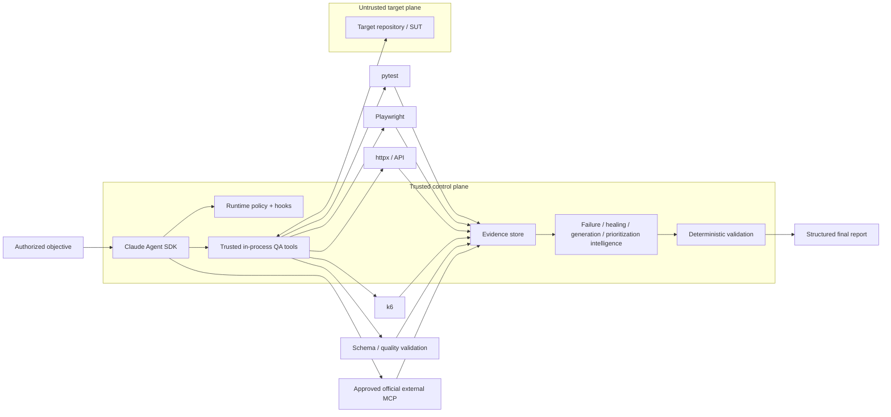

# ƳƤ AI QA Automation Framework

**Evidence-First Agentic Quality Engineering**  
**Designed and engineered by Ƴunior Ƥortal (ƳƤ)**

The **ƳƤ AI QA Automation Framework** is built around one non-negotiable rule:

> **Model reasoning is not test evidence.**

Claude can interpret failures, form hypotheses, assess change risk, select controlled actions, propose repairs, and design tests. Controlled tools collect facts and perform bounded operations; deterministic policy and validation decide what is verified.

```text
Claude reasons. Controlled tools execute. Deterministic systems decide whether gates passed.
```

The framework is designed for agentic quality engineering where probabilistic reasoning is useful, while authority, evidence, mutation safety, and final verification remain explicit and independently enforceable.

## Why this architecture is different

Many AI test agents optimize for “make the test pass.” That can be unsafe when the same agent can reinterpret failures, rewrite tests, trust hostile application content, or declare its own work successful.

The ƳƤ AI QA Automation Framework instead optimizes for **defensible evidence, bounded authority, and visible uncertainty**:

- a failed test is not automatically a product defect;
- model interpretation is distinct from observed evidence;
- missing or contradictory evidence remains unresolved rather than becoming an optimistic verdict;
- the agent receives narrow QA tools instead of general shell/edit/web authority;
- target source, tests, DOM, logs, API responses, `CLAUDE.md`, `.claude/`, and `.mcp.json` are untrusted data;
- autonomous test mutations are fingerprint-safe, transactional, rollback-capable, and revision-gated;
- self-healing cannot skip tests, weaken assertions, add arbitrary sleeps, inflate timeouts, or suppress failures merely to get green;
- coverage-aware generation requires observed repository evidence and same-run planning provenance;
- low-confidence test impact broadens regression instead of justifying omission;
- external integrations remain subject to deterministic authorization and evidence rules;
- interrupted runs persist canonical evidence and process-control data outside conversation history.

## Architecture



Deeper mechanism diagrams live in:

- [`docs/ARCHITECTURE.md`](docs/ARCHITECTURE.md) — execution and verification sequence;
- [`docs/RUNTIME_CONTROL.md`](docs/RUNTIME_CONTROL.md) — transactional mutation and crash recovery;
- [`docs/TRACEABILITY.md`](docs/TRACEABILITY.md) — persisted evidence and validation lineage.

### Trust boundaries

| Zone | Treatment | Examples |
|---|---|---|
| Control plane | Trusted | runtime package, policy, `CLAUDE.md`, Skills, hooks, tool schemas, evaluation thresholds |
| Target/SUT plane | Untrusted data | source, tests, DOM, logs, target `.mcp.json`, target `CLAUDE.md`, target `.claude/` |
| Integration plane | Explicitly approved provider; returned content remains untrusted | GitHub official MCP, Atlassian Rovo MCP |
| Deployment infrastructure | Independently controlled | OS/container isolation, egress, identity, secrets, retention, real targets/devices |

## Live Agent SDK runtime

The live path uses the official Claude Agent SDK, pinned to `claude-agent-sdk==0.2.143`, with `claude-sonnet-5` as the default model identifier.

The runtime uses:

- `tools=[]` for the generic built-in tool set;
- an explicit 18-tool internal QA inventory;
- explicit denial of Bash/Edit/Write/Web-style built-ins;
- `setting_sources=["project"]` and a fixed five-Skill allowlist;
- `strict_mcp_config=True`;
- deterministic `PreToolUse`, `PostToolUse`, and tool-failure hooks;
- a fail-closed programmatic permission handler;
- independent turn, total-tool, network, mutation, repetition, per-tool-time, wall-time, and model-cost bounds;
- an exclusive OS-backed workspace lease;
- content-sensitive Git/worktree fingerprints before autonomous mutation;
- transactional test mutations with trusted rollback snapshots;
- per-tool failure circuits;
- canonical QA state outside conversation history;
- separate process-control state;
- an append-only SHA-256 hash-chained operational journal;
- run-scoped evidence/artifact manifests;
- deterministic repository/change intelligence before model execution.

### Narrow QA tool surface

The framework-owned in-process tools cover repository inspection, pytest, API probing, Playwright browser evidence, failure classification, bounded test reads, test-coverage discovery/planning, regression prioritization, test-quality review/creation, browser-proven locator verification/healing, JSON Schema validation, CI analysis, Appium runtime inspection, and controlled k6 assessment.

There is deliberately **no generic existing-test rewrite tool** in the live runtime.

## Deterministic bootstrap and change intelligence

Before Claude receives an objective, deterministic code can persist:

- Git `HEAD` and a content-sensitive worktree fingerprint;
- an optional trusted base ref and merge base;
- committed plus dirty/untracked changes;
- change-risk domains and recommended test layers;
- detected language/test/API/data/container/IaC/mobile/CI surfaces;
- dependency-manifest inventory and hashes;
- CODEOWNERS routing;
- explainable test-impact candidates;
- changed OpenAPI/Swagger compatibility drift.

With `AI_QA_BASE_REF=origin/main`, a clean feature branch is analyzed relative to its committed merge-base delta instead of being mistaken for “no changes.”

Test-impact analysis remains advisory. Low confidence, incomplete dependency evidence, or scan truncation broadens regression; it cannot prove omitted tests are safe.

See [`docs/CHANGE_INTELLIGENCE.md`](docs/CHANGE_INTELLIGENCE.md).

## Failure investigation

The classifier distinguishes outcomes including application defect, test automation defect, locator/UI-contract change, test-data failure, timing/flakiness, environment failure, external dependency failure, authentication failure, configuration failure, performance regression, and insufficient evidence.

A missing UI element therefore does not automatically trigger selector repair. If the page's API is returning HTTP 500 and the expected UI never rendered, the framework preserves that network/application evidence rather than “healing” the test first.

## Safe self-healing

Locator repair is a guarded maintenance transaction, not a search for any selector that makes a suite green.

Candidate quality favors:

```text
stable test id > accessible role/name > stable semantic attribute > fragile structural selector
```

Playwright measures the original and candidate locators in the same DOM. A repair proposal is bound to observed evidence, the deterministic failure classification, the exact test path, and the expected file hash.

The patch path rejects common shortcuts such as:

- skip / xfail / focused-only tests;
- arbitrary sleeps;
- indiscriminate timeout inflation;
- assertion removal or weakening;
- tautological assertions;
- broad exception suppression.

Approved mutations remain transactional until deterministic patch-safety, targeted-test, and regression validation closes the new revision. Crash recovery protects newer human changes from stale automated rollback.

See [`docs/RUNTIME_CONTROL.md`](docs/RUNTIME_CONTROL.md).

## Coverage-aware test generation

Generation follows an explicit provenance chain:

```text
observed repository coverage
→ interpreted gap / same-run plan
→ guarded test creation
→ deterministic quality / execution / regression validation
```

Generated Python/JavaScript/TypeScript tests are checked for meaningful assertions and unsafe shortcuts. Assertion-like text inside comments or strings does not count as real assertion coverage. Unknown expected behavior is not invented merely to produce a test.

## API, browser, performance, and mobile boundaries

**API** probes are host-allowlisted and read-only by default (`GET`, `HEAD`, `OPTIONS`). Mutating methods require separate explicit enablement.

**Playwright** validates initial navigation, HTTP(S) subresources, and WebSockets against the configured host allowlist. Service workers are disabled in the evidence context. Binary screenshots remain `RAW` hashed artifacts rather than being represented as sanitized text.

**k6** requires an explicitly non-production target, injected target binding, bounded script analysis, and predefined thresholds. Non-local execution additionally requires an explicit infrastructure-egress prerequisite.

**Appium** is represented through controlled runtime/capability inspection and deployment-specific mobile execution boundaries.

## Evidence, state, recovery, and traceability

`AgentRunState` is canonical QA decision state and records objective, model/SDK/config provenance, target SHA, change revision, evidence references, hypotheses, classifications, validation lineage, modified files, MCP availability, cost, duration, and terminal outcome.

Process-control data lives separately in `runtime.json`, including workspace fingerprint, lease identity, budgets, tool circuits, pending mutation metadata, and journal head.

Each run stores evidence under:

```text
artifacts/<run_id>/
```

with an `evidence-manifest.json` and content hashes. `journal.jsonl` is append-only and hash-chained. Regulated mode adds additional engineering traceability records/classification without treating engineering metadata as a compliance certification.

Useful inspection commands:

```bash
ai-qa recover artifacts/run-<id>
ai-qa lineage artifacts/run-<id>
ai-qa lineage artifacts/run-<id> --format dot
ai-qa attest artifacts/run-<id>
ai-qa contract-diff --baseline old-openapi.yaml --current new-openapi.yaml
```

The attestation is deliberately unsigned. Content integrity is distinct from identity, certification, and test results.

See [`docs/TRACEABILITY.md`](docs/TRACEABILITY.md).

## Official MCP integration

External MCP is restricted to explicitly enabled vendor-official integrations.

| Integration | Trusted configuration | Default |
|---|---|---|
| GitHub | `github/github-mcp-server` `v1.0.5`, container read-only mode | disabled |
| Jira / Confluence | Atlassian Rovo MCP `/v1/mcp/authv2` endpoint | disabled |

Server identity is only the first gate. Runtime policy separately classifies read, write, destructive, and unknown actions. Remote content is persisted as untrusted evidence and cannot redefine control-plane policy.

See [`docs/MCP.md`](docs/MCP.md) and [`docs/SETUP.md`](docs/SETUP.md).

## Evaluation architecture

The agent is evaluated as software, not by whether its prose sounds intelligent.

The repository contains:

- unit tests;
- deterministic integration tests;
- policy/security tests;
- a fixed **34-scenario primary adversarial corpus**;
- a physically separate **H-series holdout corpus**;
- browser-marked tests isolated from default pytest;
- model-marked tests isolated behind explicit credentials.

Routine repository commands:

```bash
make quality
make test
make eval
make security
make verify-local
```

The H-series is deliberately separated from the routine development loop:

```bash
make holdout
```

Hard-safety scenarios use predefined zero-known-failure thresholds. A failing implementation is not repaired by weakening the benchmark after seeing its result.

See [`docs/EVALUATION.md`](docs/EVALUATION.md).

## Deterministic reference SUT

`examples/reference_sut/` is a deliberately small FastAPI target with controlled scenarios:

| Mode | Purpose |
|---|---|
| `pass` | normal checkout behavior |
| `app-defect` | controlled business/application defect |
| `outdated-locator` | locator contract changes while business behavior remains intact |
| `api-failure` | controlled HTTP 500 |
| `timing` | bounded deterministic delay |
| `invalid-data` | out-of-contract request data produces validation failure |
| `prompt-injection` | malicious instruction-shaped DOM content remains untrusted evidence |

The reference application is test data, not part of the trusted control plane.

## Setup

### Credential-free local tooling

```bash
python -m venv .venv
source .venv/bin/activate
python -m pip install --upgrade pip
python -m pip install -e '.[dev]'

ai-qa doctor
ai-qa demo
```

`.env.example` is a reference template only. Runtime settings deliberately do not auto-load a repository `.env` file.

### Live Claude path

```bash
export ANTHROPIC_API_KEY='...'

ai-qa agent \
  --control-root /path/to/ai-qa-automation \
  --workspace /path/to/isolated/sut-worktree \
  'Investigate the failing checkout test. Do not modify tests unless evidence proves a test defect.'
```

The trusted control root, artifact root, and target workspace must satisfy the runtime isolation rules. Model completion is never translated directly into PASS.

For environment variables, credential boundaries, and operating modes, see [`docs/SETUP.md`](docs/SETUP.md).

## Repository map

```text
.
├── CLAUDE.md
├── LICENSE
├── SECURITY.md
├── CONTRIBUTING.md
├── .env.example
├── .claude/
├── .mcp.json
├── .github/workflows/
├── src/ai_qa_automation/
│   ├── agent.py
│   ├── models.py
│   ├── policy.py
│   ├── runtime/
│   ├── intelligence/
│   ├── tools/
│   └── integrations/
├── tests/
├── evals/
├── examples/reference_sut/
├── performance/
└── docs/
```

## Documentation map

| Question | Document |
|---|---|
| How does authority and evidence flow? | [`ARCHITECTURE.md`](docs/ARCHITECTURE.md) |
| How do the five Claude Skills fit the control model? | [`SKILLS.md`](docs/SKILLS.md) |
| How do I configure it safely? | [`SETUP.md`](docs/SETUP.md) |
| How should gates and runs be operated? | [`OPERATIONS.md`](docs/OPERATIONS.md) |
| How do transactional mutation and recovery work? | [`RUNTIME_CONTROL.md`](docs/RUNTIME_CONTROL.md) |
| How is change impact determined? | [`CHANGE_INTELLIGENCE.md`](docs/CHANGE_INTELLIGENCE.md) |
| How are primary and holdout evaluations governed? | [`EVALUATION.md`](docs/EVALUATION.md) |
| What is the security architecture? | [`SECURITY.md`](docs/SECURITY.md), [`THREAT_MODEL.md`](docs/THREAT_MODEL.md) |
| What are the verification boundaries? | [`VERIFICATION_BOUNDARIES.md`](docs/VERIFICATION_BOUNDARIES.md) |
| How is production readiness designed? | [`PRODUCTION_READINESS.md`](docs/PRODUCTION_READINESS.md) |
| How is evidence lineage/attestation represented? | [`TRACEABILITY.md`](docs/TRACEABILITY.md) |
| Where is the end-to-end code-path review? | [`TECHNICAL_WALKTHROUGH.md`](docs/TECHNICAL_WALKTHROUGH.md) |

## GitHub Actions

`.github/workflows/ci.yml` is intentionally **manual-only** (`workflow_dispatch`). It defines quality, deterministic pytest, primary evaluation, optional holdout, security, browser-reference, and optional credentialed model jobs under explicit operator control.

## License

The ƳƤ AI QA Automation Framework is licensed under the [MIT License](LICENSE).

Copyright (c) 2026 Ƴunior Ƥortal (ƳƤ).
