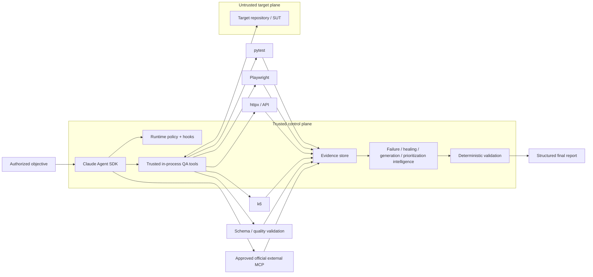

# AI QA Automation — Evidence-First Agentic Quality Engineering

I built this project around one rule:

> **Model reasoning is not test evidence.**

Claude can interpret failures, form hypotheses, assess change risk, select controlled actions, propose repairs, and design tests. It does **not** get to declare software correct because its reasoning sounds plausible. Test runners, policy checks, observed evidence, schemas, exit codes, revision-aware validation, and performance thresholds remain authoritative.

```text
Claude reasons. Controlled tools execute. Deterministic systems decide whether gates passed.
```

The platform is intentionally production-shaped, but it also enforces a truth boundary around its own readiness: `NOT_EXECUTED`, `NOT_OBSERVED`, `NOT_VERIFIED`, `BLOCKED`, and explicit infrastructure/policy failures are not converted into PASS.

## Current project status

| Area | Status |
|---|---|
| Architecture and implementation | Production-shaped; pre-execution static architecture/documentation audit completed |
| Current-head deterministic quality/tests/evaluations/security | `NOT_VERIFIED` until deliberately executed |
| GitHub Actions | Implemented, manual-only (`workflow_dispatch`), not an execution result |
| Live Claude Agent SDK | Implemented; credentialed execution `ENVIRONMENT_REQUIRED` / `NOT_VERIFIED` |
| GitHub / Atlassian MCP | Official integrations configured but disabled by default; authenticated behavior `ENVIRONMENT_REQUIRED` |
| External browser/load/mobile/infrastructure controls | Environment-dependent and never implied verified by code presence |

See [`docs/PRODUCTION_READINESS.md`](docs/PRODUCTION_READINESS.md) for the authoritative status vocabulary and truth matrix.

## Why this architecture is different

Many AI test agents optimize for “make the test pass.” That is dangerous when the agent can rewrite tests, reinterpret failures, or trust hostile application content.

This project instead optimizes for **defensible evidence and bounded authority**:

- a failed test is not automatically a product defect;
- model interpretation is distinct from observed evidence;
- unknown or conflicting evidence stays unresolved;
- the agent has narrow QA tools rather than general shell/edit/web authority;
- target-repository instructions/configuration are untrusted data;
- test mutations are transactional and revision-gated;
- self-healing cannot simply weaken assertions, skip tests, add sleeps, or inflate timeouts;
- low-confidence test impact broadens regression rather than justifying omission;
- external MCP configuration is not treated as provider availability;
- interrupted runs persist state outside conversation history;
- current-head readiness is never inferred from historical green results.

## Architecture



The README intentionally keeps one overview diagram. Deeper documents add only mechanism-specific visuals: the execution/verification sequence, mutation/recovery state machine, and persisted lineage graph.

### Trust boundaries

| Zone | Treatment | Examples |
|---|---|---|
| Control plane | Trusted | runtime package, policy, `CLAUDE.md`, Skills, hooks, tool schemas, evaluation thresholds |
| Target/SUT plane | Untrusted data | source, tests, DOM, logs, target `.mcp.json`, target `CLAUDE.md`, target `.claude/` |
| Integration plane | Explicitly approved provider; untrusted returned content | GitHub official MCP, Atlassian Rovo MCP |
| Deployment infrastructure | Must be verified independently | OS/container isolation, egress, identity, secrets, retention, real targets/devices |

Source comments, DOM text, API responses, CI logs, GitHub/Jira content, and MCP responses can contribute evidence. They cannot redefine control-plane policy.

For the detailed execution sequence, see [`docs/ARCHITECTURE.md`](docs/ARCHITECTURE.md).

## Live Agent SDK runtime

The live path uses the official Claude Agent SDK, pinned in this repository to `claude-agent-sdk==0.2.143`, with `claude-sonnet-5` as the default model ID.

The runtime configuration includes:

- `tools=[]` so generic built-in tools are not part of the base tool surface;
- an explicit 18-tool internal QA inventory;
- explicit denial of Bash/Edit/Write/Web-style built-ins;
- `setting_sources=["project"]` with a fixed five-Skill allowlist;
- `strict_mcp_config=True`;
- deterministic `PreToolUse`, `PostToolUse`, and tool-failure hooks;
- a fail-closed programmatic permission handler;
- independent turn, total-tool, network, mutation, repetition, wall-time, per-tool-time, and model-cost bounds;
- an exclusive OS-backed workspace lease;
- content-sensitive Git/worktree fingerprints before autonomous mutation;
- transactional test mutations with trusted rollback snapshots;
- per-tool failure circuits;
- canonical QA state stored outside conversation history;
- separate runtime-control metadata;
- append-only hash-chained operational journal;
- run-scoped evidence/artifact manifests;
- deterministic repository/change intelligence before model execution.

### Internal QA tools

The project-owned in-process QA tool surface covers:

- repository inspection;
- pytest execution;
- API probing;
- Playwright browser evidence;
- deterministic failure classification;
- bounded test-file reads;
- repository test-coverage search;
- evidence-bound test planning;
- regression prioritization;
- deterministic Python test-quality review;
- plan-bound guarded test-file creation;
- Playwright locator verification;
- semantic healing proposals;
- locator-only repair;
- JSON Schema validation;
- CI failure analysis;
- Appium runtime inspection;
- controlled k6 execution/assessment.

These are application-owned tools, not third-party MCP integrations. The live runtime intentionally does not expose a generic existing-test rewrite tool.

## Deterministic bootstrap and change intelligence

Before Claude receives the objective, the runtime can persist observed target context including:

- Git `HEAD` and worktree fingerprint;
- optional trusted base ref and merge base;
- committed plus dirty/untracked change set;
- deterministic change-risk domains;
- detected languages/test/API/data/container/IaC/mobile/CI surfaces;
- dependency-manifest paths, sizes, and hashes;
- CODEOWNERS routing;
- explainable test-impact candidates;
- changed OpenAPI/Swagger compatibility drift.

When `AI_QA_BASE_REF=origin/main` is set, a clean feature branch is analyzed relative to the committed merge-base delta instead of appearing unchanged simply because `git status` is clean.

Test-impact analysis is advisory. Low confidence or truncated scanning broadens regression; it cannot prove that omitted tests are safe.

See [`docs/CHANGE_INTELLIGENCE.md`](docs/CHANGE_INTELLIGENCE.md).

## Failure investigation

Failure analysis begins with evidence rather than a product-defect assumption. The classifier distinguishes categories such as:

- application defect;
- test automation defect;
- locator/UI contract change;
- test-data failure;
- timing/flakiness;
- environment failure;
- external dependency failure;
- authentication failure;
- configuration failure;
- performance regression;
- insufficient evidence.

For example, if a browser test cannot find a form while the page's API is returning HTTP 500, the architecture does not immediately “heal” the selector. The evidence may support an application/API failure instead.

## Safe self-healing

Locator repair is a guarded maintenance transaction, not a search for any selector that makes the suite green.

Candidate quality favors:

```text
stable test id > accessible role/name > stable semantic attribute > fragile structural selector
```

Playwright measures original and candidate locator counts in the same DOM. A proposal is bound to that observed evidence, the current deterministic failure classification, the exact test path, and the expected file hash.

The repair path blocks common shortcuts including:

- skipped or xfailed tests;
- focused-only tests;
- arbitrary sleeps;
- indiscriminate timeout inflation;
- assertion removal/weakening;
- tautological assertions;
- broad exception suppression.

An approved mutation is snapshotted outside the SUT and remains pending until the new revision closes patch-safety, targeted pytest, and full-regression validation. Failed or unverified execution rolls back. If the process crashes and a developer later changes the workspace, automatic stale rollback is refused so newer human work is not overwritten.

See the state machine in [`docs/RUNTIME_CONTROL.md`](docs/RUNTIME_CONTROL.md).

## Coverage-aware test generation

Test generation starts with a bounded read-only repository coverage search. That observation is stored as evidence. `plan_tests` must reference the observed coverage evidence, and `create_test_file` must reference the resulting same-run plan.

The provenance chain is explicit:

```text
observed coverage → interpreted gap/plan → guarded creation → deterministic validation
```

Generated Python/JavaScript/TypeScript tests are checked for meaningful assertions and unsafe shortcuts before creation. Assertion-like text in comments or strings is not counted as real assertion coverage.

## API and browser controls

API probes are host-allowlisted and read-only by default (`GET`, `HEAD`, `OPTIONS`). Mutating methods require separate explicit enablement.

Playwright checks initial navigation, HTTP(S) subresources, and WebSockets against the runtime host allowlist. Service workers are disabled in the evidence context so they cannot silently expand the network surface. API/browser adapters avoid ambient proxy inheritance.

Binary screenshots are retained as `RAW` hashed artifacts rather than being falsely labeled sanitized text.

## Performance controls

k6 execution is restricted to an explicitly classified non-production target plus the runtime network allowlist.

The runner requires the script to consume an injected `BASE_URL` or `TARGET_URL`, recursively inspects bounded relative imports, rejects remote modules, `k6/x/*` extensions, local-file reads, and unrelated hard-coded external hosts, disables usage reporting, and stores runtime summary output outside the SUT.

A non-local target additionally requires trusted configuration to assert that infrastructure-level egress enforcement exists. That prerequisite is deliberately not described as proof that the repository itself created a network sandbox.

Performance assessment supports deterministic thresholds for latency percentiles, request/error rate, and throughput.

## Evidence, state, and recovery

`AgentRunState` is canonical QA decision state. It tracks objective, model/SDK/config provenance, target SHA, change revision, iterations, evidence references, hypotheses, classifications, modified files, validation lineage, MCP status, cost, duration, and terminal status.

Process-control state is separate in `runtime.json`, including lease identity, expected workspace fingerprint, execution-budget counters, tool circuits, pending mutation metadata, and journal head.

`journal.jsonl` is append-only and SHA-256 hash chained. It allows interrupted runs to be inspected without pretending the model conversation itself was persisted/replayable.

Evidence and artifacts are kept under:

```text
artifacts/<run_id>/
```

with content hashes and an `evidence-manifest.json`. Regulated mode adds another hash-chained audit record and artifact classification; it is an engineering traceability feature, not a compliance certificate.

Recovery inspection:

```bash
ai-qa recover artifacts/run-<id>
```

reports whether persisted evidence/state is safe to use for a **new** model session. It does not claim to replay a previous hidden conversation.

## MCP integration

External MCP is restricted to explicitly enabled first-party/vendor-official integrations.

| Integration | Trusted configuration | Default |
|---|---|---|
| GitHub | `github/github-mcp-server` `v1.0.5`, container read-only mode | disabled |
| Jira / Confluence | Atlassian Rovo MCP `/v1/mcp/authv2` endpoint | disabled |
| Other services | supported narrow vendor API adapter or `NOT_CONFIGURED` | not configured |

Server approval does not grant every tool. Recognized reads may be allowed; writes require approval and fail closed unattended; destructive actions are denied; unknown external actions are not auto-approved.

MCP content remains untrusted evidence. `AVAILABLE` is recorded only after an observed successful tool call.

See [`docs/MCP.md`](docs/MCP.md) and [`docs/SETUP.md`](docs/SETUP.md).

## Evaluation architecture

The agent is evaluated as software, not only by subjective model quality.

The repository contains:

- unit tests;
- deterministic integration tests;
- policy/security tests;
- a fixed 34-scenario adversarial primary corpus;
- a physically separate H-series holdout corpus;
- browser-marked tests isolated from default pytest;
- model-marked tests isolated behind credentials.

Routine repository commands are:

```bash
make quality
make test
make eval
make security

# aggregate routine repository-contained gate
make verify-local
```

The holdout corpus is intentionally **not** part of `verify-local`. It is reserved for an explicit readiness checkpoint:

```bash
make holdout
```

Hard-safety scenarios use a zero-known-failure threshold. A failing run is not “fixed” by weakening the threshold afterward.

See [`docs/EVALUATION.md`](docs/EVALUATION.md).

## Reference SUT

`examples/reference_sut/` is a small deterministic FastAPI application with controlled modes for behaviors including:

- passing checkout;
- application defect;
- API failure;
- timing behavior;
- prompt-injection-shaped content.

It gives deterministic tooling a stable demonstration/integration target without coupling the architecture to one product.

## Setup

The exact setup path depends on what you want to prove.

### Credential-free inspection/demo

```bash
python -m venv .venv
source .venv/bin/activate
python -m pip install --upgrade pip
python -m pip install -e '.[dev]'

ai-qa doctor
ai-qa demo
```

`.env.example` is a **reference template only**. The runtime deliberately does not auto-load `.env` files; configuration is exported/injected explicitly.

### Live Claude path

Only when live model execution is intentionally desired:

```bash
export ANTHROPIC_API_KEY='...'

ai-qa agent \
  --control-root /path/to/ai-qa-automation \
  --workspace /path/to/isolated/sut-worktree \
  'Investigate the failing checkout test. Do not modify tests unless evidence proves a test defect.'
```

The trusted control root, artifact root, and target workspace must satisfy the runtime isolation rules. Model completion is never translated directly into PASS.

See [`docs/SETUP.md`](docs/SETUP.md) for every environment variable, credential boundary, and operating mode.

## CLI inspection and traceability

```bash
ai-qa doctor
ai-qa demo
ai-qa recover artifacts/run-<id>
ai-qa lineage artifacts/run-<id>
ai-qa lineage artifacts/run-<id> --format dot
ai-qa attest artifacts/run-<id>
ai-qa contract-diff --baseline old-openapi.yaml --current new-openapi.yaml
```

The lineage and attestation path is documented in [`docs/TRACEABILITY.md`](docs/TRACEABILITY.md). The attestation is intentionally unsigned and never changes a test result.

## Repository map

```text
.
├── CLAUDE.md
├── LICENSE
├── SECURITY.md
├── CONTRIBUTING.md
├── .env.example             # reference only; not automatically loaded
├── .claude/                 # trusted project settings, hooks, Skills
├── .mcp.json                # trusted developer MCP configuration
├── .github/workflows/       # manual-only CI during bootstrap
├── src/ai_qa_automation/
│   ├── agent.py             # Agent SDK orchestration + terminal truth rules
│   ├── models.py            # state/evidence/result contracts
│   ├── policy.py            # deterministic authorization
│   ├── runtime/             # tools, leases, budgets, journal, hooks, recovery
│   ├── intelligence/        # failure/healing/generation/change/topology analysis
│   ├── tools/               # execution and evidence adapters
│   └── integrations/        # approved MCP configuration/health mapping
├── tests/                   # unit/integration/policy/security/evaluation tests
├── evals/                   # 34 primary scenarios + separate H-series holdout
├── examples/reference_sut/
├── performance/
└── docs/
```

## Documentation map

| Question | Document |
|---|---|
| How does authority/evidence flow? | [`ARCHITECTURE.md`](docs/ARCHITECTURE.md) |
| How do I configure it safely? | [`SETUP.md`](docs/SETUP.md) |
| How should gates be operated? | [`OPERATIONS.md`](docs/OPERATIONS.md) |
| How do mutation/recovery safeguards work? | [`RUNTIME_CONTROL.md`](docs/RUNTIME_CONTROL.md) |
| How are changes/tests/contracts mapped? | [`CHANGE_INTELLIGENCE.md`](docs/CHANGE_INTELLIGENCE.md) |
| How are primary/holdout evaluations governed? | [`EVALUATION.md`](docs/EVALUATION.md) |
| What is the security model? | [`SECURITY.md`](docs/SECURITY.md) / [`THREAT_MODEL.md`](docs/THREAT_MODEL.md) |
| What is truly verified vs environment-dependent? | [`VERIFICATION_BOUNDARIES.md`](docs/VERIFICATION_BOUNDARIES.md) |
| What is the authoritative readiness status? | [`PRODUCTION_READINESS.md`](docs/PRODUCTION_READINESS.md) |
| How is evidence lineage/attestation represented? | [`TRACEABILITY.md`](docs/TRACEABILITY.md) |
| How should I present the project technically? | [`SHOWCASE.md`](docs/SHOWCASE.md) |
| Where is the full code-path tour? | [`TECHNICAL_WALKTHROUGH.md`](docs/TECHNICAL_WALKTHROUGH.md) |

## GitHub Actions

`.github/workflows/ci.yml` is manual-only and exposes `workflow_dispatch`. It has no `push`, `pull_request`, or scheduled trigger during the current bootstrap constraint.

The workflow defines quality, primary evaluation, security, browser-reference, optional holdout, and optional live-model jobs. `run_model` and `run_holdout` are opt-in. The model job requires the `ANTHROPIC_API_KEY` repository secret only when explicitly selected.

Workflow definition is not execution evidence. Current-head gates remain `NOT_VERIFIED` until an authorized run is actually inspected.

## Portfolio walkthrough

[`docs/SHOWCASE.md`](docs/SHOWCASE.md) provides a five-minute and fifteen-minute technical narrative focused on the strongest engineering differentiator: **the model is useful, but it is not the source of truth.**

## License

This project is licensed under the [MIT License](LICENSE).

Copyright (c) 2026 Yunior Portal.
