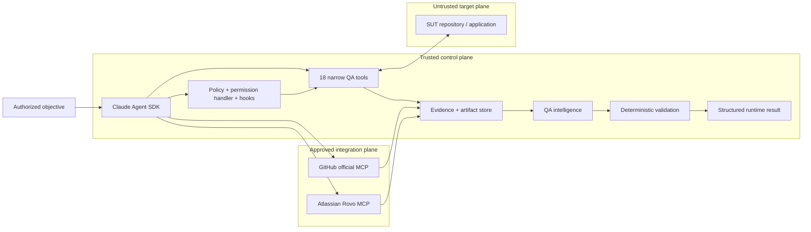
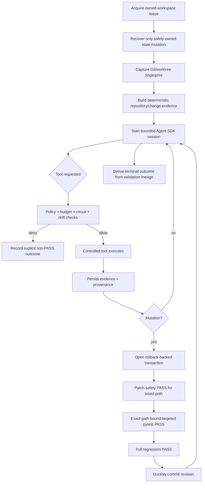

# ƳƤ AI QA Automation Framework

### Evidence-First Agentic Quality Engineering

**Designed and engineered by Ƴunior Ƥortal (ƳƤ)**

A production-oriented AI quality engineering control system that gives an LLM room to reason while keeping **authorization, evidence, mutation, and success under deterministic software authority**.

> **Core invariant — Reasoning is advisory. Evidence is observed. Authority is deterministic. Success is earned.**
>
> Claude may interpret observations, form hypotheses, rank risk, and choose among authorized actions. Controlled tools collect facts and execute bounded operations. Deterministic policy decides what is allowed. Deterministic validation decides what is proven.

[Documentation](docs/README.md) · [Architecture](docs/ARCHITECTURE.md) · [Runtime Result Contract](docs/RESULT_CONTRACT.md) · [Runtime Control](docs/RUNTIME_CONTROL.md) · [Security](docs/SECURITY.md) · [Setup](docs/SETUP.md) · [Technical Walkthrough](docs/TECHNICAL_WALKTHROUGH.md)

---

## At a glance

| Engineering surface | Framework contract |
|---|---|
| **Runtime** | Python 3.11+ · `claude-agent-sdk==0.2.136` · default model identifier `claude-sonnet-5` |
| **Reasoning boundary** | model output may guide investigation; it never certifies evidence or terminal success |
| **Controlled tool surface** | 18 purpose-built in-process QA tools; no generic autonomous Bash/Edit/Write/Web authority |
| **Trusted Skills** | exactly five allowlisted Claude Skills |
| **Live mutation boundary** | Python/pytest-backed test mutation only; reusable libraries may understand additional test syntaxes without widening runtime authority |
| **Mutation closure** | exact-path patch safety + exact-path targeted pytest + full regression at one revision |
| **Evidence** | isolated run state, manifests, hashes, artifacts, lineage, append-only journal, optional regulated audit chain |
| **Network posture** | exact host allowlists, read-only API default, browser routing controls, independent k6 egress prerequisite |
| **External MCP** | approved vendor integrations only; provider content remains untrusted evidence |
| **Evaluation** | deterministic tests, adversarial primary corpus, physically separate H-series holdout, frozen safety thresholds |
| **Workflow governance** | GitHub Actions is operator-dispatched through `workflow_dispatch` |
| **License** | MIT |

**On this page:** [Engineering thesis](#engineering-thesis) · [Architecture](#architecture-at-a-glance) · [Quick start](#quick-start) · [Control model](#production-control-model) · [Runtime truth](#runtime-result-contract) · [Safety boundaries](#safety-critical-boundaries) · [Evaluation](#evaluation-architecture) · [Documentation](#documentation-map)

> **Suggested review path**
>
> Read [Architecture](docs/ARCHITECTURE.md) → [Runtime Result Contract](docs/RESULT_CONTRACT.md) → [Runtime Control](docs/RUNTIME_CONTROL.md) → [Security](docs/SECURITY.md) → [Technical Walkthrough](docs/TECHNICAL_WALKTHROUGH.md). The [documentation hub](docs/README.md) provides additional role-specific paths.

---

## Engineering thesis

```text
Claude reasons.
Controlled tools observe and execute.
Deterministic policy authorizes.
Validation decides what is proven.
```

The framework treats an LLM as a **bounded reasoning component inside a quality-engineering control system**, not as the system of record.

That separation of powers is the central design decision. Agentic testing becomes unsafe when the same component can modify the subject, interpret the evidence, and declare its own work successful. This framework deliberately assigns those responsibilities to different authorities.

### Four contracts govern the framework

| Contract | Question | Authority |
|---|---|---|
| **Authority** | What may the agent do? | deterministic policy, hooks, permissions, budgets |
| **Evidence** | What was actually observed? | controlled tools, manifests, artifacts, hashes, provider responses |
| **Mutation** | When may automated code changes persist? | path ownership, rollback transaction, revision-bound validation closure |
| **Outcome** | What may be called successful? | deterministic validation lineage and terminal evaluation |

> **Design consequence**
>
> The architecture is intentionally asymmetric: **uncertainty reduces authority**. Missing evidence does not become green. Ambiguous ownership does not become permission. Incomplete validation does not become success.

### What the architecture is designed to prevent

| Failure mode | Deterministic response |
|---|---|
| Model-declared success | terminal truth comes from gate lineage, never persuasive prose |
| False product-defect attribution | evidence-weighted deterministic classification before test-side repair |
| Test weakening disguised as self-healing | reject skip/xfail, assertion erosion, arbitrary sleeps, timeout inflation, tautologies, and broad suppression |
| Wrong-element locator repair | same-DOM Playwright measurement + semantic intent + transactional validation |
| Meaningless generated tests | coverage provenance + conservative planning + meaningful-assertion checks + execution closure |
| Regression under-selection | uncertainty broadens regression rather than shrinking it |
| Prompt injection from SUT/provider content | source, DOM, logs, API, MCP, and repository instructions remain untrusted data |
| Tool privilege expansion | explicit tool inventory + fail-closed hooks + action-level authorization |
| Concurrent or stale mutation | OS-backed lease + content-sensitive fingerprint + rollback-backed transaction |
| Wrong-subject validation | targeted pytest must explicitly select the exact pending mutation path |
| Filesystem alias/tamper attacks | owned-path and non-symlink checks across mutation, rollback, evidence, journal, lease, recovery, and attestation |
| Cross-run evidence contamination | confined run roots + immutable evidence identities + manifests + hashes + hash-chained journals |
| Unbounded agent loops | independent turn/tool/network/mutation/repetition/time/cost budgets + per-tool circuits |
| Production load accident | non-production policy + k6 script restrictions + independently enforced egress |

---

## Architecture at a glance



### Trust boundaries

| Boundary | Trust posture | Examples |
|---|---|---|
| **Control plane** | trusted authority | runtime package, policy, hooks, Skills, tool schemas, deterministic thresholds |
| **Target / SUT** | untrusted evidence source | source, tests, DOM, logs, API responses, target `CLAUDE.md`, `.claude/`, `.mcp.json` |
| **External providers** | approved transport/provider; returned content remains untrusted | GitHub MCP, Atlassian Rovo MCP |
| **Deployment infrastructure** | independent enforcement boundary | process/container isolation, egress, identity, secrets, retention, devices, real targets |

> **Deployment boundary**
>
> Application-layer safeguards are defense in depth. Process isolation, network egress, secret management, provider identity, retention, devices, and real target environments remain deployment-owned controls.

Deep dives: [Architecture](docs/ARCHITECTURE.md) · [Runtime Control](docs/RUNTIME_CONTROL.md) · [Security](docs/SECURITY.md) · [Threat Model](docs/THREAT_MODEL.md)

---

## Quick start

### Local deterministic tooling

```bash
python -m venv .venv
source .venv/bin/activate
python -m pip install --upgrade pip
python -m pip install -e '.[dev]'

ai-qa doctor
ai-qa demo
```

On Windows PowerShell, activate with `.venv\Scripts\Activate.ps1`.

`.env.example` is a reference template only; runtime settings do not automatically load a repository `.env` file.

### Live Claude Agent SDK session

```bash
export ANTHROPIC_API_KEY='...'
export AI_QA_CONTROL_ROOT='/path/to/ai-qa-automation'
export AI_QA_ARTIFACT_ROOT='/path/to/ai-qa-artifacts'
export AI_QA_BASE_REF='origin/main'

ai-qa agent \
  --control-root "$AI_QA_CONTROL_ROOT" \
  --workspace /path/to/isolated/sut-worktree \
  'Investigate the failing checkout test. Do not modify tests unless evidence proves a test defect.'
```

The control root, artifact root, and target workspace are separate trust domains. Exact configuration and credential boundaries are documented in [Setup and Configuration](docs/SETUP.md).

### Controlled k6 execution

Because a JavaScript workload can construct destinations dynamically, every k6 execution requires a separately enforced egress boundary:

```bash
export AI_QA_K6_EXTERNAL_EGRESS_ENFORCED=true
```

Set that assertion only when the runtime environment actually enforces the intended outbound-network policy. The variable records an external prerequisite; it does not create a firewall.

---

## Production control model

The live path uses `claude-agent-sdk==0.2.136` with `claude-sonnet-5` as the default model identifier.

The runtime deliberately narrows authority:

- generic built-in tools are not the working surface;
- Bash/Edit/Write/Web-style built-ins are explicitly denied;
- exactly five trusted Claude Skills are allowlisted;
- `strict_mcp_config=True` prevents ambient MCP inheritance;
- every controlled tool request passes deterministic authorization and runtime hooks;
- approval-required operations fail closed during unattended execution;
- tool, network, mutation, repetition, wall-time, per-tool-time, turn, and model-cost limits remain independent;
- canonical QA decision state is persisted separately from conversation history;
- process-control state is persisted separately from QA decision state.

### Narrow internal QA surface

The framework exposes 18 purpose-built in-process tools:

| Domain | Controlled capability |
|---|---|
| Repository | Git/worktree inspection and change context |
| Tests | bounded pytest execution and evidence capture |
| API | allowlisted HTTP probing with read-only default |
| Browser | Playwright accessibility, screenshot, console, network, and locator evidence |
| Failure intelligence | deterministic first-pass causal classification |
| Source context | bounded test-file reads and coverage search |
| Test design | evidence-bound generation planning |
| Regression | risk-based prioritization with mandatory coverage preservation |
| Test quality | deterministic Python test-quality review |
| Generation | guarded live Python test creation; reusable patch utilities also understand JS/TS test artifacts |
| Self-healing | same-DOM locator verification, proposal, and Python locator-only live mutation |
| Contracts | JSON Schema validation |
| CI | normalized CI-failure analysis |
| Mobile | Appium runtime/capability inspection |
| Performance | controlled k6 execution and deterministic threshold assessment |

> **Authority boundary**
>
> **Library capability is not runtime authority.** Reusable patching components may validate Python/JavaScript/TypeScript test artifacts, while live autonomous mutation remains Python/pytest-backed because that is the language path with deterministic commit closure.

There is intentionally **no generic existing-test rewrite tool** in the live agent surface.

---

## Evidence-first runtime lifecycle



A targeted run against an unrelated file is diagnostic evidence; it cannot certify the pending mutation.

### Mutation persistence is a transaction, not an edit

For a changed revision to persist, the runtime requires all of the following at the **same revision**:

1. deterministic patch-safety `PASS` bound to the exact changed path;
2. targeted pytest `PASS` explicitly selecting that same path;
3. full-regression pytest `PASS`;
4. no conflicting active validation at that revision; and
5. durable transaction metadata that can be safely committed.

Pending transaction metadata is persisted before the mutation tool may execute. Commit/rollback closure is persisted before rollback-backup cleanup. The design prefers an orphan cleanup artifact over the unsafe inverse: discarded rollback bytes while durable metadata still says the mutation is pending.

See [Runtime Control and Recovery](docs/RUNTIME_CONTROL.md).

---

## Runtime result contract

The framework distinguishes **terminal outcomes**, **validation outcomes**, and **provider-health outcomes**. They are separate namespaces because “the provider responded,” “a validator passed,” and “the run is successful” are not equivalent claims.

| Terminal outcome | Meaning |
|---|---|
| `SUCCESS` | every active deterministic gate required by the objective/revision is closed |
| `FAILURE` | a definitive active execution or validation failure exists |
| `BLOCKED` | a safety or integrity prerequisite prevented continuation |
| `POLICY_DENIED` | requested authority is outside policy |
| `INFRASTRUCTURE_FAILURE` | runtime integrity cannot be guaranteed |
| `BUDGET_EXCEEDED` / `CANCELLED` | bounded execution terminated explicitly |
| `NOT_VERIFIED` | evidence is absent, incomplete, stale, contradictory, unbound, or validator execution was inconclusive |

For pytest, exit `0` can support `PASS`, exit `1` represents an observed test failure, and timeout/interruption/usage/internal/no-tests/integrity failures remain `NOT_VERIFIED` rather than being mislabeled as SUT defects.

> **Terminal truth boundary**
>
> A model result subtype of `success` is only an input to terminal evaluation. It is never sufficient to produce framework `SUCCESS` on its own. An unrelated green check is also insufficient: trusted deterministic validation must be bound to the run objective and, for mutation, to the exact revision and subject.

For revision supersession, provider-health semantics, conflicting evidence, and complete closure rules, see the authoritative [Runtime Result Contract](docs/RESULT_CONTRACT.md).

---

## AI-assisted QA with deterministic closure

### Evidence-driven failure investigation

The deterministic classifier distinguishes evidence patterns for application defects, test automation defects, locator/UI-contract changes, test-data failures, timing/flakiness, environment failures, external dependency failures, authentication/configuration failures, performance regressions, and insufficient evidence.

A missing element does not automatically become a locator defect. If network/application evidence indicates that the expected UI state never rendered, the framework preserves the higher-order failure evidence instead of “healing” the test first.

### Safe self-healing

Self-healing is intentionally narrow: **semantic locator maintenance only**.

```text
stable test id
    > accessible role/name
    > label
    > placeholder
    > exact text
    > semantic CSS
    >>> positional / XPath-style structure
```

Autonomous eligibility requires:

1. a deterministic failure class compatible with locator repair;
2. Playwright measurement of original and candidate locators in the same DOM;
3. a unique candidate;
4. supported literal locator syntax;
5. deterministic semantic-intent overlap;
6. policy-owned stability scoring;
7. exact file-hash and proposal binding;
8. Python locator-only live mutation; and
9. complete revision closure through patch safety, exact-path targeted pytest, and regression pytest.

Model-provided semantic/stability scores may inform reasoning, but they are overwritten before autonomous eligibility is decided.

### Coverage-aware test generation

```text
observed repository coverage
→ interpreted gap
→ same-run plan
→ conservative candidate scenarios
→ evidence reconciliation
→ guarded live Python test creation
→ exact-path targeted execution
→ full regression closure
```

Model-supplied “already covered” labels are advisory. They cannot suppress deterministic candidate scenarios by themselves. Generated tests are also checked for meaningful assertions and common intent-eroding shortcuts; assertion-looking text in comments or strings does not satisfy observability requirements.

### Deterministic change intelligence

Before model reasoning, bootstrap can persist:

- target Git `HEAD` and content-sensitive worktree fingerprint;
- trusted base ref and immutable merge-base provenance;
- committed plus dirty/untracked change union;
- changed domains and recommended test layers;
- repository/test/API/data/container/IaC/mobile/CI topology;
- dependency-manifest paths, sizes, and bounded hashes when safely readable;
- CODEOWNERS routing context;
- explainable test-impact candidates;
- conservative OpenAPI/Swagger compatibility drift.

With `AI_QA_BASE_REF=origin/main`, a clean feature branch is still analyzed against its committed merge-base delta. A clean worktree is never confused with “no change.”

Low confidence, truncated scans, or incomplete dependency knowledge broaden regression rather than justify aggressive omission.

See [Change Intelligence](docs/CHANGE_INTELLIGENCE.md).

---

## Safety-critical boundaries

| Surface | Deterministic boundary |
|---|---|
| **API** | exact host allowlist; read-only method default; redirects and ambient proxy inheritance disabled; bounded sanitized response evidence |
| **Browser / Playwright** | allowlisted navigation/subresources/WebSockets; service workers disabled in evidence context; final URL rechecked; bounded diagnostic buffers; viewport-scoped screenshots |
| **Performance / k6** | production-like targets denied; target injection required; remote modules/`k6/x/*`/local `open()`/unrelated literal hosts rejected; bounded subprocess output; infrastructure-level egress required for every run |
| **Mutation** | Git-backed isolated worktree; owned non-symlink path; baseline fingerprint; rollback snapshot; one unresolved transaction at a time; revision-bound validation closure |
| **Recovery** | prior run, journal, target, rollback path, backup hash, fingerprint, and ownership revalidated before any stale rollback |
| **External MCP** | explicit vendor integrations only; conservative action authorization; provider results sanitized; error-shaped results cannot become successful remote evidence |
| **Persistence** | confined run roots; bounded state/runtime/manifest/journal/artifacts; immutable evidence identities; hash verification; symlink ownership rejection |

> **Load-test boundary**
>
> For k6, static JavaScript inspection is deliberately **not** treated as a network sandbox. The application requires independent infrastructure-level egress enforcement even for localhost targets.

See [Security Architecture](docs/SECURITY.md), [Threat Model](docs/THREAT_MODEL.md), and [Verification Boundaries](docs/VERIFICATION_BOUNDARIES.md).

---

## Evidence, traceability, and attestation

Each run has an isolated durable evidence surface beneath:

```text
artifacts/<run_id>/
```

The framework can persist:

- canonical `state.json`;
- separate `runtime.json` process-control state;
- `evidence-manifest.json`;
- content-addressed artifacts;
- append-only `journal.jsonl` with SHA-256 hash chaining;
- optional regulated audit records;
- evidence-to-validation lineage;
- model/SDK/configuration/target provenance;
- token/cost information when supplied by the provider;
- unsigned run-integrity attestations.

State, runtime metadata, manifests, journal events, artifacts, restore operations, lineage materialization, and attestation reads are bounded so malformed run data cannot silently become an unbounded recovery operation.

`ai-qa attest` verifies owned persisted subjects, the runtime journal chain, pending-mutation state, and registered artifact hashes before reporting `integrity_verified=true`.

```bash
ai-qa recover artifacts/run-<id>
ai-qa lineage artifacts/run-<id>
ai-qa lineage artifacts/run-<id> --format dot
ai-qa attest artifacts/run-<id>
ai-qa contract-diff --baseline old-openapi.yaml --current new-openapi.yaml
```

> **Attestation boundary**
>
> Content-addressed integrity proves byte relationships, not actor identity, notarization, compliance certification, a trusted timestamp, business correctness, or test success.[^integrity]

See [Traceability and Run Attestation](docs/TRACEABILITY.md).

---

## Evaluation architecture

The framework is evaluated as software, not by whether its prose sounds convincing.

The repository defines:

- unit tests for models, policy, redaction, evidence, state, budgets, recovery, ownership, attestation, and intelligence;
- deterministic integration tests for evidence/runtime flows;
- dedicated policy and security tests;
- a fixed **34-scenario primary adversarial corpus**;
- a physically separate **H-series holdout corpus**;
- frozen evaluation-threshold schema and hard-safety limits;
- Playwright-marked tests separated from the default pytest path;
- credentialed model tests separated behind explicit configuration.

```bash
make quality
make test
make eval
make security
make verify-local
make holdout
```

The evaluation runners validate their own threshold schema and required scenario-family coverage before aggregate metrics can be treated as meaningful.

See [Evaluation Strategy](docs/EVALUATION.md).

### Deterministic reference SUT

`examples/reference_sut/` is a compact FastAPI application for reproducible evidence paths:

| Mode | Purpose |
|---|---|
| `pass` | normal checkout behavior |
| `app-defect` | controlled business/application defect |
| `outdated-locator` | stale locator while business behavior remains intact |
| `api-failure` | controlled HTTP 500 |
| `timing` | bounded deterministic delay |
| `invalid-data` | out-of-contract data produces validation failure |
| `prompt-injection` | instruction-shaped DOM content remains untrusted evidence |

The reference SUT is test data for the control architecture, never part of the trusted control plane.

---

## Operating modes

| Mode | Purpose | Primary authority |
|---|---|---|
| Local deterministic tooling | inspection, demo, tests, evaluations, security tooling | repository-contained deterministic code |
| Live Claude session | bounded agentic investigation and authorized QA actions | Agent SDK reasoning + deterministic runtime authority |
| GitHub MCP | vendor-official repository context | external provider + local action policy |
| Atlassian MCP | vendor-official Jira/Confluence context | external provider + local action policy |
| Browser/API/load/mobile target | target-specific validation | controlled adapter + deployment environment |
| Regulated traceability mode | additional engineering audit/retention labeling | deterministic persistence controls |

---

## Repository layout

```text
.
├── CLAUDE.md                       # trusted engineering/agent rules
├── README.md
├── LICENSE
├── SECURITY.md
├── CONTRIBUTING.md
├── .env.example
├── .claude/
│   ├── settings.json
│   ├── hooks/
│   └── skills/                     # five trusted QA Skills
├── .mcp.json
├── .github/
│   ├── CODEOWNERS
│   └── workflows/ci.yml            # operator-dispatched workflow
├── src/ai_qa_automation/
│   ├── agent.py                    # Agent SDK orchestration + terminal truth
│   ├── models.py                   # state/evidence/result contracts
│   ├── policy.py                   # deterministic authorization
│   ├── evidence.py                 # evidence/artifact registry + ownership
│   ├── intelligence/               # classification/healing/generation/change logic
│   ├── integrations/               # approved external MCP adapters
│   ├── runtime/                    # leases, budgets, hooks, recovery, lineage, attestation
│   └── tools/                      # narrow execution/evidence adapters
├── tests/
├── evals/
├── examples/reference_sut/
├── performance/
└── docs/
```

---

## Documentation map

Start with the [documentation hub](docs/README.md) for reviewer-specific reading paths.

| Topic | Document |
|---|---|
| Architectural authority, trust, and execution flow | [Architecture](docs/ARCHITECTURE.md) |
| Runtime terminal/validation/provider semantics | **[Runtime Result Contract](docs/RESULT_CONTRACT.md)** |
| Transactional mutation and crash recovery | [Runtime Control](docs/RUNTIME_CONTROL.md) |
| Security architecture | [Security](docs/SECURITY.md) |
| Threat model and adversarial assumptions | [Threat Model](docs/THREAT_MODEL.md) |
| Trusted setup and credentials | [Setup](docs/SETUP.md) |
| Operating the framework | [Operations](docs/OPERATIONS.md) |
| Change intelligence and regression evidence | [Change Intelligence](docs/CHANGE_INTELLIGENCE.md) |
| Evaluation and holdout governance | [Evaluation](docs/EVALUATION.md) |
| Claude Skill contracts | [Skills](docs/SKILLS.md) |
| External MCP policy | [MCP](docs/MCP.md) |
| Evidence lineage and attestations | [Traceability](docs/TRACEABILITY.md) |
| Evidence/deployment trust boundaries | [Verification Boundaries](docs/VERIFICATION_BOUNDARIES.md) |
| Production-readiness architecture | [Production Readiness](docs/PRODUCTION_READINESS.md) |
| Design boundaries and non-claims | [Limitations](docs/LIMITATIONS.md) |
| Failure diagnosis without weakening controls | [Troubleshooting](docs/TROUBLESHOOTING.md) |
| End-to-end technical review path | [Technical Walkthrough](docs/TECHNICAL_WALKTHROUGH.md) |

---

## GitHub Actions

`.github/workflows/ci.yml` is operator-dispatched through `workflow_dispatch`. It defines quality/type checks, deterministic pytest, the primary adversarial evaluator, holdout evaluation, security scanning, Playwright reference-SUT coverage, and an optional credentialed Agent SDK smoke path under explicit operator control.

## Security and contributions

Security reports should follow [Security Policy](SECURITY.md). Engineering changes should preserve the authority hierarchy and test-integrity rules in [Contributing](CONTRIBUTING.md) and [Engineering Rules](CLAUDE.md).

> **Add capability without silently adding authority. Add intelligence without weakening evidence. Add automation without weakening test intent.**

## License

The **ƳƤ AI QA Automation Framework** is licensed under the [MIT License](LICENSE).

**Copyright (c) 2026 Ƴunior Ƥortal (ƳƤ).**

[^integrity]: The attestation is intentionally unsigned. Its purpose is deterministic integrity accounting across framework-owned persisted subjects, not independent identity or compliance certification.
