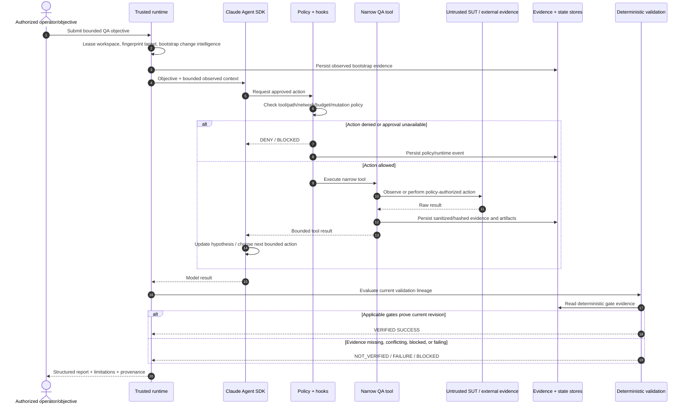

# Architecture

> **ƳƤ AI QA Automation Framework** · Designed and engineered by **Ƴunior Ƥortal (ƳƤ)**

## Architectural thesis

The ƳƤ AI QA Automation Framework treats an LLM as a **bounded reasoning component inside a quality-engineering control system**, not as the authority that decides whether software is correct.

The governing invariant is:

> **Model reasoning is not test evidence.** Claude may interpret observations, form hypotheses, rank risk, and choose among approved actions. Controlled tools perform side effects and collect facts. Deterministic policy and validation decide whether a result is verified.

This separation is the foundation for failure analysis, self-healing, test generation, regression selection, external integrations, and final reporting.

## Design invariants

| Invariant | Architectural consequence |
|---|---|
| A model statement cannot prove PASS | Terminal success requires deterministic validation evidence. |
| Target content is untrusted | SUT source, tests, DOM, logs, API responses, target `CLAUDE.md`, `.claude/`, and `.mcp.json` cannot redefine control-plane policy. |
| Authority is narrower than capability | The runtime exposes an explicit QA tool inventory instead of general shell/edit/web authority. |
| Writes are higher risk than reads | Test writes are disabled by default, path-confined when enabled, transactionally backed up, and validated at a new revision. |
| Uncertainty must remain visible | Missing, conflicting, stale, or unexecuted evidence resolves to explicit non-PASS states rather than optimistic inference. |
| External systems are not implicitly trusted | Approved vendor integration identifies a transport/provider; returned content remains untrusted evidence. |
| Runtime state must survive beyond chat | Canonical state, evidence, runtime checkpoints, and journal records are persisted independently of model conversation history. |
| Resource use is bounded independently | Turns, tool calls, network calls, mutations, repeated actions, time, and model cost have distinct limits. |

## Execution and verification sequence



The sequence intentionally gives the model no shortcut around policy, evidence, or validation. Even a successful Claude result is only an input to terminal-outcome evaluation.

## Lifecycle

At a high level:

```text
OBJECTIVE
→ ACQUIRE WORKSPACE OWNERSHIP
→ CAPTURE DETERMINISTIC BASELINE
→ COLLECT/REUSE OBSERVED EVIDENCE
→ FORM OR RANK HYPOTHESES
→ SELECT CONTROLLED ACTION
→ AUTHORIZE
→ EXECUTE TOOL
→ PERSIST EVIDENCE/STATE
→ EVALUATE DETERMINISTIC GATES
→ TERMINATE OR CONTINUE WITHIN BUDGET
```

## Trust zones

### Trusted control plane

The trusted control plane includes:

- the installed `ai_qa_automation` package;
- runtime system prompt;
- root `CLAUDE.md`;
- approved project Skills;
- `.claude/settings.json` and trusted hooks;
- deterministic policy engine;
- internal QA tool schemas/implementations;
- external MCP allowlist/configuration supplied by the control plane;
- evaluation thresholds;
- canonical state/evidence/runtime persistence.

The Agent SDK working/configuration root is set explicitly to this trusted project root.

### Untrusted target/SUT plane

The target repository/worktree is data, even when it contains files that resemble agent configuration. Its source, tests, comments, local instructions, `.claude`, `CLAUDE.md`, `.mcp.json`, logs, DOM, screenshots, API responses, fixtures, and dependency metadata can contribute evidence but cannot gain control-plane authority.

The control root, artifact root, and target workspace are required to remain disjoint for live execution.

### Explicit integration plane

External integrations are disabled by default and limited to approved first-party/vendor-official providers. Server identity is only the first gate: tool-level read/write/destructive policy still applies, and returned remote content is sanitized and treated as untrusted evidence.

Configuration does not imply availability. An MCP integration becomes observed `AVAILABLE` only after a successful tool call.

## Runtime authority surface

The Agent SDK path uses:

- `tools=[]` for the generic built-in tool set;
- a project-owned in-process QA MCP server;
- explicit external MCP configuration only when enabled;
- `strict_mcp_config=True`;
- `setting_sources=["project"]` and an explicit five-Skill allowlist;
- explicit denial of general Bash/Edit/Write/Web capabilities;
- deterministic `PreToolUse`, `PostToolUse`, and failure hooks;
- a programmatic fail-closed permission handler;
- independent limits for turns, total tools, network tools, mutations, repeated actions, wall time, per-tool time, and model cost.

The internal server exposes 18 narrow QA tools spanning repository inspection, pytest, API/browser evidence, failure classification, bounded test reads, coverage search and planning, regression selection, test review/creation, browser-proven locator verification/healing, schema validation, CI analysis, Appium runtime inspection, and k6 assessment.

There is intentionally no generic existing-test rewrite tool.

## Deterministic bootstrap before model execution

Before the objective reaches Claude, the runtime can persist observed context including:

- Git `HEAD` and content-sensitive worktree fingerprint;
- optional trusted base-ref resolution and merge base;
- committed plus dirty/untracked change set;
- deterministic change-risk domains;
- repository technology/test topology;
- dependency-manifest inventory and content hashes;
- CODEOWNERS routing;
- explainable test-impact candidates;
- changed OpenAPI/Swagger compatibility drift.

Only a bounded serialized summary is inserted into model context. The underlying evidence remains independently persisted.

This makes repository facts **inputs to reasoning**, not claims Claude is expected to discover or remember reliably.

## Canonical decision state versus process-control state

`AgentRunState` is the canonical QA decision state stored outside conversation history. It records objective, model/SDK/config provenance, target SHA, change revision, hypotheses, evidence references, classifications, validation lineage, MCP status, modified files, cost, duration, and terminal state.

Process-level safety is stored separately in `runtime.json`, including workspace fingerprint, lease identity, execution-budget counters, tool circuits, pending mutation metadata, and journal head.

The separation prevents process-recovery mechanics from being confused with QA conclusions.

## Evidence semantics

`EvidenceItem` distinguishes observed facts from interpretation. `EvidenceStore` keeps run-scoped evidence and artifact metadata, sanitizes text before model use/persistence where applicable, hashes artifacts, and references binary artifacts rather than pretending they were sanitized text.

In regulated mode, additional hash-chained audit records provide integrity/ordering evidence. That mechanism is deliberately described as an engineering traceability control, not a compliance certification.

## Deterministic terminal status

A model result subtype of `success` is insufficient by itself.

Validation has revision-aware lineage keyed by deterministic gate. Historical results remain recorded, while a newer approved mutation advances the revision and can be validated independently. A later PASS can supersede an older FAIL for the same gate only at the newer revision; contradictory PASS/FAIL evidence at the same revision is treated as possible flakiness and resolves to `NOT_VERIFIED`.

When a test file changes, the current revision cannot close successfully without all of the following at that revision:

1. patch-safety PASS;
2. targeted pytest PASS; and
3. full-regression pytest PASS.

Another autonomous mutation is blocked while a previous mutation transaction remains unresolved.

## Workspace and mutation safety

A live run acquires an exclusive OS-backed lease for its target worktree. The runtime also captures a Git/worktree fingerprint and checks it before an autonomous mutation. Out-of-band drift blocks the write.

Approved test mutations are transactional: the previous bytes are snapshotted in the trusted artifact area, the mutation remains pending while validation runs, and an unverified/failed run rolls back. Crash recovery refuses to overwrite newer human/out-of-band work when the persisted fingerprint no longer matches.

See [`RUNTIME_CONTROL.md`](RUNTIME_CONTROL.md) for the mutation/recovery state machine.

## Network, API, browser, and performance boundaries

API/browser access uses explicit host allowlists and avoids ambient proxy inheritance. API methods are read-only by default. Browser initial navigation, HTTP(S) subresources, and WebSocket connections are checked against the same approved-host policy; service workers are disabled in the evidence context.

k6 execution additionally requires:

- a target explicitly classified as non-production;
- runtime host allowlisting;
- a script bound to an injected target URL;
- rejection of remote modules, `k6/x/*` extensions, local-file reads, and unrelated external hosts;
- a trusted infrastructure-egress precondition for non-local targets.

Application-level checks are not described as an operating-system or network sandbox. High-assurance egress/isolation remains an environment boundary.

## External MCP

GitHub and Atlassian integrations are explicit and disabled by default. The runtime does not inherit target, user, plugin, or unrelated local MCP configuration.

Services without an approved first-party/vendor-official MCP remain `NOT_CONFIGURED` or require a narrow supported vendor API adapter rather than an unofficial community substitute.

See [`MCP.md`](MCP.md) and [`SETUP.md`](SETUP.md).

## What this architecture does not claim

Source structure is evidence that a control is implemented; it is not current-head execution evidence. Live model, authenticated MCP, external browser/device, approved load, infrastructure sandbox/egress, and organization security controls require their own environment-specific verification.

The authoritative status language is maintained in [`PRODUCTION_READINESS.md`](PRODUCTION_READINESS.md) and [`VERIFICATION_BOUNDARIES.md`](VERIFICATION_BOUNDARIES.md).

Copyright (c) 2026 Ƴunior Ƥortal (ƳƤ). See [`../LICENSE`](../LICENSE).
