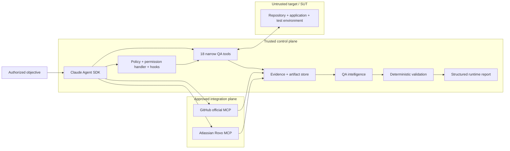
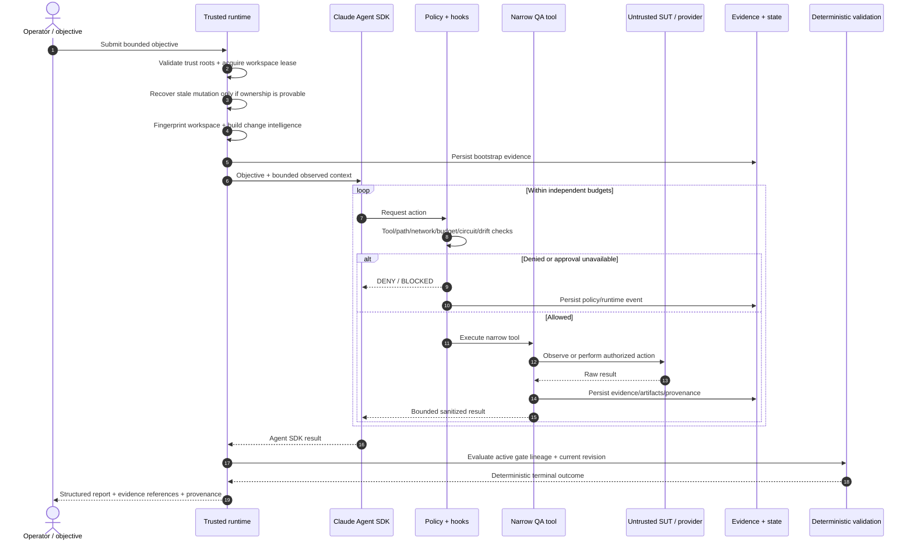

# Architecture

> **ƳƤ AI QA Automation Framework** · Designed and engineered by **Ƴunior Ƥortal (ƳƤ)**

## Architectural thesis

The ƳƤ AI QA Automation Framework treats an LLM as a **bounded reasoning component inside a quality-engineering control system**, not as the authority that decides whether software is correct.

> **Model reasoning is not test evidence.**

Claude may interpret observations, form hypotheses, rank risk, and choose among approved actions. Controlled tools perform bounded observations and side effects. Deterministic policy, validation, integrity checks, and revision lineage decide what the framework can prove.

## Authority hierarchy

```text
TRUSTED CONFIGURATION + POLICY
        ↓
RUNTIME OWNERSHIP + BUDGETS + HOOKS
        ↓
CONTROLLED OBSERVATION / EXECUTION
        ↓
PERSISTED EVIDENCE + PROVENANCE
        ↓
DETERMINISTIC VALIDATION LINEAGE
        ↓
MODEL INTERPRETATION / NEXT ACTION
        ↓
STRUCTURED TERMINAL REPORT
```

The hierarchy is deliberately asymmetric: lower layers can constrain model behavior; model reasoning cannot override lower-layer truth.

## Design invariants

| Invariant | Architectural consequence |
|---|---|
| Model prose cannot prove PASS | Terminal success requires deterministic validation closure |
| Target content is untrusted | SUT source/tests/DOM/logs/API responses and target agent config cannot redefine policy |
| Authority is narrower than capability | Runtime exposes purpose-built QA tools rather than general shell/edit/web authority |
| Configuration is not provider evidence | External availability is derived from observed provider interaction |
| Writes are higher risk than reads | Autonomous writes are explicit, path-confined, transactional, and revision-gated |
| Model confidence cannot authorize mutation | Self-healing uniqueness, semantic eligibility, stability, and patch safety are independently constrained |
| Uncertainty remains visible | Missing, contradictory, stale, or blocked evidence produces explicit non-PASS outcomes |
| Runtime truth is revision-aware | Older evidence cannot silently certify newer bytes |
| Recovery obeys live ownership rules | Stale rollback requires the same confinement, non-symlink ownership, hash, and fingerprint guarantees |
| Resource use is independently bounded | Turns, tools, network, mutations, repetition, time, and model cost have distinct controls |
| Integrity is not correctness | Hashes/journals/attestations preserve provenance but never override validation |

## System view



## Execution sequence



## Trust zones

### Trusted control plane

The trusted control plane includes:

- installed `ai_qa_automation` code;
- runtime system prompt;
- root `CLAUDE.md`;
- five approved project Skills;
- `.claude/settings.json` and hooks;
- deterministic policy engine;
- internal QA tool schemas/implementations;
- external MCP registry/configuration supplied by the control plane;
- evaluation thresholds;
- evidence/state/runtime persistence.

The Agent SDK working/configuration root is set explicitly to this trusted framework repository.

### Untrusted target plane

The target repository/worktree is data even when it contains instruction-shaped files. Source, tests, comments, `CLAUDE.md`, `.claude/`, `.mcp.json`, DOM, logs, screenshots, API responses, fixtures, and dependency metadata can contribute evidence but cannot acquire control-plane authority.

The control root, artifact root, and target workspace remain disjoint trust domains.

### External integration plane

External MCP providers are explicitly approved and disabled by default. Provider identity is only the first gate. Tool-level read/write/destructive policy still applies, and returned content remains untrusted evidence.

## Runtime authority surface

The Agent SDK path uses:

- `tools=[]` for the generic built-in tool set;
- one framework-owned in-process QA MCP server;
- external MCP only from explicit trusted configuration;
- `strict_mcp_config=True`;
- `setting_sources=["project"]`;
- a fixed five-Skill allowlist;
- explicit denial of Bash/Edit/Write/Web-style built-ins;
- deterministic `PreToolUse`, `PostToolUse`, and tool-failure hooks;
- fail-closed programmatic permission handling;
- independent limits for turns, tools, network actions, mutations, repeated actions, per-tool time, wall time, and model cost.

The internal server exposes 18 narrow capabilities spanning repository inspection, pytest, API/browser evidence, classification, bounded source reads, coverage search/planning, regression prioritization, test review/creation, locator verification/healing, schema validation, CI analysis, Appium inspection, and k6 assessment.

There is no generic existing-test rewrite tool in the live agent surface.

## Deterministic bootstrap before model execution

Before Claude receives the objective, deterministic code can persist:

- target Git `HEAD`;
- content-sensitive worktree fingerprint;
- explicit trusted base-ref resolution and merge base;
- committed plus dirty/untracked change union;
- change-risk domains;
- repository technology/test topology;
- dependency-manifest inventory and hashes;
- CODEOWNERS routing context;
- explainable test-impact candidates;
- changed OpenAPI/Swagger compatibility drift.

Only a bounded summary is placed in model context. The underlying evidence remains independently persisted.

## State separation

### Canonical QA decision state

`AgentRunState` records evidence relevant to the QA conclusion:

- objective and run/session identity;
- model/SDK/configuration provenance;
- target SHA and change revision;
- observations and hypotheses;
- evidence references;
- failure classification;
- validation lineage;
- modified files;
- provider outcomes;
- token/cost/duration data;
- terminal outcome.

### Process-control state

`runtime.json` holds operational safety state:

- workspace fingerprint;
- lease identity;
- budget counters;
- tool circuits;
- pending mutation metadata;
- journal head.

Keeping these states separate prevents recovery mechanics from becoming QA conclusions and prevents conversational state from becoming the only copy of critical runtime truth.

## Evidence semantics

`EvidenceItem` separates `OBSERVED_FACT` from `MODEL_INTERPRETATION`.

`EvidenceStore` provides:

- run-root confinement;
- duplicate-ID/path immutability;
- sanitization of supported model-facing/text persistence paths;
- artifact hashing;
- manifests;
- optional regulated audit chaining;
- explicit `RAW` treatment for binary artifacts.

Evidence integrity and evidence meaning are separate concerns.

## Runtime result semantics

The complete contract lives in [`RESULT_CONTRACT.md`](RESULT_CONTRACT.md).

Important architectural properties:

- Agent SDK subtype `success` is necessary but not sufficient for terminal `SUCCESS`;
- active deterministic FAIL remains failure;
- non-PASS validation outcomes are never promoted by model judgment;
- same-gate PASS/FAIL at the same revision is treated as contradictory evidence;
- newer evidence supersedes older gate evidence only through gate identity + revision lineage;
- changed tests require patch-safety, targeted pytest, and full-regression PASS at the current revision.

## Safe self-healing authority

Self-healing separates **proposal intelligence** from **mutation authority**.

The model may propose candidates. Playwright measures candidate uniqueness in the live DOM. The deterministic self-healing engine then overwrites model-provided semantic/stability confidence with policy-owned values:

- supported locator syntax is parsed without executing locator code;
- semantic tokens are derived from the original and candidate locator contracts;
- low semantic overlap is rejected for autonomous repair;
- strategy stability is fixed by policy;
- positional/XPath-style candidates are rejected;
- exact target file hash binds the proposal to the analyzed bytes.

This means “unique and model-confident” is still insufficient for autonomous mutation.

## Workspace and mutation safety

A live run acquires an exclusive OS-backed lease for its target worktree and captures a content-sensitive fingerprint.

Before mutation:

- target must be Git-backed;
- fingerprint must still match;
- path must remain inside the workspace;
- absolute/traversal/symlink ambiguity is rejected;
- no prior mutation transaction may remain unresolved.

Mutation then becomes a rollback-backed transaction. Existing bytes are snapshotted under trusted artifact storage and hash-bound. The candidate revision must close deterministic validation before the backup is discarded.

Crash recovery reuses the same ownership philosophy: previous run directory, pending target path, runtime metadata, rollback path, fingerprint, and backup hash must all remain trustworthy. Ambiguity blocks automatic restoration.

See [`RUNTIME_CONTROL.md`](RUNTIME_CONTROL.md).

## Network, API, browser, and performance boundaries

Trusted network configuration is host-only. Hostnames/IP literals are canonicalized; wildcard, URL-shaped, port-bearing, path-bearing, and malformed entries are rejected before runtime use.

API/browser access then applies the explicit allowlist:

- API methods default to read-only;
- redirects are disabled in the API probe;
- ambient proxy inheritance is avoided;
- browser navigation/subresources/WebSockets pass through host policy;
- service workers are blocked in the evidence context;
- browser final navigation is rechecked.

k6 additionally requires explicit non-production classification, target binding, controlled import/script analysis, and an infrastructure-egress prerequisite for non-local targets.

These are application-layer controls and do not pretend to replace an operating-system/container/network sandbox.

## External MCP authorization

GitHub and Atlassian integrations are explicit. The runtime does not inherit target/user/plugin MCP configuration.

External tool names are tokenized conservatively:

```text
destructive token > write token > read token
```

This prevents names such as a read-prefixed create/delete action from inheriting read authority merely because the first verb sounds safe. Unknown operations require approval and therefore fail closed during unattended execution.

See [`MCP.md`](MCP.md).

## Evaluation as architecture

Evaluation is part of the control design, not a presentation layer. The repository separates unit/integration/policy/security tests, the fixed 34-scenario primary corpus, the independent H-series holdout, browser-marked behavior, and credentialed model behavior.

A benchmark failure is addressed by improving the general control, not by weakening its expected outcome after the fact.

See [`EVALUATION.md`](EVALUATION.md).

## Deployment boundaries

Source-level controls, credentialed providers, external applications/devices, load targets, process isolation, network enforcement, identity, secret management, and retention each have their own evidence owner. The framework keeps those boundaries explicit rather than allowing one green layer to stand in for another.

See [`PRODUCTION_READINESS.md`](PRODUCTION_READINESS.md), [`VERIFICATION_BOUNDARIES.md`](VERIFICATION_BOUNDARIES.md), and [`README.md`](README.md).

Copyright (c) 2026 Ƴunior Ƥortal (ƳƤ). See [`../LICENSE`](../LICENSE).
