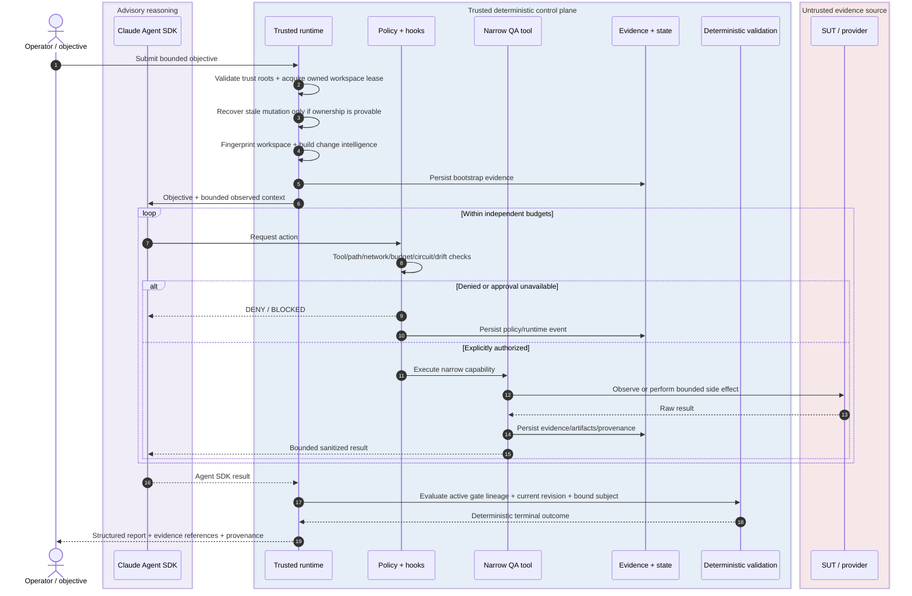

# Architecture

> [!IMPORTANT]
> **Model reasoning is not test evidence and is not runtime authority.** Claude may interpret observations, form hypotheses, rank risk, and choose among approved actions. Controlled tools perform bounded observations and side effects. Deterministic policy, ownership, validation, integrity checks, and revision lineage decide what the framework may do and what it can prove.

**ƳƤ AI QA Automation Framework** · Designed and engineered by **Ƴunior Ƥortal (ƳƤ)**

[Documentation home](README.md) · [Result contract](RESULT_CONTRACT.md) · [Security](SECURITY.md) · [Runtime control](RUNTIME_CONTROL.md)

---

The framework treats an LLM as a **bounded planner and diagnostician inside a quality-engineering control system**, not as the test oracle, authorization engine, or system of record.

## Authority hierarchy

The hierarchy below is a **trust and decision-rights hierarchy**, not a chronological request sequence:

```text
TRUSTED CONFIGURATION + DETERMINISTIC POLICY
        ↓ constrains
RUNTIME OWNERSHIP + PERMISSIONS + BUDGETS + HOOKS
        ↓ authorizes
CONTROLLED OBSERVATION / EXECUTION
        ↓ produces
PERSISTED EVIDENCE + PROVENANCE
        ↓ supports
DETERMINISTIC SUBJECT / REVISION-BOUND VALIDATION
        ↓ derives
STRUCTURED TERMINAL TRUTH

ADVISORY MODEL REASONING
        ↳ proposes actions and interpretations inside the boundaries above
        ↳ cannot override, manufacture, or promote lower-layer truth
```

The architecture is deliberately asymmetric: **capability may be probabilistic; authority and proof are not delegated to model confidence**.

## Design invariants

| Invariant | Architectural consequence |
|---|---|
| Model prose cannot prove PASS | terminal success requires deterministic validation closure |
| Target content is untrusted | SUT source/tests/DOM/logs/API responses and target agent config cannot redefine policy |
| Authority is narrower than capability | runtime exposes purpose-built QA tools rather than general shell/edit/web authority |
| Configuration is not provider evidence | external availability is derived from observed provider interaction |
| Writes are higher risk than reads | autonomous writes are explicit, path-confined, transactional, and revision-gated |
| Validation must prove the changed subject | targeted pytest must explicitly select the exact pending mutation path |
| Model confidence cannot authorize mutation | locator uniqueness, semantic eligibility, stability, and patch safety are independently constrained |
| Uncertainty remains visible | missing, contradictory, stale, or blocked evidence produces explicit non-PASS outcomes |
| Runtime truth is revision-aware | older evidence cannot silently certify newer bytes |
| Recovery obeys live ownership rules | stale rollback requires the same workspace and run-persistence identities, confinement, non-symlink ownership, hash, and fingerprint guarantees |
| Resource use is independently bounded | turns, tools, network, mutations, repetition, time, and model cost have distinct controls |
| Static script checks are not a sandbox | every k6 execution requires independently enforced infrastructure egress |
| Integrity is not correctness | hashes/journals/attestations preserve provenance but never override validation |

## System view

```mermaid
flowchart LR
    accTitle: Evidence-first AI QA architecture with explicit authority and trust boundaries
    accDescr: An authorized objective reaches advisory Claude reasoning. Action requests cross deterministic policy before internal tools or approved providers may execute. Internal tools observe the untrusted target. Provider and target content remain untrusted evidence. Evidence is persisted and deterministic subject-bound validation derives the structured runtime report.

    O[Authorized objective]
    A[Claude Agent SDK / advisory reasoning]

    subgraph TRUSTED[Trusted deterministic control plane]
      direction LR
      P[Policy + permissions + hooks] --> T[18 least-privilege QA tools]
      T --> E[Evidence + artifact store]
      E --> Q[Deterministic QA intelligence]
      Q --> V[Subject / revision-bound validation]
      V --> R[Structured runtime report]
    end

    subgraph TARGET[Untrusted target / SUT]
      S[Repository + application + test environment]
    end

    subgraph INTEGRATIONS[Approved providers · returned content untrusted]
      direction TB
      G[GitHub official MCP]
      J[Atlassian Rovo MCP]
    end

    O --> A
    A -->|action request| P
    P -->|authorize internal| T
    P -->|authorize provider| G
    P -->|authorize provider| J
    T <--> S
    G -->|provider result| E
    J -->|provider result| E

    classDef neutral fill:#f6f8fa,stroke:#57606a,color:#24292f,stroke-width:1.5px
    classDef advisory fill:#fbefff,stroke:#8250df,color:#24292f,stroke-width:2px
    classDef authority fill:#ddf4ff,stroke:#0969da,color:#24292f,stroke-width:2px
    classDef evidence fill:#dafbe1,stroke:#1a7f37,color:#24292f,stroke-width:2px
    classDef untrusted fill:#ffebe9,stroke:#cf222e,color:#24292f,stroke-width:2px,stroke-dasharray:5 3
    classDef terminal fill:#dafbe1,stroke:#1a7f37,color:#24292f,stroke-width:3px

    class O neutral
    class A advisory
    class P,T,Q authority
    class E,V evidence
    class R terminal
    class S,G,J untrusted

    style TRUSTED stroke:#0969da,stroke-width:2px,stroke-dasharray:6 4
    style TARGET stroke:#cf222e,stroke-width:2px,stroke-dasharray:6 4
    style INTEGRATIONS stroke:#cf222e,stroke-width:2px,stroke-dasharray:6 4
    linkStyle default stroke:#57606a,stroke-width:1.5px
```



**Diagram key:** purple = advisory reasoning · blue = deterministic authority · green = evidence/validation · red dashed = untrusted evidence source. Text and boundary labels repeat the meaning so color is never the only signal.

## Execution sequence



## Trust zones

### Trusted deterministic control plane

The trusted control plane includes:

- installed `ai_qa_automation` code;
- trusted runtime system policy;
- root `CLAUDE.md`;
- five approved project Skills;
- `.claude/settings.json` and hooks;
- deterministic policy engine;
- internal QA tool schemas/implementations;
- external MCP registry/configuration supplied by the control plane;
- evaluation thresholds;
- evidence/state/runtime persistence.

The Agent SDK working/configuration root is set explicitly to this trusted framework repository. **That trusted configuration source does not make model reasoning an authorization or proof authority.** The model remains an advisory reasoning component constrained by the deterministic control plane.

### Untrusted target plane

The target repository/worktree is data even when it contains instruction-shaped files. Source, tests, comments, `CLAUDE.md`, `.claude/`, `.mcp.json`, DOM, logs, screenshots, API responses, fixtures, workload scripts, and dependency metadata can contribute evidence but cannot acquire control-plane authority.

The control root, artifact root, and target workspace remain disjoint trust domains.

### External integration plane

External MCP providers are explicitly approved and disabled by default. Provider identity is only the first gate. Tool-level read/write/destructive policy still applies, and returned content remains untrusted evidence.

## Runtime authority surface

The Agent SDK path uses:

- `tools=[]` for the generic built-in tool set;
- one framework-owned in-process QA MCP server;
- external MCP only from explicit trusted configuration;
- `strict_mcp_config=True`;
- `setting_sources=["project"]`;
- a fixed five-Skill allowlist;
- explicit denial of Bash/Edit/Write/Web-style built-ins;
- deterministic `PreToolUse`, `PostToolUse`, and tool-failure hooks;
- fail-closed programmatic permission handling;
- independent limits for turns, tools, network actions, mutations, repeated actions, per-tool time, wall time, and model cost.

The internal server exposes 18 narrow capabilities spanning repository inspection, pytest, API/browser evidence, classification, bounded source reads, coverage search/planning, regression prioritization, test review/creation, locator verification/healing, schema validation, CI analysis, Appium inspection, and k6 assessment.

Live autonomous mutation is intentionally restricted to Python tests because deterministic mutation closure is pytest-backed. Reusable patch utilities may understand Python/JavaScript/TypeScript artifacts, but non-Python live writes are not authorized merely because the library can parse them.

There is no generic existing-test rewrite tool in the live agent surface.

## Deterministic bootstrap before model execution

Before Claude receives the objective, deterministic code can persist:

- target Git `HEAD`;
- content-sensitive worktree fingerprint;
- explicit trusted base-ref resolution and merge base;
- committed plus dirty/untracked change union;
- change-risk domains;
- repository technology/test topology;
- dependency-manifest inventory and hashes;
- CODEOWNERS routing context;
- explainable test-impact candidates;
- changed OpenAPI/Swagger compatibility drift.

Only a bounded summary is placed in model context. The underlying evidence remains independently persisted.

## State separation

### Canonical QA decision state

`AgentRunState` records objective/run identity, model/SDK/configuration provenance, target SHA, change revision, observations, hypotheses, evidence references, failure classification, validation lineage, modified-file history, provider outcomes, token/cost/duration data, and terminal outcome.

### Process-control state

`runtime.json` records workspace fingerprint, lease identity, budget counters, tool circuits, pending mutation metadata, and journal head.

Keeping these states separate prevents recovery mechanics from becoming QA conclusions and prevents conversational state from becoming the only copy of critical runtime truth.

## Evidence semantics and ownership

`EvidenceItem` separates `OBSERVED_FACT` from `MODEL_INTERPRETATION`.

`EvidenceStore` provides:

- run-root confinement;
- one shared run-persistence-root `(device, inode)` identity with state, runtime metadata, and journal authority on descriptor-relative no-follow platforms;
- descriptor-confined/root-revalidated manifest, audit, artifact publication, and artifact reads beneath that identity;
- duplicate-ID/path immutability;
- model-facing text sanitization where applicable;
- artifact hashing;
- evidence manifests;
- optional regulated audit chaining;
- explicit `RAW` treatment for binary artifacts;
- non-symlink ownership checks for evidence control files and registered artifact paths.

The operational journal and canonical/process state use the same run-persistence-root authority where the operating system can enforce it. An ordinary directory replacement therefore cannot silently redirect a successful authority-bearing read/write merely because the replacement is not a symlink. On platforms without descriptor-relative no-follow authority, the runtime keeps its conservative ownership checks but does not serialize a best-effort stat tuple as equivalent historical run-root authority.

Evidence integrity and evidence meaning remain separate concerns.

## Runtime result semantics

The complete contract lives in [`RESULT_CONTRACT.md`](RESULT_CONTRACT.md).

Key properties:

- Agent SDK subtype `success` is necessary but not sufficient for terminal `SUCCESS`;
- active deterministic FAIL remains failure;
- non-PASS validation outcomes are never promoted by model judgment;
- same-gate PASS/FAIL at the same revision is contradictory evidence;
- newer evidence supersedes older gate evidence only through gate identity + revision lineage;
- changed tests require exact-path patch safety, exact-path-bound targeted pytest, and full-regression PASS at the current revision;
- recovery inspection uses the same subject-bound closure rule.

## Safe self-healing authority

Self-healing separates **proposal intelligence** from **mutation authority**.

The model may propose candidates. Playwright measures candidate uniqueness in the live DOM. Deterministic code then constrains eligibility:

- supported locator syntax is parsed without executing locator code;
- semantic tokens are derived from original and candidate locator contracts;
- low semantic overlap is rejected;
- strategy stability is fixed by policy;
- model-provided semantic/stability scores are overwritten before authorization;
- positional/XPath-style candidates are rejected;
- exact target file hash binds proposal to analyzed bytes.

“Unique and model-confident” remains insufficient for autonomous mutation.

## Coverage-aware generation authority

Coverage search creates observed repository evidence. Test planning is interpretation derived from that evidence.

Model-supplied “already covered” labels are intentionally advisory: they cannot suppress deterministic candidate scenarios by themselves. Before implementation, a candidate is reconciled with same-run observed coverage so the framework avoids both unsafe omission and unnecessary duplication.

Live generated-file mutation is Python/pytest-backed and remains subject to the same transaction closure as self-healing.

## Workspace and mutation safety

A live run acquires an exclusive OS-backed lease for its target worktree and captures a content-sensitive fingerprint.

Before mutation:

- target must be Git-backed;
- fingerprint must still match;
- path must remain inside the workspace;
- absolute/traversal/symlink ambiguity is rejected by both orchestration and the safe patch library;
- no prior mutation transaction may remain unresolved.

Lease files, rollback directories, rollback backups, evidence files, and recovery journals are also checked for owned non-symlink paths where the framework controls those files.

Mutation becomes a rollback-backed transaction. Existing bytes are snapshotted under trusted artifact storage and hash-bound. The candidate revision must close deterministic validation before the backup is discarded.

Crash recovery reuses the same ownership philosophy. On descriptor-relative no-follow platforms, the live run pins one run-persistence-root identity and the workspace lease persists that identity as historical recovery authority. A later stale-recovery owner must match the exact recorded prior run `(device, inode)` before it accepts that run's state/runtime/journal/rollback authority or touches target bytes; missing, malformed, or mismatched historical identity blocks automatic recovery. Attestation, lineage, and recovery inspection pin one observed run-root identity for the duration of an inspection and reject mid-inspection substitution, but do not fabricate a historical identity they do not possess. Platforms without enforceable descriptor-relative root authority retain conservative non-equivalent fallback semantics.

See [`RUNTIME_CONTROL.md`](RUNTIME_CONTROL.md).

## Network, API, browser, and performance boundaries

Trusted network configuration is host-only. Hostnames/IP literals are canonicalized; wildcard, URL-shaped, port-bearing, scoped, path-bearing, and malformed entries are rejected before runtime use.

API/browser access then applies the explicit allowlist:

- API methods default to read-only;
- redirects are disabled in the API probe;
- ambient proxy inheritance is avoided;
- browser navigation/subresources/WebSockets pass through host policy;
- service workers are blocked in the evidence context;
- final browser navigation is rechecked.

k6 additionally requires explicit non-production classification, injected target binding, controlled import/script analysis, **and independently enforced infrastructure egress for every execution, including localhost**. Static JavaScript inspection is not represented as a network sandbox.

> [!NOTE]
> Application-level target/host rules and an egress-precondition flag are not themselves a firewall. The deployment owns the actual isolation mechanism.

## External MCP authorization

GitHub and Atlassian integrations are explicit. The runtime does not inherit target/user/plugin MCP configuration.

External tool names are tokenized conservatively:

```text
destructive token > write token > read token
```

This prevents read-prefixed create/delete actions from inheriting read authority. Unknown operations require approval and therefore fail closed during unattended execution. Numeric business identifiers are not normalized as HTTP/provider status codes without contextual transport semantics.

See [`MCP.md`](MCP.md).

## Traceability and attestation

`ai-qa attest` is deliberately unsigned. `integrity_verified=true` requires owned core persisted subjects, a valid runtime journal chain, no pending mutation, and a matching SHA-256 for every artifact registered in the evidence manifest.

That verifies internal persisted-record integrity only. It does not establish actor identity, notarization, compliance, a trusted timestamp, or test success.

See [`TRACEABILITY.md`](TRACEABILITY.md).

## Evaluation as architecture

Evaluation is part of the control design, not a presentation layer. The repository separates unit/integration/policy/security tests, the fixed 34-case primary deterministic control corpus, the repository-visible sequestered H-series readiness corpus, browser-marked behavior, and credentialed model behavior.

The H-series is physically separated from routine primary execution but remains committed repository content; it is not blind or independent evidence. Likewise, the primary untrusted-authority cases exercise deterministic policy paths and do not by themselves prove model prompt-injection resistance.

An evaluation failure is addressed by improving the general control, not by weakening its expected outcome or governed threshold after the fact.

See [`EVALUATION.md`](EVALUATION.md).

## Deployment boundaries

Source-level controls, credentialed providers, external applications/devices, workload targets, process isolation, network enforcement, identity, secret management, and retention each have their own evidence owner. The framework keeps those boundaries explicit rather than allowing one green layer to stand in for another.

> [!TIP]
> Read [`RESULT_CONTRACT.md`](RESULT_CONTRACT.md) immediately after this document; it is the authoritative bridge between architecture and terminal truth.

---

Related: [`PRODUCTION_READINESS.md`](PRODUCTION_READINESS.md) · [`VERIFICATION_BOUNDARIES.md`](VERIFICATION_BOUNDARIES.md) · [`TECHNICAL_WALKTHROUGH.md`](TECHNICAL_WALKTHROUGH.md)

[← Documentation home](README.md)

Copyright (c) 2026 Ƴunior Ƥortal (ƳƤ). See [`../LICENSE`](../LICENSE).