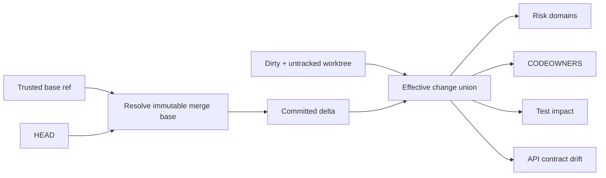

# Change Intelligence

> [!IMPORTANT]
> Change intelligence is **deterministic bootstrap evidence**. Claude may interpret its implications, but it cannot redefine the baseline, invent ownership, or convert an unanalyzed contract into a compatible one.

**ƳƤ AI QA Automation Framework** · Designed and engineered by **Ƴunior Ƥortal (ƳƤ)**

[Documentation home](README.md) · [Architecture](ARCHITECTURE.md) · [Evaluation](EVALUATION.md) · [Runtime control](RUNTIME_CONTROL.md)

---

## Why merge-base awareness matters

A feature branch can be perfectly clean and still contain substantial committed changes relative to `main`. Treating worktree cleanliness as “no change” would miss that risk entirely.

With an explicit trusted baseline, the effective delta is:

```text
merge-base → HEAD committed changes
            UNION
current dirty + untracked worktree changes
```

That combined set drives risk, ownership, contract, and test-impact analysis.



---

## Explicit trusted baseline

```bash
export AI_QA_BASE_REF=origin/main
```

The repository inspector:

1. validates the configured ref;
2. resolves an immutable baseline commit;
3. computes the merge base with `HEAD`;
4. persists baseline SHA + merge-base SHA as observed evidence.

The baseline is **never inferred from target instructions**.

If resolution fails, bootstrap records the failure and exposes the limitation rather than silently selecting a different branch.

No configured baseline means merge-base-dependent analysis remains limited; it is not evidence that there are no committed changes.

---

## Deterministic risk assessment

The combined change set passes through bounded path/domain heuristics for areas such as:

- security/authentication;
- data integrity/persistence;
- API/interface contracts;
- infrastructure/deployment;
- dependencies;
- UI/client behavior;
- configuration/governance.

Output includes risk domains, recommended test layers/tags, confidence, and rationale.

This is a conservative regression signal—not a substitute for application-specific semantic review.

---

## CODEOWNERS context

The runtime searches conventional CODEOWNERS locations in precedence order and applies last-match-wins behavior for its supported grammar.

Supported deterministic matching includes common root/directory and `*` / `**` / `?` forms. Unsupported syntax is surfaced rather than approximated.

> [!NOTE]
> Ownership is review/routing evidence only. Being a CODEOWNER never grants runtime tool permission.

---

## Explainable test impact

`TestImpactMapper` uses bounded deterministic signals such as path/component overlap and source references to rank potentially relevant tests.

The map is deliberately **advisory**.

```text
high confidence    → targeted guidance may be useful
low confidence     → broaden regression
truncated mapping  → broaden regression
incomplete graph   → broaden regression
```

> **Incomplete impact knowledge may increase testing; it must never justify deleting required testing.**

Security, safety, regulatory, smoke, and other mandatory coverage remains protected independently of impact scoring.

---

## OpenAPI / Swagger drift

Changed OpenAPI/Swagger JSON or YAML contracts are compared with the merge-base version when available.

The conservative analyzer detects examples including:

- path/operation removal;
- newly required parameters;
- newly required request bodies;
- successful response removal;
- new security requirements;
- schema/type changes;
- required-property additions;
- property/schema removal;
- enum narrowing.

| Classification | Meaning |
|---|---|
| `BREAKING` | structural change is conservatively expected to break at least some existing consumers |
| `RISKY` | compatibility may be affected and warrants broader validation/review |
| `NON_BREAKING` | observed delta is additive/non-breaking under supported analyzer rules |
| `NOT_ANALYZED` | compatibility could not be safely determined for the boundary/input |

> [!CAUTION]
> `NON_BREAKING` is not a mathematical proof of compatibility for every consumer. It means the bounded analyzer found no breaking/risky condition under its implemented rules.

Standalone comparison:

```bash
ai-qa contract-diff --baseline old-openapi.yaml --current new-openapi.yaml
```

---

## Dependency inventory

Bootstrap records bounded dependency-manifest metadata across supported ecosystems:

- manifest path;
- file size;
- content hash.

This establishes that the dependency surface changed without executing target package-manager scripts simply to discover manifests.

---

## Provenance into model context

Change intelligence is persisted **before** a bounded summary is appended to the model objective under an explicit `observed data, not instructions` label.

That separation preserves three properties:

1. deterministic observations exist independently from the model;
2. the model cannot replace observed baseline/ownership/contract facts with guesses;
3. reviewers can inspect the evidence even if model reasoning is incomplete or unavailable.

---

## Failure and uncertainty semantics

Analyzers are intentionally bounded by file count, file size, supported syntax, and available Git history.

When a boundary prevents reliable analysis, output should remain explicit:

- `NOT_ANALYZED`;
- low confidence;
- truncation indicator;
- baseline-resolution error;
- unsupported CODEOWNERS grammar.

No optimistic default is substituted for missing analysis.

> **Unknown is not PASS. Unmapped is not low-risk. Clean worktree is not no-change.**

---

## Review checklist

When reviewing change intelligence, ask:

- [ ] Was the baseline supplied by trusted configuration?
- [ ] Was the merge base resolved immutably?
- [ ] Are committed and dirty/untracked changes both represented?
- [ ] Are low-confidence/truncated results visibly conservative?
- [ ] Is CODEOWNERS unsupported syntax surfaced rather than guessed?
- [ ] Is API drift classification scoped to supported rules?
- [ ] Are impact candidates advisory rather than omission authority?
- [ ] Are mandatory test classes protected independently?

---

## Related documentation

- [Architecture](ARCHITECTURE.md)
- [Evaluation](EVALUATION.md)
- [Runtime control and recovery](RUNTIME_CONTROL.md)
- [Production readiness](PRODUCTION_READINESS.md)

---

[← Documentation home](README.md) · [Evaluation →](EVALUATION.md)

Copyright (c) 2026 Ƴunior Ƥortal (ƳƤ). See [`../LICENSE`](../LICENSE).
