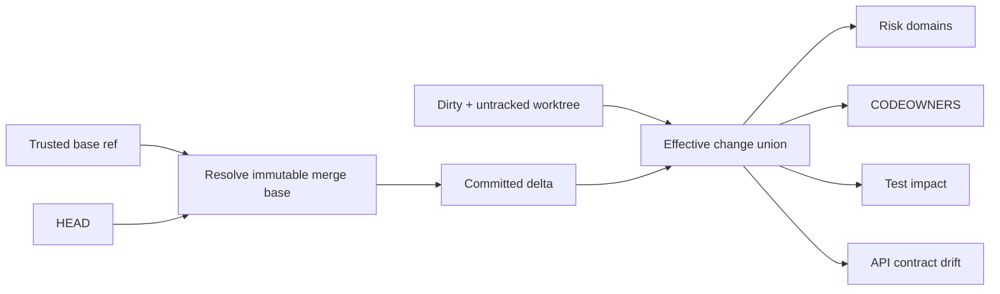

# Change Intelligence

> [!IMPORTANT]
> Change intelligence is **deterministic bootstrap evidence**. Claude may interpret its implications, but it cannot redefine the baseline, invent ownership, or convert an unanalyzed contract into a compatible one.

**ƳƤ AI QA Automation Framework** · Designed and engineered by **Ƴunior Ƥortal (ƳƤ)**

[Documentation home](README.md) · [Architecture](ARCHITECTURE.md) · [Evaluation](EVALUATION.md) · [Runtime control](RUNTIME_CONTROL.md)

---

## Why merge-base awareness matters

A feature branch can be perfectly clean and still contain substantial committed changes relative to `main`. Treating worktree cleanliness as “no change” would miss that risk entirely.

With an explicit trusted baseline, the effective delta is:

```text
merge-base → HEAD committed changes
            UNION
current dirty + untracked worktree changes
```

That combined set drives risk, ownership, contract, and test-impact analysis.



---

## Explicit trusted baseline

```bash
export AI_QA_BASE_REF=origin/main
```

The repository inspector:

1. validates the configured ref;
2. resolves an immutable baseline commit;
3. computes the merge base with `HEAD`;
4. persists baseline SHA + merge-base SHA as observed evidence.

The baseline is **never inferred from target instructions**.

If resolution fails, bootstrap records the failure and exposes the limitation rather than silently selecting a different branch.

No configured baseline means merge-base-dependent analysis remains limited; it is not evidence that there are no committed changes.

---

## Deterministic risk assessment

The combined change set passes through bounded path/domain heuristics for areas such as:

- security/authentication;
- data integrity/persistence;
- API/interface contracts;
- infrastructure/deployment;
- dependencies;
- UI/client behavior;
- configuration/governance.

Output includes risk domains, recommended test layers/tags, confidence, and rationale.

This is a conservative regression signal—not a substitute for application-specific semantic review.

---

## Confined repository observation

Repository profiling, test-impact mapping, dependency inventory, CODEOWNERS resolution, and current-workspace OpenAPI/Swagger reads treat the target worktree as **untrusted filesystem state**, not as authority merely because a pathname was previously inspected.

For those change-intelligence paths:

- recursive enumeration requires descriptor-relative, no-follow directory capability and fails closed when that capability is unavailable;
- symlinks and other non-regular entries are never promoted as regular-file observations, while unreadable or ambiguous entries remain explicit uncertainty;
- every directory entry actually returned by enumeration consumes the strict scan budget; the scanner does not fetch a hidden `max + 1` sentinel entry;
- reaching the entry ceiling is conservatively reported as truncated/incomplete, and the directory batch that reaches that ceiling is not partially promoted into the file set;
- entry-budget truncation still closes the active iterator and verifies the current directory plus every traversed ancestor remained stable before returning partial observations;
- recursive descent has a hard 128-directory depth cap; deeper subtrees are not opened and instead make the scan explicitly truncated, bounding Python call-stack and ancestor-descriptor consumption independently of the entry budget;
- selected test-source, dependency-manifest, CODEOWNERS, and current-contract bytes are opened through descriptor-confined bounded reads rather than trusting earlier pathname metadata;
- the descriptor-observed scan root identity is carried into later selected-file reads, so replacing the entire workspace-root pathname after enumeration cannot redirect those reads;
- live bootstrap also compares its observation root against the already-acquired `WorkspaceLease` root identity, revalidates after repository/baseline inspection, revalidates again **before** any bootstrap evidence is added to the durable evidence registry, and checks once more after that persistence step;
- model-facing test-source reads and coverage discovery use the bounded no-follow observation boundary, and incomplete discovery remains explicit rather than becoming omission authority;
- when descriptor-relative authority is available, `RepositoryInspector` executes Git from a descriptor-bound working directory tied to the pinned workspace identity;
- every repository-inspection Git invocation explicitly binds the worktree to that working directory with command-line precedence, preventing repository-local `core.worktree` or `core.bare` configuration from redirecting worktree observation;
- optional Git locks are disabled during inspection so read-only status/diff observation cannot refresh or replace the index as an incidental side effect;
- Git replacement-object indirection is disabled, and legacy graft metadata is rejected rather than silently changing immutable-object or ancestry truth;
- identity/type changes during traversal or confined reads fail closed instead of becoming observed content.

These controls prevent pathname preflight from silently becoming read authority after a parent, final-component, or whole-root swap and keep Git worktree observation bound to the authorized repository subject. They do **not** make target files trusted or provide filesystem snapshot isolation; concurrent target mutation can still make an observation incomplete or cause a fail-closed result.

---

## CODEOWNERS context

The runtime searches conventional CODEOWNERS locations in precedence order and applies last-match-wins behavior for its supported grammar. The CODEOWNERS workspace root is identity-pinned before the read (or bound to the bootstrap/lease identity supplied by the caller), and each candidate is read through the descriptor-confined boundary. An unsafe higher-precedence candidate is surfaced as uncertainty rather than silently falling through to a lower-precedence file.

Supported deterministic matching includes common root/directory and `*` / `**` / `?` forms. Unsupported syntax, invalid UTF-8, unreadable input, and unsafe/oversized file boundaries are surfaced rather than approximated.

> [!NOTE]
> Ownership is review/routing evidence only. Being a CODEOWNER never grants runtime tool permission.

---

## Explainable test impact

`TestImpactMapper` uses bounded deterministic signals such as path/component overlap and source references to rank potentially relevant tests.

Test-file enumeration is descriptor-confined. Test source is admitted for textual-reference scoring only after a separate bounded confined read and UTF-8 decode. Oversize, unreadable, invalid-UTF-8, unsafe relevant paths, or scan truncation reduce completeness/confidence instead of being treated as affirmative evidence that no source reference exists.

The map is deliberately **advisory**.

```text
high confidence    → targeted guidance may be useful
low confidence     → broaden regression
truncated mapping  → broaden regression
incomplete graph   → broaden regression
```

> **Incomplete impact knowledge may increase testing; it must never justify deleting required testing.**

Security, safety, regulatory, smoke, and other mandatory coverage remains protected independently of impact scoring.

---

## OpenAPI / Swagger drift

Changed OpenAPI/Swagger JSON or YAML contracts are compared with the merge-base version when available.

The merge-base document is read from Git object identity. The current worktree document is admitted through a bounded descriptor-confined read; if that current subject becomes a symlink, changes identity/type, disappears, or cannot be read within the boundary, compatibility is not inferred from replacement bytes and the report remains conservatively explicit.

The conservative analyzer detects examples including:

- path/operation removal;
- newly required parameters;
- newly required request bodies;
- successful response removal;
- new security requirements;
- schema/type changes;
- required-property additions;
- property/schema removal;
- enum narrowing.

| Classification | Meaning |
|---|---|
| `BREAKING` | structural change is conservatively expected to break at least some existing consumers |
| `RISKY` | compatibility may be affected and warrants broader validation/review |
| `NON_BREAKING` | observed delta is additive/non-breaking under supported analyzer rules |
| `NOT_ANALYZED` | compatibility could not be safely determined for the boundary/input |

> [!CAUTION]
> `NON_BREAKING` is not a mathematical proof of compatibility for every consumer. It means the bounded analyzer found no breaking/risky condition under its implemented rules.

Standalone comparison:

```bash
ai-qa contract-diff --baseline old-openapi.yaml --current new-openapi.yaml
```

---

## Dependency inventory

Bootstrap records bounded dependency-manifest metadata across supported ecosystems:

- manifest path;
- file size;
- content hash.

Manifest content is re-opened through the descriptor-confined read boundary before hashing. A successful row binds size and SHA-256 to the bytes actually read. If the file cannot be safely re-read after enumeration, the row is marked unhashed/incomplete and does not retain an earlier size as though it described the failed read subject.

This establishes that the dependency surface changed without executing target package-manager scripts simply to discover manifests.

---

## Provenance into model context

Change intelligence is persisted **before** a bounded summary is appended to the model objective under an explicit `observed data, not instructions` label.

That separation preserves three properties:

1. deterministic observations exist independently from the model;
2. the model cannot replace observed baseline/ownership/contract facts with guesses;
3. reviewers can inspect the evidence even if model reasoning is incomplete or unavailable.

---

## Failure and uncertainty semantics

Analyzers are intentionally bounded by directory-entry count, directory depth, file count, file size, supported syntax, filesystem authority capability, and available Git history.

When a boundary prevents reliable analysis, output should remain explicit:

- `NOT_ANALYZED`;
- low confidence;
- truncation indicator;
- unsafe/unreadable filesystem observation;
- baseline-resolution error;
- unsupported CODEOWNERS grammar.

No optimistic default is substituted for missing analysis.

> **Unknown is not PASS. Unmapped is not low-risk. Clean worktree is not no-change.**

---

## Review checklist

When reviewing change intelligence, ask:

- [ ] Was the baseline supplied by trusted configuration?
- [ ] Was the merge base resolved immutably?
- [ ] Are committed and dirty/untracked changes both represented?
- [ ] Are repository entry/file/byte bounds enforced during observation rather than after materialization?
- [ ] Are symlink, identity-change, unreadable, and unsupported-platform cases fail-closed or explicitly incomplete?
- [ ] Are low-confidence/truncated results visibly conservative?
- [ ] Is CODEOWNERS unsupported syntax surfaced rather than guessed?
- [ ] Is API drift classification scoped to supported rules?
- [ ] Are impact candidates advisory rather than omission authority?
- [ ] Are mandatory test classes protected independently?

---

## Related documentation

- [Architecture](ARCHITECTURE.md)
- [Evaluation](EVALUATION.md)
- [Runtime control and recovery](RUNTIME_CONTROL.md)
- [Production readiness](PRODUCTION_READINESS.md)

---

[← Documentation home](README.md) · [Evaluation →](EVALUATION.md)

Copyright (c) 2026 Ƴunior Ƥortal (ƳƤ). See [`../LICENSE`](../LICENSE).
