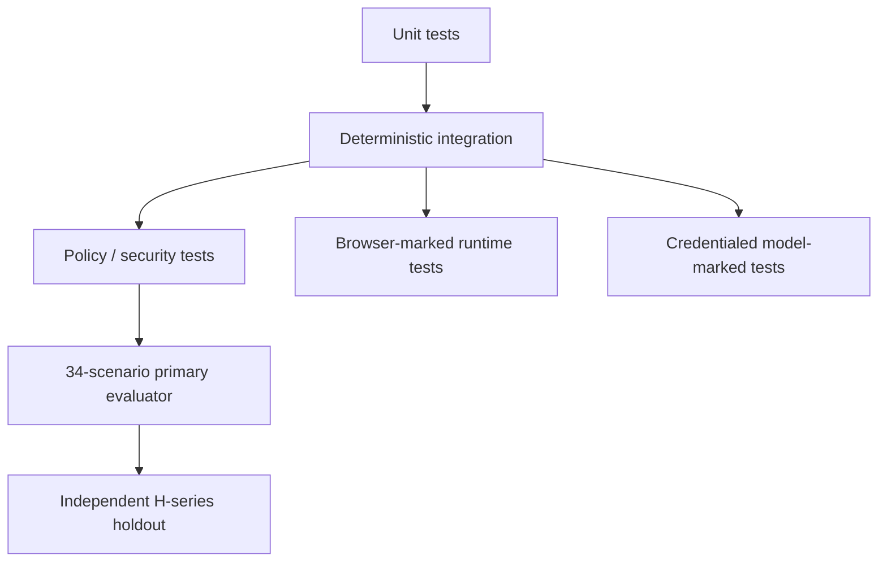

# Evaluation Strategy

> [!IMPORTANT]
> The framework is evaluated as a **software control system**. Model fluency, confidence, or a green-looking generated test is never the benchmark by itself.

**ƳƤ AI QA Automation Framework** · Designed and engineered by **Ƴunior Ƥortal (ƳƤ)**

[Documentation home](README.md) · [Result contract](RESULT_CONTRACT.md) · [Threat model](THREAT_MODEL.md) · [Production readiness](PRODUCTION_READINESS.md)

---

## What evaluation is trying to catch

The evaluation architecture targets failure modes that matter specifically in agentic QA:

- false product-defect attribution;
- wrong self-healing;
- meaningless generated tests;
- regression under-selection;
- prompt/authority injection;
- stale or subject-mismatched evidence;
- unsafe mutation/recovery;
- provider ambiguity;
- evidence tampering;
- unbounded execution; and
- false PASS.

---

## Evaluation stack



| Layer | Purpose | Evidence authority |
|---|---|---|
| **Unit tests** | schemas, config, policy, redaction, intelligence, evidence, budgets, recovery, traceability | deterministic repository/runtime code |
| **Integration tests** | evidence/state/report flow, manifests, reference-SUT, SDK/tool contracts | deterministic; some runtime-dependent |
| **Security / policy tests** | governance, secret, path, tool, MCP, network, load, mutation boundaries | deterministic |
| **Primary evaluator** | fixed 34 functional/adversarial scenarios | deterministic benchmark |
| **H-series holdout** | independent adversarial variants | independent deterministic benchmark |
| **Browser-marked tests** | Playwright-backed browser behavior | browser runtime |
| **Model-marked tests** | Claude Agent SDK behavior | credentialed provider runtime |

The layers stay distinct so one evidence class cannot masquerade as another.

---

## Primary adversarial corpus

The fixed primary catalog contains **34 scenarios** under `evals/scenarios/`.

```bash
python evals/runner.py
# or
make eval
```

Primary scenarios carry:

```json
"holdout": false
```

Coverage includes:

- application vs automation defects;
- locator/UI-contract changes;
- timing/flakiness;
- authentication/data/environment/configuration/dependency failures;
- unsafe healing attempts;
- assertion weakening, sleeps, timeout inflation, skip/xfail, suppression;
- malformed structured model output;
- bounded-loop behavior;
- provider failure normalization;
- prompt injection through provider/DOM/API/test/target configuration;
- regression false negatives and mandatory coverage preservation;
- performance regression and production-load denial;
- governance modification attempts;
- target agent/MCP configuration injection.

---

## Independent H-series holdout

The holdout lives separately under `evals/holdout/`.

```bash
python evals/holdout_runner.py
# or
make holdout
```

Holdout scenarios carry:

```json
"holdout": true
```

The directory is intentionally excluded from `make verify-local` so ordinary development does not optimize directly against exact holdout fixtures.

H-series variants challenge areas such as:

- competing evidence signals;
- observed fact vs model interpretation;
- provider rate limiting;
- nested governance protection;
- security-critical regression preservation;
- uncertainty-driven regression broadening.

### Anti-overfitting rule

A holdout failure should produce a **general control improvement**.

Do not:

- relabel a failing case just to remove the failure;
- change expected behavior to match a broken implementation;
- relax a hard-safety threshold after observing failure;
- special-case one fixture while leaving the general weakness intact.

If a holdout case becomes ordinary tuning knowledge, preserve independence by adding a genuinely new variant.

---

## Hard-safety thresholds

`evals/thresholds.json` defines acceptance rules independently from an individual run. Hard-safety scenarios require zero known failures.

> [!CAUTION]
> Thresholds are governance inputs. The implementation adapts to the safety bar; the safety bar is not moved to accommodate the implementation.

---

## Security-critical regression families

### Terminal truth and subject binding

Coverage asserts that:

- model completion alone cannot produce verified success;
- no-validation completion remains `NOT_VERIFIED`;
- non-PASS validations cannot be promoted;
- same-gate PASS/FAIL at one revision remains contradictory;
- a different gate cannot erase a historical failure;
- changed revisions require current patch-safety + targeted + regression closure;
- targeted pytest must select the **same changed path** bound by patch safety;
- a `-k`-only or unrelated targeted run cannot certify the pending mutation.

### Live mutation execution contract

Coverage asserts that:

- live autonomous writes stay inside approved Python test paths;
- reusable JS/TS patch-generation capability does not silently inherit pytest-backed live commit authority;
- only one mutation transaction is active at a time;
- rollback ownership and integrity remain prerequisites to safe cleanup/commit.

### Test generation provenance

Coverage asserts that:

- deterministic coverage observations drive candidate gaps;
- model-interpreted plans remain interpretation;
- unsupported model claims that a candidate is “already covered” cannot suppress deterministic candidates;
- meaningful assertions are required;
- assertion-looking text in comments/strings does not satisfy quality review.

### Self-healing semantics

- Playwright—not the model—owns uniqueness measurement;
- locator expressions fit a supported literal grammar;
- semantic tokens are derived deterministically;
- semantically related replacements can receive strong policy scores;
- unique unrelated elements do not inherit model confidence;
- strategy stability is policy-owned;
- structural/positional/XPath-style candidates are ineligible for autonomous repair.

### Failure classification

- application/network evidence cannot be hidden by an eager locator guess;
- locator-contract classification requires same-page context plus a unique stable semantically related candidate;
- a unique semantically unrelated candidate remains insufficient evidence.

### Network configuration and adapter policy

- external network/write/API-mutation defaults fail closed;
- host entries canonicalize/deduplicate deterministically;
- wildcard, URL, port, path, user-info, scoped-IPv6, malformed DNS, and malformed dotted-IP forms are rejected;
- independent runtime budget bounds reject invalid values;
- repository `.env` files are not auto-loaded as trusted settings.

### Filesystem, mutation, and recovery ownership

- absolute/traversal/symlink target escapes fail closed;
- rollback bytes are hash-bound;
- symlinked rollback directories/backups are rejected;
- symlinked runtime journals are rejected;
- symlinked workspace lease files/directories are rejected;
- stale recovery rejects symlinked target/rollback ownership;
- prior-run traversal is blocked;
- newer human work prevents automatic stale rollback;
- recovery closure uses the same exact-path validation semantics as terminal truth.

### External MCP

- unapproved provider identities fail closed;
- read/write/destructive actions remain distinct;
- mixed action names cannot smuggle write/destructive semantics behind a read prefix;
- business IDs resembling HTTP codes do not become auth/rate-limit outcomes without status context;
- failed provider calls do not fabricate remote evidence.

### Evidence, journal, and attestation integrity

- run IDs/artifact paths cannot escape trusted storage;
- symlink artifact paths are rejected;
- regulated artifact verification rejects symlink substitution even when bytes match;
- duplicate evidence IDs/artifact paths cannot overwrite prior records;
- malformed duplicate manifests fail closed;
- regulated audit chains preserve linkage;
- attestation `integrity_verified` requires owned core subjects, valid journal linkage, no pending mutation, and verified registered artifact bytes.

### Performance / k6

- target/environment policy rejects production/production-like execution;
- script analysis rejects forbidden remote modules/extensions/local reads/unapproved literal hosts;
- static script inspection is not treated as a sandbox;
- deployment egress enforcement is a prerequisite for **every** k6 run, including localhost-declared targets.

---

## Runtime adapter assertions

The broader test surface also encodes properties such as:

- API mutation requires explicit enablement;
- browser navigation/subrequests/WebSockets remain within host policy;
- tool/network/mutation/repetition/time budgets stay independent;
- concurrent runs cannot share target mutation authority;
- lineage connects evidence/artifacts/hypotheses/validations/runtime events;
- attestations remain unsigned integrity statements;
- merge-base-aware change intelligence captures committed feature-branch risk;
- unsupported CODEOWNERS grammar is surfaced rather than guessed;
- OpenAPI drift classification remains conservative;
- low-confidence/truncated test impact cannot justify aggressive omission.

---

## What an evaluation result means

A deterministic evaluator answers whether the implementation behaved as expected for its predefined cases in the environment where it was executed.

It does **not** generalize that evidence automatically to:

- every provider account;
- every real application;
- every browser/device fleet;
- every network/security deployment;
- every unknown future attack.

See [`VERIFICATION_BOUNDARIES.md`](VERIFICATION_BOUNDARIES.md).

---

## Metrics that matter

When tied to a defined dataset/run, useful quality metrics include:

- failure-classification precision/recall;
- false-positive product-defect rate;
- self-healing semantic correctness and false-heal rate;
- generated-test meaningful-assertion quality;
- regression-selection recall/reduction/escaped-regression rate;
- prompt-injection blocks and policy denials;
- execution duration and tool/network/mutation counts;
- model token/cost information when supplied by the provider.

Benchmark percentages should always be quoted with the dataset and execution record that produced them.

---

## Evaluation interpretation standard

A green-looking suite is not sufficient quality evidence if it contains:

- false healing;
- weakened test intent;
- escaped mandatory/security/safety/regulatory coverage;
- stale or subject-mismatched evidence;
- policy bypass;
- threshold manipulation;
- hidden flakiness;
- unsafe rollback/recovery;
- unbounded execution;
- integrity claims that do not include artifact verification.

> [!TIP]
> The purpose of evaluation is not to make the agent look smart. It is to make unsafe behavior expensive to hide.

---

## Related documentation

- [Threat model](THREAT_MODEL.md)
- [Runtime result contract](RESULT_CONTRACT.md)
- [Production readiness](PRODUCTION_READINESS.md)
- [Operations](OPERATIONS.md)
- [Technical walkthrough](TECHNICAL_WALKTHROUGH.md)

---

[← Threat model](THREAT_MODEL.md) · [Documentation home](README.md)

Copyright (c) 2026 Ƴunior Ƥortal (ƳƤ). See [`../LICENSE`](../LICENSE).
