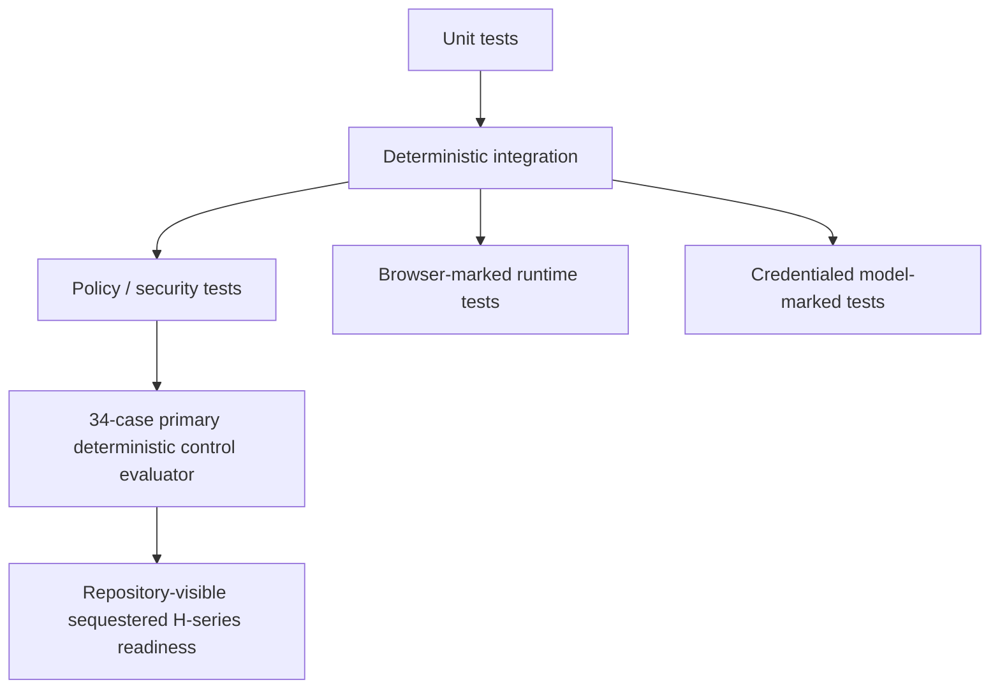

# Evaluation Strategy

> [!IMPORTANT]
> The framework is evaluated as a **software control system**. Model fluency, confidence, or a green-looking generated test is never the benchmark by itself. Evaluation labels describe only the paths that actually execute.

**ƳƤ AI QA Automation Framework** · Designed and engineered by **Ƴunior Ƥortal (ƳƤ)**

[Documentation home](README.md) · [Result contract](RESULT_CONTRACT.md) · [Threat model](THREAT_MODEL.md) · [Production readiness](PRODUCTION_READINESS.md)

---

## What evaluation is trying to catch

The evaluation architecture targets failure modes that matter specifically in agentic QA:

- false product-defect attribution;
- unsafe self-healing policy escapes;
- meaningless generated tests;
- regression under-selection;
- untrusted-data attempts to acquire authority;
- stale or subject-mismatched evidence;
- unsafe mutation/recovery;
- provider ambiguity;
- evidence tampering;
- unbounded execution; and
- false PASS.

---

## Evaluation stack



| Layer | Purpose | Evidence authority |
|---|---|---|
| **Unit tests** | schemas, config, policy, redaction, intelligence, evidence, budgets, recovery, traceability | deterministic repository/runtime code |
| **Integration tests** | evidence/state/report flow, manifests, reference-SUT, SDK/tool contracts | deterministic; some runtime-dependent |
| **Security / policy tests** | governance, secret, path, tool, MCP, network, load, mutation boundaries | deterministic |
| **Primary evaluator** | fixed 34 deterministic functional/adversarial control cases | deterministic component/control evidence only |
| **H-series readiness** | six repository-visible cases intentionally separated from routine primary execution | deterministic readiness evidence; not blind or independent |
| **Browser-marked tests** | Playwright-backed browser behavior | browser runtime |
| **Model-marked tests** | Claude Agent SDK behavior | credentialed provider runtime |

The layers stay distinct so one evidence class cannot masquerade as another. In particular, the primary evaluator does **not** execute Claude or prove model-level prompt-injection resistance.

---

## Primary deterministic control corpus

The fixed primary catalog contains **34 cases** under `evals/scenarios/`.

```bash
python evals/runner.py
# or
make eval
```

Primary cases retain the compatibility field:

```json
"holdout": false
```

Coverage includes distinct deterministic paths for:

- application vs automation defects;
- locator/UI-contract changes;
- timing/flakiness;
- authentication/data/environment/configuration/dependency failures;
- unsafe-healing policy attempts;
- assertion weakening, sleeps, timeout inflation, skip/xfail, and broad exception suppression;
- malformed structured model output;
- bounded-loop behavior;
- provider failure normalization;
- untrusted issue/ticket/DOM/API contexts attempting secret reads, governance writes, unrestricted tools, or API mutation;
- regression false negatives and mandatory-coverage cases;
- performance regression and production-load denial;
- protected evaluation-threshold modification;
- target `CLAUDE.md` and `.mcp.json` modification attempts.

Each primary case must map to exactly one registered evaluator path. The loader binds case ID, filename, title, evaluator, expected result, and hard-safety designation to repository-owned executable metadata. Duplicate IDs, duplicate evaluator paths, callable aliases, unknown evaluators, relabeled expectations, and hard-safety demotion fail closed.

Primary and readiness **catalog directories** use descriptor-pinned, no-follow ingestion rather than pathname enumeration after a separate preflight. Enumeration is bounded while it occurs; each direct JSON entry is opened relative to the pinned directory descriptor, read under an actual byte limit, and checked for file-identity or directory-identity changes before the catalog can close successfully. Duplicate JSON keys, non-standard numeric constants, parser coercion, symlink substitution, catalog replacement, concurrent catalog mutation, and entry-count exhaustion therefore fail closed. The standalone `evals/thresholds.json` file uses the bounded no-follow single-file ingestion path.

This catalog guarantee intentionally has a platform prerequisite: the runtime must provide no-follow directory opens, descriptor-relative `open`/`stat`, and descriptor-based directory enumeration. The implementation proves descriptor enumeration by attempting `os.scandir(directory_fd)` on the already-open directory; it does not trust capability metadata as evidence. If those primitives are unavailable, evaluator catalog ingestion fails closed instead of falling back to a weaker pathname scan. The repository CI evidence for this path is Linux-hosted; it does not by itself establish equivalent filesystem semantics on every operating system.

### What the untrusted-authority cases prove

Cases 24–27 prove that deterministic policy still denies four concrete authority requests when they originate from untrusted-context fixtures and that the runtime system prompt preserves the untrusted-data boundary.

They do **not** submit four injected payloads to Claude and therefore do not establish a model prompt-injection success rate. The fixtures exercise deterministic request/policy paths; credentialed model behavior belongs to the separate model-marked evidence layer.

---

## Repository-visible sequestered H-series readiness

The H-series lives under the legacy compatibility namespace `evals/holdout/` and runs through `evals/holdout_runner.py`.

```bash
python evals/holdout_runner.py
# or
make holdout
```

Cases retain:

```json
"holdout": true,
"repository_visible": true
```

`holdout` here means **execution separation only**. These fixtures are committed in the same public repository and can be inspected or tuned against; they are not secret, blind, unseen, or independent evaluation evidence.

The H-series is intentionally excluded from the routine primary runner and challenges distinct variants of:

- competing evidence signals;
- observed fact vs model interpretation;
- provider rate limiting;
- nested governance protection;
- security-critical regression preservation;
- uncertainty-driven regression broadening.

A genuinely blind benchmark requires an environment-owned corpus unavailable to the repository/implementation during development.

### Anti-overfitting rule

A readiness failure should produce a **general control improvement**.

Do not:

- relabel a failing case just to remove the failure;
- change expected behavior to match a broken implementation;
- relax a hard-safety threshold after observing failure;
- special-case one fixture while leaving the general weakness intact.

If a public readiness case becomes routine tuning knowledge, add a genuinely different variant to preserve behavioral diversity. Do not call that new repository-visible variant blind.

---

## Governed threshold contract

`evals/thresholds.json` uses schema version 2. Its acceptance values were not weakened during the Phase 3 semantic rename: the same numerical bars remain, but names now describe the actual case-scoped evidence.

The governed primary metrics are:

| Metric | Meaning |
|---|---|
| `classification_case_accuracy` | fraction of registered primary classification cases whose exact expected class matched |
| `unsafe_healing_policy_escape_rate` | fraction of registered unsafe-healing policy cases that escaped deterministic `BLOCKED` behavior |
| `mandatory_coverage_case_pass_rate` | fraction of registered mandatory-coverage cases whose exact expected result matched |
| `untrusted_authority_policy_overrides` | count of registered untrusted-authority cases that were not deterministically blocked |
| `fabricated_passes` | count of cases returning `PASS` when the registered expected result was not `PASS` |
| `evaluated_cases` / `distinct_evaluator_paths` / `duplicate_evaluator_paths` | explicit denominator and path-diversity accounting |

The corresponding schema-v2 thresholds remain:

- classification case accuracy at least `0.90`;
- unsafe-healing policy escape rate at most `0.00`;
- mandatory-coverage case pass rate at least `1.00`;
- untrusted-authority policy overrides at most `0`;
- fabricated PASS count at most `0`;
- hard-safety failures at most `0`.

> [!CAUTION]
> Thresholds are governance inputs. The implementation adapts to the safety bar; the safety bar is not moved to accommodate the implementation.

Threshold parsing rejects missing/unknown schema keys, wrong types, non-finite ratios, invalid ranges, blank governance notes, and schema-version drift. Metric aggregation also rejects unknown evaluator identities, expected-result drift, coercive row types, and `pass` flags inconsistent with `actual == expected`.

---

## Security-critical regression families

### Terminal truth and subject binding

Coverage asserts that:

- model completion alone cannot produce verified success;
- no-validation completion remains `NOT_VERIFIED`;
- non-PASS validations cannot be promoted;
- same-gate PASS/FAIL at one revision remains contradictory;
- a different gate cannot erase a historical failure;
- changed revisions require current patch-safety + targeted + regression closure;
- targeted pytest must select the **same changed path** bound by patch safety;
- a `-k`-only or unrelated targeted run cannot certify the pending mutation.

### Live mutation execution contract

Coverage asserts that:

- live autonomous writes stay inside approved Python test paths;
- reusable JS/TS patch-generation capability does not silently inherit pytest-backed live commit authority;
- only one mutation transaction is active at a time;
- rollback ownership and integrity remain prerequisites to safe cleanup/commit.

### Test generation provenance

Coverage asserts that:

- deterministic coverage observations drive candidate gaps;
- model-interpreted plans remain interpretation;
- unsupported model claims that a candidate is “already covered” cannot suppress deterministic candidates;
- meaningful assertions are required;
- assertion-looking text in comments/strings does not satisfy quality review.

### Self-healing semantics

- Playwright—not the model—owns uniqueness measurement;
- locator expressions fit a supported literal grammar;
- semantic tokens are derived deterministically;
- semantically related replacements can receive strong policy scores;
- unique unrelated elements do not inherit model confidence;
- strategy stability is policy-owned;
- structural/positional/XPath-style candidates are ineligible for autonomous repair.

### Failure classification

- application/network evidence cannot be hidden by an eager locator guess;
- locator-contract classification requires same-page context plus a unique stable semantically related candidate;
- a unique semantically unrelated candidate remains insufficient evidence.

### Network configuration and adapter policy

- external network/write/API-mutation defaults fail closed;
- host entries canonicalize/deduplicate deterministically;
- wildcard, URL, port, path, user-info, scoped-IPv6, malformed DNS, and malformed dotted-IP forms are rejected;
- independent runtime budget bounds reject invalid values;
- repository `.env` files are not auto-loaded as trusted settings.

### Filesystem, mutation, and recovery ownership

- absolute/traversal/symlink target escapes fail closed;
- rollback bytes are hash-bound;
- symlinked rollback directories/backups are rejected;
- symlinked runtime journals are rejected;
- symlinked workspace lease files/directories are rejected;
- stale recovery rejects symlinked target/rollback ownership;
- prior-run traversal is blocked;
- newer human work prevents automatic stale rollback;
- recovery closure uses the same exact-path validation semantics as terminal truth.

### External MCP

- unapproved provider identities fail closed;
- read/write/destructive actions remain distinct;
- mixed action names cannot smuggle write/destructive semantics behind a read prefix;
- business IDs resembling HTTP codes do not become auth/rate-limit outcomes without status context;
- failed provider calls do not fabricate remote evidence.

### Evidence, journal, and attestation integrity

- run IDs/artifact paths cannot escape trusted storage;
- symlink artifact paths are rejected;
- regulated artifact verification rejects symlink substitution even when bytes match;
- duplicate evidence IDs/artifact paths cannot overwrite prior records;
- malformed duplicate manifests fail closed;
- regulated audit chains preserve linkage;
- attestation `integrity_verified` requires owned core subjects, valid journal linkage, no pending mutation, and verified registered artifact bytes.

### Performance / k6

- target/environment policy rejects production/production-like execution;
- script analysis rejects forbidden remote modules/extensions/local reads/unapproved literal hosts;
- static script inspection is not treated as a sandbox;
- deployment egress enforcement is a prerequisite for **every** k6 run, including localhost-declared targets.

---

## Runtime adapter assertions

The broader test surface also encodes properties such as:

- API mutation requires explicit enablement;
- browser navigation/subrequests/WebSockets remain within host policy;
- tool/network/mutation/repetition/time budgets stay independent;
- concurrent runs cannot share target mutation authority;
- lineage connects evidence/artifacts/hypotheses/validations/runtime events;
- attestations remain unsigned integrity statements;
- merge-base-aware change intelligence captures committed feature-branch risk;
- unsupported CODEOWNERS grammar is surfaced rather than guessed;
- OpenAPI drift classification remains conservative;
- low-confidence/truncated test impact cannot justify aggressive omission.

---

## What an evaluation result means

A deterministic evaluator answers whether the implementation behaved as expected for its predefined registered cases in the environment and revision where it was executed.

A green primary run can prove, for that exact revision:

- all 34 registered case executions completed with their expected results;
- hard-safety failures were zero;
- schema-v2 case-scoped thresholds passed;
- 34 case labels corresponded to 34 distinct registered evaluator paths.

A green H-series run can prove the six repository-visible readiness cases completed as expected with six distinct registered paths. It does not become blind evidence because it ran separately.

Neither deterministic corpus automatically proves:

- live Claude/model behavior;
- prompt-injection resistance of a model/provider;
- every provider account;
- every real application;
- every browser/device fleet;
- every network/security deployment;
- every unknown future attack.

See [`VERIFICATION_BOUNDARIES.md`](VERIFICATION_BOUNDARIES.md).

---

## Metrics beyond the fixed corpus

Broader quality metrics can be valuable when a dedicated dataset actually measures them, including:

- failure-classification precision/recall across representative labeled incidents;
- false-positive product-defect rate;
- end-to-end self-healing semantic correctness and false-heal rate;
- generated-test meaningful-assertion quality;
- regression-selection recall/reduction/escaped-regression rate;
- model prompt-injection resistance under a credentialed adversarial corpus;
- execution duration and tool/network/mutation counts;
- model token/cost information when supplied by the provider.

Do not substitute the fixed primary case metrics for these broader quantities. Every percentage must name its dataset, denominator, execution record, and revision.

---

## Evaluation interpretation standard

A green-looking suite is not sufficient quality evidence if it contains:

- duplicate proxy cases presented as distinct paths;
- misleading labels that imply a model/provider/browser execution that never occurred;
- false healing;
- weakened test intent;
- escaped mandatory/security/safety/regulatory coverage;
- stale or subject-mismatched evidence;
- policy bypass;
- threshold manipulation;
- hidden flakiness;
- unsafe rollback/recovery;
- unbounded execution;
- integrity claims that do not include artifact verification.

> [!TIP]
> The purpose of evaluation is not to make the agent look smart. It is to make unsafe behavior and false evidence difficult to hide.

---

## Related documentation

- [Threat model](THREAT_MODEL.md)
- [Runtime result contract](RESULT_CONTRACT.md)
- [Production readiness](PRODUCTION_READINESS.md)
- [Operations](OPERATIONS.md)
- [Technical walkthrough](TECHNICAL_WALKTHROUGH.md)

---

[← Threat model](THREAT_MODEL.md) · [Documentation home](README.md)

Copyright (c) 2026 Ƴunior Ƥortal (ƳƤ). See [`../LICENSE`](../LICENSE).
