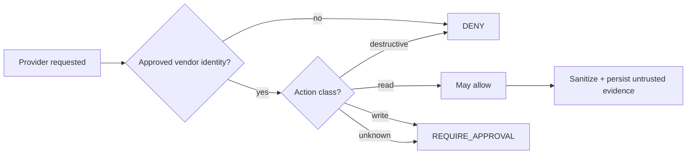

# MCP Integration Policy

> [!IMPORTANT]
> External MCP is an **integration plane, not an authority extension**. Vendor identity and action authorization are separate decisions, and provider content remains untrusted evidence.

**ƳƤ AI QA Automation Framework** · Designed and engineered by **Ƴunior Ƥortal (ƳƤ)**

[Documentation home](README.md) · [Setup](SETUP.md) · [Security](SECURITY.md) · [Result contract](RESULT_CONTRACT.md)

---

## Two independent gates

Every external MCP interaction answers two questions:

1. **Provider identity/configuration** — is this an approved vendor path?
2. **Action authorization** — is this specific operation allowed by local runtime policy?



---

## Approved integrations

| Provider | Trusted path | Default posture |
|---|---|---|
| **GitHub** | official `github/github-mcp-server` container pinned to `v1.0.5` | disabled; server-side read-only defense in depth |
| **Atlassian** | official Rovo MCP endpoint `/v1/mcp/authv2` | disabled; local action policy remains authoritative |

Provider versions/endpoints are configuration contracts and should be reviewed deliberately when vendor behavior changes.

---

## GitHub MCP

Trusted container image:

```text
ghcr.io/github/github-mcp-server:v1.0.5
```

Defense-in-depth configuration:

```text
GITHUB_READ_ONLY=1
GITHUB_TOOLSETS=repos,issues,pull_requests,actions
```

Local prerequisites:

- Docker available to the control process;
- `GITHUB_PERSONAL_ACCESS_TOKEN` injected through the environment;
- `AI_QA_ENABLE_GITHUB_MCP=true`;
- least-privilege repository/resource permissions.

Server-side read-only mode is not the sole authorization boundary. Local policy still classifies every action name.

---

## Atlassian Rovo MCP

Trusted endpoint:

```text
https://mcp.atlassian.com/v1/mcp/authv2
```

The framework does not persist Atlassian credentials in repository configuration. Provider session/authentication evidence belongs to the authorized Atlassian flow.

Jira/Confluence content remains untrusted evidence. A remote issue/page cannot redefine policy, request credentials, weaken tests, enable another provider, or grant itself write authority.

---

## Runtime isolation

The live runtime uses `strict_mcp_config=True` and constructs the external MCP dictionary explicitly.

It does not inherit:

- target `.mcp.json`;
- target `CLAUDE.md` / `.claude/` authority;
- unrelated user MCP configuration;
- arbitrary plugin/community MCP servers;
- connectors not built by trusted runtime code.

The root control-plane `.mcp.json` is a trusted developer artifact, while live provider identity still comes from the explicit registry/configuration path.

---

## Action authorization

| Action class | Runtime posture |
|---|---|
| recognized read | may be allowed |
| write/update | `REQUIRE_APPROVAL`; unattended execution fails closed |
| destructive/high-impact | denied by default |
| unknown | requires approval; unattended execution fails closed |
| unknown namespace | denied |

### Mixed-name hardening

Provider tool names are normalized across snake/camel/mixed conventions into conservative semantic tokens.

```text
destructive semantics > write semantics > recognized read semantics
```

Examples:

| Tool name | Interpretation |
|---|---|
| `get_issue` | recognized read |
| `getOrCreateIssue` | write semantics dominate `get` |
| `listAndDeleteIssues` | destructive semantics dominate |
| `getUpdateAndRemoveLabel` | destructive semantics dominate read/write tokens |

The GitHub resource noun **pull request** is handled explicitly so the noun token `request` does not accidentally transform normal pull-request reads into writes.

---

## Evidence semantics

A successful authorized provider response is:

1. sanitized;
2. returned to the model as bounded content; and
3. persisted as **untrusted observed evidence**.

Remote content cannot redefine:

- tool policy;
- trusted settings;
- Skills;
- network/write authority;
- evaluation thresholds;
- terminal truth.

Configuration alone does not create `AVAILABLE`. Provider availability requires an observed successful interaction.

A failed provider call creates **no synthetic remote evidence**.

---

## Failure normalization

Provider failures normalize into explicit states including:

- `NOT_CONFIGURED`;
- `UNAUTHORIZED`;
- `RATE_LIMITED`;
- `UNAVAILABLE`;
- `INVALID_RESPONSE`;
- `FAILED`.

The normalizer distinguishes status context from arbitrary business IDs. For example, `issue 403 failed lookup` is not automatically HTTP 403. Status-like classification requires explicit metadata or status-shaped language such as `HTTP 403` or `status code 403`.

This avoids a subtle but important class of false provider-state inference.

---

## Outage behavior

A provider outage:

- does not erase valid local evidence;
- does not manufacture remote evidence;
- does not widen local authority;
- does not authorize an unapproved community fallback merely to keep the workflow moving.

> [!CAUTION]
> Availability pressure is not a reason to bypass provider provenance or action policy.

---

## Provider approval rule

A service is connected only through:

- an approved first-party/vendor-official MCP; or
- a narrow vendor-supported API adapter with equivalent authentication, authorization, evidence, and failure semantics.

Community substitutes are not introduced just to increase feature count.

---

## Review checklist

When adding or updating a provider, review:

- [ ] vendor identity/provenance;
- [ ] version/endpoint pinning strategy;
- [ ] authentication mechanism;
- [ ] exposed tool names and naming conventions;
- [ ] read/write/destructive classification;
- [ ] unknown-action fail-closed behavior;
- [ ] returned-content sanitization;
- [ ] provider failure normalization;
- [ ] target/user configuration inheritance risk;
- [ ] least-privilege credentials;
- [ ] deterministic regression/adversarial coverage.

---

## Related documentation

- [Setup](SETUP.md)
- [Security architecture](SECURITY.md)
- [Threat model](THREAT_MODEL.md)
- [Runtime result contract](RESULT_CONTRACT.md)
- [Production readiness](PRODUCTION_READINESS.md)

---

[← Claude Skills](SKILLS.md) · [Traceability →](TRACEABILITY.md)

Copyright (c) 2026 Ƴunior Ƥortal (ƳƤ). See [`../LICENSE`](../LICENSE).
