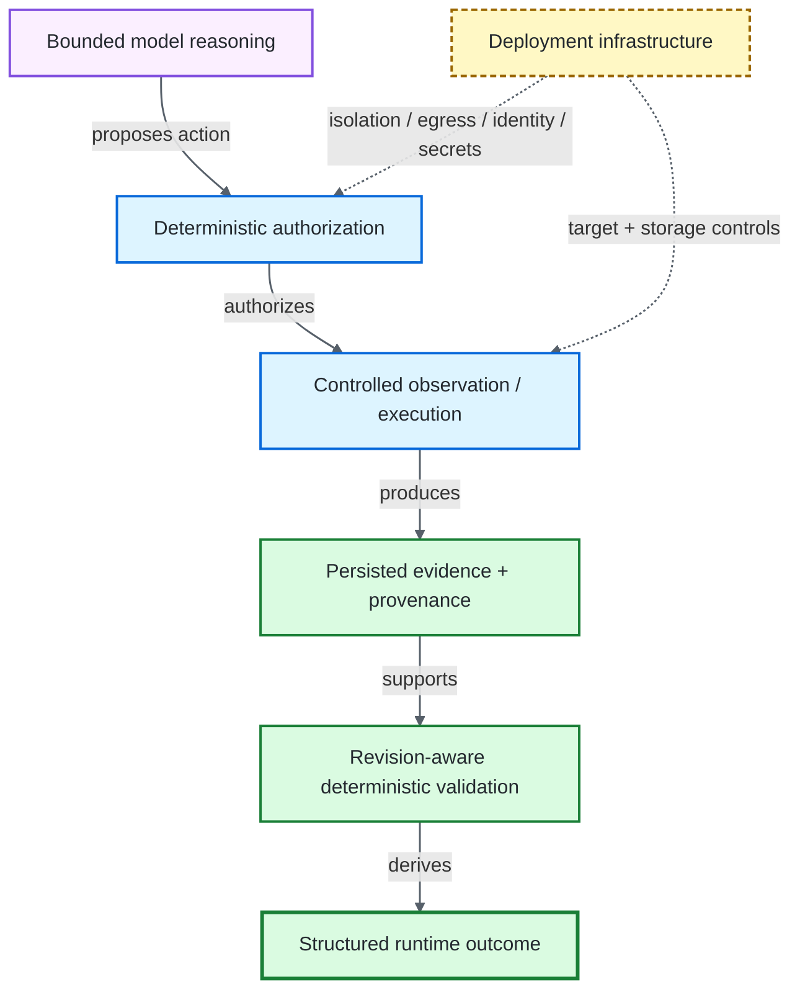

# Production Readiness Architecture

> [!IMPORTANT]
> Production readiness in an agentic QA system is a property of the **control system around the model**, not of model fluency. Authority, evidence, execution boundaries, validation, recovery, security, and deployment discipline remain independently owned.

**ƳƤ AI QA Automation Framework** · Designed and engineered by **Ƴunior Ƥortal (ƳƤ)**

[Documentation home](README.md) · [Architecture](ARCHITECTURE.md) · [Security](SECURITY.md) · [Verification boundaries](VERIFICATION_BOUNDARIES.md)

---

## Readiness thesis

> **Claude may reason about quality; deterministic controls and observed evidence govern quality decisions.**

The framework intentionally separates concerns that conventional AI agents often blur together.

| Concern | Primary owner | Non-negotiable rule |
|---|---|---|
| **Reasoning** | Claude | may interpret evidence and choose among authorized next actions |
| **Authority** | policy + hooks + runtime control | decides whether an action is permitted |
| **Observation** | controlled tools | produces evidence from the target/provider/runtime |
| **Validation** | deterministic gates | proves or disproves claims for a scope/revision |
| **Mutation integrity** | transaction + workspace ownership | prevents stale, concurrent, unsupported, or unsafe writes |
| **Terminal truth** | result contract | derives runtime outcome from current deterministic lineage |
| **Deployment assurance** | infrastructure / organization | owns isolation, egress, identity, secrets, retention, target access |

A persuasive model response cannot substitute for a lower layer.

---

## Production control stack



**Control key:** purple = advisory reasoning · blue = deterministic authority/execution · green = evidence and validation · amber dashed = independently owned deployment enforcement. Labels preserve meaning without relying on color.

### 1. Agent orchestration

- official Claude Agent SDK orchestration;
- pinned SDK dependency and explicit default model identifier;
- bounded turns and model cost;
- trusted project configuration root;
- exactly five trusted Skills;
- explicit internal QA tool inventory;
- strict external MCP configuration;
- structured final reporting.

### 2. Deterministic runtime authority

- fail-closed tool authorization;
- explicit denial of generic Bash/Edit/Write/Web-style authority;
- deterministic PreToolUse/PostToolUse/failure hooks;
- approval-required actions denied during unattended execution;
- protected governance/security paths;
- network, method, path, provider, and performance-target policy outside model judgment;
- independent tool/network/mutation/repetition/time/cost budgets and per-tool circuits.

### 3. Evidence provenance

- typed evidence records;
- `OBSERVED_FACT` separated from `MODEL_INTERPRETATION`;
- run-scoped immutable evidence identities;
- content-addressed artifacts and manifests;
- text sanitization/redaction on supported persistence/model paths;
- binary evidence explicitly labeled `RAW`;
- provider failures recorded without fabricating remote evidence.

### 4. Runtime truth

[`RESULT_CONTRACT.md`](RESULT_CONTRACT.md) is authoritative.

Important properties:

- model/session completion is necessary but not sufficient for `SUCCESS`;
- missing deterministic validation resolves to `NOT_VERIFIED`;
- current definitive FAIL remains failure;
- same-gate same-revision PASS/FAIL is contradictory and remains unverified;
- historical evidence cannot certify newer bytes;
- changed live autonomous tests require patch-safety PASS, **targeted pytest bound to the exact changed path**, and full-regression PASS at the current revision;
- provider availability is independent from QA terminal truth.

### 5. Autonomous mutation safety

- test writes disabled unless explicitly enabled;
- live autonomous commit authority restricted to Python test paths the controlled pytest runner can validate;
- target must be a Git-backed isolated worktree;
- OS-backed workspace lease establishes cooperating-process ownership;
- content-sensitive fingerprint detects out-of-band drift;
- path traversal/escape/symlink ambiguity rejected;
- one mutation transaction open at a time;
- trusted rollback snapshots hash-bound outside the SUT;
- rollback directories/backups protected against symlink substitution;
- newer human/out-of-band work wins over stale automatic rollback.

### 6. Safe self-healing

Locator maintenance requires more than “the new selector works.” Authorization requires:

- compatible deterministic failure classification;
- same-DOM Playwright measurement;
- candidate uniqueness;
- supported locator syntax;
- policy-owned stability scoring;
- deterministic semantic-intent overlap;
- exact target file/hash binding;
- locator-only mutation semantics;
- current-revision deterministic closure if the live runtime is authorized to write the path.

Model-supplied confidence is never mutation authority.

### 7. Coverage-aware generation

```text
observed repository coverage
→ deterministic candidate gaps
→ same-run interpreted plan
→ unsupported “already covered” claims cannot suppress candidates
→ guarded creation
→ deterministic test-quality review
→ exact-path targeted execution
→ regression closure
```

Reusable generation/patch components may understand Python/JavaScript/TypeScript syntax, while live autonomous commit authority remains intentionally narrower where deterministic execution proof is pytest-backed.

### 8. Change intelligence

Deterministic bootstrap can establish:

- explicit base-ref and merge-base provenance;
- committed + dirty + untracked change union;
- risk-domain classification;
- repository/test topology;
- dependency inventory and hashes;
- CODEOWNERS routing;
- explainable test-impact candidates;
- conservative OpenAPI/Swagger compatibility drift.

Incomplete mapping increases caution. It never becomes evidence that omitted testing is safe.

### 9. Network and external-system safety

- external network disabled unless explicitly enabled;
- trusted host configuration is exact hostname/IP only;
- wildcard, URL, port, path, scoped-IPv6, and malformed dotted-IP ambiguity rejected;
- API probes read-only by default;
- browser HTTP(S)/WebSocket activity constrained by the same host policy;
- ambient proxy inheritance avoided in controlled paths;
- GitHub and Atlassian MCP use approved vendor paths;
- provider identity separated from action authorization;
- mixed/unknown external actions fail closed or require approval;
- remote content remains untrusted evidence.

### 10. Performance safety

Every k6 workload requires:

- an explicit HTTP(S) target;
- recognized non-production classification;
- production-like hostname denial even if metadata claims QA/staging;
- target host authorization;
- injected `BASE_URL` / `TARGET_URL` consumption;
- bounded local module analysis;
- remote-module / `k6/x/*` / local-file-read / unsupported-import / unrelated-literal-host rejection;
- predefined metric thresholds;
- **deployment-level egress enforcement asserted as a prerequisite for every run**.

Static JavaScript inspection is defense in depth, not a sandbox.

### 11. Reliability and recovery

- exclusive workspace lease with trusted lease-path ownership;
- atomic canonical/process state persistence;
- append-only hash-chained journal with symlink-resistant ownership;
- rollback-backed mutation transactions;
- stale recovery only under exact fingerprint/path/backup ownership;
- recovery inspection uses the same exact-path validation bar as terminal truth;
- recovery never claims hidden model-conversation replay.

### 12. Traceability and attestation

A run can persist:

- run/session identity;
- target Git provenance;
- model/SDK/configuration provenance;
- structured runtime events;
- evidence/artifact manifests;
- validation lineage;
- journal linkage;
- token/cost data when supplied by the provider;
- unsigned content-integrity attestation;
- optional regulated engineering traceability records.

An attestation can report `integrity_verified` only when core persisted subjects are owned files, the journal chain is valid, no mutation is pending, and registered artifact bytes still match their recorded hashes.

> [!CAUTION]
> Integrity is not identity, signing, correctness, compliance, or deployment assurance.

---

## Evaluation architecture

The repository treats evaluation as part of the system design and keeps evidence classes distinct.

| Layer | Purpose |
|---|---|
| **Unit tests** | schemas, policy, evidence, redaction, state, intelligence, budgets, recovery |
| **Deterministic integration tests** | runtime/evidence/reference-SUT behavior |
| **Policy/security tests** | authority, path, network, mutation, fail-closed boundaries |
| **Primary evaluator** | fixed 34-case deterministic functional/adversarial control corpus with 34 unique registered evaluator identities |
| **H-series readiness** | six repository-visible deterministic cases sequestered from routine primary execution |
| **Browser-marked tests** | Playwright-backed browser behavior |
| **Model-marked tests** | credentialed Claude Agent SDK behavior |

The H-series remains committed repository content and therefore is not blind, unseen, or independent evidence merely because its execution is separated. Likewise, deterministic direct-authorization-policy cases cover the complete seven-case registered denominator (24, 26, 27, and 31–34) and prove only those concrete source-agnostic authorization calls; the prompt-boundary case proves the exact repository-owned prompt rule. Neither establishes source-provenance enforcement or model prompt-injection resistance without a path that actually carries provenance or executes the credentialed model.

Hard-safety expectations and schema-v3 numerical acceptance bars are defined before execution and must not be weakened to accommodate a failing implementation. Schema 3 changes evaluator/metric naming and direct-authorization denominator accounting to match execution semantics; the numerical bars are unchanged.

---

## Deployment contract

| Framework-owned | Deployment-owned |
|---|---|
| tool/action authorization | process/container/VM isolation |
| application host/method policy | firewall/proxy/egress enforcement |
| credential-minimal subprocess env | organization secret manager + rotation |
| target workspace confinement | filesystem/container/Kubernetes policy |
| evidence hashing/redaction semantics | artifact encryption/access/retention |
| provider action policy | identity/OAuth/token lifecycle + org permissions |
| load-target policy and egress prerequisite | actual approved load environment + network controls |
| Appium capability boundary | device/emulator/cloud provisioning + app signing |
| unsigned content-integrity attestation | external signing/identity/timestamping where required |

Neither side is silently treated as proof of the other.

---

## Principal-level red-team questions

A mature production review should be able to answer these without appealing to “the model should know better”:

- Can a model response become PASS without deterministic evidence?
- Can a targeted test of the wrong file certify a mutation?
- Can model-reported coverage suppress a required generation scenario without repository evidence?
- Can a JavaScript/TypeScript write be committed through a pytest-only closure path?
- Can target `CLAUDE.md`, `.claude/`, `.mcp.json`, DOM, logs, or provider content redefine authority?
- Can a mixed MCP action hide a write/delete behind a read-looking prefix?
- Can a symlink redirect target mutation, rollback, journal, lease, or artifact verification?
- Can a stale rollback overwrite newer human work?
- Can same-revision retries hide contradiction?
- Can a provider outage manufacture remote evidence?
- Can a clean feature branch hide committed change risk from a worktree-only scan?
- Can a production-like load target be disguised with friendly environment metadata?
- Can dynamic k6 JavaScript escape the declared target without infrastructure egress containment?
- Can an intact journal coexist with tampered registered artifacts and still produce an integrity-verified attestation?
- Can one resource dimension be exhausted through another unbounded path?

A material weakness should produce a narrower deterministic control, a regression/security test, an adversarial evaluation, or an explicit deployment boundary—not stronger prompt wording alone.

---

## CI/CD execution design

`.github/workflows/ci.yml` retains ordinary event triggers in source plus fixed trusted `repository_dispatch`, but the observed external Actions Policy permits only owner-authorized `trusted-pr-validation` dispatch for the protected identity. Validation jobs are read-only, contain no secret references, disable persisted checkout credentials, and verify the exact selected prospective merge subject before executing project code.

The trusted validation path covers quality/full deterministic pytest, the 34-case primary evaluator, security scanning, supply-chain/SBOM/repeatability/container evidence, and deterministic Playwright reference-SUT coverage. `Required PR Gate` uses `if: always()` and fails unless every prerequisite succeeds; it is internal aggregate evidence, while protected merge authority is the separately published `Trusted PR Gate` after live subject revalidation.

`.github/workflows/manual-validation.yml` is `workflow_dispatch` only and remains outside protected merge evidence. The observed `repository_dispatch`-only policy prevents it from executing under the same protected identity, so repository-visible H-series readiness and credentialed Agent SDK smoke require a separately trusted execution mechanism or equivalent deliberate policy change; the credential remains step-scoped when that path is executable.

`scripts/verify_ci_contract.py` deterministically checks the repository-owned workflow authority model and emits machine-readable evidence during trusted supply-chain execution. That verifier does not prove the live external Actions Policy or protected ruleset; those platform settings remain separately observed authority. See [CI/CD and Repository Governance](CI_CD.md).

---

## Related documentation

- [Architecture](ARCHITECTURE.md)
- [CI/CD and repository governance](CI_CD.md)
- [Runtime result contract](RESULT_CONTRACT.md)
- [Runtime control and recovery](RUNTIME_CONTROL.md)
- [Security architecture](SECURITY.md)
- [Threat model](THREAT_MODEL.md)
- [Evaluation architecture](EVALUATION.md)
- [Verification boundaries](VERIFICATION_BOUNDARIES.md)
- [Technical walkthrough](TECHNICAL_WALKTHROUGH.md)

---

[← Documentation home](README.md) · [Verification boundaries →](VERIFICATION_BOUNDARIES.md)

Copyright (c) 2026 Ƴunior Ƥortal (ƳƤ). See [`../LICENSE`](../LICENSE).
