# Runtime Result Contract

> [!IMPORTANT]
> **Runtime outcomes are derived from deterministic policy, observed evidence, subject-bound validation lineage, and integrity state.**

**ƳƤ AI QA Automation Framework** · Designed and engineered by **Ƴunior Ƥortal (ƳƤ)**

[Documentation home](README.md) · [Architecture](ARCHITECTURE.md) · [Runtime control](RUNTIME_CONTROL.md) · [Traceability](TRACEABILITY.md)

---

The framework separates **what a model says** from **what the system can prove**. A fluent answer, confident diagnosis, green-looking retry, or successful Agent SDK result subtype never becomes a verified QA outcome by itself.

This document is the authoritative semantic contract for live terminal, validation, and provider outcomes.

## Decision hierarchy

```text
trusted policy / runtime invariants
        ↓
observed evidence
        ↓
deterministic validation lineage
        ↓
model interpretation / proposed action
        ↓
structured terminal report
```

Model reasoning can influence **what to investigate next**. It cannot redefine policy, convert missing evidence into PASS, erase contradictory validation, or certify its own mutation.

## Terminal outcomes

| Outcome | Meaning |
|---|---|
| `SUCCESS` | Agent execution completed successfully and every active deterministic gate required by the current revision or objective closed. |
| `FAILURE` | A current deterministic validation actually failed, the Agent SDK returned a non-success subtype, or another definitive execution failure occurred. |
| `BLOCKED` | A deterministic safety/integrity prerequisite prevented safe continuation. |
| `INSUFFICIENT_EVIDENCE` | Available evidence cannot support a reliable causal conclusion. |
| `POLICY_DENIED` | The requested action is outside authorized runtime policy. |
| `INFRASTRUCTURE_FAILURE` | Runtime integrity cannot be guaranteed, including rollback-integrity failure. |
| `CANCELLED` | Execution ended before deterministic completion because cancellation was requested. |
| `BUDGET_EXCEEDED` | An independent execution budget was exhausted. |
| `NOT_VERIFIED` | Evidence is absent, incomplete, stale, contradictory, unbound to the objective, or validator execution was inconclusive. |

`NOT_VERIFIED` is deliberately different from `FAILURE`: it means the framework refuses to invent certainty where the validation record does not justify it.

## Validation outcomes

| Outcome | Meaning |
|---|---|
| `PASS` | The gate executed for its bound subject/scope/revision and satisfied its deterministic condition. |
| `FAIL` | The gate executed and its deterministic condition actually failed. |
| `NOT_EXECUTED` | No execution record exists for the relevant decision. |
| `NOT_OBSERVED` | A required observation was not captured. |
| `NOT_VERIFIED` | Evidence exists but does not close the gate, including validator/infrastructure outcomes that did not produce a trustworthy assertion result. |
| `BLOCKED` | Policy, environment, integrity, or another prerequisite prevented safe execution. |

None of the non-PASS outcomes is promoted by model judgment. Infrastructure/tool uncertainty is not relabeled as product failure merely because a validator process returned nonzero.

An unexpected exception from an internal **validation-bearing** tool is itself current-revision validation uncertainty. `PostToolUseFailure` therefore records a sanitized `NOT_VERIFIED` lineage item keyed by the tool and a hash of its sanitized request. This marker is intentionally not erased by an older PASS at the same revision: an unexplained validator crash cannot be hidden by earlier green evidence. Failures of advisory-only tools and external-provider reads retain their own diagnostic/provider semantics and do not fabricate deterministic validation outcomes.

### Objective binding across revisions

A set of unrelated green checks does not prove that the requested objective succeeded. For every `change_revision`, terminal `SUCCESS` requires an operator-supplied exact objective-validation gate contract and an active deterministic PASS whose gate identity matches that contract **at the current revision**.

When autonomous mutation advances `change_revision`, objective evidence from an older revision is stale for terminal authority even if that older PASS remains part of the historical validation record. The objective gate must be re-executed for the post-mutation subject/revision before those newer bytes can reach `SUCCESS`.

For changed revisions, objective closure and mutation closure are independent, additive predicates. Patch-safety, exact-path targeted pytest, trusted out-of-process targeted executed-test outcome evidence, and independently trusted full-regression executed-test semantics can close the mutation transaction, but they do not become objective proof unless the operator independently supplied that exact gate identity as the objective contract and the matching PASS is current-revision evidence. If no current objective-specific deterministic PASS exists, the correct terminal state is `NOT_VERIFIED` even when every mutation-closure gate is green.

This prevents a model from selecting an easy but irrelevant validation or mutation merely to satisfy a mechanical “some gate passed” condition.

### Pytest exit semantics

Pytest process exit is interpreted only within the authority available for the requested scope:

- ordinary diagnostic/read-only exit `0` can produce validation `PASS`, subject to workspace-integrity and binding rules;
- exit `1` is validation `FAIL` when trustworthy execution proves tests actually failed;
- timeout, interruption, internal error, command-line usage error, no-tests-collected, workspace-integrity failure, and other abnormal exits are `NOT_VERIFIED`;
- an exit `0` from a changed-test targeted or full-regression run is **not** by itself executed-test semantic authority.

The controlled pytest adapter also fingerprints the Git-backed target immediately before and after execution. A zero pytest exit cannot remain authoritative if target tests changed the repository, changed Git `HEAD`, or made the workspace fingerprint incomplete. Subprocess output is continuously drained into bounded tails, and validator descendants are cleanup-scoped so target code cannot certify itself while leaving background execution attached to the run.

For a **full-regression** run, the controller still materializes the exact provenance-bound pytest execution subject and performs bounded pre-collection, execution, and post-collection phases against that same frozen tree. The diagnostic suite identity binds the target Git SHA and workspace fingerprint, frozen-subject digest, pytest version, active pytest configuration bytes and relevant discovery/selection semantics, every admitted `conftest.py` path/content digest, and the ordered collected node IDs. The controller supplies an explicit repository-root `.` selector so target `testpaths` cannot silently redefine the regression root; other admitted target configuration remains active and is part of the bound subject rather than being silently discarded.

Those collection and transcript checks do **not** prove full-regression executed-test semantics. Collection, terminal node lines, pytest hooks, and process exit are produced inside the untrusted target interpreter. A hostile target-owned `conftest.py` can override `pytest_runtestloop`, emit plausible `<nodeid> PASSED` terminal lines, execute zero test bodies, and return exit `0`. Therefore the live adapter records `regression_execution_authority="unavailable"`, `regression_outcome_report_verified=false`, and no authoritative `regression_suite_id`; a successful-looking full-regression run remains `NOT_VERIFIED` for mutation closure until a genuinely independent observer proves regression execution semantics. The frozen subject, collection manifests, pre/run/post reconciliation, sandbox evidence, and raw process results remain valuable diagnostics and integrity evidence only.

For a **targeted changed-test closure** gate, a zero pytest exit is likewise insufficient. Target test code executes inside the pytest interpreter and cannot authoritatively report that its own intended call-phase test actually executed. Mutation closure therefore requires a separate trusted out-of-process observer bound to the exact mutated path and execution subject. The current live `run_pytest` adapter deliberately records `targeted_execution_authority="unavailable"` and `targeted_outcome_report_verified=false`; it does not manufacture the reserved trusted-observer authority from target-controlled stdout, hooks, files, inherited descriptors, or same-interpreter state.

---

## Revision-aware truth

Autonomous mutation advances `change_revision`. Validation is revision-bound so evidence from older bytes cannot silently certify newer bytes.

A live autonomous mutation is deliberately constrained to the Python/pytest execution path. For a changed test's **mutation transaction** to close, the current revision requires all four conditions:

1. **patch-safety PASS** bound to the exact changed path;
2. **targeted pytest PASS** that explicitly selects that same pending mutation path;
3. **trusted out-of-process targeted executed-test outcome evidence** proving at least one successful call-phase execution from that exact mutated path and bound execution subject; and
4. **independently trusted full-regression executed-test semantic PASS** bound to the exact run/revision/frozen execution subject and admitted regression invocation.

Those four gates prove mutation closure only. Terminal `SUCCESS` for the changed revision additionally requires the exact operator-supplied objective-validation gate to have an active PASS at that same revision. Neither predicate substitutes for the other.

A selector such as:

```text
tests/test_checkout.py::test_checkout_success
```

can bind diagnostic targeted validation to `tests/test_checkout.py`. A `-k` expression with no explicit file selector, or a run targeting another test file, cannot certify those changed bytes; it is diagnostic evidence only. Even an exact-path targeted exit `0` cannot close the mutation without the independent trusted executed-test outcome authority.

> [!CAUTION]
> “Targeted” is not a synonym for “relevant,” “regression transcript reconciled” is not a synonym for “tests executed,” and “pytest exited 0” is not a synonym for “trusted executed-test proof.” Mutation commit requires deterministic subject binding plus independently trusted targeted **and** regression execution semantics.

The current live adapter emits neither trusted targeted semantics nor trusted full-regression semantics. Consequently a positive autonomous test mutation remains unclosed/`NOT_VERIFIED` and subject to rollback until the separate observer authority tracked by #118 is integrated. This fail-closed liveness limitation must not be bypassed by locator healing, generated-test logic, model interpretation, legacy regression-suite dictionaries, or target-controlled pytest transcripts.

A failed gate remains active until the **same gate identity** is superseded by evidence at a newer revision. Re-running a different selector cannot erase the original failure.

If PASS and FAIL are both observed for the same gate at the same revision, the evidence is contradictory and terminal truth resolves to `NOT_VERIFIED` rather than selecting the more convenient observation. Future independently trusted regression evidence must likewise remain single-subject and non-ambiguous before it can close a mutation.

### Locator-repair authority is not revision closure

A `locator_repair:<sha256>` PASS authorizes only evaluation/application of one narrowly bound locator mutation. Its subject binds the exact failing targeted-pytest validation and failure evidence, the failure-observed Git SHA/workspace fingerprint, test path and file digest, original locator occurrence, exact browser verification and same-DOM context, current revision, and classification computed only from that evidence subset.

Proposal cannot introduce a new target path/hash/original locator after browser verification, and apply revalidates the same subject before writing. Workspace or revision drift invalidates unused proposal authority even when target-file SHA remains unchanged. This prevents cross-test and cross-revision repair reuse.

After a locator patch is applied, only patch-safety evidence exists for the new revision. The four mutation-closure requirements above still apply in full. A repair subject, browser PASS, or model-approved healing proposal cannot stand in for trusted targeted execution or trusted regression execution semantics.

## Mutation transaction semantics

```mermaid
stateDiagram-v2
    accTitle: Revision-bound mutation transaction from authorization through rollback-backed validation closure
    accDescr: An authorized mutation receives an owned rollback snapshot and enters a pending state. Exact-path patch safety, exact-path targeted pytest plus trusted out-of-process targeted outcome authority, and independently trusted full-regression executed-test semantics must all pass before commit; failures or incomplete closure route to rollback, and unprovable rollback ownership or integrity escalates to infrastructure failure.

    [*] --> Authorized
    Authorized --> Pending: owned rollback snapshot
    Pending --> PatchSafe: exact-path patch safety PASS
    PatchSafe --> TargetedExit: exact-path targeted pytest PASS
    TargetedExit --> TrustedTargeted: trusted targeted call-phase outcome
    TrustedTargeted --> RegressionDiagnostic: frozen regression execution + diagnostics
    RegressionDiagnostic --> TrustedRegression: independent regression semantic PASS
    TrustedRegression --> Committed: revision closed

    Pending --> Rollback: failure / incomplete closure
    PatchSafe --> Rollback
    TargetedExit --> Rollback
    TrustedTargeted --> Rollback
    RegressionDiagnostic --> Rollback
    TrustedRegression --> Rollback
    Rollback --> IntegrityFailure: rollback ownership/hash cannot be proven
```



A permitted write is not immediately trusted. Any path that fails to establish deterministic closure returns through rollback. If rollback ownership or integrity cannot be guaranteed, the framework escalates to `INFRASTRUCTURE_FAILURE` rather than overwriting data optimistically.

Crash recovery applies the same ownership standard: exact workspace fingerprint, confined non-symlink paths, owned rollback directory/backup, and verified original bytes are required before stale restoration can touch the target.

## Performance-validator truth

A k6 workload can produce PASS/FAIL only after the controlled runner successfully parses every required measurement used by the configured thresholds. Missing or malformed summary metrics, a missing k6 runtime, timeout, process failure, malformed summary JSON, or another runner/infrastructure failure resolves to `NOT_VERIFIED`; it is not a synthetic performance regression.

A measured threshold breach is `FAIL`. A successfully measured run satisfying every configured threshold is `PASS`. Every k6 invocation additionally requires a non-production target policy decision and an independently enforced infrastructure-level egress prerequisite.

## Recovery truth

`ai-qa recover` uses the same closure rule as terminal execution. A persisted changed revision is considered closed only when:

- one exact patch-safety target exists;
- targeted pytest is explicitly bound to that target;
- trusted out-of-process targeted executed-test outcome evidence proves successful call-phase execution from that exact target;
- independently trusted full-regression executed-test semantic evidence proves the exact admitted regression subject; and
- no pending mutation remains.

Legacy `regression_suite_verified` dictionaries, reconciled target-owned node transcripts, and exit `0` remain diagnostic persisted evidence and cannot make recovery report a changed revision as closed.

Persisted state/runtime metadata, journal records, registered artifacts, and attestation/recovery ingestion are byte-bounded before parsing or hashing. Oversized/corrupted persisted material therefore cannot be treated as successful recovery evidence simply because it exists.

Recovery does not reconstruct a previous hidden model conversation. It evaluates persisted state and determines whether a **new** session can safely start from that evidence.

---

## External integration outcomes

Provider health is independent from QA terminal truth:

| Provider outcome | Meaning |
|---|---|
| `AVAILABLE` | An authorized provider interaction was successfully observed. |
| `NOT_CONFIGURED` | The provider is not enabled/configured for the runtime. |
| `UNAUTHORIZED` | Authentication or authorization was rejected. |
| `RATE_LIMITED` | The provider reported throttling. |
| `UNAVAILABLE` | Transport/provider availability prevented the operation. |
| `INVALID_RESPONSE` | The response could not be interpreted as the expected provider contract. |
| `FAILED` | The provider action failed without a more specific normalized class. |

Configuration presence alone does not manufacture `AVAILABLE`, and failed provider calls do not manufacture remote evidence.

Numeric business identifiers are not treated as HTTP status codes merely because they look like values such as `403` or `429`; failure normalization requires surrounding provider/transport semantics.

## Evidence classes

The framework keeps observation and interpretation distinct:

- `OBSERVED_FACT` — produced by controlled tooling or deterministic inspection;
- `MODEL_INTERPRETATION` — hypothesis, plan, proposal, ranking, or reasoning derived from evidence.

A model interpretation can reference observed evidence, but repetition or confidence cannot turn it into an observed fact.

This distinction is especially important for:

- locator semantic confidence;
- test-generation coverage interpretation;
- failure hypotheses;
- regression prioritization;
- external-provider content.

## Integrity versus correctness

Run integrity and QA correctness are separate dimensions.

`ai-qa attest` can verify:

- owned core persisted subjects;
- runtime journal hash-chain integrity;
- absence of a pending mutation; and
- SHA-256 integrity for every bounded artifact registered in the evidence manifest.

That integrity result does **not** override terminal truth.

> [!NOTE]
> An intact `FAILURE` remains a failure. An intact `NOT_VERIFIED` remains unverified. An unsigned digest remains unsigned.

## Final report provenance

The structured report carries the identifiers needed to reason about its conclusion, including:

- run ID and objective;
- terminal outcome and reason;
- deterministic validation results;
- evidence identifiers;
- failure classification/confidence when applicable;
- modified files after rollback accounting;
- model and Agent SDK identity;
- policy/tool-schema/configuration fingerprints;
- target Git SHA when observed.

## Core invariant

> **Unknown is not PASS. Validator uncertainty is not FAIL. Model completion is not PASS. An unrelated green gate is not objective success. A mutation proposal is not mutation closure. Configuration is not PASS. Historical evidence is not current-revision PASS. Integrity is not PASS. Target-controlled pytest transcript reconciliation is not executed-test authority. Only deterministic closure can produce verified success.**

---

Related: [`ARCHITECTURE.md`](ARCHITECTURE.md) · [`RUNTIME_CONTROL.md`](RUNTIME_CONTROL.md) · [`TRACEABILITY.md`](TRACEABILITY.md) · [`VERIFICATION_BOUNDARIES.md`](VERIFICATION_BOUNDARIES.md)

[← Documentation home](README.md)

Copyright (c) 2026 Ƴunior Ƥortal (ƳƤ). See [`../LICENSE`](../LICENSE).
