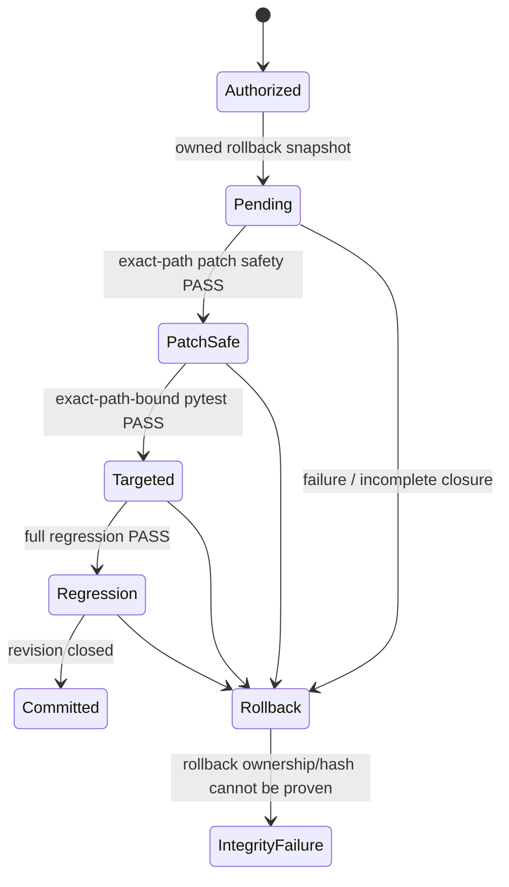

# Runtime Result Contract

> **ƳƤ AI QA Automation Framework** · Designed and engineered by **Ƴunior Ƥortal (ƳƤ)**

The framework separates **what a model says** from **what the system can prove**. A fluent answer, confident diagnosis, green-looking retry, or successful Agent SDK result subtype never becomes a verified QA outcome by itself.

> [!IMPORTANT]
> **Runtime outcomes are derived from deterministic policy, observed evidence, subject-bound validation lineage, and integrity state.**

This document is the authoritative semantic contract for live terminal, validation, and provider outcomes.

## Decision hierarchy

```text
trusted policy / runtime invariants
        ↓
observed evidence
        ↓
deterministic validation lineage
        ↓
model interpretation / proposed action
        ↓
structured terminal report
```

Model reasoning can influence **what to investigate next**. It cannot redefine policy, convert missing evidence into PASS, erase contradictory validation, or certify its own mutation.

## Terminal outcomes

| Outcome | Meaning |
|---|---|
| `SUCCESS` | Agent execution completed successfully and every active deterministic gate required by the current revision closed. |
| `FAILURE` | A current deterministic validation failed, the Agent SDK returned a non-success subtype, or another definitive execution failure occurred. |
| `BLOCKED` | A deterministic safety/integrity prerequisite prevented safe continuation. |
| `INSUFFICIENT_EVIDENCE` | Available evidence cannot support a reliable causal conclusion. |
| `POLICY_DENIED` | The requested action is outside authorized runtime policy. |
| `INFRASTRUCTURE_FAILURE` | Runtime integrity cannot be guaranteed, including rollback-integrity failure. |
| `CANCELLED` | Execution ended before deterministic completion because cancellation was requested. |
| `BUDGET_EXCEEDED` | An independent execution budget was exhausted. |
| `NOT_VERIFIED` | Evidence is absent, incomplete, stale, contradictory, or insufficient to prove success. |

`NOT_VERIFIED` is deliberately different from `FAILURE`: it means the framework refuses to invent certainty where the validation record does not justify it.

## Validation outcomes

| Outcome | Meaning |
|---|---|
| `PASS` | The gate executed for its bound subject/scope/revision and satisfied its deterministic condition. |
| `FAIL` | The gate executed and failed its deterministic condition. |
| `NOT_EXECUTED` | No execution record exists for the relevant decision. |
| `NOT_OBSERVED` | A required observation was not captured. |
| `NOT_VERIFIED` | Evidence exists but does not close the gate. |
| `BLOCKED` | Policy, environment, integrity, or another prerequisite prevented safe execution. |

None of the non-PASS outcomes is promoted by model judgment.

---

## Revision-aware truth

Autonomous mutation advances `change_revision`. Validation is revision-bound so evidence from older bytes cannot silently certify newer bytes.

A live autonomous mutation is deliberately constrained to the Python/pytest execution path. For a changed test to close, the current revision requires all three conditions:

1. **patch-safety PASS** bound to the exact changed path;
2. **targeted pytest PASS** that explicitly selects that same pending mutation path; and
3. **full-regression pytest PASS** at that revision.

A selector such as:

```text
tests/test_checkout.py::test_checkout_success
```

can bind validation to `tests/test_checkout.py`. A `-k` expression with no explicit file selector, or a run targeting another test file, cannot certify those changed bytes; it is diagnostic evidence only.

> [!CAUTION]
> “Targeted” is not a synonym for “relevant.” Mutation commit requires a deterministic subject binding to the exact file whose bytes are pending.

A failed gate remains active until the **same gate identity** is superseded by evidence at a newer revision. Re-running a different selector cannot erase the original failure.

If PASS and FAIL are both observed for the same gate at the same revision, the evidence is contradictory and terminal truth resolves to `NOT_VERIFIED` rather than selecting the more convenient observation.

## Mutation transaction semantics



A permitted write is not immediately trusted. Any path that fails to establish deterministic closure returns through rollback. If rollback ownership or integrity cannot be guaranteed, the framework escalates to `INFRASTRUCTURE_FAILURE` rather than overwriting data optimistically.

Crash recovery applies the same ownership standard: exact workspace fingerprint, confined non-symlink paths, owned rollback directory/backup, and verified original bytes are required before stale restoration can touch the target.

## Recovery truth

`ai-qa recover` uses the same closure rule as terminal execution. A persisted changed revision is considered closed only when:

- one exact patch-safety target exists;
- targeted pytest is explicitly bound to that target;
- full regression passed; and
- no pending mutation remains.

Recovery does not reconstruct a previous hidden model conversation. It evaluates persisted state and determines whether a **new** session can safely start from that evidence.

---

## External integration outcomes

Provider health is independent from QA terminal truth:

| Provider outcome | Meaning |
|---|---|
| `AVAILABLE` | An authorized provider interaction was successfully observed. |
| `NOT_CONFIGURED` | The provider is not enabled/configured for the runtime. |
| `UNAUTHORIZED` | Authentication or authorization was rejected. |
| `RATE_LIMITED` | The provider reported throttling. |
| `UNAVAILABLE` | Transport/provider availability prevented the operation. |
| `INVALID_RESPONSE` | The response could not be interpreted as the expected provider contract. |
| `FAILED` | The provider action failed without a more specific normalized class. |

Configuration presence alone does not manufacture `AVAILABLE`, and failed provider calls do not manufacture remote evidence.

Numeric business identifiers are not treated as HTTP status codes merely because they look like values such as `403` or `429`; failure normalization requires surrounding provider/transport semantics.

## Evidence classes

The framework keeps observation and interpretation distinct:

- `OBSERVED_FACT` — produced by controlled tooling or deterministic inspection;
- `MODEL_INTERPRETATION` — hypothesis, plan, proposal, ranking, or reasoning derived from evidence.

A model interpretation can reference observed evidence, but repetition or confidence cannot turn it into an observed fact.

This distinction is especially important for:

- locator semantic confidence;
- test-generation coverage interpretation;
- failure hypotheses;
- regression prioritization;
- external-provider content.

## Integrity versus correctness

Run integrity and QA correctness are separate dimensions.

`ai-qa attest` can verify:

- owned core persisted subjects;
- runtime journal hash-chain integrity;
- absence of a pending mutation; and
- SHA-256 integrity for every artifact registered in the evidence manifest.

That integrity result does **not** override terminal truth.

> [!NOTE]
> An intact `FAILURE` remains a failure. An intact `NOT_VERIFIED` remains unverified. An unsigned digest remains unsigned.

## Final report provenance

The structured report carries the identifiers needed to reason about its conclusion, including:

- run ID and objective;
- terminal outcome and reason;
- deterministic validation results;
- evidence identifiers;
- failure classification/confidence when applicable;
- modified files after rollback accounting;
- model and Agent SDK identity;
- policy/tool-schema/configuration fingerprints;
- target Git SHA when observed.

## Core invariant

> **Unknown is not PASS. Model completion is not PASS. Configuration is not PASS. Historical evidence is not current-revision PASS. Integrity is not PASS. Only deterministic closure can produce verified success.**

---

Related: [`ARCHITECTURE.md`](ARCHITECTURE.md) · [`RUNTIME_CONTROL.md`](RUNTIME_CONTROL.md) · [`TRACEABILITY.md`](TRACEABILITY.md) · [`VERIFICATION_BOUNDARIES.md`](VERIFICATION_BOUNDARIES.md)

[← Documentation home](README.md)

Copyright (c) 2026 Ƴunior Ƥortal (ƳƤ). See [`../LICENSE`](../LICENSE).
