# Runtime Control and Recovery

> [!IMPORTANT]
> **No autonomous mutation or recovery write proceeds unless the runtime can establish both ownership of the filesystem path and ownership of the workspace state.**

**ƳƤ AI QA Automation Framework** · Designed and engineered by **Ƴunior Ƥortal (ƳƤ)**

[Documentation home](README.md) · [Architecture](ARCHITECTURE.md) · [Result contract](RESULT_CONTRACT.md) · [Security](SECURITY.md)

---

Runtime safety is a deterministic subsystem, not a prompt convention. The framework separates QA decision state from process-control state so model/conversation failure cannot erase workspace ownership, mutation transactions, resource budgets, or journal facts.

That invariant applies during normal execution, transaction commit/rollback, crash recovery, recovery inspection, and integrity attestation.

## Workspace ownership

A live run acquires an OS advisory lease whose metadata lives beneath trusted artifact storage rather than inside the target repository. On platforms with descriptor-relative no-follow filesystem support, the runtime also pins the target workspace root to its `(device, inode)` identity and holds a non-blocking advisory lock on that directory inode. The second lock prevents replacement of `.leases/` from creating a second cooperating authority for the same still-open workspace object.

The lease path itself is part of the trust boundary:

- `.leases/` must not be a symlink;
- the lease-directory identity is pinned and revalidated during acquisition;
- the per-workspace lock file must not be a symlink;
- ownership is rechecked immediately before opening the file;
- `O_NOFOLLOW` and descriptor-relative opens are used when the operating system supports them;
- metadata is written through the locked file descriptor;
- the target workspace root is revalidated against its pinned identity before and after lease acquisition; and
- where descriptor-relative authority is available, the workspace directory inode remains locked for the lease lifetime in addition to the artifact-store lock file.

The lease prevents cooperating framework processes from simultaneously holding mutation authority over the same worktree, but it is only the first layer. Autonomous writes also require a Git-backed isolated target, a content-sensitive workspace fingerprint, descriptor-pinned target-path ownership, and unambiguous mutation provenance.

Trusted artifact storage remains a deployment-owned control-plane boundary. Repository code rejects ambiguous/symlinked control paths and validates persisted authority, but it does not claim to defend against an already-compromised operating-system account with arbitrary write authority over the trusted artifact root.

### Run-persistence-root authority

The run directory beneath trusted artifact storage is an authority-bearing subject distinct from the target workspace. On platforms with descriptor-relative no-follow support, a live run establishes one exact run-persistence-root `(device, inode)` identity when canonical state storage is created. That same identity is injected into canonical state, operational journal, process-control metadata, evidence/artifact persistence, and the workspace lease rather than letting each component independently trust the same pathname.

Authority-bearing I/O below that root is descriptor-confined or revalidated through the pinned root before success is returned. Nested artifact and rollback parents are therefore not allowed to redirect a successful read, append, publication, or closure merely because an ordinary directory was renamed and replaced without a symlink. If the rooted path no longer resolves to the authorized directory/entry after I/O, the operation fails closed; an already-published object may remain orphaned rather than being deleted through a now-ambiguous pathname.

The workspace lease durably records the current run-root identity for future stale recovery. On descriptor-capable platforms, automatic recovery of a prior run requires a valid lease-recorded prior run-root identity and an exact current `(device, inode)` match **before prior transaction authority is accepted and before target rollback can be authorized**. Missing, malformed, or mismatched historical run-root identity is `BLOCKED`, even if a replacement prior-run tree is internally coherent.

Attestation, lineage, and recovery inspection have a different evidence boundary: they pin the one run-root identity they actually observe for that inspection and reject substitution during the multi-file read. They do not claim a historical identity that is absent from their input authority. Automatic stale recovery is stronger because the prior lease supplies the historical identity needed to compare the observed directory with the run that originally held mutation authority.

On platforms where descriptor-relative no-follow authority cannot be enforced, the runtime retains conservative symlink/path ownership checks but does **not** persist or consume a best-effort stat tuple as equivalent run-root authority. That fallback is intentionally weaker and must not be represented as the same proof.

## Mutation transaction state machine

```mermaid
stateDiagram-v2
    direction LR
    accTitle: Autonomous mutation transaction and crash-recovery state machine
    accDescr: A mutation starts only from an owned baseline. Exact-path patch safety, exact-path-bound targeted pytest, and full regression must pass before commit. Failed or incomplete proof enters rollback only after an advanced revision is durably marked NOT_VERIFIED. A crashed transaction is automatically recovered only when run-persistence identity, workspace root identity, fingerprint, canonical state lineage, paths, and backup integrity remain provable; otherwise the runtime blocks for manual review.

    [*] --> Baseline: owned lease + root identity + fingerprint

    Baseline --> Blocked: non-Git / drift / policy denial / ambiguous path
    Baseline --> Pending: authorized mutation + owned rollback snapshot

    Pending --> PatchSafe: exact-path patch-safety PASS
    Pending --> RollbackIntent: tool failure / terminal path without closure

    PatchSafe --> Targeted: exact-path-bound pytest PASS
    PatchSafe --> RollbackIntent: patch-safety FAIL / incomplete

    Targeted --> Regression: full-regression pytest PASS
    Targeted --> RollbackIntent: targeted pytest FAIL / unrelated target / incomplete

    Regression --> Committed: revision deterministically closed
    Regression --> RollbackIntent: regression FAIL / incomplete

    RollbackIntent --> Rollback: advanced revision durably marked NOT_VERIFIED
    Rollback --> Baseline: prior bytes restored / runtime pending closed / state reconciled
    RollbackIntent --> IntegrityFailure: state checkpoint cannot be made durable
    Rollback --> IntegrityFailure: restoration ownership/integrity cannot be guaranteed

    Pending --> Crashed: process exit
    PatchSafe --> Crashed
    Targeted --> Crashed
    Regression --> Crashed
    RollbackIntent --> Crashed
    Rollback --> Crashed

    Crashed --> Recovered: exact root identity + fingerprint + state lineage + owned paths + verified backup
    Recovered --> Baseline: stale mutation reverted and state reconciled before runtime closure
    Crashed --> ManualReview: replacement workspace / newer work / revision gap / path ambiguity / integrity ambiguity

    classDef active fill:#ddf4ff,stroke:#0969da,color:#24292f,stroke-width:2px
    classDef verified fill:#dafbe1,stroke:#1a7f37,color:#24292f,stroke-width:2px
    classDef recovery fill:#fbefff,stroke:#8250df,color:#24292f,stroke-width:2px
    classDef blocked fill:#ffebe9,stroke:#cf222e,color:#24292f,stroke-width:2px

    class Baseline,Pending active
    class PatchSafe,Targeted,Regression,Committed verified
    class RollbackIntent,Rollback,Crashed,Recovered recovery
    class Blocked,IntegrityFailure,ManualReview blocked
```



**State key:** blue = actively controlled transaction · green = deterministic proof/closure · purple = recovery path · red = fail-closed/manual intervention. State names remain explicit so color is supplementary.

The state machine is asymmetric by design: preserving newer human work or a replacement workspace is more important than automatically cleaning an older agent transaction. A rollback also cannot erase deterministic lineage for the candidate bytes it invalidated.

## Mutation preparation

Only one autonomous mutation may remain pending at a time.

Before a write, the runtime:

1. pins the workspace root identity where descriptor-relative authority is available;
2. validates the relative target path;
3. rejects absolute paths and `..` traversal;
4. rejects symlink components before resolution;
5. confirms the resolved target remains inside the workspace;
6. binds the pending mutation to the same workspace-root identity used during authorization;
7. independently applies the same ownership check inside the reusable safe patcher;
8. confirms no prior mutation is unresolved;
9. rejects a symlinked rollback directory;
10. snapshots existing bytes when the target already exists;
11. bounds rollback snapshot size and records SHA-256;
12. records the canonical `change_revision_before` in pending authority; and
13. persists pending-mutation metadata, including root authority, before the candidate revision is trusted.

New files are tracked as absent-before-mutation so rollback removes them rather than manufacturing previous content.

### Transaction durability ordering

`state.json` owns canonical validation/revision truth; `runtime.json` owns crash-recovery transaction state. Neither may outrun the other in a way that can certify bytes that no longer exist.

The runtime therefore orders transaction transitions conservatively:

- **prepare:** rollback bytes are created, then pending metadata—including `change_revision_before`—is durably persisted before the mutation tool may execute;
- **commit:** exact-path deterministic closure is evaluated from the shared revision-closure authority, rollback ownership/hash is verified, then pending metadata is durably cleared **before** the rollback snapshot is discarded;
- **rollback with an advanced revision:** a current-revision `mutation_transaction=NOT_VERIFIED` rollback-intent gate is durably persisted in `state.json` **before** target bytes are restored or runtime pending authority can be cleared;
- after that pre-close checkpoint, original bytes are restored (or an unverified new file is removed), workspace-root identity is revalidated, and `runtime.json.pending_mutation` is durably cleared;
- only after runtime closure does canonical file accounting move from rollback-intent to rolled-back state; the same current revision remains monotonic and non-PASS;
- if the pre-close state checkpoint fails, **no rollback write occurs** and durable runtime pending/backup authority remains intact;
- if the post-close state checkpoint fails, runtime pending may already be closed, but the earlier durable `NOT_VERIFIED` gate still prevents stale validation lineage from certifying the reverted bytes; rollback backup cleanup is not reached;
- if the candidate never advanced `change_revision`, no new validation gate is needed: rollback returns the workspace to the same canonical revision while runtime pending authority protects the transaction until closure;
- if runtime metadata persistence fails during commit or rollback closure, pending authority is rebound/preserved and rollback material remains available; and
- lifecycle journal augmentation occurs after an already-durable commit/rollback transition and cannot resurrect pending state, undo restored bytes, or manufacture validation closure.

This ordering intentionally prefers retained pending authority, a durable `NOT_VERIFIED` gate, or an orphaned cleanup artifact over the unsafe opposite states: reverted bytes with stale PASS lineage, or deleted rollback bytes while durable metadata still says a mutation is pending.

### Live-language closure boundary

The reusable safe patcher can validate Python/JavaScript/TypeScript test artifacts. The **live autonomous write surface is narrower**: it authorizes Python test mutations only, because current deterministic commit closure is pytest-backed.

> [!NOTE]
> Library capability is not runtime authority. Supporting a file format in a reusable utility does not automatically authorize autonomous persistence for that format.

## Exact-path revision closure

Mutation commit and authorization for the next autonomous mutation use the same deterministic closure authority as terminal/recovery truth. Model completion is not an alternate authority.

The current `change_revision` must contain:

- patch-safety `PASS` bound to the exact changed path;
- targeted pytest `PASS` explicitly selecting that same pending path; and
- full-regression pytest `PASS`.

Validation lineage ahead of canonical `change_revision`, conflicting same-revision truth, failed/incomplete current-revision checks, or ambiguous patch subjects fail closed rather than being filtered out by a separate mutation precheck.

For example, a targeted selector such as:

```text
tests/test_checkout.py::test_checkout_success
```

can bind validation to `tests/test_checkout.py`. A `-k` filter with no file selector or a targeted run against `tests/test_other.py` is diagnostic evidence and cannot commit `tests/test_checkout.py`.

A different gate cannot silently supersede an earlier failed gate. Gate identity and revision lineage remain governed by [`RESULT_CONTRACT.md`](RESULT_CONTRACT.md).

Until closure, rollback material remains authoritative recovery state.

## Rollback integrity

For an existing file, rollback does not trust persisted path metadata blindly.

Before restore—or before discarding a backup after successful closure—the runtime verifies:

- the workspace root still matches the identity bound to the pending mutation where that authority is available;
- rollback directory is still owned and not a symlink;
- backup metadata exists;
- backup path remains beneath the trusted rollback directory;
- no backup path component is a symlink;
- backup is a regular file;
- SHA-256 of backup bytes matches the original recorded digest.

If a transaction begins safely and the target workspace or rollback directory is later replaced, restore/commit is refused. The framework does not redirect authority to the replacement pathname.

If any integrity check fails, the pending transaction is preserved and the framework escalates rather than performing a best-effort overwrite.

## Crash-aware stale recovery

A process can terminate before in-process cleanup executes. The next workspace owner can inspect the prior lease and recover a stale mutation, but recovery is intentionally **not** a weaker alternate write path.

Recovery validates the complete ownership and lineage chain before touching the target.

### Prior run ownership

- prior `run_id` is a non-traversing relative path beneath trusted artifact storage;
- run-directory components are not symlinks;
- on descriptor-relative no-follow platforms, the prior lease must contain the exact historical run-persistence-root `(device, inode)` identity;
- the current prior-run directory must match that recorded identity before `runtime.json`, canonical state, journal, rollback backup, or other transaction authority is accepted;
- missing, malformed, or mismatched historical run-root identity blocks automatic rollback before any target write;
- prior `journal.jsonl` ownership is checked before recovery mutation and is opened under the authorized prior run root where enforceable;
- `runtime.json` is a regular non-symlink file and is read under the authorized prior run root where enforceable;
- canonical `state.json` must load under its strict schema/JSON bounds and the same prior run-root authority where enforceable;
- prior state `run_id` and workspace must match lease/runtime authority; and
- runtime workspace exactly matches the newly leased workspace.

A coherent replacement `artifacts/<prior-run-id>` directory therefore cannot manufacture stale-recovery authority merely by presenting mutually consistent state/runtime/journal/backup bytes at the expected pathname.

### Workspace-state ownership

- pending mutation metadata is structurally usable and carries an integer `change_revision_before`;
- canonical `change_revision` may equal `change_revision_before` (prepared but not advanced) or exactly `change_revision_before + 1` (one candidate revision advanced); a larger gap is incoherent and blocks before any target write;
- persisted post-mutation fingerprint exists;
- current workspace fingerprint exactly matches it;
- on platforms that can enforce descriptor-relative filesystem authority, persisted `workspace_root_identity` is mandatory rather than optional legacy metadata; and
- current `(device, inode)` identity must exactly match that persisted authority before rollback and again before recovery closure.

A fingerprint mismatch means newer human/out-of-band work may exist. A root-identity mismatch means the same pathname may now designate a replacement workspace. An impossible revision gap means pending runtime authority cannot be safely mapped to canonical validation lineage. Any of these conditions blocks automatic rollback.

### Target ownership

- pending target path is relative and non-traversing;
- no path component is a symlink;
- target traversal and publication use descriptor-relative no-follow filesystem authority where supported;
- resolved target remains inside the authorized workspace object.

### Backup ownership

For a file that existed before mutation:

- rollback metadata contains backup path and original digest;
- rollback directory itself is not a symlink;
- backup remains inside that directory;
- no backup path component is a symlink;
- backup is a regular file;
- content hash equals the recorded original digest.

Only after every applicable condition is satisfied does recovery restore bytes. If the prior mutation advanced the canonical revision, stale recovery then durably reconciles that prior run's `state.json` to `NOT_VERIFIED`/rolled-back lineage **before** clearing `runtime.json.pending_mutation`. A state-persistence failure therefore retains runtime pending and backup authority rather than certifying a clean recovery transition.

## Independent execution budgets

Agent SDK turn/model-cost bounds are complemented by framework-owned limits for:

- total controlled tool attempts;
- network-capable attempts;
- autonomous mutation attempts;
- repeated identical actions;
- overall wall-clock duration;
- bounded tool/test adapter execution time.

These dimensions remain independent. Increasing total tool budget does not silently increase network or mutation authority.

Budgets are charged before the relevant action executes. Exhaustion is a deterministic runtime event rather than something the model is expected to notice voluntarily.

## Per-tool failure circuits

Each tool has a consecutive-failure circuit. Repeated failures open only that tool's circuit, preventing an agent from spending the remaining budget retrying one broken path indefinitely.

A later successful invocation resets the circuit. A broken provider/tool therefore does not erase unrelated local evidence or grant broader capability as compensation.

## Process records and ownership

| Record | Purpose | Ownership rule |
|---|---|---|
| `state.json` | canonical QA decision/evidence state, including rollback-intent/rolled-back validation lineage | on descriptor-capable platforms, shares the pinned run-persistence-root identity; recovery/attestation reject ambiguous ownership; rollback cannot clear runtime authority ahead of required canonical lineage persistence |
| `runtime.json` | lease, workspace-root identity, fingerprint, budgets, circuits, mutation metadata, journal head | shares the pinned run-persistence-root identity where enforceable; stale recovery requires lease-bound historical run-root authority plus root/fingerprint/state-revision subject binding |
| `journal.jsonl` | append-only hash-chained lifecycle/tool events | shares the pinned run-persistence-root identity where enforceable; final entry and parent substitution are rejected and records remain byte-bounded |
| `evidence-manifest.json` | evidence/artifact identities and hashes | evidence shares the pinned run-persistence-root identity where enforceable and rejects root/nested-parent substitution, strict-JSON ambiguity, cross-run records, and bounded-registry violations |
| `rollback/` | temporary authoritative prior bytes | backup reads/cleanup are bound beneath the authorized run root where enforceable; directory + backup ownership, size, and hashes are revalidated |
| `.leases/*.lock` | cross-process workspace ownership + historical recovery metadata | lease-directory/file identities are revalidated; POSIX-capable runtimes additionally lock the target workspace inode; the lease records enforceable run-root identity for later stale recovery or `null` when equivalent authority is unavailable |

Keeping these concerns separate prevents process recovery metadata from becoming test evidence or a QA conclusion while still requiring their authority-bearing transitions to remain coherent.

## Recovery inspection

```bash
ai-qa recover artifacts/run-<id>
```

Recovery inspection uses the same subject-bound closure rule as live terminal evaluation and mutation authorization. A changed revision is closed only when one exact patch target has patch-safety PASS, targeted pytest is bound to that target, regression passed, no non-PASS current-revision transaction gate remains, and no pending mutation remains.

On descriptor-relative no-follow platforms, one observed run-root identity is pinned for the complete inspection and threaded across state/runtime/journal reads; ordinary-directory replacement during that inspection is rejected rather than allowing authority from two different roots to be combined. This is inspection-time consistency, not a claim that the inspector possesses the historical run-root identity. Automatic stale recovery separately obtains that historical identity from prior lease metadata before it may authorize rollback.

The inspection path also rejects symlinked run/state/runtime/journal control paths and, where descriptor-relative workspace identity is available, requires persisted workspace-root identity to match the current workspace before declaring the run recoverable. Recreating byte-equivalent content at the same pathname is not sufficient subject identity when an applicable identity authority exists.

It does not replay or reconstruct hidden Claude conversational state; it decides whether a **new** session may safely begin from persisted evidence.

## Runtime interruption semantics

| Condition | Framework response |
|---|---|
| Another process owns target lease/inode | `BLOCKED` |
| Lease path ownership is ambiguous | infrastructure/lease failure before agent execution |
| Live run-persistence root changes after authority is pinned | authority-bearing persistence/inspection fails closed |
| Prior lease run-root identity missing/invalid/mismatched where enforceable | stale recovery `BLOCKED` before target write |
| Workspace root identity changes after authorization | `BLOCKED` / manual reconciliation |
| Workspace drift before mutation | `BLOCKED` |
| Target path has traversal/symlink ambiguity | `BLOCKED` |
| Rollback directory/backup ownership is ambiguous | mutation or recovery refused |
| Prior crash journal/target path is ambiguous | stale recovery blocked |
| Pending revision authority and canonical revision have an impossible gap | rollback/recovery blocked before target write |
| Live pre-rollback canonical state checkpoint fails | no rollback write; pending/backup authority retained |
| Live post-rollback state reconciliation fails | durable `NOT_VERIFIED` lineage retained; no PASS claim |
| Stale-recovery state reconciliation fails after restore | restored bytes coexist with retained pending/backup authority; recovery remains blocked for manual reconciliation |
| Budget exhausted | `BUDGET_EXCEEDED` |
| Tool circuit open | tool action denied |
| Revision cannot close | rollback before terminal report |
| Human/out-of-band edit after crash | preserve newer work; manual review |
| Replacement workspace at same pathname | preserve replacement; manual review |
| Rollback integrity cannot be guaranteed | `INFRASTRUCTURE_FAILURE` |
| Journal integrity is invalid | recovery cannot be represented as clean |

> [!CAUTION]
> These are runtime safety semantics, not application-defect classifications.

---

Related: [`RESULT_CONTRACT.md`](RESULT_CONTRACT.md) · [`ARCHITECTURE.md`](ARCHITECTURE.md) · [`SECURITY.md`](SECURITY.md) · [`OPERATIONS.md`](OPERATIONS.md) · [`TRACEABILITY.md`](TRACEABILITY.md)

[← Documentation home](README.md)

Copyright (c) 2026 Ƴunior Ƥortal (ƳƤ). See [`../LICENSE`](../LICENSE).