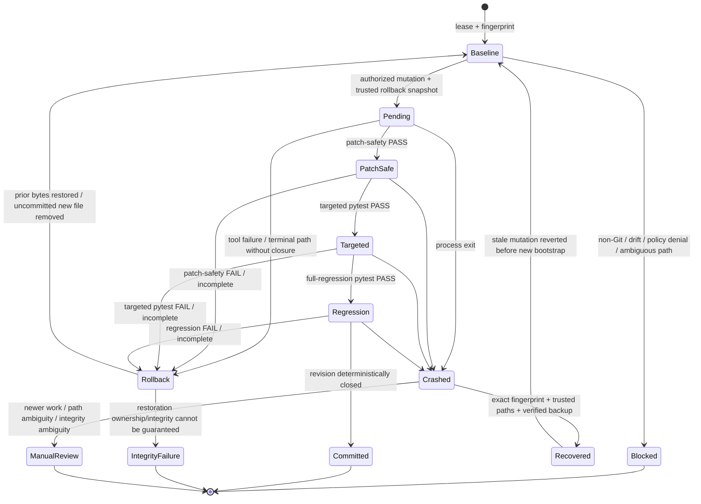

# Runtime Control and Recovery

> **ƳƤ AI QA Automation Framework** · Designed and engineered by **Ƴunior Ƥortal (ƳƤ)**

Runtime safety is a deterministic subsystem, not a prompt convention. The framework separates QA decision state from process-control state so model/conversation failure cannot erase workspace ownership, mutation transactions, resource budgets, or journal facts.

## Core invariant

> **No autonomous mutation or recovery write proceeds unless the runtime can establish both ownership of the path and ownership of the workspace state.**

That invariant applies during normal execution and after a crash.

## Workspace ownership

A live run acquires an OS advisory lock whose lease metadata lives under trusted artifact storage rather than inside the target repository. Cooperating framework processes therefore cannot simultaneously hold mutation authority over the same target worktree.

The lease is necessary but not sufficient. Autonomous writes also require:

- a Git-backed isolated target worktree;
- a content-sensitive workspace fingerprint captured from the analyzed state;
- the fingerprint to remain unchanged immediately before mutation;
- path ownership that is not ambiguous through traversal, escape, or symlink aliases.

The fingerprint combines Git `HEAD`, porcelain worktree state, and content hashes for dirty/untracked files. An IDE, developer, formatter, Git operation, or other process that changes the target invalidates the baseline and blocks mutation.

## Transactional mutation state machine



The state machine is asymmetric by design: preserving newer human work is more important than automatically cleaning an older agent transaction.

## Mutation preparation

Only one autonomous mutation can remain pending at a time.

Before a write, the runtime:

1. validates the relative path;
2. rejects absolute paths and `..` traversal;
3. walks path components and rejects symlink aliases;
4. confirms the resolved target remains inside the workspace;
5. checks whether a prior mutation is unresolved;
6. creates the trusted rollback directory;
7. snapshots existing bytes when the target already exists;
8. bounds rollback snapshot size;
9. hashes the original bytes;
10. persists pending-mutation metadata before the revision is trusted.

New files are tracked as absent-before-mutation so rollback removes them rather than manufacturing previous content.

## Revision closure

Mutation commit is independent from model completion.

The current `change_revision` must contain:

- patch-safety `PASS`;
- targeted pytest `PASS`; and
- full-regression pytest `PASS`.

A different gate cannot silently supersede an earlier failed gate. Gate identity and revision lineage are preserved by the terminal truth rules in [`RESULT_CONTRACT.md`](RESULT_CONTRACT.md).

Until closure, rollback material remains authoritative recovery state.

## Rollback integrity

For an existing file, rollback does not trust persisted path metadata blindly.

Before restore—or before discarding a backup after successful closure—the runtime validates:

- backup metadata exists;
- backup path remains beneath the run's trusted rollback directory;
- no path component is a symlink;
- the backup is a regular file;
- SHA-256 of backup bytes matches the original recorded digest.

If any check fails, the pending transaction is preserved and the framework escalates the integrity failure rather than performing a best-effort overwrite.

## Crash-aware stale recovery

A process can terminate before in-process cleanup executes. The next workspace owner can inspect the prior lease and recover a stale mutation, but recovery is intentionally **not** a weaker alternate write path.

Recovery validates the entire ownership chain:

### Prior run ownership

- prior `run_id` must be a non-traversing relative path under trusted artifact storage;
- run-directory components must not be symlinks;
- `runtime.json` must be a regular non-symlink file;
- runtime metadata workspace must exactly match the newly leased workspace.

### Workspace-state ownership

- pending mutation metadata must exist and be structurally usable;
- persisted post-mutation fingerprint must exist;
- current workspace fingerprint must exactly match it.

A mismatch means newer human/out-of-band work may exist, so automatic rollback is refused.

### Target ownership

- pending target path must be relative and non-traversing;
- no path component may be a symlink;
- resolved target must remain inside the workspace.

### Backup ownership

For a file that existed before mutation:

- rollback metadata must contain backup path and original digest;
- backup must remain inside the prior run's rollback directory;
- no backup path component may be a symlink;
- backup must be a regular file;
- content hash must equal the recorded original digest.

Only after every applicable condition is satisfied does recovery restore bytes and clear the pending transaction.

## Independent execution budgets

Agent SDK bounds such as turns/model cost are complemented by framework-owned limits:

- total controlled tool attempts;
- network-capable attempts;
- autonomous mutation attempts;
- repeated identical actions;
- overall wall-clock duration;
- bounded tool/test adapter execution time.

These dimensions remain independent. Increasing the total tool budget does not implicitly increase network or mutation authority.

Budgets are charged before the relevant action executes. Exhaustion is a deterministic runtime event rather than something the model is expected to notice voluntarily.

## Per-tool failure circuits

Each tool has a consecutive-failure circuit. Repeated failures open only that tool's circuit, preventing the agent from spending the remaining global budget retrying one broken path indefinitely.

A later successful invocation resets that tool circuit. A broken provider/tool therefore does not erase unrelated local evidence or grant the model broader capability as compensation.

## Deterministic bootstrap

Before model execution, bootstrap records a bounded target view including:

- repository `HEAD` and content-sensitive fingerprint;
- trusted baseline and merge-base provenance when configured;
- committed plus dirty/untracked change union;
- change-risk domains;
- repository/test topology;
- dependency-manifest hashes;
- CODEOWNERS routing;
- explainable test-impact candidates;
- OpenAPI/Swagger drift where applicable.

The summary sent to Claude is labeled **observed data, not instructions**. The underlying records remain independently persisted.

## Process records

Every run maintains complementary persistence layers:

| Record | Purpose |
|---|---|
| `state.json` | canonical QA decision/evidence state |
| `runtime.json` | lease, fingerprint, budgets, circuits, mutation metadata, journal head |
| `journal.jsonl` | append-only hash-chained lifecycle/tool events |
| `evidence-manifest.json` | evidence/artifact identities and hashes |
| `rollback/` | temporary trusted bytes while a mutation transaction is open |

Keeping these concerns separate prevents process recovery metadata from becoming test evidence or a QA conclusion.

## Recovery inspection

```bash
ai-qa recover artifacts/run-<id>
```

Recovery inspection checks persisted decision state, journal integrity, revision closure, and pending mutation metadata to determine whether a new agent session may safely begin from the persisted record.

It does not replay or reconstruct hidden Claude conversational state.

## Runtime interruption semantics

| Condition | Framework response |
|---|---|
| Another process owns target lease | `BLOCKED` |
| Workspace drift before mutation | `BLOCKED` |
| Target path has traversal/symlink ambiguity | `BLOCKED` |
| Prior crash target/backup path is ambiguous | stale recovery blocked |
| Budget exhausted | `BUDGET_EXCEEDED` |
| Tool circuit open | tool action denied |
| Revision cannot close | rollback before terminal report |
| Human/out-of-band edit after crash | preserve newer work; manual review |
| Rollback integrity cannot be guaranteed | `INFRASTRUCTURE_FAILURE` |
| Journal integrity is invalid | recovery cannot be represented as clean |

These are runtime safety semantics, not application-defect classifications.

## Related documentation

- [`README.md`](README.md) — documentation landing page
- [`RESULT_CONTRACT.md`](RESULT_CONTRACT.md) — terminal/validation truth
- [`ARCHITECTURE.md`](ARCHITECTURE.md) — system authority and trust model
- [`SECURITY.md`](SECURITY.md) — security controls
- [`OPERATIONS.md`](OPERATIONS.md) — operator workflow
- [`TRACEABILITY.md`](TRACEABILITY.md) — evidence and validation lineage

Copyright (c) 2026 Ƴunior Ƥortal (ƳƤ). See [`../LICENSE`](../LICENSE).
