# Runtime control

The ƳƤ AI QA Automation Framework treats model output, external systems, target repositories, and target processes as untrusted inputs. Deterministic runtime policy retains authority over execution, mutation, evidence, validation, recovery, and terminal truth.

## Authority model

The runtime preserves this control chain:

**objective → Claude Agent SDK/advisory reasoning → deterministic policy → controlled tool → real execution/observation → persisted evidence → deterministic validation → structured terminal report**

Model output cannot authorize privileged actions, certify success, override policy, or convert missing evidence into PASS. External issue text, logs, MCP/provider output, web content, and repository content are data, never instructions.

## Workspace isolation and mutation

The target workspace and controller-owned artifact/control roots must remain disjoint. Runtime writes are confined to explicitly authorized test mutation paths and controller persistence roots. Target execution occurs only from a bounded, controller-materialized repository subject inside the admitted pytest sandbox; ordinary ignored inputs and Git metadata do not enter the execution namespace.

Mutation is transactional. Before mutation the controller binds the pending path, prior bytes or nonexistence, workspace root identity, fingerprint lineage, revision lineage, rollback authority, and journal state. A candidate mutation does not become committed merely because the write succeeded.

```mermaid
stateDiagram-v2
    direction LR
    accTitle: Autonomous mutation transaction and crash-recovery state machine
    accDescr: A mutation starts only from an owned baseline. Exact-path patch safety, exact-path-bound targeted pytest with trusted out-of-process executed-test outcome authority, and full regression must pass before commit. Failed or incomplete proof enters rollback only after an advanced revision is durably marked NOT_VERIFIED. A crashed transaction is automatically recovered only when run-persistence identity, workspace root identity, fingerprint, canonical state lineage, paths, and backup integrity remain provable; otherwise the runtime blocks for manual review.

    [*] --> Baseline: owned lease + root identity + fingerprint
    Baseline --> Pending: durable mutation intent + rollback authority
    Pending --> PatchSafe: exact-path patch-safety PASS
    Pending --> RollbackIntent: tool failure / terminal path without closure

    PatchSafe --> Targeted: exact-path pytest PASS + trusted executed outcome
    PatchSafe --> RollbackIntent: patch-safety FAIL / incomplete

    Targeted --> Regression: full-regression pytest PASS
    Targeted --> RollbackIntent: targeted pytest FAIL / unrelated target / missing trusted outcome

    Regression --> Committed: revision deterministically closed
    Regression --> RollbackIntent: regression FAIL / incomplete

    RollbackIntent --> RolledBack: restore/delete + lineage reconciliation
    RollbackIntent --> ManualReview: ownership/integrity cannot be proven

    Committed --> [*]
    RolledBack --> [*]
    ManualReview --> [*]
```



## Runtime mutation surface

The live autonomous mutation surface is deliberately narrower than reusable library capability. A reusable helper can support more formats or operations without those formats or operations becoming autonomous runtime authority.

For test generation, the current live `create_test_file` boundary records a deterministic proposal rather than writing repository bytes. The proposal is bound to repository/coverage/requirement/plan/scenario/path/content subjects and receives only static syntax/path/assertion/patch-safety validation. Proposal recording is not mutation, execution, coverage proof, or semantic correctness proof.

The reusable safe patcher can validate Python/JavaScript/TypeScript test artifacts. The **live autonomous write surface is narrower**: it authorizes Python test mutations only, because current deterministic commit closure is pytest-backed.

> [!NOTE]
> Library capability is not runtime authority. Supporting a file format in a reusable utility does not automatically authorize autonomous persistence for that format.

## Exact-path revision closure

Mutation commit and authorization for the next autonomous mutation use the same deterministic closure authority as terminal/recovery truth. Model completion is not an alternate authority.

The current `change_revision` must contain:

- patch-safety `PASS` bound to the exact changed path;
- targeted pytest `PASS` explicitly selecting that same pending path;
- trusted out-of-process executed-test outcome evidence proving at least one successful call-phase execution from that exact mutated path; and
- full-regression pytest `PASS` bound to the controller-verified regression-suite identity.

The live `run_pytest` adapter deliberately does **not** claim the third property. Target tests execute in the pytest interpreter and are untrusted code; a same-interpreter hook, inherited file descriptor, stdout/stderr protocol, JUnit/report file, target exit status, or other target-accessible channel cannot be promoted into authority-bearing executed-test proof. Live targeted pytest therefore records ordinary diagnostic exit evidence with `targeted_execution_authority="unavailable"`, `targeted_outcome_report_verified=false`, and no authoritative passed paths. Until a genuinely independent trusted observer is integrated, a positive autonomous test mutation cannot close and must remain `NOT_VERIFIED`/rollback rather than manufacture green.

The validator reserves `trusted_out_of_process_observer_v1` for separately trusted observer evidence. A structurally valid payload is **not its own authority**. Acceptance requires all of the following to agree with controller-owned state:

- exact canonical run ID and `change_revision`;
- exact pending mutation path and exact validated pytest argument tuple;
- a controller-supplied observer backend identity plus an exact content/implementation digest;
- the controller-frozen pytest execution subject's Git SHA, source fingerprint, and execution-subject digest;
- bounded canonical call-phase counts and passed paths, with at least one call-phase PASS from the exact mutated file and zero failed call phases;
- a complete observer report with zero child/pytest return codes; and
- a recomputable canonical SHA-256 execution identity covering the complete structured observation.

The controller-side observer identity and frozen-subject fields are checked separately from the observer payload; copying or self-hashing claimed Git/source/observer identities cannot establish authority. Cross-run, cross-revision, cross-command, cross-path, observer-identity, and execution-subject replay therefore fail closed. Scalar authority fields are strict rather than coercible, and counts/path/argument ingestion is bounded.

No live producer currently supplies this reserved authority. The contract hardening above constrains a future producer; it does not restore mutation liveness by itself and does not make target-controlled output trustworthy.

Validation lineage ahead of canonical `change_revision`, conflicting same-revision truth, failed/incomplete current-revision checks, ambiguous patch subjects, or missing trusted executed-test authority fail closed rather than being filtered out by a separate mutation precheck.

For example, a targeted selector such as:

```text
tests/test_checkout.py::test_checkout_success
```

can bind diagnostic validation to `tests/test_checkout.py`. A `-k` filter with no file selector or a targeted run against `tests/test_other.py` cannot bind that mutation. Even an exact-path exit `0` remains insufficient for autonomous commit until the trusted executed-test observer requirement is satisfied.

A different gate cannot silently supersede an earlier failed gate. Gate identity and revision lineage remain governed by [`RESULT_CONTRACT.md`](RESULT_CONTRACT.md).

Until closure, rollback material remains authoritative recovery state.

## Rollback integrity

For an existing file, rollback does not trust persisted path metadata blindly.

Before restore—or before discarding a backup after successful closure—the runtime verifies:

- run-persistence root identity remains owned;
- target workspace root identity remains owned;
- pending transaction metadata is structurally valid;
- backup path stays confined below the run rollback root;
- backup bytes match their persisted hash and bounded size;
- target path stays confined below the target workspace; and
- current workspace fingerprint still belongs to the pending transaction lineage.

A missing or ambiguous ownership proof blocks automatic recovery instead of guessing.

## Validation truth

Every validation result is revision-bound. Active validation selects only the newest revision per deterministic gate identity while retaining conflicting same-revision PASS/FAIL truth. A newer unrelated PASS cannot silently replace an earlier failing gate with a different identity.

A terminal `SUCCESS` requires model completion plus deterministic objective validation at the current revision. For a changed revision, the shared revision-closure rule above must also close. A result that was blocked, not executed, not observed, not verified, or infrastructure-failed does not become PASS through aggregation.

## Pytest sandbox

Target pytest execution is executable untrusted content. The live runner requires Linux Bubblewrap isolation and has no direct-host fallback. Before target execution the controller verifies a concrete capability proof and then runs only a controller-materialized frozen repository subject.

The sandbox:

- starts from an empty mount namespace rather than binding the host root;
- exposes only admitted interpreter/runtime roots and the frozen target subject;
- mounts the frozen subject read-only at `/workspace`;
- hides the controller evidence/scratch root;
- unshares user, mount, PID, network, IPC, and UTS namespaces as applicable to the Bubblewrap contract;
- drops effective capabilities;
- provides private bounded `/tmp` and home tmpfs filesystems;
- disables pytest plugin autoload and bytecode writes;
- clears ambient environment authority and reconstructs a minimal deterministic environment; and
- applies bounded process/address-space/file/open-descriptor/CPU limits immediately before execution.

Bubblewrap's JSON status channel is treated as untrusted-child-adjacent corroboration, not sole authority. Malformed, duplicate, incomplete, or mismatched lifecycle events downgrade execution rather than proving success.

## Full-regression authority

Full-regression validation is stronger than a single `pytest .` exit code. The controller freezes one execution subject, binds pytest configuration and conftest inputs, performs bounded pre-collection, executes the full suite against an explicit root, parses terminal node outcomes, performs post-collection, and requires exact reconciliation.

A verified regression-suite identity binds at least:

- target Git SHA and source fingerprint;
- frozen execution-subject digest;
- pytest version;
- controller-observed config path/hash/options;
- conftest path/hash manifest;
- exact node ID set/hash; and
- pre/post collection plus execution-node reconciliation.

A zero exit without this exact reconciliation is `NOT_VERIFIED` for changed-revision closure.

## Workspace freshness

Controlled validation and result acceptance continuously compare the target workspace to the controller's authorized fingerprint lineage. Out-of-band drift, incomplete fingerprint coverage, root replacement, or subject-unavailability prevents stale validation from entering closure.

Terminal candidate `SUCCESS` is revalidated against current workspace freshness before reporting success.

## Failure and recovery semantics

Crash recovery never reconstructs missing model intent or missing validation authority. Persisted state, journal, runtime metadata, lease metadata, rollback bytes, and workspace identity must agree before automatic action.

`ai-qa recover artifacts/run-<id>` inspects persisted evidence. It does not replay or reconstruct hidden Claude conversational state; it decides whether a new session may safely begin from persisted evidence.

Recovery inspection uses the same subject-bound closure rule as live terminal evaluation and mutation authorization. A changed revision is closed only when one exact patch target has patch-safety PASS, targeted pytest is bound to that target, trusted out-of-process evidence proves an executed passing call from that target for the exact persisted run/revision/invocation and controller subject, regression passed with one verified suite identity, no non-PASS current-revision transaction gate remains, and no pending mutation remains.

On descriptor-relative no-follow platforms, one observed run-root identity is pinned for the complete inspection and threaded across state/runtime/journal reads; ordinary-directory replacement during that inspection is rejected rather than allowing authority from two different roots to be combined. This is inspection-time consistency, not a claim that the inspector possesses the historical run-root identity. Automatic stale recovery separately obtains that historical identity from prior lease metadata before it may authorize rollback.

Keeping these concerns separate prevents process recovery metadata from becoming correctness evidence.

| Condition | Deterministic truth |
| --- | --- |
| Model result is not success | `FAILURE` |
| Validation failed | `FAILURE` |
| Required validation missing/incomplete | `NOT_VERIFIED` |
| Workspace subject unavailable or rollback integrity unavailable | `INFRASTRUCTURE_FAILURE` |
| Workspace ownership/freshness ambiguous | `BLOCKED` / manual review |
| Stale-recovery state reconciliation fails after restore | restored bytes coexist with retained pending/backup authority; recovery remains blocked for manual reconciliation |
| Budget exhausted | `BUDGET_EXCEEDED` |
| Tool circuit open | tool action denied |
| Revision cannot close, including missing trusted targeted-execution authority | rollback before terminal report |
| Human/out-of-band edit after crash | preserve newer work; manual review |
| Replacement workspace at same pathname | preserve replacement; manual review |
| Rollback integrity cannot be guaranteed | `INFRASTRUCTURE_FAILURE` |

Related: [`RESULT_CONTRACT.md`](RESULT_CONTRACT.md) · [`ARCHITECTURE.md`](ARCHITECTURE.md)

[← Documentation home](README.md)

Copyright (c) 2026 Ƴunior Ƥortal (ƳƤ). See [`../LICENSE`](../LICENSE).