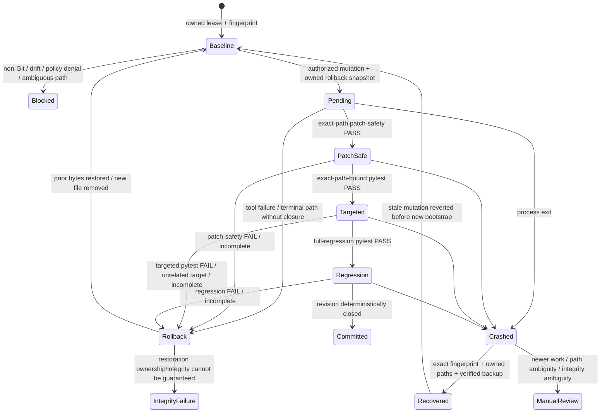

# Runtime Control and Recovery

> [!IMPORTANT]
> **No autonomous mutation or recovery write proceeds unless the runtime can establish both ownership of the filesystem path and ownership of the workspace state.**

**ƳƤ AI QA Automation Framework** · Designed and engineered by **Ƴunior Ƥortal (ƳƤ)**

[Documentation home](README.md) · [Architecture](ARCHITECTURE.md) · [Result contract](RESULT_CONTRACT.md) · [Security](SECURITY.md)

---

Runtime safety is a deterministic subsystem, not a prompt convention. The framework separates QA decision state from process-control state so model/conversation failure cannot erase workspace ownership, mutation transactions, resource budgets, or journal facts.

That invariant applies during normal execution, transaction commit/rollback, crash recovery, and recovery inspection.

## Workspace ownership

A live run acquires an OS advisory lock whose metadata lives beneath trusted artifact storage rather than inside the target repository.

The lease path itself is part of the trust boundary:

- `.leases/` must not be a symlink;
- the per-workspace lock file must not be a symlink;
- ownership is rechecked immediately before opening the file;
- `O_NOFOLLOW` is used when the operating system supports it;
- metadata is written through the locked file descriptor.

The lease prevents cooperating framework processes from simultaneously holding mutation authority over the same worktree, but it is only the first layer. Autonomous writes also require a Git-backed isolated target, a content-sensitive workspace fingerprint, and unambiguous path ownership.

## Mutation transaction state machine



The state machine is asymmetric by design: preserving newer human work is more important than automatically cleaning an older agent transaction.

## Mutation preparation

Only one autonomous mutation may remain pending at a time.

Before a write, the runtime:

1. validates the relative target path;
2. rejects absolute paths and `..` traversal;
3. rejects symlink components before resolution;
4. confirms the resolved target remains inside the workspace;
5. independently applies the same ownership check inside the reusable safe patcher;
6. confirms no prior mutation is unresolved;
7. rejects a symlinked rollback directory;
8. snapshots existing bytes when the target already exists;
9. bounds rollback snapshot size and records SHA-256;
10. persists pending-mutation metadata before the candidate revision is trusted.

New files are tracked as absent-before-mutation so rollback removes them rather than manufacturing previous content.

### Transaction durability ordering

`runtime.json` is the crash-recovery authority for whether a mutation is still pending. The runtime therefore orders transaction transitions conservatively:

- **prepare:** rollback bytes are created, then pending metadata is durably persisted before the mutation tool may execute;
- **commit:** rollback ownership/hash is verified, then pending metadata is durably cleared **before** the rollback snapshot is discarded;
- **rollback:** original bytes are restored (or an unverified new file is removed), then pending metadata is durably cleared **before** rollback-snapshot cleanup;
- if metadata persistence fails during commit, the transaction remains pending and rollback bytes are preserved;
- if metadata persistence fails after rollback bytes have been restored, the transaction remains conservatively pending with its backup intact so recovery cannot infer a clean closure;
- lifecycle journal augmentation occurs after an already-durable commit/rollback transition and cannot resurrect pending state or undo restored bytes.

This ordering intentionally prefers an orphaned cleanup artifact over the unsafe opposite state: deleted rollback bytes while durable metadata still says a mutation is pending.

### Live-language closure boundary

The reusable safe patcher can validate Python/JavaScript/TypeScript test artifacts. The **live autonomous write surface is narrower**: it authorizes Python test mutations only, because current deterministic commit closure is pytest-backed.

> [!NOTE]
> Library capability is not runtime authority. Supporting a file format in a reusable utility does not automatically authorize autonomous persistence for that format.

## Exact-path revision closure

Mutation commit is independent from model completion.

The current `change_revision` must contain:

- patch-safety `PASS` bound to the exact changed path;
- targeted pytest `PASS` explicitly selecting that same pending path; and
- full-regression pytest `PASS`.

For example, a targeted selector such as:

```text
tests/test_checkout.py::test_checkout_success
```

can bind validation to `tests/test_checkout.py`. A `-k` filter with no file selector or a targeted run against `tests/test_other.py` is diagnostic evidence and cannot commit `tests/test_checkout.py`.

A different gate cannot silently supersede an earlier failed gate. Gate identity and revision lineage remain governed by [`RESULT_CONTRACT.md`](RESULT_CONTRACT.md).

Until closure, rollback material remains authoritative recovery state.

## Rollback integrity

For an existing file, rollback does not trust persisted path metadata blindly.

Before restore—or before discarding a backup after successful closure—the runtime verifies:

- rollback directory is still owned and not a symlink;
- backup metadata exists;
- backup path remains beneath the trusted rollback directory;
- no backup path component is a symlink;
- backup is a regular file;
- SHA-256 of backup bytes matches the original recorded digest.

If a transaction begins safely and the rollback directory is later replaced by a symlink, restore/commit is refused. The framework does not follow the new alias.

If any integrity check fails, the pending transaction is preserved and the framework escalates rather than performing a best-effort overwrite.

## Crash-aware stale recovery

A process can terminate before in-process cleanup executes. The next workspace owner can inspect the prior lease and recover a stale mutation, but recovery is intentionally **not** a weaker alternate write path.

Recovery validates the complete ownership chain before touching the target.

### Prior run ownership

- prior `run_id` is a non-traversing relative path beneath trusted artifact storage;
- run-directory components are not symlinks;
- prior `journal.jsonl` ownership is checked before recovery mutation;
- `runtime.json` is a regular non-symlink file;
- runtime workspace exactly matches the newly leased workspace.

### Workspace-state ownership

- pending mutation metadata is structurally usable;
- persisted post-mutation fingerprint exists;
- current workspace fingerprint exactly matches it.

A mismatch means newer human/out-of-band work may exist, so automatic rollback is refused.

### Target ownership

- pending target path is relative and non-traversing;
- no path component is a symlink;
- resolved target remains inside the workspace.

### Backup ownership

For a file that existed before mutation:

- rollback metadata contains backup path and original digest;
- rollback directory itself is not a symlink;
- backup remains inside that directory;
- no backup path component is a symlink;
- backup is a regular file;
- content hash equals the recorded original digest.

Only after every applicable condition is satisfied does recovery restore bytes and clear the transaction.

## Independent execution budgets

Agent SDK turn/model-cost bounds are complemented by framework-owned limits for:

- total controlled tool attempts;
- network-capable attempts;
- autonomous mutation attempts;
- repeated identical actions;
- overall wall-clock duration;
- bounded tool/test adapter execution time.

These dimensions remain independent. Increasing total tool budget does not silently increase network or mutation authority.

Budgets are charged before the relevant action executes. Exhaustion is a deterministic runtime event rather than something the model is expected to notice voluntarily.

## Per-tool failure circuits

Each tool has a consecutive-failure circuit. Repeated failures open only that tool's circuit, preventing an agent from spending the remaining budget retrying one broken path indefinitely.

A later successful invocation resets the circuit. A broken provider/tool therefore does not erase unrelated local evidence or grant broader capability as compensation.

## Process records and ownership

| Record | Purpose | Ownership rule |
|---|---|---|
| `state.json` | canonical QA decision/evidence state | recovery/attestation reject ambiguous symlink ownership |
| `runtime.json` | lease, fingerprint, budgets, circuits, mutation metadata, journal head | stale recovery requires owned metadata; writes/restores are size-bounded |
| `journal.jsonl` | append-only hash-chained lifecycle/tool events | journal rejects pre-existing and post-init symlink substitution and byte-bounds records |
| `evidence-manifest.json` | evidence/artifact identities and hashes | evidence store rejects symlink control-file substitution and enforces bounded registries |
| `rollback/` | temporary authoritative prior bytes | directory + backup ownership, size, and hashes are revalidated |
| `.leases/*.lock` | cross-process workspace ownership | directory/file symlink ownership rejected |

Keeping these concerns separate prevents process recovery metadata from becoming test evidence or a QA conclusion.

## Recovery inspection

```bash
ai-qa recover artifacts/run-<id>
```

Recovery inspection uses the same subject-bound closure rule as live terminal evaluation. A changed revision is closed only when one exact patch target has patch-safety PASS, targeted pytest is bound to that target, regression passed, and no pending mutation remains.

The inspection path also rejects symlinked run/state/runtime/journal control paths rather than following ambiguous aliases.

It does not replay or reconstruct hidden Claude conversational state; it decides whether a **new** session may safely begin from persisted evidence.

## Runtime interruption semantics

| Condition | Framework response |
|---|---|
| Another process owns target lease | `BLOCKED` |
| Lease path ownership is ambiguous | infrastructure/lease failure before agent execution |
| Workspace drift before mutation | `BLOCKED` |
| Target path has traversal/symlink ambiguity | `BLOCKED` |
| Rollback directory/backup ownership is ambiguous | mutation or recovery refused |
| Prior crash journal/target path is ambiguous | stale recovery blocked |
| Budget exhausted | `BUDGET_EXCEEDED` |
| Tool circuit open | tool action denied |
| Revision cannot close | rollback before terminal report |
| Human/out-of-band edit after crash | preserve newer work; manual review |
| Rollback integrity cannot be guaranteed | `INFRASTRUCTURE_FAILURE` |
| Journal integrity is invalid | recovery cannot be represented as clean |

> [!CAUTION]
> These are runtime safety semantics, not application-defect classifications.

---

Related: [`RESULT_CONTRACT.md`](RESULT_CONTRACT.md) · [`ARCHITECTURE.md`](ARCHITECTURE.md) · [`SECURITY.md`](SECURITY.md) · [`OPERATIONS.md`](OPERATIONS.md) · [`TRACEABILITY.md`](TRACEABILITY.md)

[← Documentation home](README.md)

Copyright (c) 2026 Ƴunior Ƥortal (ƳƤ). See [`../LICENSE`](../LICENSE).
