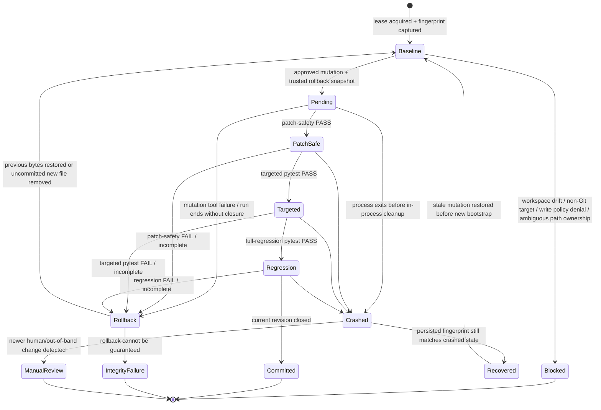

# Runtime Control and Recovery

> **ƳƤ AI QA Automation Framework** · Designed and engineered by **Ƴunior Ƥortal (ƳƤ)**

Runtime safety in the ƳƤ AI QA Automation Framework is treated as a deterministic subsystem, not as a prompt convention. The model-facing QA state and the process-control state are deliberately separate so a conversational or model failure cannot erase workspace ownership, pending-mutation, budget, or journal facts.

## Workspace ownership

A live run acquires an OS advisory lock whose lock file lives under the trusted artifact root, not inside the target repository. Two cooperating agent processes cannot hold the same target-workspace lease at the same time. The operating system releases the lock if the owning process exits.

The lease is necessary but not sufficient. Autonomous writes additionally require a Git-backed isolated worktree whose fingerprint still matches the baseline captured by the runtime. The fingerprint combines `HEAD`, porcelain worktree output, and content hashes for dirty/untracked files. Before a mutation, the universal tool hook recomputes it; any mismatch is treated as concurrent/out-of-band drift and blocks the write.

Mutation path ownership is also explicit: absolute paths, `..` traversal, workspace escapes, and symlink components are rejected before a transaction is prepared. The runtime does not treat a symlink alias as equivalent ownership of its resolved target.

> **No autonomous mutation proceeds unless the runtime can prove it is still acting on the workspace state it inspected.**

## Transactional mutation state machine



The state machine is intentionally asymmetric: preserving newer human work is more important than automatically cleaning up an old agent transaction.

## Mutation transactions

Only one autonomous mutation can be pending at a time. Before an authorized write, the runtime stores a bounded byte-for-byte rollback snapshot outside the SUT. A newly created file is tracked so it can be removed rather than “restored” if the new revision does not close validation.

Rollback snapshots are integrity-checked before restoration and their persisted paths must remain under the trusted rollback directory. A missing, tampered, or escaped backup does not trigger a best-effort overwrite; the transaction remains unresolved and the integrity failure is surfaced.

The transaction remains pending until the current change revision has all of the following:

- deterministic patch-safety PASS;
- targeted pytest PASS; and
- full-regression pytest PASS.

A tool failure, failed validation, blocked execution, or run that terminates without deterministic closure restores the previous content. Rollback failure is escalated to an infrastructure failure because workspace integrity can no longer be guaranteed.

Successful model completion is irrelevant to transaction commit unless the deterministic revision closure is also satisfied.

## Crash-aware stale recovery

A process can terminate before its in-process `finally` cleanup executes. The next workspace owner reads the previous lease metadata and pending mutation checkpoint before replacing them.

Automatic stale recovery is allowed only when the current target fingerprint exactly matches the fingerprint persisted by the crashed run. If it matches, the runtime can restore the trusted snapshot or remove the uncommitted new file before new bootstrap begins.

If a developer, IDE, formatter, Git operation, or any other process changed the workspace after the crash, automatic rollback is refused. The new content is preserved and the run reports a manual-review blocker instead of guessing which version should win.

## Independent execution budgets

The Agent SDK bounds turns and model cost. The runtime adds independent non-model limits:

- total controlled tool attempts;
- network-capable tool attempts;
- autonomous mutation attempts;
- repeated identical actions;
- overall wall-clock duration; and
- bounded individual execution time for test/tool adapters.

The top-level settings keep these dimensions separate. For example, increasing `AI_QA_MAX_TOOL_CALLS` does not implicitly increase `AI_QA_MAX_NETWORK_CALLS` or `AI_QA_MAX_MUTATIONS`.

A budget is charged before the relevant tool action executes. Exhaustion is a deterministic denial and is persisted in runtime state/journal rather than being left to the model to notice.

## Per-tool failure circuits

Each tool has a consecutive-failure circuit. Repeated failures open that tool's circuit so the agent cannot spend its remaining budget retrying one broken path indefinitely. A later successful call resets that tool's failure state.

A broken external integration can therefore become unavailable without erasing unrelated local evidence or granting the model broader authority to compensate.

## Bootstrap intelligence

Before model execution, deterministic code records a bounded view of the current target, including:

- repository `HEAD` and worktree fingerprint;
- optional trusted baseline and merge-base resolution;
- committed plus dirty/untracked change set;
- change-risk domains and recommended layers/tags;
- detected languages and test-framework surfaces;
- API/database/container/IaC/mobile/CI surfaces;
- dependency-manifest paths, sizes, and hashes;
- CODEOWNERS routing;
- deterministic test-impact candidates; and
- changed OpenAPI/Swagger compatibility drift when available.

The bounded summary inserted into the objective is explicitly labeled **observed data, not instructions**. The underlying observations are persisted as evidence independently of the model context window.

## Runtime checkpoint and journal

Every run has two complementary process records:

- `runtime.json` — lease identity, expected workspace fingerprint, execution-budget snapshot, tool circuits, pending mutation metadata, and journal head;
- `journal.jsonl` — append-only sequence of lifecycle/tool events with previous-record and current-record SHA-256 hashes.

`state.json` remains the QA decision state. Keeping these concerns separate avoids treating process recovery metadata as test evidence or test conclusions.

## Recovery inspection

```bash
ai-qa recover artifacts/run-<id>
```

Recovery inspection verifies persisted state and the journal chain, reports whether the last change revision closed, detects pending mutation metadata, and determines whether a **new** agent session may safely start from persisted evidence.

It does not replay, resume, or reconstruct the hidden state of a previous Claude conversation.

## Failure semantics

Runtime safeguards prefer explicit interruption over ambiguous continuation:

| Condition | Result |
|---|---|
| Another process owns the target lease | `BLOCKED` |
| Workspace drift before autonomous mutation | `BLOCKED` |
| Mutation path uses traversal/symlink ambiguity | `BLOCKED` |
| Budget exhausted | bounded budget terminal state |
| Tool circuit open | tool action denied |
| Pending mutation cannot close validation | rollback before terminal report |
| Post-crash target changed by a human/out-of-band process | manual-review blocker; no overwrite |
| Rollback integrity cannot be guaranteed | infrastructure failure |
| Persisted journal integrity fails | recovery cannot be represented as clean |

These outcomes are deliberately not converted into product defects or successful test results.

## Verification boundary

These controls are part of the runtime contract and are exercised through dedicated budget, lease, transaction, journal, path-ownership, rollback-integrity, and stale-recovery tests.

See [`OPERATIONS.md`](OPERATIONS.md), [`PRODUCTION_READINESS.md`](PRODUCTION_READINESS.md), and [`VERIFICATION_BOUNDARIES.md`](VERIFICATION_BOUNDARIES.md).

Copyright (c) 2026 Ƴunior Ƥortal (ƳƤ). See [`../LICENSE`](../LICENSE).
