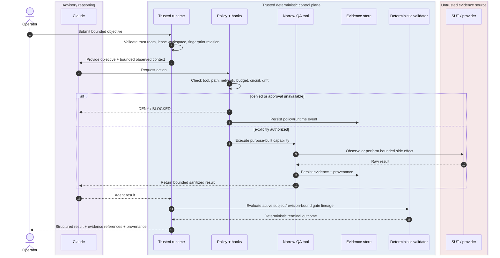
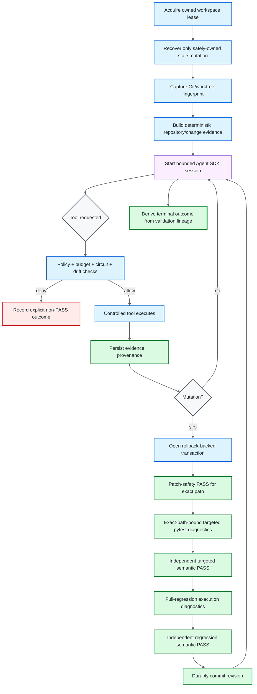

# Runtime Lifecycle and Mutation Closure

## Purpose

This page owns the runtime request, evidence, validation, mutation, and crash-recovery flows that are intentionally too detailed for the repository landing page. The main README keeps only the primary trust-and-authority architecture diagram.

The lifecycle follows one rule throughout: **reasoning proposes; deterministic policy authorizes; controlled tools observe or act; evidence is provenance-bound; subject/revision-bound validation decides terminal truth.**

## Request → authorization → evidence → terminal validation

The sequence separates provider/model liveness from framework success. A model completion is an input to terminal evaluation; it is never sufficient authority for `SUCCESS`.

## Evidence-first runtime lifecycle

A targeted run against an unrelated file is diagnostic evidence; it cannot certify the pending mutation. Even an exact-path targeted exit `0`, or a reconciled full-regression transcript with exit `0`, cannot positively certify its own execution semantics from inside the target interpreter.

## Transactional mutation and crash recovery

```mermaid
stateDiagram-v2
    direction LR
    accTitle: Transactional mutation and crash-recovery state machine
    accDescr: A mutation starts only from an owned baseline. Exact-path patch safety and targeted/full-regression execution diagnostics require independent semantic proof before commit. Failure or incomplete proof rolls back. A crash can recover automatically only when workspace ownership, fingerprint, paths, and backup integrity remain provable; otherwise the runtime blocks for manual review.

    [*] --> Baseline: owned lease + fingerprint

    Baseline --> Pending: authorized mutation + owned rollback snapshot
    Baseline --> Blocked: drift / policy denial / path ambiguity

    Pending --> PatchSafe: exact-path patch-safety PASS
    Pending --> Rollback: tool failure / terminal without closure

    PatchSafe --> Targeted: exact-path-bound pytest diagnostics
    PatchSafe --> Rollback: safety FAIL / incomplete

    Targeted --> TargetedSemantics: independent targeted semantic PASS
    Targeted --> Rollback: targeted FAIL / unbound / missing authority

    TargetedSemantics --> Regression: full-regression execution diagnostics
    Regression --> Committed: independent regression semantic PASS
    Regression --> Rollback: regression FAIL / missing authority / incomplete

    Rollback --> Baseline: prior bytes restored / new file removed
    Rollback --> IntegrityFailure: restore ownership/integrity uncertain

    Pending --> Crashed: process exit
    PatchSafe --> Crashed
    Targeted --> Crashed
    TargetedSemantics --> Crashed
    Regression --> Crashed

    Crashed --> Recovered: fingerprint + ownership + backup verified
    Recovered --> Baseline: stale mutation reverted
    Crashed --> ManualReview: newer work / ownership ambiguity

    classDef active fill:#ddf4ff,stroke:#0969da,color:#24292f,stroke-width:2px
    classDef verified fill:#dafbe1,stroke:#1a7f37,color:#24292f,stroke-width:2px
    classDef recovery fill:#fbefff,stroke:#8250df,color:#24292f,stroke-width:2px
    classDef blocked fill:#ffebe9,stroke:#cf222e,color:#24292f,stroke-width:2px

    class Baseline,Pending,Regression active
    class PatchSafe,Targeted,TargetedSemantics,Committed verified
    class Rollback,Crashed,Recovered recovery
    class Blocked,IntegrityFailure,ManualReview blocked
```

## Mutation closure contract

For changed test bytes to persist at one revision, the runtime requires all of the following:

1. deterministic patch-safety `PASS` bound to the exact changed path;
2. targeted pytest diagnostics explicitly selecting that same path;
3. independently trusted targeted executed-test semantic `PASS` for the frozen subject/path;
4. full-regression diagnostics for the same change revision;
5. independently trusted full-regression executed-test semantic `PASS` for that revision;
6. no conflicting active validation; and
7. durable transaction metadata that can be safely committed.

Target-controlled collection, output, report, and exit evidence can remain useful diagnostics or fail-safe denial inputs. They cannot manufacture the independent positive semantic authority required to commit an autonomous mutation.

## Recovery ownership

Crash recovery is deliberately conservative. Automatic cleanup is valid only while the framework can re-establish ownership of the prior run, workspace, journal, fingerprint, target path, rollback directory, backup bytes, and transaction state. When newer human or out-of-band work makes ownership ambiguous, the correct outcome is manual review rather than an automated rollback that may destroy newer work.

## Related documentation

- [Architecture](ARCHITECTURE.md) — trust zones and authority ownership.
- [Runtime Result Contract](RESULT_CONTRACT.md) — terminal/validation/provider namespaces and closure rules.
- [Runtime Control](RUNTIME_CONTROL.md) — leases, transaction mechanics, rollback and recovery implementation.
- [Workspace Freshness Boundary](WORKSPACE_FRESHNESS_BOUNDARY.md) — subject fingerprint lineage and result freshness.
- [Pytest Execution Isolation](PYTEST_EXECUTION_ISOLATION.md) — infrastructure prerequisites for target-controlled Python.
- [Traceability](TRACEABILITY.md) — evidence lineage, journal integrity and attestations.
- [Security](SECURITY.md) — deterministic safety boundaries and residual deployment controls.
