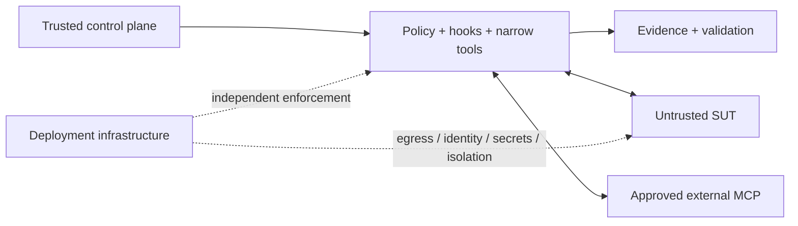
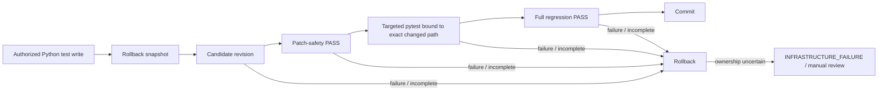

# Security Architecture

> [!IMPORTANT]
> **Security rule:** model reasoning, prompt compliance, and model confidence are never the primary security boundary. Authority is constrained by deterministic policy, narrow tools, ownership checks, validation lineage, and deployment controls.

**ƳƤ AI QA Automation Framework** · Designed and engineered by **Ƴunior Ƥortal (ƳƤ)**

[Documentation home](README.md) · [Architecture](ARCHITECTURE.md) · [Threat model](THREAT_MODEL.md) · [Result contract](RESULT_CONTRACT.md) · [Verification boundaries](VERIFICATION_BOUNDARIES.md)

---

## Security posture

The framework assumes two things from the start:

1. **Probabilistic reasoning can be wrong or manipulated.**
2. **Target/provider content can be hostile while still looking like ordinary engineering data.**

The design therefore makes a model mistake survivable. A bad hypothesis, malicious DOM node, poisoned issue body, stale worktree, broken provider, or partial runtime failure must not silently widen authority, corrupt the target, weaken test intent, fabricate evidence, or manufacture verified success.

### Seven security principles

| Principle | Enforced consequence |
|---|---|
| **Fail closed** | Unknown tools, actions, paths, environments, providers, and ownership states do not receive optimistic permission. |
| **Separate trust zones** | Control-plane configuration defines authority; SUT and provider content remain evidence. |
| **Minimize capability** | Purpose-built QA operations replace generic shell/edit/web authority. |
| **Keep confidence advisory** | Model confidence can guide investigation but cannot authorize mutation or prove PASS. |
| **Bind writes to ownership** | Autonomous mutation requires isolated Git state, path ownership, rollback material, and current-revision closure. |
| **Preserve uncertainty** | Missing, contradictory, blocked, stale, or insufficient evidence remains visibly non-PASS. |
| **Separate app and infrastructure controls** | Source-level allowlists are defense in depth; process/container/network enforcement belongs to deployment infrastructure. |

---

## Trust model



| Zone | Trust posture | Security responsibility |
|---|---|---|
| **Control plane** | trusted authority | policy, hooks, Skills, schemas, thresholds, runtime code |
| **Target / SUT** | untrusted evidence source | source, tests, DOM, logs, API data, target agent files |
| **External providers** | approved transport/provider; returned content untrusted | authenticated retrieval + local action authorization |
| **Deployment infrastructure** | independent enforcement boundary | process/container isolation, egress, identity, secrets, storage, devices |

> [!NOTE]
> An approved provider is not an approved action, and an intact artifact is not a passing test. Identity, integrity, authorization, and correctness are separate claims.

---

## Fail-closed runtime authority

The live Agent SDK path exposes the framework-owned QA surface rather than generic mutation/network tools.

Security-relevant configuration includes:

- `tools=[]` for the generic built-in working surface;
- explicit denial of Bash/Edit/Write/Web-style built-ins;
- exactly five trusted Skills;
- `setting_sources=["project"]` rooted in the trusted control repository;
- `strict_mcp_config=True` so ambient/target MCP configuration is not inherited;
- deterministic `PreToolUse`, `PostToolUse`, and tool-failure hooks;
- a fail-closed programmatic permission handler;
- independent turn/tool/network/mutation/repetition/time/cost budgets;
- per-tool consecutive-failure circuits.

Approval-required operations do not become silently allowed in unattended execution.

---

## Trusted network configuration

Network authority begins with configuration parsing, not with a loose string comparison later in execution.

Allowlist entries are canonical **hostnames or IP literals only**. Configuration rejects:

- wildcards;
- URL-shaped values;
- embedded ports;
- user-info;
- paths, queries, and fragments;
- malformed DNS labels;
- malformed dotted IPv4-looking values;
- bracket abuse;
- scoped IPv6 zone identifiers;
- an empty network allowlist when external network access is enabled.

API and browser adapters then consume the same canonical host boundary.

---

## Filesystem ownership and workspace integrity

### Autonomous target mutation

A live write requires all of the following:

1. an isolated **Git-backed** target worktree;
2. an exclusive OS-backed workspace lease;
3. a content-sensitive fingerprint matching the analyzed baseline;
4. explicit test-write enablement;
5. an approved Python test path under `tests/` or `generated_tests/`;
6. no unresolved previous mutation transaction;
7. no absolute path, `..` traversal, workspace escape, or symlink component.

The Python/pytest restriction is deliberate: the current autonomous closure mechanism can deterministically execute and bind pytest evidence to the changed path. Reusable patch libraries may understand additional source syntaxes without widening live autonomous commit authority.

### Trusted runtime artifacts

Trusted artifact paths are protected against ownership substitution as well:

- rollback directories/files reject symlink substitution;
- stale-recovery metadata and backup paths must be owned regular files;
- runtime journals reject symlink file targets;
- evidence artifacts reject symlink path components;
- regulated artifact verification rejects symlink replacement even when pointed-to bytes match a known digest;
- workspace lease directories/files reject symlink substitution and use no-follow file opening where supported.

This prevents “same bytes, wrong filesystem object” from being mistaken for owned state.

---

## Transactional mutation integrity



The target-specific gate is not merely labeled `targeted`. The validation record must be bound to the **same path** as the current patch-safety record and pending mutation. A different test file or a `-k`-only selection cannot certify the changed bytes.

Patch-quality controls reject common “make it green” shortcuts including:

- skip / xfail insertion;
- focused-only tests;
- arbitrary sleeps;
- indiscriminate timeout inflation;
- assertion erosion;
- tautological assertions;
- broad exception suppression.

Rollback backups are path-confined and SHA-256 verified before restore **and** before successful disposal.

---

## Crash recovery is not a weaker write path

Stale recovery applies the same ownership philosophy as live mutation.

Automatic restoration requires:

- prior `run_id` confined beneath trusted artifact storage;
- non-symlink prior run ownership;
- owned `runtime.json` and journal paths;
- exact workspace identity;
- an exact persisted/current post-mutation fingerprint match;
- confined non-symlink pending target path;
- confined non-symlink rollback directory and backup;
- original backup SHA-256 match.

A developer edit after a crash wins. If newer work may exist, automatic rollback is refused rather than overwriting it.

Recovery inspection also uses the same exact-path targeted-validation semantics as terminal truth, so the recovery CLI cannot report a weaker closure standard than the live runtime.

---

## Deterministic self-healing authority

A unique locator is not automatically a safe locator.

The framework separates proposal intelligence from mutation authority:

1. Playwright measures original/candidate match counts in the same DOM.
2. Locator expressions are reparsed without executing arbitrary locator code.
3. Semantic intent is recomputed deterministically from original/candidate contracts.
4. Model-supplied semantic confidence is not authoritative.
5. Strategy stability is policy-owned.
6. Positional/XPath-style and weak-semantic candidates are rejected.
7. The proposal is bound to exact file bytes and same-run evidence.
8. Any live autonomous mutation must satisfy the Python/pytest transaction contract above.

The model can propose; it cannot self-certify the proposal.

---

## Evidence, journal, and attestation integrity

`EvidenceStore` confines run/artifact paths and preserves immutable IDs/paths. The runtime journal is append-only and SHA-256 hash chained. Regulated mode adds an additional audit chain and artifact verification.

Unsigned run attestations deliberately distinguish **content integrity** from **identity/signing** and from **test correctness**. Their `integrity_verified` signal now requires:

- owned regular core persisted subjects;
- valid journal-chain verification;
- no pending mutation;
- artifact manifest structure that can be inspected safely; and
- every registered artifact to exist as an owned regular file with bytes matching its recorded SHA-256.

> [!CAUTION]
> A valid hash proves something about bytes. It does **not** prove who created them, that a test passed, that an environment behaved correctly, or that a deployment is compliant.

---

## API and browser boundaries

### API

- exact host allowlist;
- read-only `GET` / `HEAD` / `OPTIONS` default;
- separate opt-in for mutating methods;
- redirects disabled;
- ambient proxy inheritance disabled;
- response bytes bounded;
- textual evidence sanitized before persistence/model return.

### Browser / Playwright

The controlled browser context applies host policy to:

- initial navigation;
- HTTP(S) subresources;
- WebSockets;
- final navigation after page load.

Service workers are disabled in the evidence context so they cannot silently extend the routed network surface. Screenshots remain explicitly `RAW` hashed artifacts rather than being mislabeled as sanitized text.

---

## Performance-test safety

k6 is treated as executable JavaScript, not as a configuration file. Static inspection therefore provides defense in depth but is **not** treated as a network sandbox.

Every k6 execution requires:

- explicit non-production environment classification;
- production/production-like hostname denial;
- target host allowlisting;
- injected `BASE_URL` / `TARGET_URL` consumption;
- rejection of remote modules, `k6/x/*`, local `open()`, unsupported imports, and unrelated literal hosts;
- bounded runtime;
- `AI_QA_K6_EXTERNAL_EGRESS_ENFORCED=true` as a trusted assertion that deployment-level egress enforcement exists.

That prerequisite is universal—even for a localhost target—because arbitrary JavaScript can construct destinations dynamically. The flag itself is not a firewall; the deployment must actually provide the egress boundary.

---

## MCP security

External MCP requires both **provider identity** and **action authorization**.

| Layer | Control |
|---|---|
| Provider | explicit enablement + vendor-official identity allowlist |
| Server | GitHub configured read-only as defense in depth |
| Action | local deterministic read/write/destructive/unknown classification |
| Content | sanitized and treated as untrusted evidence |
| Failure | normalized provider health; no fabricated remote evidence |

Action-name normalization is conservative across snake/camel/mixed forms:

```text
destructive token > write token > recognized read token
```

Resource-noun collisions such as `pull request` are handled explicitly, while mixed verbs such as read-plus-create/delete cannot inherit read authority from a safe-looking prefix.

See [`MCP.md`](MCP.md).

---

## Secrets, subprocesses, and raw artifacts

- supported model-facing/text evidence is recursively sanitized;
- pytest output is redacted before storage/return;
- pytest/k6/git subprocesses receive credential-minimal environments;
- control-process `PYTHONPATH` is not inherited by controlled execution;
- `.env.example` is documentation only; repository `.env` is not auto-loaded;
- real credentials belong in the operating environment or an approved secret manager;
- screenshots and other binary evidence remain explicitly `RAW` and require deployment-level access/retention policy.

---

## Governance and supply chain

Authority-bearing assets—including `CLAUDE.md`, `.claude/`, `.mcp.json`, policy/hooks, thresholds, secret-bearing environment files, and workflow/governance surfaces—are not autonomous self-modification targets.

Dependency/provider changes should be deliberate: verify official provenance, review capability/authority changes, update deterministic tests/policy where necessary, and evaluate the resulting configuration through the applicable repository gates.

Repository security tooling is defined for static analysis, dependency auditing, secret scanning, and adversarial policy coverage; execution evidence belongs to the environment where those commands are deliberately run.

---

## Security review map

| Reviewer question | Canonical document |
|---|---|
| What can attack the system? | [`THREAT_MODEL.md`](THREAT_MODEL.md) |
| Where does authority live? | [`ARCHITECTURE.md`](ARCHITECTURE.md) |
| What makes a run PASS or non-PASS? | [`RESULT_CONTRACT.md`](RESULT_CONTRACT.md) |
| How are writes/recovery controlled? | [`RUNTIME_CONTROL.md`](RUNTIME_CONTROL.md) |
| Which guarantees belong to deployment? | [`VERIFICATION_BOUNDARIES.md`](VERIFICATION_BOUNDARIES.md) |
| How are provider actions constrained? | [`MCP.md`](MCP.md) |

For vulnerability reporting, follow root [`SECURITY.md`](../SECURITY.md). Never include real credentials, private customer data, production artifacts, or sensitive exploit material in a public report.

---

[← Documentation home](README.md) · [Threat model →](THREAT_MODEL.md)

Copyright (c) 2026 Ƴunior Ƥortal (ƳƤ). See [`../LICENSE`](../LICENSE).
