# Claude Skills

> [!IMPORTANT]
> Skills are **reasoning/playbook context, not permission grants**. Runtime policy, hooks, narrow tools, evidence requirements, budgets, and deterministic validation remain authoritative regardless of Skill instructions.

**ƳƤ AI QA Automation Framework** · Designed and engineered by **Ƴunior Ƥortal (ƳƤ)**

[Documentation home](README.md) · [Architecture](ARCHITECTURE.md) · [Evaluation](EVALUATION.md) · [Security](SECURITY.md)

---

## Skill inventory

The live Agent SDK configuration explicitly allowlists exactly five framework Skills.

| Skill | Purpose | Deterministic authority boundary |
|---|---|---|
| `investigate-test-failure` | evidence-driven root-cause investigation | material classification references observed evidence; interpretation alone cannot prove defect class |
| `self-heal-test` | semantic locator maintenance | Playwright uniqueness + deterministic locator semantics/stability + exact path/hash + validation lineage |
| `generate-test` | coverage-aware test design/creation | observed coverage drives candidates; unsupported model coverage claims cannot suppress them |
| `prioritize-regression` | risk-aware regression selection | mandatory coverage preserved; low confidence broadens execution |
| `performance-test` | bounded k6 assessment | non-production/host/script/egress prerequisites + predefined measured thresholds |

---

## Why Skills are separate

A monolithic permanent prompt mixes procedures that do not belong to every objective. Focused Skills keep the always-on contract smaller while making each QA workflow independently inspectable.

For each Skill, a reviewer should be able to answer:

1. When is the procedure appropriate?
2. Which evidence must exist first?
3. What may the model interpret or propose?
4. Which side effects are actually available?
5. Which shortcuts are prohibited?
6. Which deterministic gates close the work?
7. When must the workflow stop or escalate?

---

## `investigate-test-failure`

```text
.claude/skills/investigate-test-failure/SKILL.md
```

The procedure prioritizes discriminating evidence over repeated retries and considers competing hypotheses across application, automation, locator/UI-contract, data, timing, environment, dependency, authentication, configuration, and performance classes.

> [!NOTE]
> **A test failure alone is not evidence of a product defect.**

Evidence IDs remain distinct from model interpretation. Ambiguity is preserved when causal evidence is insufficient.

---

## `self-heal-test`

```text
.claude/skills/self-heal-test/SKILL.md
```

This Skill governs **semantic locator maintenance**, not arbitrary failing-test repair.

The workflow expects:

- expected product behavior to remain present;
- same-DOM Playwright evidence for original/candidate locators;
- compatible deterministic failure classification;
- supported original locator grammar;
- exact authorized test path and file hash;
- explicit autonomous-write enablement when mutation is requested.

The deterministic healing engine—not model confidence—owns authorization:

1. Playwright-observed match counts establish uniqueness.
2. Original/candidate locator syntax is reparsed.
3. Semantic-intent overlap is recomputed.
4. Model semantic confidence is advisory only.
5. Stability is replaced with policy-owned strategy stability.
6. Positional/XPath-style and weak-semantic candidates are rejected.
7. Proposal remains bound to exact target bytes and evidence.
8. Any live autonomous commit must fit the Python/pytest mutation contract.

---

## `generate-test`

```text
.claude/skills/generate-test/SKILL.md
```

Generation begins with expected behavior and **observed repository coverage**—not an instruction to immediately write code.

```mermaid
flowchart LR
    accTitle: Coverage-aware test generation from observed evidence to guarded validation
    accDescr: A requirement or change is inspected through bounded coverage search, producing observed coverage evidence and deterministic candidate gaps. The model may interpret a same-run plan, but guarded creation is followed by deterministic quality, execution, and regression validation.

    A[Requirement / change] --> B[Bounded coverage search]
    B --> C[Observed coverage evidence]
    C --> D[Deterministic candidate gaps]
    D --> E[Model-interpreted same-run plan]
    E --> F[Guarded creation]
    F --> G[Quality + execution + regression validation]
```



A model may annotate a candidate as “already covered” only when same-run observed evidence supports that interpretation. Unsupported labels cannot shrink the deterministic candidate set.

The Skill rejects plan-less, assertion-free, arbitrary-sleep, skip/xfail/focus, timeout-inflated, or otherwise intent-eroding tests.

Unknown product intent remains unknown; it is not invented merely to produce a test.

> [!NOTE]
> Reusable generation/patch components can understand Python/JavaScript/TypeScript syntax. Live autonomous commit authority is intentionally narrower where the controlled execution proof is pytest-backed.

---

## `prioritize-regression`

```text
.claude/skills/prioritize-regression/SKILL.md
```

This Skill optimizes **risk-adjusted recall before execution reduction**.

Inputs may include:

- changed components/APIs;
- dependency/ownership signals;
- candidate tests;
- historical failure behavior;
- runtime cost;
- business/security/safety/regulatory criticality.

Mandatory coverage is independent of model preference. Low confidence, incomplete dependency mapping, conflicting evidence, or incomplete candidate inventory broadens the strategy rather than authorizing omission.

---

## `performance-test`

```text
.claude/skills/performance-test/SKILL.md
```

The Skill guides k6 only when:

- the target is explicitly non-production;
- the host is authorized;
- workload/runtime are bounded;
- the script uses injected target binding;
- import/local-file/literal-host restrictions are satisfied;
- thresholds are predefined; and
- deployment-level egress containment is independently established.

The egress prerequisite applies to **every** k6 run, including localhost-declared targets, because arbitrary JavaScript can construct destinations dynamically.

PASS/FAIL comes from measured k6 evidence plus deterministic threshold assessment.

---

## Skills cannot widen authority

No Skill can:

- add a runtime tool;
- enable Bash/Edit/Write/Web authority;
- change policy or protected paths;
- enable a provider by itself;
- approve an external write;
- widen the network allowlist;
- increase runtime budgets;
- convert model interpretation into observed fact;
- convert incomplete validation into PASS;
- weaken mutation path/rollback ownership;
- change evaluation thresholds or holdout expectations.

Those controls live in trusted deterministic code/configuration and reviewed engineering changes.

---

## Target Skills and prompt injection

A target repository may contain `CLAUDE.md`, `.claude/skills/`, `.mcp.json`, or similar instruction-shaped content. The runtime treats those files as **target data**, not control-plane Skills.

The Agent SDK is rooted in the trusted framework project with an explicit Skill allowlist, so the SUT cannot acquire authority merely by shipping agent-looking configuration.

---

## Skill maintenance standard

A Skill change is an algorithm/procedure change when it affects evidence sufficiency, escalation, regression scope, or mutation guidance.

A strong Skill change should:

- preserve deterministic authority boundaries;
- avoid duplicating controls enforced more reliably in code;
- keep evidence prerequisites explicit;
- keep prohibited shortcuts explicit;
- add deterministic/adversarial coverage when behavior changes;
- preserve predefined hard-safety expectations.

> [!TIP]
> The best Skill is not the one that sounds smartest. It is the one that makes the model's reasoning useful **without requiring the model to be trusted as the control plane**.

---

## Related documentation

- [Architecture](ARCHITECTURE.md)
- [Evaluation](EVALUATION.md)
- [Runtime result contract](RESULT_CONTRACT.md)
- [Security architecture](SECURITY.md)
- [Threat model](THREAT_MODEL.md)

---

[← Documentation home](README.md) · [MCP policy →](MCP.md)

Copyright (c) 2026 Ƴunior Ƥortal (ƳƤ). See [`../LICENSE`](../LICENSE).
