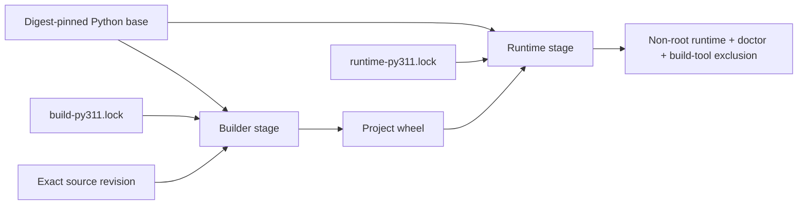

# Supply-Chain Integrity

> [!IMPORTANT]
> **Integrity, availability, reproducibility, and identity are different claims.** The ƳƤ AI QA Automation Framework binds accepted dependency/build inputs and produces revision-bound build evidence without treating package hashes, an SBOM, or a repeated build as publisher identity or release signing.

**ƳƤ AI QA Automation Framework** · Designed and engineered by **Ƴunior Ƥortal (ƳƤ)**

[Documentation home](README.md) · [Security](SECURITY.md) · [Verification boundaries](VERIFICATION_BOUNDARIES.md) · [Operations](OPERATIONS.md)

---

## Trust model

The repository separates supply-chain subjects instead of treating “the build” as one authority:

| Subject | Repository authority | Evidence produced |
|---|---|---|
| Python application/runtime graph | `requirements/runtime-py311.lock` | exact versions + accepted SHA-256 package hashes |
| Development/verification graphs | `requirements/dev-py311.lock`, `requirements/dev-py313.lock` | exact interpreter-specific verification environments |
| Automatic dependency-install definitions | exact reviewed Git-blob identities for all five committed `.lock` files | pre-install and post-install build-authority verification before project code or later CI tools run |
| Python build backend graph | `requirements/build-py311.lock` + `hatchling==1.32.0` | isolated backend dependency graph, separate from runtime |
| Project build/install configuration + file/source authority + Hatch plugin surface | exact static `pyproject.toml` build/Hatch configuration + distribution name `ai-qa-automation` + sole console script `ai-qa` + no GUI/project entry-point groups + fixed bounded `README.md`/`LICENSE` inputs + bounded symlink-free `src/ai_qa_automation` tree + no installed `hatch` entry points | checkout and per-archive build-authority JSON evidence |
| Container base | `requirements/base-image.lock` | exact `python:3.11.16-slim` OCI digest used by every Docker stage |
| Container runtime-composition definition | exact reviewed `Dockerfile` Git blob identity | deterministic denial of any unreviewed Dockerfile byte/instruction drift |
| Container build context | exact `$GITHUB_SHA` tar stream from an isolated bare Git view | runtime image consumes repository bytes from the GitHub event subject rather than mutable checkout state |

The dependency lock files are repository-owned resolution snapshots derived from declared project constraints, then committed and reviewed. Runtime installation uses `pip --require-hashes`; direct URL/VCS/editable requirements, non-exact pins, missing hashes, unexpected lock files, and non-SHA-256 hash directives are rejected by `scripts/verify_supply_chain.py`.

> [!NOTE]
> A package hash constrains which bytes can be accepted. It does **not** guarantee that the public package index is available, that a package publisher is trustworthy, or that future vulnerability intelligence will remain unchanged.

---

## Pre-install dependency authority

Hash-required installation is not sufficient if an unreviewed pull request can first rewrite the lock that `pip` consumes. A changed but internally hash-valid development lock could add a package that installs an executable named `ruff`, `pytest`, `pip-audit`, or another later CI command before the repository's deeper supply-chain verifier has run. The package hashes would constrain the added package bytes but would not make that newly expanded dependency/tool authority reviewed.

`scripts/verify_build_authority.py` therefore validates the **exact five reviewed lock-file bytes before automatic dependency installation**. The verifier is standard-library-only at this boundary and records the expected Git blob identity for `base-image.lock`, `build-py311.lock`, `dev-py311.lock`, `dev-py313.lock`, and `runtime-py311.lock`. It opens the `requirements/` directory and each reviewed lock through descriptor-relative no-follow operations, bounds actual directory/file ingestion, requires the exact `.lock` filename set, brackets file and directory identity during observation, and rejects any lock whose observed Git blob identity differs from the reviewed constant.

Every automatic `python -m pip install --require-hashes -r ...` site is structurally bracketed by `scripts/verify_build_authority.py`: the first invocation proves the lock subject before `pip` consumes it, and the second revalidates the same reviewed lock/build authority immediately after installation and before the project install or later repository-owned tool execution. `scripts/verify_ci_contract.py` requires exactly the reviewed five dependency-install definitions and rejects removal of either side of any bracket. The complete automatic workflow still has an exact reviewed Git-blob check as an additional in-run definition guard.

This design intentionally makes a dependency-lock refresh an explicit authority change. A legitimate lock update must be reviewed together with the corresponding `EXPECTED_LOCK_BLOB_SHAS` policy revision and then revalidated; a pull request cannot silently substitute a different lock and have the old automatic-install authority remain `PASS`.

The exact lock identities constrain repository-selected dependency inputs, not publisher identity or the hosted bootstrap interpreter/`pip`. Network/package-index availability and the bytes of the GitHub-hosted bootstrap remain environment-owned boundaries.

---

## Build/runtime separation

The Docker build deliberately prevents build tooling from becoming runtime authority:

The builder:

- uses the exact OCI digest in `base-image.lock`;
- installs only `build-py311.lock` with `--require-hashes`;
- builds with `--no-deps --no-build-isolation`;
- fixes `SOURCE_DATE_EPOCH=315532800` for deterministic wheel timestamps.

The runtime stage:

- uses the same exact OCI digest;
- installs only `runtime-py311.lock` with `--require-hashes`;
- installs the already-built project wheel with `--no-deps`;
- runs as the non-root `aiqa` user;
- is checked to exclude Hatchling and the build-only packages named by repository policy.

`scripts/verify_supply_chain.py` binds the complete bounded-read `Dockerfile` text to the reviewed Git blob identity before accepting its runtime-composition checks. Any added or changed Docker instruction—including an extra `apt`, `curl`, `pip`, `ADD`, or other unmodeled installation/network path—fails closed even if the required hash-lock tokens remain present. A legitimate Dockerfile change therefore requires an explicit authority review and an intentional update of the reviewed blob identity.

The runtime-container build does not hand mutable checkout `.` to Docker. It creates a separate fresh bare Git view and empty template under `RUNNER_TEMP`, executes Git through the same clean environment used for reproducible source archives, points the view at only the checked-out content-addressed object store, disables replacement-object rewriting, and archives exact `$GITHUB_SHA` with `core.attributesFile=/dev/null`. That tar stream is piped directly to `docker build --tag "$image" -`. Consequently, later worktree changes and checkout-local `.dockerignore` or Git metadata cannot silently retarget the repository bytes consumed by the runtime image; committed files and committed attributes in the exact event tree remain repository-owned context authority.

This exact-event context binding constrains **which repository bytes Docker may consume**. It does not attest Docker/BuildKit binaries, the hosted runner, registry availability, package-index availability, privileged mutation outside the build context, or the external registry beyond the already digest-pinned base subject.

No container-image byte-for-byte reproducibility claim is made. The Docker build verifies a digest-pinned base, reviewed runtime composition, and exact-event repository context; repeatability evidence currently applies to the Python wheel.

---

## Pre-build project authority

A pinned build backend is not sufficient if repository build configuration, installation metadata, file-valued project metadata, package-tree filesystem shape/resource volume, or an installed Hatch plugin can expand what a build or later CI step reads or executes. Hatch supports build hooks and plugin surfaces, project installation can create executables and entry points, and exact Hatchling 1.32.0 follows included filesystem paths when writing wheel files. Automatic CI therefore validates these repository-controlled authorities **before** any project build occurs.

`scripts/verify_build_authority.py` is intentionally standard-library-only so automatic jobs can execute it after Python setup without first importing or installing project code. In addition to the exact reviewed dependency-lock authority above, it reads `pyproject.toml` through bounded no-follow ingestion and requires:

- `[build-system]` to be exactly `requires = ["hatchling==1.32.0"]` plus `build-backend = "hatchling.build"`;
- no `backend-path` or additional build-system authority;
- the project distribution name to remain exactly `ai-qa-automation`, preventing project installation from replacing an unrelated locked distribution by name;
- a static non-empty project version and no dynamic project metadata;
- `[project.scripts]` to be exactly `ai-qa = "ai_qa_automation.cli:app"`, so project installation cannot add or replace other command names used by later CI;
- no `[project.gui-scripts]` or `[project.entry-points]` groups, preventing project-owned GUI/plugin entry-point expansion;
- the project README to remain exactly `README.md` and the project license file to remain exactly `LICENSE`;
- no `license-files` expansion of automatic build file authority;
- `[tool.hatch]` to contain only the reviewed wheel package selection `packages = ["src/ai_qa_automation"]`;
- therefore no custom Hatch build hooks, metadata hooks, version sources, custom builders, or other Hatch extension configuration.

The verifier opens `README.md` and `LICENSE` without following symlinks, requires them to be stable regular files during observation, and rejects either file above `MAX_PROJECT_FILE_INPUT_BYTES = 2 MiB`. It traverses the selected `src/ai_qa_automation` package tree through descriptor-relative no-follow operations, permits only regular files and real directories, rejects symlinks and special filesystem nodes, and revalidates file/directory identity during the walk. Actual directory ingestion is capped at `MAX_BUILD_SOURCE_ENTRIES = 1024`; each selected regular file is capped at `MAX_BUILD_SOURCE_FILE_BYTES = 8 MiB`; and aggregate selected-package bytes are capped at `MAX_BUILD_SOURCE_TOTAL_BYTES = 32 MiB`. These limits are enforced during the pre-build observation instead of relying on later wheel/artifact limits after Hatchling has already consumed the source.

The verifier also inspects installed distribution metadata with `importlib.metadata.entry_points(group="hatch")` and fails closed if any such entry point exists. It does not load or execute plugin code while performing this inspection. The supply-chain job emits `build-authority-verification.json` before installing the verification graph, then re-runs the same verifier after the exact reviewed hash-locked graph is installed and immediately before the checkout project build. The other automatic dependency/project-install paths use the same pre-/post-lock and pre-project-build checks. Because both dependency-lock and project-declared executable/entry-point surfaces are frozen before their corresponding installations, neither a rewritten lock nor project metadata can silently introduce a later-CI executable/plugin authority while preserving verifier `PASS`.

For the reproducible-wheel path, the checkout observation is not treated as proof of the later extracted source trees. After each exact-event archive is extracted, the checkout-owned verifier is invoked with `--root` against that specific archive immediately before its wheel build. CI persists the two deterministic results as `build-authority-archive-a.json` and `build-authority-archive-b.json` and requires them to be byte-identical. Those JSON results include the reviewed lock blob map, observed source entry/byte counts, and reviewed byte ceilings, so the equality check covers both archive roots under the same dependency/build/install/resource authority contract.

A future legitimate need for a dependency-lock change, different distribution name, additional console/GUI scripts, project entry-point groups, hook, installed Hatch plugin, dynamic metadata source, custom backend, backend path, additional file-valued project metadata, different package selection, package symlink, or larger reviewed build-input budget requires an explicit policy change rather than silently gaining build or later-CI authority.

This control constrains repository dependency-install inputs, build configuration, project installation metadata, declared file inputs, selected package-tree filesystem/resource authority, and installed Hatch plugin entry-point authority. Its filesystem checks are bounded observations; they do not create a privileged immutable filesystem snapshot after verification. The byte ceilings bound repository-controlled ingestion into the reviewed build path but do not make the hosted runner/build tools themselves resource-immutable. The verifier also does not independently attest the hosted Python bootstrap or package-publisher identity. Those remain covered only by the separate exact-version/hash-lock and hosted-runner trust boundaries described here.

---

## Immutable automation inputs

Permanent CI does not use floating GitHub Action tags. The reviewed Action revisions are exact 40-character commit SHAs for:

- `actions/checkout`;
- `actions/setup-python`;
- `actions/upload-artifact`.

The Ruff pre-commit mirror is likewise pinned to an exact repository commit rather than `v0.16.2` as a mutable ref. The public commit SHA literals carry narrow `detect-secrets` inline allowlist annotations because they are intentionally committed provenance identifiers, not credentials. The reviewed automatic-workflow, dependency-lock, and Dockerfile Git blob identifiers use the same narrow annotation for the same reason.

CI also names exact CPython patch releases (`3.11.16`, `3.13.15`) and uses the `ubuntu-24.04` runner family rather than `ubuntu-latest`.

> [!CAUTION]
> `ubuntu-24.04` is a stable hosted-runner family label, **not an immutable runner-image digest**. GitHub can service that family with newer image revisions. The repository records this as a residual platform boundary rather than calling hosted CI hermetic.

### Bootstrap trust boundary

The initial Python interpreter and `pip` process are supplied by the GitHub-hosted runner/toolcache selected by `actions/setup-python`. The repository pins the Action source and exact CPython patch version, but it cannot independently attest the bytes of that hosted bootstrap environment. If the toolcache already contains the same `pip` version named by a development lock, `pip` may report it as already satisfied rather than reinstalling it from a hashed artifact. The pre-install lock-blob check proves which repository lock bytes `pip` is instructed to consume; `--require-hashes` constrains accepted package candidates. Neither mechanism is a cryptographic attestation of the bootstrap installer itself. This remains an explicit environment-owned trust root.

---

## Deterministic repository verifiers

`scripts/verify_supply_chain.py` fails closed when repository supply-chain inputs drift. Among other checks, it requires:

- exactly the five expected lock files;
- a descriptor-pinned, no-follow `requirements/` directory scan with bounded actual ingestion and file/directory identity revalidation;
- exact `==` pins with SHA-256 hashes;
- no direct URLs, VCS requirements, editable lock entries, custom index/find-links directives, or duplicate packages;
- declared runtime/dev/build dependencies to be represented by their corresponding locks;
- build-only packages to remain outside the runtime graph;
- Docker stages to match `base-image.lock` exactly;
- the complete `Dockerfile` bytes to match the exact reviewed Git blob identity before runtime-composition `PASS`;
- hash-required Docker dependency installation;
- no live `pip install --upgrade` or editable CI install path;
- exact Python patch versions in permanent CI;
- only the reviewed immutable GitHub Action commits;
- only the reviewed immutable pre-commit revision.

The deeper lock verifier rejects symlink substitution, lock-file identity changes, requirements-directory replacement, and entry exhaustion instead of falling back to weaker pathname enumeration when the required descriptor-relative primitives are unavailable. Before any automatic lock consumption, `scripts/verify_build_authority.py` additionally requires the exact reviewed Git blob identity for all five lock files. These are complementary checks: the pre-install boundary controls which reviewed bytes may be consumed, while `verify_supply_chain.py` proves the internal lock/dependency policy for those bytes.

`scripts/verify_build_authority.py` is the earlier pre-build/pre-install boundary for exact dependency-lock bytes, executable project-build configuration, project installation metadata, file-valued project metadata, selected package-tree filesystem/resource authority, and installed Hatch plugin metadata; it is also reused against each extracted reproducible-build root. `scripts/verify_ci_contract.py` separately requires exactly five automatic dependency-install definitions bracketed by build/lock-authority checks, immediate build-authority revalidation before every automatic project install, the complete automatic `ci.yml` bytes to match their reviewed Git blob identity within the executing workflow, per-archive source verification before wheel creation, matching archive-authority evidence, exact-event isolated Git archive authority for the runtime-container build context, and upload of all three build-authority evidence files.

These verifiers emit machine-readable JSON statements about repository invariants. Their `PASS` states only that the corresponding deterministic checks passed inside the workflow execution subject; they do not certify external package availability, publisher identity, hosted-runner immutability, bootstrap-tool identity, post-observation filesystem immutability, Docker/BuildKit identity, immutable GitHub workflow-governance policy, or release signing.

---

## Reproducible wheel evidence

The permanent supply-chain CI job builds the project wheel twice from independently extracted archives of the exact GitHub event subject. For each run, CI creates fresh random build directories plus a fresh bare Git view and an empty Git template under `RUNNER_TEMP`. Git commands execute through an `env -i` environment that retains only `PATH` and the reviewed controls disabling system/global configuration, system attributes, replacement objects, lazy fetching, and optional locks. The fresh bare view points at the checked-out repository's content-addressed object store through `GIT_OBJECT_DIRECTORY` but does not reuse the checkout's Git directory/configuration. Both archives name `$GITHUB_SHA` and explicitly set `core.attributesFile=/dev/null`; `/usr/bin/tar` extraction also runs under an empty environment containing only `PATH`.

This construction removes checkout-local `.git/info/attributes`, checkout Git configuration, user/global configuration, and system attributes from archive authority instead of relying on a check/use/check bracket around mutable metadata. Committed `.gitattributes` in the exact event tree remains repository-owned source authority. Replacement-object rewriting is disabled and the event subject itself—not mutable `HEAD`—is named.

Each extracted tree is then passed to `scripts/verify_build_authority.py --root` immediately before its wheel build. The verifier confirms the exact reviewed lock identities, project-install metadata/file-valued metadata policy, and bounded symlink-free/special-node-free selected package tree for the source that Hatchling will consume. The two JSON results are persisted and must be byte-identical before later provenance generation can continue. Both builds still execute inside one CI job and therefore share the same hosted runner, object store, and installed build environment; the evidence establishes same-environment repeatability, not cross-runner or cross-operating-system reproducibility, and it does not attest runner binaries or privileged mutation of the object store.

`scripts/generate_build_manifest.py` requires an explicit `--expected-source-sha` and refuses to emit its manifest unless:

1. the expected source is a lowercase full object ID of the repository's actual Git object format and resolves to itself as an available commit;
2. the corresponding original tree resolves with replacement objects disabled;
3. current `HEAD` equals that explicit expected source before and after tracked source-input observation;
4. the observed `Dockerfile`, `pyproject.toml`, and all five lock files byte-match the blobs stored in that exact expected commit;
5. both fresh-tree builds produce one wheel with the same artifact name and identical SHA-256 digest/size;
6. the tracked checkout is clean around source-input observation;
7. the expected source-date epoch is active; and
8. the CycloneDX runtime SBOM is structurally present and its observed digest matches the parent CI-owned `RUNTIME_SBOM_SHA256` value.

The manifest's Git subprocesses disable system/global Git configuration, replacement refs, optional Git locks, and lazy fetching. Fixed source-input paths are read from the expected commit with bounded blob-size checks before content ingestion. The worktree bytes used to derive manifest input digests must then exactly equal those expected-commit blob bytes; a clean-status heuristic alone is not accepted as source authority.

The manifest generator binds parsed SBOM metadata and the SBOM digest to one bounded no-follow byte observation. In addition, the parent CI workflow computes the runtime-SBOM SHA-256 immediately after the hash-locked audit, exports that digest through the GitHub step environment, and requires the same digest before wheel builds, after both wheel builds, and after manifest generation. The manifest itself must also accept that parent-owned digest. Consequently, later build activity cannot silently substitute a different SBOM and have that replacement accepted as the earlier audit subject.

Manifest persistence rejects ambiguous symlink ownership and uses atomic replacement plus directory fsync.

`scripts/verify_ci_contract.py` freezes the complete automatic-workflow Git blob identity in addition to the dependency-install brackets, pre-build authority, immediate automatic-project-install guards, runtime-SBOM digest export, isolated bare-Git archive construction, per-archive build-authority checks and matching persisted evidence, reproducible-build shell block, exact-event runtime-container build-context construction, supply-chain evidence set, and their safety-critical ordering. Replacing `$GITHUB_SHA` with mutable `HEAD`, re-enabling Git replacement objects, removing the clean Git environment, fresh Git view/object-directory/empty-template controls, reintroducing ambient archive attributes, allowing dirty tar extraction authority, removing either side of an automatic dependency-install authority bracket, removing either archive verification or its equality/evidence requirement, removing the SBOM lineage checks, moving project installation ahead of build-authority validation, adding an alternate unreviewed project-install command, reverting the runtime container to mutable checkout `docker build ... .`, or removing required evidence causes deterministic CI-contract failure **inside a run that executes this verifier**.

The resulting unsigned manifest records:

- exact Git event-subject commit and original tree SHA;
- Python version and source-date epoch;
- wheel name, size, and SHA-256;
- Dockerfile and `pyproject.toml` SHA-256, each byte-bound to the expected commit;
- every committed lock-file SHA-256, each byte-bound to the expected commit;
- exact container base subject;
- CycloneDX format/spec/component count and SBOM SHA-256;
- `signed: false` / `NOT_PROVIDED` identity state.

This is intentionally an **unsigned reproducible-build manifest**, not a provenance signature.

---

## Workflow-definition enforcement boundary

The automatic workflow's exact Git-blob check is strong **in-run evidence**, but it is not independent external workflow governance. For a `pull_request` event, GitHub executes the workflow associated with the event/merge subject. A pull request that changes `.github/workflows/ci.yml` can therefore change the workflow code that would otherwise check its own definition. GitHub required status checks identify the required check/context and source integration; they do not make the repository workflow file itself immutable.

The repository's active default-branch ruleset currently requires the strict `Required PR Gate` check from GitHub Actions and has no bypass actors, which is valuable merge enforcement for the check that actually ran. That ruleset does **not** independently bind that check to an immutable `.github/workflows/ci.yml` definition. Consequently, repository-local workflow self-verification must not be presented as proof that an arbitrary future pull request cannot rewrite the certifying workflow and emit the same required check context.

Closing that generic workflow-mutation boundary requires an authority outside the pull request's editable workflow subject—for example an organization/Enterprise required-workflow control, a separately trusted GitHub App/check producer, or another repository/platform policy that makes workflow updates independently non-authoritative. The currently connected repository-management surface does not expose a ruleset mutation that can establish such an immutable workflow identity for this user-owned repository, so this remains an explicit environment/governance boundary rather than a fabricated `PASS`.

This limitation does **not** invalidate static review or exact-subject execution evidence for a specific candidate whose workflow bytes were independently reviewed. It does prevent treating the existing status-check requirement plus repository-local self-check as a universal tamper-proof workflow-governance guarantee.

---

## SBOM and vulnerability evidence

The supply-chain job audits the exact hash-locked Python runtime dependency subject and emits CycloneDX JSON. The security job separately audits the exact development/verification lock.

For the runtime SBOM, artifact existence is not enough. Its post-audit SHA-256 becomes parent-step authority and is bracketed across the later wheel-build and manifest operations. A green supply-chain job therefore proves that the uploaded/manifest-recorded SBOM subject remained byte-identical to the subject produced by the earlier runtime audit through those operations.

The runtime SBOM describes the Python package subject represented by the runtime lock. It does **not** claim coverage of:

- Debian/OS packages in the base container;
- Chromium/system packages installed for Playwright jobs;
- external MCP/provider services;
- target/SUT dependencies outside this repository;
- registry or package-publisher identity.

Vulnerability results are time-sensitive observations. A green audit at one revision/time does not permanently certify a dependency as vulnerability-free.

---

## Evidence boundaries

| Claim | What proves it | What does **not** prove it |
|---|---|---|
| Automatic dependency lock subject is the reviewed subject before `pip` consumes it | descriptor-pinned exact `.lock` set + exact reviewed Git blob identities + pre/post verification around every automatic dependency install | package-index availability, package publisher identity, or hosted bootstrap-installer identity |
| Accepted Python package candidates are constrained | exact reviewed lock subject + exact lock pins + `--require-hashes` | package-index availability, publisher trust, or bootstrap-installer identity |
| Project build/install authority excludes unreviewed execution/filesystem/resource expansion | exact distribution/console-script policy + no project GUI/entry-point groups + exact static build/Hatch configuration + fixed bounded README/LICENSE authority + bounded no-follow symlink-free selected package-tree observation on checkout and both extracted build roots + per-file/aggregate source-byte ceilings + installed `hatch` entry-point denial + immediate automatic-install guards | post-observation immutable filesystem state, general proof that all future build systems are safe, or independent package-byte attestation |
| Build backend graph is repository-bound | exact `hatchling==1.32.0` + reviewed build lock | build publisher identity |
| Container base subject is fixed | OCI digest in `base-image.lock` and Dockerfile | byte-identical rebuilt container image |
| Container runtime-composition definition is the reviewed subject | exact Dockerfile Git blob identity + existing digest/hash-lock/non-root composition checks | byte-identical rebuilt image, registry identity, or proof that a future Dockerfile change is safe without review |
| Container repository build context is the exact CI event subject | isolated clean Git view + exact `$GITHUB_SHA` archive streamed directly to Docker + complete in-run `ci.yml` definition check | Docker/BuildKit identity, hosted-runner immutability, external registry/package availability, or byte-identical rebuilt image |
| Automatic CI definition matched the reviewed bytes **within the executed run** | exact `ci.yml` Git blob identity + structural trigger/permission/step guards | independent proof that a future PR cannot rewrite the workflow that emits the required check |
| Default-branch merge requires the configured status check | live GitHub repository ruleset state | immutable binding of that check to one workflow-file identity |
| Wheel is repeatable for the exact CI event subject and recorded inputs | two fresh-bare-view/no-replace `$GITHUB_SHA` archives with versioned-tree-only attribute authority + per-archive build-authority evidence + expected-commit-bound manifest inputs + identical wheel SHA-256 in one CI environment | signer/publisher identity, runner-binary attestation, privileged object-store immutability, or cross-environment reproducibility |
| Runtime Python SBOM remained the audited subject through wheel generation | post-audit SHA-256 exported before builds + digest checks around later build/manifest activity + manifest acceptance of the parent-owned digest | OS/container/provider coverage or permanent vulnerability status |
| GitHub Actions are source-revision pinned | exact reviewed Action commit SHAs | immutable hosted runner OS/image |
| Artifact identity is signed | **not provided by repository CI** | SHA-256, SBOM, or reproducibility alone |

---

## Updating supply-chain authority

A dependency, lock definition, Action, build-backend/configuration, project-install metadata/resource budget, interpreter, automatic-workflow definition, Dockerfile, container build-context contract, or container-base update is a controlled engineering change—not a background resolver event. The update should:

1. verify official provenance of the proposed upstream subject;
2. resolve/regenerate the affected candidate lock or digest material deliberately from the declared repository constraints, recording the interpreter and resolver/tooling used for the update;
3. review graph additions/removals and authority changes rather than treating generated comments as authority;
4. explicitly review any proposed change to exact lock blob authority, build backend/configuration, distribution name, console/GUI scripts, project entry-point groups, file-valued project inputs, selected package-tree shape/symlink/resource policy, installed Hatch plugin surface, source-execution extension points, automatic CI command surface, Docker runtime-composition instructions, or exact-event container build-context construction;
5. update reviewed lock/workflow/Dockerfile Git blob identities only after the corresponding authority review;
6. run the pre-install/pre-build authority verifier against the checkout and reproducible-build roots, deterministic repository verifiers, and adversarial tests;
7. run applicable vulnerability/secret/static scans;
8. reproduce the project wheel and regenerate the runtime SBOM;
9. build and inspect the final runtime container from the exact event-subject context;
10. bind completion evidence to the exact source revision before merge and separately verify any external workflow-governance controls being claimed.

A lock refresh is not claimed to reproduce an old resolver decision indefinitely: package-index metadata and available distributions can evolve. The committed reviewed lock is the build/install authority until a deliberately reviewed replacement supersedes it.

Release publication, signing keys, registry credentials, external workflow-governance controls, and transparency/attestation services remain environment-owned privileged operations. They should be manual or environment-protected unless a dedicated design deliberately adds those authorities.

---

[← Security](SECURITY.md) · [Verification boundaries →](VERIFICATION_BOUNDARIES.md)

Copyright (c) 2026 Ƴunior Ƥortal (ƳƤ). See [`../LICENSE`](../LICENSE).
