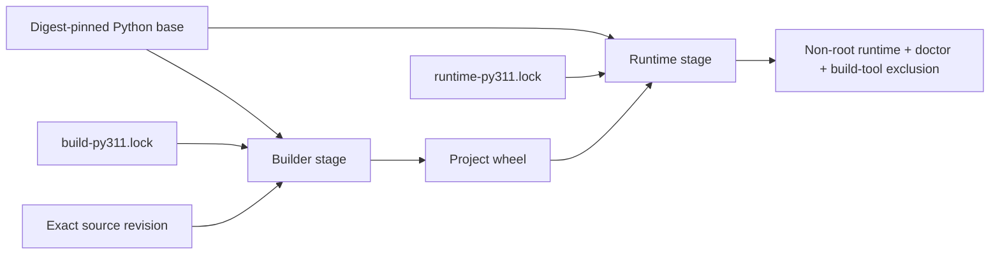

# Supply-Chain Integrity

> [!IMPORTANT]
> **Integrity, availability, reproducibility, and identity are different claims.** The ƳƤ AI QA Automation Framework binds accepted dependency/build inputs and produces revision-bound build evidence without treating package hashes, an SBOM, or a repeated build as publisher identity or release signing.

**ƳƤ AI QA Automation Framework** · Designed and engineered by **Ƴunior Ƥortal (ƳƤ)**

[Documentation home](README.md) · [Security](SECURITY.md) · [Verification boundaries](VERIFICATION_BOUNDARIES.md) · [Operations](OPERATIONS.md)

---

## Trust model

The repository separates four supply-chain subjects:

| Subject | Repository authority | Evidence produced |
|---|---|---|
| Python application/runtime graph | `requirements/runtime-py311.lock` | exact versions + accepted SHA-256 package hashes |
| Development/verification graphs | `requirements/dev-py311.lock`, `requirements/dev-py313.lock` | exact interpreter-specific verification environments |
| Python build backend | `requirements/build-py311.lock` + `hatchling==1.32.0` in `pyproject.toml` | isolated backend graph, separate from runtime |
| Container base | `requirements/base-image.lock` | exact `python:3.11.16-slim` OCI digest used by every Docker stage |

The dependency lock files are generated from declared project constraints, then committed and reviewed. Runtime installation uses `pip --require-hashes`; direct URL/VCS/editable requirements, non-exact pins, missing hashes, unexpected lock files, and non-SHA-256 hash directives are rejected by `scripts/verify_supply_chain.py`.

> [!NOTE]
> A package hash constrains which bytes can be accepted. It does **not** guarantee that the public package index is available, that a package publisher is trustworthy, or that future vulnerability intelligence will remain unchanged.

---

## Build/runtime separation

The Docker build deliberately prevents build tooling from becoming runtime authority:

The builder:

- uses the exact OCI digest in `base-image.lock`;
- installs only `build-py311.lock` with `--require-hashes`;
- builds with `--no-deps --no-build-isolation`;
- fixes `SOURCE_DATE_EPOCH=315532800` for deterministic wheel timestamps.

The runtime stage:

- uses the same exact OCI digest;
- installs only `runtime-py311.lock` with `--require-hashes`;
- installs the already-built project wheel with `--no-deps`;
- runs as the non-root `aiqa` user;
- is checked to exclude Hatchling and the build-only packages named by repository policy.

No container-image byte-for-byte reproducibility claim is made. The Docker build verifies a digest-pinned base and runtime composition; reproducibility evidence currently applies to the Python wheel.

---

## Immutable automation inputs

Permanent CI does not use floating GitHub Action tags. The reviewed Action revisions are exact 40-character commit SHAs for:

- `actions/checkout`;
- `actions/setup-python`;
- `actions/upload-artifact`.

The Ruff pre-commit mirror is likewise pinned to an exact repository commit rather than `v0.16.2` as a mutable ref. The public commit SHA literals carry narrow `detect-secrets` inline allowlist annotations because they are intentionally committed provenance identifiers, not credentials.

CI also names exact CPython patch releases (`3.11.16`, `3.13.15`) and uses the `ubuntu-24.04` runner family rather than `ubuntu-latest`.

> [!CAUTION]
> `ubuntu-24.04` is a stable hosted-runner family label, **not an immutable runner-image digest**. GitHub can service that family with newer image revisions. The repository records this as a residual platform boundary rather than calling hosted CI hermetic.

---

## Deterministic repository verifier

`scripts/verify_supply_chain.py` fails closed when repository supply-chain authority drifts. Among other checks, it requires:

- exactly the five expected lock files;
- bounded regular lock files;
- exact `==` pins with SHA-256 hashes;
- no direct URLs, VCS requirements, editable lock entries, custom index/find-links directives, or duplicate packages;
- declared runtime/dev/build dependencies to be represented by their corresponding locks;
- build-only packages to remain outside the runtime graph;
- Docker stages to match `base-image.lock` exactly;
- hash-required Docker dependency installation;
- no live `pip install --upgrade` or editable CI install path;
- exact Python patch versions in permanent CI;
- only the reviewed immutable GitHub Action commits;
- only the reviewed immutable pre-commit revision.

The verifier emits a machine-readable JSON statement about these repository invariants. Its `PASS` means those deterministic repository checks passed; it does not certify external package availability, external publisher identity, hosted-runner immutability, or release signing.

---

## Reproducible wheel evidence

The permanent supply-chain CI job builds the project wheel twice from two independently extracted `git archive` trees of the same checked-out revision with the fixed `SOURCE_DATE_EPOCH`.

`scripts/generate_build_manifest.py` refuses to emit its manifest unless:

1. both builds produce one wheel with the same artifact name;
2. the two wheel SHA-256 digests are identical;
3. the tracked checkout is clean;
4. the expected source-date epoch is active;
5. the CycloneDX runtime SBOM is structurally present.

The resulting unsigned manifest records:

- exact Git commit and tree SHA;
- Python version and source-date epoch;
- wheel name, size, and SHA-256;
- Dockerfile and `pyproject.toml` SHA-256;
- every committed lock-file SHA-256;
- exact container base subject;
- CycloneDX format/spec/component count and SBOM SHA-256;
- `signed: false` / `NOT_PROVIDED` identity state.

This is intentionally an **unsigned reproducible-build manifest**, not a provenance signature.

---

## SBOM and vulnerability evidence

The supply-chain job audits the exact hash-locked Python runtime dependency subject and emits CycloneDX JSON. The security job separately audits the exact development/verification lock.

The runtime SBOM describes the Python package subject represented by the runtime lock. It does **not** claim coverage of:

- Debian/OS packages in the base container;
- Chromium/system packages installed for Playwright jobs;
- external MCP/provider services;
- target/SUT dependencies outside this repository;
- registry or package-publisher identity.

Vulnerability results are time-sensitive observations. A green audit at one revision/time does not permanently certify a dependency as vulnerability-free.

---

## Evidence boundaries

| Claim | What proves it | What does **not** prove it |
|---|---|---|
| Accepted Python dependency bytes are constrained | exact lock pins + `--require-hashes` | package-index availability or publisher trust |
| Build backend is repository-bound | exact `hatchling==1.32.0` + build lock | build publisher identity |
| Container base subject is fixed | OCI digest in `base-image.lock` and Dockerfile | byte-identical rebuilt container image |
| Wheel is reproducible for the recorded build inputs | two fresh-tree builds with identical SHA-256 | signer/publisher identity |
| Runtime Python SBOM was emitted | CycloneDX output from the runtime lock audit | OS/container/provider coverage |
| GitHub Actions are source-revision pinned | exact reviewed Action commit SHAs | immutable hosted runner OS/image |
| Artifact identity is signed | **not provided by repository CI** | SHA-256, SBOM, or reproducibility alone |

---

## Updating supply-chain authority

A dependency, Action, build-backend, interpreter, or container-base update is a controlled engineering change—not a background resolver event. The update should:

1. verify official provenance of the proposed upstream subject;
2. regenerate the affected lock/digest material deliberately;
3. review graph additions/removals and authority changes;
4. run the deterministic repository verifier and adversarial tests;
5. run applicable vulnerability/secret/static scans;
6. reproduce the project wheel and regenerate the runtime SBOM;
7. build and inspect the final runtime container;
8. bind completion evidence to the exact source revision before merge.

Release publication, signing keys, registry credentials, and external transparency/attestation services remain environment-owned privileged operations. They should be manual or environment-protected unless a dedicated release design deliberately adds those authorities.

---

[← Security](SECURITY.md) · [Verification boundaries →](VERIFICATION_BOUNDARIES.md)

Copyright (c) 2026 Ƴunior Ƥortal (ƳƤ). See [`../LICENSE`](../LICENSE).
