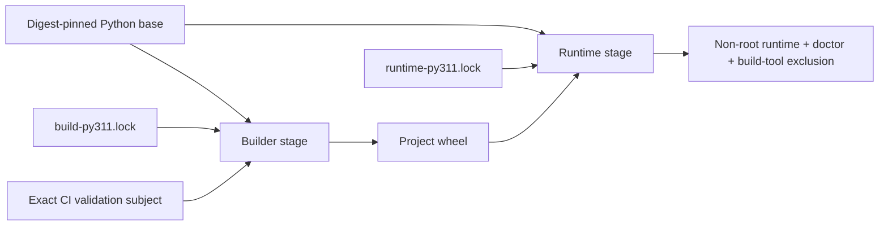

# Supply-Chain Integrity

> [!IMPORTANT]
> **Integrity, availability, reproducibility, identity, and merge authority are different claims.** The ƳƤ AI QA Automation Framework binds accepted dependency/build inputs and produces subject-bound build evidence without treating package hashes, an SBOM, a repeated build, or a green PR workflow as publisher identity, release signing, or independently trusted merge authorization.

**ƳƤ AI QA Automation Framework** · Designed and engineered by **Ƴunior Ƥortal (ƳƤ)**

[Documentation home](README.md) · [Security](SECURITY.md) · [CI/CD](CI_CD.md) · [Trusted PR control plane](TRUSTED_PR_CONTROL_PLANE.md) · [Verification boundaries](VERIFICATION_BOUNDARIES.md) · [Operations](OPERATIONS.md)

---

## Trust model

The repository separates supply-chain subjects instead of treating “the build” as one authority:

| Subject | Repository authority | Evidence produced |
|---|---|---|
| Python application/runtime graph | `requirements/runtime-py311.lock` | exact versions + accepted SHA-256 package hashes |
| Development/verification graphs | `requirements/dev-py311.lock`, `requirements/dev-py313.lock` | exact interpreter-specific verification environments |
| Automatic dependency-install definitions | exact reviewed Git-blob identities for all five committed `.lock` files | pre-install and post-install build-authority verification before project code or later CI tools run |
| Python build backend graph | `requirements/build-py311.lock` + `hatchling==1.32.0` | isolated backend dependency graph, separate from runtime |
| Project build/install configuration + file/source authority + Hatch plugin surface | exact static `pyproject.toml` build/Hatch configuration + distribution name `ai-qa-automation` + sole console script `ai-qa` + no GUI/project entry-point groups + fixed bounded `README.md`/`LICENSE` inputs + bounded symlink-free `src/ai_qa_automation` tree + no installed `hatch` entry points | checkout and per-archive build-authority JSON evidence |
| CI validation subject | `CI_SUBJECT_SHA`: `github.sha` for ordinary events or `repository_dispatch.client_payload.expected_merge_sha` for the dormant trusted path | exact-subject checkout, archive, manifest, wheel, SBOM lineage, and container-context evidence |
| Automatic browser runtime | hosted `/usr/bin/google-chrome`, observed before the reference test; no automatic browser/OS installer authority | observed Chrome version + deterministic localhost reference-SUT JUnit evidence |
| Container base | `requirements/base-image.lock` | exact `python:3.11.16-slim` OCI digest used by every Docker stage |
| Container runtime-composition definition | exact reviewed `Dockerfile` Git blob identity | deterministic denial of unreviewed Dockerfile byte/instruction drift |
| Container build context | exact `CI_SUBJECT_SHA` tar stream from an isolated bare Git view | runtime image consumes repository bytes from the selected validation subject rather than mutable checkout state |
| Trusted reporter implementation | default-branch `repository_dispatch` `github.sha`, separate from `CI_SUBJECT_SHA` | reporter validates trusted workflow revision before any status write; live PR head/base/merge are re-fetched before terminal status |

The dependency lock files are repository-owned resolution snapshots derived from declared project constraints and then committed/reviewed. Runtime and verification installation use `pip --require-hashes`; direct URL/VCS/editable requirements, non-exact pins, missing hashes, unexpected lock files, and non-SHA-256 hash directives are rejected by `scripts/verify_supply_chain.py`.

> [!NOTE]
> A package hash constrains which bytes can be accepted. It does **not** prove package-publisher identity, package-index availability, future vulnerability status, or the integrity of the hosted bootstrap interpreter/installer.

---

## Validation-subject authority

`ci.yml` defines the repository build/evidence subject once:

```text
CI_SUBJECT_SHA = repository_dispatch ? client_payload.expected_merge_sha : github.sha
```

For ordinary `pull_request`, `push`, and `merge_group` execution, this preserves the existing GitHub event subject. For the dormant trusted `repository_dispatch` path, `expected_merge_sha` is untrusted dispatch data used only to select the read-only validation subject.

The five validation jobs all:

- check out `CI_SUBJECT_SHA`;
- disable persisted checkout credentials;
- immediately verify `git rev-parse HEAD == CI_SUBJECT_SHA`.

The same subject is used for:

- both isolated reproducible-wheel archives;
- `generate_build_manifest.py --expected-source-sha`;
- the isolated runtime-container tar context.

No reviewed build/evidence step derives the accepted subject from mutable `HEAD`.

The trusted reporter is deliberately separate. On the dormant `repository_dispatch` path it checks out and verifies `github.sha`, which GitHub resolves from the default branch for that event, while the prospective merge subject remains data. The reporter/helper then re-fetches the live pull request before any status write. This separation is documented in [`TRUSTED_PR_CONTROL_PLANE.md`](TRUSTED_PR_CONTROL_PLANE.md); it is not yet active merge authority because the definition is still on a draft branch and the external policy/bootstrap prerequisites remain unverified.

---

## Pre-install dependency authority

Hash-required installation is insufficient if an unreviewed pull request can first rewrite the lock that `pip` consumes. A changed but internally hash-valid development lock could add a package that installs an executable named `ruff`, `pytest`, `pip-audit`, or another later CI command before the deeper supply-chain verifier runs.

`scripts/verify_build_authority.py` therefore validates the **exact five reviewed lock-file bytes before automatic dependency installation**. The standard-library-only boundary requires:

- exactly `base-image.lock`, `build-py311.lock`, `dev-py311.lock`, `dev-py313.lock`, and `runtime-py311.lock`;
- each file's reviewed Git blob identity;
- descriptor-relative no-follow directory/file observation;
- bounded requirements-directory enumeration;
- regular-file identity stability around ingestion;
- 1 MiB maximum reviewed lock-file ingestion.

Every automatic `python -m pip install --require-hashes -r ...` site is structurally bracketed by `verify_build_authority.py`: the first invocation proves the lock subject before `pip` consumes it, and the second revalidates the same reviewed lock/build authority immediately after installation and before project installation or later repository-owned tool execution.

`scripts/verify_ci_contract.py` requires exactly the reviewed five dependency-install definitions and rejects removal of either side of any bracket. A legitimate lock refresh therefore requires an explicit review plus intentional policy-constant update; a pull request cannot silently substitute a different lock while preserving the old pre-install authority result.

These controls constrain repository-selected dependency inputs. They do not independently attest the hosted Python bootstrap, `pip` executable bytes, package publisher, or network/package-index availability.

---

## Pre-build project authority

A pinned backend is insufficient if repository build configuration, install metadata, file-valued project metadata, package-tree shape/resource volume, or installed build plugins can expand what a build or later CI step reads or executes.

Before project build/install, `scripts/verify_build_authority.py` requires:

- `[build-system]` exactly `requires = ["hatchling==1.32.0"]` plus `build-backend = "hatchling.build"`;
- no `backend-path`;
- project distribution name exactly `ai-qa-automation`;
- a static non-empty project version and no dynamic metadata;
- `[project.scripts]` exactly `ai-qa = "ai_qa_automation.cli:app"`;
- no `[project.gui-scripts]` or `[project.entry-points]` expansion;
- project README exactly `README.md` and license file exactly `LICENSE`;
- no `license-files` expansion;
- reviewed Hatch wheel package selection only: `src/ai_qa_automation`;
- no custom Hatch build hooks, metadata hooks, version sources, custom builders, or extension configuration;
- no installed `hatch` entry point exposed through distribution metadata.

### File and resource bounds

The verifier requires `README.md` and `LICENSE` to be stable regular non-symlink files and caps each at **2 MiB**.

The selected package tree is traversed through descriptor-relative no-follow operations. It permits only real directories and regular files, rejects symlinks and special nodes, and revalidates identity during observation. Limits are enforced during traversal:

- at most **1024** selected package entries;
- at most **8 MiB** per selected regular source file;
- at most **32 MiB** aggregate selected-package bytes.

These budgets prevent a small number of oversized repository files from forcing unbounded pre-build ingestion before later wheel limits apply.

### Install executable/plugin authority

Freezing the project distribution name and sole console script prevents project installation from:

- colliding with an unrelated locked distribution name;
- creating later-CI executable names such as `docker`, `ruff`, `pytest`, or `pip-audit`;
- adding GUI/entry-point surfaces;
- declaring project-owned Hatch plugin metadata after the pre-install plugin check.

The verifier inspects installed `hatch` entry-point metadata without loading or executing plugin code.

### Archive-specific revalidation

The checkout observation is not reused as proof of later extracted source trees. After each exact-subject archive is extracted, the checkout-owned verifier executes with `--root` against that archive immediately before wheel creation.

CI persists:

- `build-authority-archive-a.json`;
- `build-authority-archive-b.json`.

Those deterministic JSON results must be byte-identical. They include the reviewed lock blob map, observed source entry/byte counts, and reviewed ceilings, so both archive roots are checked under the same dependency/build/install/resource authority contract.

A future legitimate dependency-lock change, distribution-name change, added console/GUI script, project entry-point group, build hook/plugin, dynamic metadata source, backend path, file-valued metadata expansion, package selection change, symlink, or resource-budget change requires an explicit policy update rather than silently gaining authority.

---

## Build/runtime separation

The Docker build prevents build tooling from becoming runtime authority:



The builder:

- uses the exact OCI digest in `base-image.lock`;
- installs only `build-py311.lock` with `--require-hashes`;
- builds with `--no-deps --no-build-isolation`;
- fixes `SOURCE_DATE_EPOCH=315532800` for deterministic wheel timestamps.

The runtime stage:

- uses the same exact OCI digest;
- installs only `runtime-py311.lock` with `--require-hashes`;
- installs the already-built project wheel with `--no-deps`;
- runs as non-root user `aiqa`;
- is checked to exclude Hatchling and repository-defined build-only packages.

`scripts/verify_supply_chain.py` binds the complete bounded-read `Dockerfile` bytes to the reviewed Git blob identity before accepting runtime-composition checks. Any added or changed Docker instruction—including unreviewed `apt`, `curl`, `pip`, `ADD`, or other installation/network authority—requires an intentional reviewed blob update rather than passing through token-presence checks.

---

## Runtime-container context authority

The runtime-container build does not hand mutable checkout `.` to Docker. It creates a separate fresh bare Git view and empty template under `RUNNER_TEMP`, runs Git under the reviewed clean environment, points the view at the checked-out content-addressed object store, disables replacement-object rewriting, and archives exact `$CI_SUBJECT_SHA` with `core.attributesFile=/dev/null`.

That tar stream is piped directly to:

```text
docker build --tag "$image" -
```

Consequently, later worktree changes, checkout-local `.dockerignore`, checkout Git metadata, global/system attributes, and mutable `HEAD` cannot silently retarget the repository bytes consumed by the runtime image. Committed files and committed attributes in the selected validation tree remain repository-owned context authority.

This control constrains **which repository bytes Docker may consume**. It does not attest Docker/BuildKit binaries, the hosted runner, external registry availability, package-index availability, or privileged mutation outside the build context.

No container-image byte-for-byte reproducibility claim is made. The container check proves digest-pinned base selection, reviewed runtime composition, exact validation-subject repository context, non-root runtime behavior, doctor success, and exclusion of reviewed build-only packages.

---

## Reproducible wheel authority

The reproducible-wheel path creates fresh random source directories and a fresh bare Git view initialized from an empty template. Git executes through a clean `env -i` authority containing only `PATH` plus reviewed controls for:

- system/global config isolation;
- system attribute isolation;
- replacement-object disabling;
- lazy-fetch disabling;
- optional-lock disabling.

The bare view shares only the checked-out repository object store. Both archives explicitly name `$CI_SUBJECT_SHA`; `core.attributesFile=/dev/null` prevents mutable global attribute injection, and extraction runs `/usr/bin/tar` under a clean environment.

The two archive roots are independently build-authority-verified immediately before wheel creation. The wheel outputs must match under the repository reproducibility contract.

This proves repeatability for the tested Python wheel under the reviewed build environment and source subject. It is not a package signature, publisher identity attestation, or guarantee that a different hosted platform/toolchain produces identical bytes.

---

## Build-manifest and SBOM lineage

`scripts/generate_build_manifest.py` requires an explicit `--expected-source-sha`. CI passes `$CI_SUBJECT_SHA`; the manifest does not accept mutable `HEAD` as source authority.

The generator resolves the original commit/tree with replacement-object rewriting disabled, verifies tracked fixed inputs against exact expected commit blobs, brackets repository HEAD around manifest construction, and binds the runtime SBOM digest into the manifest.

The runtime CycloneDX SBOM is generated from the hash-locked runtime graph. Immediately after the audit, CI records its SHA-256 into the parent step environment. The wheel/build-manifest step requires the same digest:

- before wheel generation;
- after both wheel builds;
- after manifest generation.

The manifest generator independently requires the parent-owned digest. A later action therefore cannot silently replace the audited SBOM with a different structurally valid file while preserving the reviewed lineage checks.

---

## Immutable automation inputs

Permanent CI uses exact reviewed GitHub Action commit SHAs for:

- `actions/checkout`;
- `actions/setup-python`;
- `actions/upload-artifact`.

The Ruff pre-commit mirror is pinned to an exact repository commit. Public Git/action/blob SHA literals use narrow `detect-secrets` allowlist annotations only where necessary because they are provenance identifiers, not credentials.

CI names exact CPython patch releases (`3.11.16`, `3.13.15`) and the `ubuntu-24.04` runner family instead of `ubuntu-latest`.

> [!CAUTION]
> `ubuntu-24.04` is a hosted-runner family label, **not an immutable runner-image digest**. GitHub can service that label with newer runner/browser/tool images. The repository records this as an environment boundary rather than calling hosted CI hermetic.

### Automatic browser runtime boundary

The automatic reference-SUT browser job consumes hosted `/usr/bin/google-chrome` instead of installing a browser during untrusted validation. Its exact reviewed step requires the executable and records its version. `scripts/verify_ci_contract.py` rejects automatic tokens for `playwright install`, `sudo`, `apt-get`, and `apt install`.

Absence or incompatibility is a browser-validation failure/incomplete condition, not authorization to acquire root/browser-install authority during the PR run.

### Bootstrap trust boundary

The initial Python interpreter and `pip` process are supplied by the GitHub-hosted runner/toolcache selected by the pinned `actions/setup-python` source and exact requested Python patch version. The repository cannot independently attest those hosted bootstrap bytes.

The pre-install lock-blob check proves which repository lock bytes `pip` is instructed to consume; `--require-hashes` constrains accepted package candidates. Neither mechanism is a cryptographic attestation of the bootstrap installer itself.

---

## Deterministic repository verifiers

`scripts/verify_supply_chain.py` fails closed on repository supply-chain drift. Among other checks, it requires:

- exactly the five reviewed lock files;
- descriptor-pinned no-follow requirements-directory ingestion with bounded enumeration and identity revalidation;
- exact `==` pins with SHA-256 hashes;
- no direct URLs, VCS requirements, editable entries, custom index/find-links directives, or duplicate packages;
- declared runtime/dev/build dependencies represented by corresponding locks;
- build-only packages excluded from the runtime graph;
- Docker stages matching `base-image.lock` exactly;
- complete `Dockerfile` bytes matching the reviewed Git blob identity;
- hash-required Docker dependency installation;
- no live `pip install --upgrade` or editable CI install path;
- exact Python patch versions and only reviewed immutable Actions/pre-commit revisions.

`scripts/verify_build_authority.py` provides the earlier pre-install/pre-build boundary for exact lock bytes, build configuration, project install metadata, selected filesystem/resource authority, and installed Hatch entry-point authority.

`scripts/verify_ci_contract.py` binds those controls into the workflow definition and additionally requires:

- fixed normal + `repository_dispatch` trigger contract;
- five `CI_SUBJECT_SHA` validation checkouts;
- one separate trusted `github.sha` reporter checkout;
- exact dependency/project-install counts and bracketing;
- cache denial in both `ci.yml` and `manual-validation.yml`;
- exact SBOM/reproducible-wheel/container/evidence blocks;
- exact complete `ci.yml` Git blob identity;
- sole trusted reporter write/token authority.

These verifiers are deterministic repository controls. During ordinary PR execution they remain part of the PR subject and therefore do not independently solve merge-authority provenance; that external/bootstrap boundary is described in [`CI_CD.md`](CI_CD.md) and [`TRUSTED_PR_CONTROL_PLANE.md`](TRUSTED_PR_CONTROL_PLANE.md).

---

## Evidence bundle

The automatic Supply Chain job persists the reviewed evidence set, including:

- checkout build-authority verification;
- archive A/B build-authority verification;
- supply-chain verifier result;
- CI-contract verifier result;
- documentation-integrity result;
- Mermaid-validation result;
- runtime CycloneDX SBOM;
- build manifest;
- SHA-256 checksum file;
- reproducible wheel artifact;
- runtime container image ID.

Artifact upload uses the exact reviewed immutable `actions/upload-artifact` revision with `if-no-files-found: error` for the supply-chain bundle and bounded retention.

Artifact presence alone does not imply Supply Chain or overall CI succeeded: failure-path uploads may contain partial diagnostic evidence. Terminal job conclusions and the aggregate gate remain authoritative for what actually passed.

---

## Update authority

A legitimate supply-chain authority change must intentionally update the corresponding reviewed source and deterministic policy together. Examples include:

- dependency lock refresh;
- build-backend/configuration change;
- distribution/script/entry-point change;
- build-input file/resource-budget change;
- Dockerfile/runtime-composition change;
- container base digest change;
- GitHub Action revision change;
- workflow definition/subject-selection change;
- trusted reporter permission/event contract change.

Changing an authority-bearing constant merely to recover green without reviewing the changed subject violates the repository contract.

---

## What green proves—and does not prove

For an ordinary exact PR event subject, a fully green run can prove that the executed reviewed source passed the deterministic gates and that its recorded build/evidence artifacts are internally bound to the selected `CI_SUBJECT_SHA` under the checks described here.

It does **not** by itself prove:

- package-publisher identity;
- hosted Python/runner/browser byte identity;
- external package/registry availability;
- Docker/BuildKit identity;
- signed provenance or release publication;
- container-image byte reproducibility;
- GitHub Actions Policy state;
- ruleset/branch-protection state;
- that the default-branch trusted `repository_dispatch` path has executed;
- that `Trusted PR Gate` is active merge authority.

The dormant trusted path is source design plus ordinary PR self-consistency evidence until it is bootstrapped to `main`, external policy is observed, the fixed `repository_dispatch` is executed against an exact current subject, its evidence/status is inspected, and merge enforcement is revalidated.

---

[← Browser validation](BROWSER_VALIDATION.md) · [CI/CD →](CI_CD.md)

Copyright (c) 2026 Ƴunior Ƥortal (ƳƤ). See [`../LICENSE`](../LICENSE).
