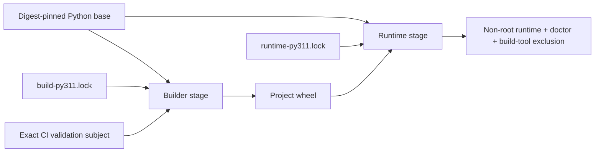

# Supply-Chain Integrity

> [!IMPORTANT]
> **Integrity, availability, reproducibility, identity, and merge authority are different claims.** The ƳƤ AI QA Automation Framework binds accepted dependency/build inputs and produces subject-bound build evidence without treating package hashes, an SBOM, a repeated build, or a green validation aggregate as publisher identity, release signing, or terminal merge authorization.

**ƳƤ AI QA Automation Framework** · Designed and engineered by **Ƴunior Ƥortal (ƳƤ)**

[Documentation home](README.md) · [Security](SECURITY.md) · [CI/CD](CI_CD.md) · [Trusted PR control plane](TRUSTED_PR_CONTROL_PLANE.md) · [Verification boundaries](VERIFICATION_BOUNDARIES.md) · [Operations](OPERATIONS.md)

---

## Trust model

The repository separates supply-chain subjects instead of treating “the build” as one authority:

| Subject | Repository authority | Evidence produced |
|---|---|---|
| Python application/runtime graph | `requirements/runtime-py311.lock` | exact versions + accepted SHA-256 package hashes |
| Development/verification graphs | `requirements/dev-py311.lock`, `requirements/dev-py314.lock` | exact interpreter-specific verification environments |
| Automatic dependency-install definitions | exact reviewed Git-blob identities for all five committed `.lock` files | pre-install and post-install build-authority verification before project code or later CI tools run |
| Python build backend graph | `requirements/build-py311.lock` + `hatchling==1.32.0` | isolated backend dependency graph, separate from runtime |
| Project build/install authority | exact static `pyproject.toml` build/Hatch configuration, bounded README/license/source inputs, entry-point constraints, and no installed Hatch plugin surface | checkout and per-archive build-authority JSON evidence |
| CI validation subject | `CI_SUBJECT_SHA`: `github.sha` for ordinary event execution or `repository_dispatch.client_payload.expected_merge_sha` for trusted validation | exact-subject checkout, archive, manifest, wheel, SBOM lineage, and container-context evidence |
| Trusted dispatch control-plane changes | owner-supplied exact protected-root base/subject Git-object manifest that must equal the complete observed protected-root change set | deterministic admission or fail-closed rejection before repository scripts execute |
| Trusted reporter implementation | default-branch `repository_dispatch` `github.sha`, separate from `CI_SUBJECT_SHA` | exact reporter source checkout plus live PR/head/base/merge-ref revalidation |
| Trusted reporter credential | Environment-protected dedicated GitHub App private key; short-lived installation token | terminal status identity separated from native GitHub Actions identity once externally activated |
| Automatic browser runtime | hosted `/usr/bin/google-chrome`, observed before the reference test; no automatic browser/OS installer authority | observed Chrome version + deterministic localhost reference-SUT JUnit evidence |
| Container base | `requirements/base-image.lock` | exact `python:3.11.16-slim` OCI digest used by every Docker stage |
| Container runtime-composition definition | exact reviewed `Dockerfile` Git blob identity | deterministic denial of unreviewed Dockerfile byte/instruction drift |
| Container build context | exact `CI_SUBJECT_SHA` tar stream from an isolated bare Git view | runtime image consumes repository bytes from the selected validation subject rather than mutable checkout state |

The dependency lock files are repository-owned resolution snapshots derived from declared project constraints and then committed/reviewed. Runtime and verification installation use `pip --require-hashes`; direct URL/VCS/editable requirements, non-exact pins, missing hashes, unexpected lock files, and non-SHA-256 hash directives are rejected by `scripts/verify_supply_chain.py`.

> [!NOTE]
> A package hash constrains which bytes can be accepted. It does **not** prove package-publisher identity, package-index availability, future vulnerability status, or the integrity of the hosted bootstrap interpreter/installer.

---

## Validation-subject authority

`ci.yml` defines the repository build/evidence subject once:

```text
CI_SUBJECT_SHA = repository_dispatch ? client_payload.expected_merge_sha : github.sha
```

For trusted `repository_dispatch`, `expected_merge_sha` is untrusted dispatch data used only to select the read-only validation subject. It does not select the trusted reporter implementation, release credentials, or status identity.

All five validation jobs:

- check out `CI_SUBJECT_SHA`;
- disable persisted checkout credentials;
- immediately verify `git rev-parse HEAD == CI_SUBJECT_SHA`.

The same subject is used for:

- both isolated reproducible-wheel archives;
- `generate_build_manifest.py --expected-source-sha`;
- the isolated runtime-container tar context;
- persisted subject-bound supply-chain evidence.

No reviewed build/evidence step derives the accepted subject from mutable `HEAD`.

The reporter is deliberately separate. On owner `repository_dispatch`, it checks out and verifies trusted default-branch `github.sha`. Before any terminal status write, `scripts/trusted_pr_control.py` independently revalidates the live PR identity, `refs/pull/<number>/merge`, and the merge commit's ordered parents, then repeats the live PR/ref read.

---

## Protected control-plane maintenance

A blanket “protected paths must equal main” rule prevents legitimate maintenance of workflows, tests, dependency authority, and verifier code. The trusted preflight instead compares the protected root object identities between trusted base and prospective merge subject.

If a protected root differs, the owner dispatch must supply exactly the observed tuple:

```text
path
base_oid
subject_oid
```

The manifest is bounded to the reviewed protected-root set, rejects duplicates and unknown paths, and accepts only full 40-hex Git object IDs or the explicit `MISSING` sentinel. The normalized supplied manifest must equal the complete observed changed-root set. An empty manifest authorizes no protected changes.

This is an explicit owner trust transition for exact Git objects. It is **not** independent proof that changed control-plane bytes are correct. Exact-revision testing, source review, adversarial audit, and external control-plane validation remain necessary before merge.

---

## Independent terminal-status identity

Automatic PR CI and protected merge identity are different trust domains.

Ordinary `pull_request` validation is intentionally automatic, read-only, and secret-free. A candidate workflow may prove internal consistency for its exact event subject but must not acquire the identity that satisfies the protected `Trusted PR Gate` rule.

The trusted reporter therefore keeps native GitHub Actions permissions at `contents: read` and obtains terminal status authority only through Environment `trusted-pr-gate`:

1. trusted default-branch reporter code verifies `github.sha`;
2. the Environment supplies `TRUSTED_GATE_APP_CLIENT_ID` and `TRUSTED_GATE_APP_PRIVATE_KEY` only to the eligible reporter job;
3. the reporter constructs a short-lived GitHub App JWT;
4. it exchanges that JWT for the repository installation token with requested `contents: read`, `pull_requests: read`, and `statuses: write` permissions;
5. the token is masked and passed to the standard-library trusted reporter helper;
6. the helper publishes `Trusted PR Gate` only after exact live subject revalidation.

For that separation to be real merge authority, the external branch ruleset must require `Trusted PR Gate` from the **dedicated App integration**. Repository code cannot self-attest the App installation, its effective permissions, Environment trusted-ref protection, App secret configuration, Actions Policy, or ruleset expected-source binding.

Historical activation evidence in which GitHub Actions integration ID `15368` published `Trusted PR Gate` remains valid historical evidence for the earlier control plane. It does not prove the independent App boundary is active.

---

## Pre-install dependency authority

Hash-required installation is insufficient if an unreviewed candidate can first rewrite the lock that `pip` consumes. A changed but internally hash-valid development lock could add a package that installs an executable named `ruff`, `pytest`, `pip-audit`, or another later CI command before the deeper supply-chain verifier runs.

`scripts/verify_build_authority.py` therefore validates the **exact five reviewed lock-file bytes before automatic dependency installation**. The standard-library-only boundary requires:

- exactly `base-image.lock`, `build-py311.lock`, `dev-py311.lock`, `dev-py314.lock`, and `runtime-py311.lock`;
- each file's reviewed Git blob identity;
- descriptor-relative no-follow directory/file observation;
- bounded requirements-directory enumeration;
- regular-file identity stability around ingestion;
- 1 MiB maximum reviewed lock-file ingestion.

Every automatic `python -m pip install --require-hashes -r ...` site is structurally bracketed by `verify_build_authority.py`: the first invocation proves the lock subject before `pip` consumes it, and the second revalidates the same reviewed lock/build authority immediately after installation and before project installation or later repository-owned tool execution.

`scripts/verify_ci_contract.py` constrains the reviewed dependency-install sites and rejects missing authority brackets. A legitimate lock refresh therefore requires an intentional reviewed authority update; a candidate cannot silently substitute a different lock while preserving the old pre-install authority result.

These controls constrain repository-selected dependency inputs. They do not independently attest the hosted Python bootstrap, `pip` executable bytes, package publisher, or network/package-index availability.

---

## Pre-build project authority

A pinned backend is insufficient if repository build configuration, install metadata, file-valued project metadata, package-tree shape/resource volume, or installed build plugins can expand what a build or later CI step reads or executes.

Before project build/install, `scripts/verify_build_authority.py` requires:

- `[build-system]` exactly `requires = ["hatchling==1.32.0"]` plus `build-backend = "hatchling.build"`;
- no `backend-path`;
- project distribution name exactly `ai-qa-automation`;
- a static non-empty project version and no dynamic metadata;
- `[project.scripts]` exactly `ai-qa = "ai_qa_automation.cli:app"`;
- no `[project.gui-scripts]` or `[project.entry-points]` expansion;
- project README exactly `README.md` and license file exactly `LICENSE`;
- no `license-files` expansion;
- reviewed Hatch wheel package selection only: `src/ai_qa_automation`;
- no custom Hatch build hooks, metadata hooks, version sources, custom builders, or extension configuration;
- no installed `hatch` entry point exposed through distribution metadata.

### File and resource bounds

The verifier requires `README.md` and `LICENSE` to be stable regular non-symlink files and caps each at **2 MiB**.

The selected package tree is traversed through descriptor-relative no-follow operations. It permits only real directories and regular files, rejects symlinks and special nodes, and revalidates identity during observation. Limits are enforced during traversal:

- at most **1024** selected package entries;
- at most **8 MiB** per selected regular source file;
- at most **32 MiB** aggregate selected-package bytes.

### Archive-specific revalidation

The checkout observation is not reused as proof of later extracted source trees. After each exact-subject archive is extracted, the checkout-owned verifier executes with `--root` against that archive immediately before wheel creation.

CI persists `build-authority-archive-a.json` and `build-authority-archive-b.json`. Those deterministic JSON results must be byte-identical and include reviewed lock identities, source entry/byte counts, and configured ceilings.

---

## Build/runtime separation



The builder uses the exact OCI digest in `base-image.lock`, installs only the hash-locked build graph, builds with `--no-deps --no-build-isolation`, and fixes `SOURCE_DATE_EPOCH=315532800` for deterministic wheel timestamps.

The runtime stage uses the same exact OCI digest, installs only `runtime-py311.lock`, installs the already-built wheel with `--no-deps`, runs as non-root user `aiqa`, and is checked to exclude Hatchling and repository-defined build-only packages.

`scripts/verify_supply_chain.py` binds complete bounded-read `Dockerfile` bytes to the reviewed Git blob identity before accepting runtime-composition checks.

---

## Runtime-container context authority

The runtime-container build does not hand mutable checkout `.` to Docker. It creates a fresh bare Git view and empty template under `RUNNER_TEMP`, runs Git under reviewed clean environment controls, points the view at the checked-out content-addressed object store, disables replacement-object rewriting, and archives exact `$CI_SUBJECT_SHA` with reviewed attribute/config authority.

That tar stream is piped directly to Docker. Later worktree changes, checkout-local `.dockerignore`, checkout Git metadata, global/system attributes, and mutable `HEAD` therefore cannot silently retarget the repository bytes consumed by the runtime image.

This constrains **which repository bytes Docker may consume**. It does not attest Docker/BuildKit binaries, the hosted runner, external registries, or privileged mutation outside the build context.

---

## Reproducible wheel and SBOM lineage

The reproducible-wheel path creates fresh random source directories and a fresh bare Git view initialized from an empty template. Git executes with reviewed controls for system/global config isolation, system attribute isolation, replacement-object disabling, lazy-fetch disabling, and optional-lock disabling.

Both archives explicitly name `$CI_SUBJECT_SHA`; each extracted root is independently build-authority-verified immediately before wheel creation. Wheel outputs must match under the repository reproducibility contract.

`scripts/generate_build_manifest.py` requires an explicit `--expected-source-sha`, and CI passes `$CI_SUBJECT_SHA`. The runtime CycloneDX SBOM is generated from the hash-locked runtime graph, and its SHA-256 is revalidated across later wheel/manifest steps so a later action cannot silently substitute another structurally valid SBOM while preserving lineage claims.

Repeatability under this reviewed environment is not a package signature, publisher identity attestation, or promise that another hosted platform/toolchain produces identical bytes.

---

## Immutable automation inputs

Permanent CI uses exact reviewed GitHub Action commit SHAs for:

- `actions/checkout`;
- `actions/setup-python`;
- `actions/upload-artifact`.

The trusted App token is minted without introducing an additional marketplace Action. The Ruff pre-commit mirror remains pinned to an exact repository commit. Public Git/action/blob SHA literals use narrow secret-scan allowlist annotations only where necessary because they are provenance identifiers, not credentials.

CI names exact CPython patch releases `3.11.16` and `3.14.7` and the `ubuntu-24.04` runner family instead of `ubuntu-latest`. Python 3.11.16 is the full-quality authority; Python 3.14.7 is the deterministic compatibility lane.

> [!CAUTION]
> `ubuntu-24.04` is a hosted-runner family label, **not an immutable runner-image digest**. GitHub can service that label with newer runner/browser/tool images. The repository records this as an environment boundary rather than calling hosted CI hermetic.

Automatic browser validation consumes hosted `/usr/bin/google-chrome` instead of installing a browser during validation. Absence or incompatibility is a browser-validation failure/incomplete condition, not authorization to acquire root/browser-install authority.

---

## Deterministic repository verifiers

`scripts/verify_supply_chain.py` fails closed on repository supply-chain drift. Among other checks, it requires:

- exactly the five reviewed lock files;
- descriptor-pinned no-follow requirements-directory ingestion with bounded enumeration and identity revalidation;
- exact `==` pins with SHA-256 hashes;
- no direct URLs, VCS requirements, editable entries, custom index/find-links directives, or duplicate packages;
- declared runtime/dev/build dependencies represented by corresponding locks;
- build-only packages excluded from the runtime graph;
- Docker stages matching `base-image.lock` exactly;
- complete `Dockerfile` bytes matching the reviewed Git blob identity;
- hash-required Docker dependency installation;
- no live `pip install --upgrade` or editable CI install path;
- exact Python patch versions and only reviewed immutable Actions/pre-commit revisions.

`scripts/verify_build_authority.py` provides the earlier pre-install/pre-build boundary for exact lock bytes, build configuration, project install metadata, selected filesystem/resource authority, and installed Hatch entry-point authority.

`scripts/verify_ci_contract.py` binds those controls into the workflow definition and additionally constrains:

- fixed ordinary + `repository_dispatch` trigger contract;
- five `CI_SUBJECT_SHA` validation checkouts;
- one separate trusted `github.sha` reporter checkout;
- read-only native GitHub Actions permissions;
- no native `GITHUB_TOKEN` terminal status publication;
- one Environment-scoped App private-key/client-ID consumer;
- exact protected-manifest comparison structure;
- dependency/project-install authority brackets;
- cache denial;
- reviewed SBOM/reproducible-wheel/container/evidence structure;
- complete `ci.yml` Git blob identity.

These verifiers are deterministic repository controls. They cannot independently attest the external App installation, Environment protection, Actions Policy, ruleset expected-source binding, hosted bootstrap bytes, or later administrative drift.

---

## Evidence bundle

The Supply Chain job persists repository-owned evidence including:

- static build-authority verification;
- per-archive build-authority verification;
- supply-chain verification;
- CI-contract verification;
- documentation-integrity verification;
- Mermaid validation;
- runtime CycloneDX SBOM;
- build manifest and checksums;
- one reproducible wheel copy;
- runtime container image ID observation.

Those artifacts are subject-bound evidence for the executed run. They are not release signatures or immutable platform attestations.

---

## Update discipline

A deliberate supply-chain or control-plane change should follow this order:

1. change the declared dependency/build/workflow source intentionally;
2. update exact locks/blob authority rather than weakening the verifier;
3. review new packages/actions/images/permissions and transitive effects;
4. if a protected root changes, compute the exact base/subject protected manifest for trusted validation;
5. run formatting/lint/type checks and the full deterministic suite;
6. run supply-chain, security, evaluator, browser, and reproducibility gates;
7. audit the exact revision adversarially for authority expansion and false-green paths;
8. re-run exact-revision evidence after remediation;
9. for reporter/App/ruleset changes, re-observe the external Environment/App/Actions/ruleset configuration and live trusted path before claiming activation;
10. merge only the revision bound to the accepted evidence.

Do not weaken hashes, assertions, exact subject binding, verification thresholds, or status-source requirements merely to obtain green output.

---

[← Security](SECURITY.md) · [CI/CD →](CI_CD.md)

Copyright (c) 2026 Ƴunior Ƥortal (ƳƤ). See [`../LICENSE`](../LICENSE).
