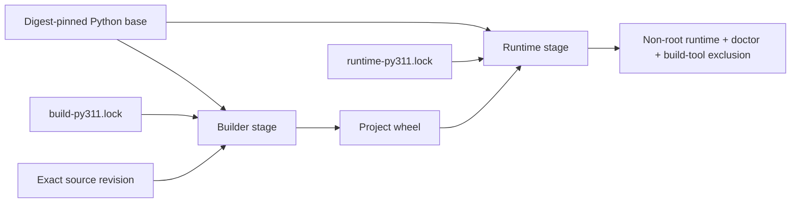

# Supply-Chain Integrity

> [!IMPORTANT]
> **Integrity, availability, reproducibility, and identity are different claims.** The ƳƤ AI QA Automation Framework binds accepted dependency/build inputs and produces revision-bound build evidence without treating package hashes, an SBOM, or a repeated build as publisher identity or release signing.

**ƳƤ AI QA Automation Framework** · Designed and engineered by **Ƴunior Ƥortal (ƳƤ)**

[Documentation home](README.md) · [Security](SECURITY.md) · [Verification boundaries](VERIFICATION_BOUNDARIES.md) · [Operations](OPERATIONS.md)

---

## Trust model

The repository separates supply-chain subjects instead of treating “the build” as one authority:

| Subject | Repository authority | Evidence produced |
|---|---|---|
| Python application/runtime graph | `requirements/runtime-py311.lock` | exact versions + accepted SHA-256 package hashes |
| Development/verification graphs | `requirements/dev-py311.lock`, `requirements/dev-py313.lock` | exact interpreter-specific verification environments |
| Python build backend graph | `requirements/build-py311.lock` + `hatchling==1.32.0` | isolated backend dependency graph, separate from runtime |
| Project build configuration + file/source authority + Hatch plugin surface | exact static `pyproject.toml` build/Hatch configuration + fixed `README.md`/`LICENSE` inputs + bounded symlink-free `src/ai_qa_automation` tree + no installed `hatch` entry points | pre-build `build-authority-verification.json` |
| Container base | `requirements/base-image.lock` | exact `python:3.11.16-slim` OCI digest used by every Docker stage |

The dependency lock files are repository-owned resolution snapshots derived from declared project constraints, then committed and reviewed. Runtime installation uses `pip --require-hashes`; direct URL/VCS/editable requirements, non-exact pins, missing hashes, unexpected lock files, and non-SHA-256 hash directives are rejected by `scripts/verify_supply_chain.py`.

> [!NOTE]
> A package hash constrains which bytes can be accepted. It does **not** guarantee that the public package index is available, that a package publisher is trustworthy, or that future vulnerability intelligence will remain unchanged.

---

## Build/runtime separation

The Docker build deliberately prevents build tooling from becoming runtime authority:

The builder:

- uses the exact OCI digest in `base-image.lock`;
- installs only `build-py311.lock` with `--require-hashes`;
- builds with `--no-deps --no-build-isolation`;
- fixes `SOURCE_DATE_EPOCH=315532800` for deterministic wheel timestamps.

The runtime stage:

- uses the same exact OCI digest;
- installs only `runtime-py311.lock` with `--require-hashes`;
- installs the already-built project wheel with `--no-deps`;
- runs as the non-root `aiqa` user;
- is checked to exclude Hatchling and the build-only packages named by repository policy.

No container-image byte-for-byte reproducibility claim is made. The Docker build verifies a digest-pinned base and runtime composition; repeatability evidence currently applies to the Python wheel.

---

## Pre-build project authority

A pinned build backend is not sufficient if repository build configuration, file-valued project metadata, package-tree filesystem shape, or an installed Hatch plugin can expand what a build reads or executes. Hatch supports build hooks and plugin surfaces, and exact Hatchling 1.32.0 follows included filesystem paths when writing wheel files. Automatic CI therefore validates these repository-controlled authorities **before** any project build occurs.

`scripts/verify_build_authority.py` is intentionally standard-library-only so automatic jobs can execute it after Python setup without first importing or installing project code. It reads `pyproject.toml` through bounded no-follow ingestion and requires:

- `[build-system]` to be exactly `requires = ["hatchling==1.32.0"]` plus `build-backend = "hatchling.build"`;
- no `backend-path` or additional build-system authority;
- a static non-empty project version and no dynamic project metadata;
- the project README to remain exactly `README.md` and the project license file to remain exactly `LICENSE`;
- no `license-files` expansion of automatic build file authority;
- `[tool.hatch]` to contain only the reviewed wheel package selection `packages = ["src/ai_qa_automation"]`;
- therefore no custom Hatch build hooks, metadata hooks, version sources, custom builders, or other Hatch extension configuration.

The verifier opens `README.md` and `LICENSE` without following symlinks and requires them to be stable regular files during observation. It traverses the selected `src/ai_qa_automation` package tree through descriptor-relative no-follow operations, permits only regular files and real directories, rejects symlinks and special filesystem nodes, revalidates file/directory identity during the walk, and enforces `MAX_BUILD_SOURCE_ENTRIES = 1024` while directory entries are actually consumed rather than after an unbounded enumeration.

The verifier also inspects installed distribution metadata with `importlib.metadata.entry_points(group="hatch")` and fails closed if any such entry point exists. It does not load or execute plugin code while performing this inspection. The supply-chain job emits `build-authority-verification.json` before installing the verification graph, then re-runs the same verifier after the hash-locked graph is installed and immediately before the project build. The other automatic project-install paths likewise revalidate build authority immediately before `pip install --no-deps --no-build-isolation .`.

A future legitimate need for a hook, installed Hatch plugin, dynamic metadata source, custom backend, backend path, additional file-valued project metadata, different package selection, or package symlink requires an explicit policy change rather than silently gaining build authority.

This control constrains repository build configuration, declared file inputs, selected package-tree filesystem shape, and installed Hatch plugin entry-point authority. Its filesystem checks are bounded observations; they do not create a privileged immutable filesystem snapshot after verification. It also does not independently attest the hosted Python bootstrap or dependency package bytes. Those remain covered only by the separate exact-version/hash-lock and hosted-runner trust boundaries described here.

---

## Immutable automation inputs

Permanent CI does not use floating GitHub Action tags. The reviewed Action revisions are exact 40-character commit SHAs for:

- `actions/checkout`;
- `actions/setup-python`;
- `actions/upload-artifact`.

The Ruff pre-commit mirror is likewise pinned to an exact repository commit rather than `v0.16.2` as a mutable ref. The public commit SHA literals carry narrow `detect-secrets` inline allowlist annotations because they are intentionally committed provenance identifiers, not credentials.

CI also names exact CPython patch releases (`3.11.16`, `3.13.15`) and uses the `ubuntu-24.04` runner family rather than `ubuntu-latest`.

> [!CAUTION]
> `ubuntu-24.04` is a stable hosted-runner family label, **not an immutable runner-image digest**. GitHub can service that family with newer image revisions. The repository records this as a residual platform boundary rather than calling hosted CI hermetic.

### Bootstrap trust boundary

The initial Python interpreter and `pip` process are supplied by the GitHub-hosted runner/toolcache selected by `actions/setup-python`. The repository pins the Action source and exact CPython patch version, but it cannot independently attest the bytes of that hosted bootstrap environment. If the toolcache already contains the same `pip` version named by a development lock, `pip` may report it as already satisfied rather than reinstalling it from a hashed artifact. `--require-hashes` constrains package candidates that the bootstrap installer resolves/installs; it is not a cryptographic attestation of the bootstrap installer itself. This remains an explicit environment-owned trust root.

---

## Deterministic repository verifiers

`scripts/verify_supply_chain.py` fails closed when repository supply-chain inputs drift. Among other checks, it requires:

- exactly the five expected lock files;
- a descriptor-pinned, no-follow `requirements/` directory scan with bounded actual ingestion and file/directory identity revalidation;
- exact `==` pins with SHA-256 hashes;
- no direct URLs, VCS requirements, editable lock entries, custom index/find-links directives, or duplicate packages;
- declared runtime/dev/build dependencies to be represented by their corresponding locks;
- build-only packages to remain outside the runtime graph;
- Docker stages to match `base-image.lock` exactly;
- hash-required Docker dependency installation;
- no live `pip install --upgrade` or editable CI install path;
- exact Python patch versions in permanent CI;
- only the reviewed immutable GitHub Action commits;
- only the reviewed immutable pre-commit revision.

The lock verifier rejects symlink substitution, lock-file identity changes, requirements-directory replacement, and entry exhaustion instead of falling back to weaker pathname enumeration when the required descriptor-relative primitives are unavailable.

`scripts/verify_build_authority.py` is the earlier pre-build boundary for executable project-build configuration, file-valued project metadata, selected package-tree filesystem authority, and installed Hatch plugin metadata. `scripts/verify_ci_contract.py` separately requires the evidence-producing pre-build verifier, immediate build-authority revalidation before every automatic project install, and upload of the supply-chain build-authority evidence.

These verifiers emit machine-readable JSON statements about repository invariants. Their `PASS` states only that the corresponding deterministic checks passed; it does not certify external package availability, publisher identity, hosted-runner immutability, bootstrap-tool identity, post-observation filesystem immutability, or release signing.

---

## Reproducible wheel evidence

The permanent supply-chain CI job builds the project wheel twice from independently extracted archives of the exact GitHub event subject. For each run, CI creates fresh random build directories plus a fresh bare Git view and an empty Git template under `RUNNER_TEMP`. Git commands execute through an `env -i` environment that retains only `PATH` and the reviewed controls disabling system/global configuration, system attributes, replacement objects, lazy fetching, and optional locks. The fresh bare view points at the checked-out repository's content-addressed object store through `GIT_OBJECT_DIRECTORY` but does not reuse the checkout's Git directory/configuration. Both archives name `$GITHUB_SHA` and explicitly set `core.attributesFile=/dev/null`; `/usr/bin/tar` extraction also runs under an empty environment containing only `PATH`.

This construction removes checkout-local `.git/info/attributes`, checkout Git configuration, user/global configuration, and system attributes from archive authority instead of relying on a check/use/check bracket around mutable metadata. Committed `.gitattributes` in the exact event tree remains repository-owned source authority. Replacement-object rewriting is disabled and the event subject itself—not mutable `HEAD`—is named. Both builds still execute inside one CI job and therefore share the same hosted runner, object store, and installed build environment; the evidence establishes same-environment repeatability, not cross-runner or cross-operating-system reproducibility, and it does not attest runner binaries or privileged mutation of the object store.

`scripts/generate_build_manifest.py` requires an explicit `--expected-source-sha` and refuses to emit its manifest unless:

1. the expected source is a lowercase full object ID of the repository's actual Git object format and resolves to itself as an available commit;
2. the corresponding original tree resolves with replacement objects disabled;
3. current `HEAD` equals that explicit expected source before and after tracked source-input observation;
4. the observed `Dockerfile`, `pyproject.toml`, and all five lock files byte-match the blobs stored in that exact expected commit;
5. both fresh-tree builds produce one wheel with the same artifact name and identical SHA-256 digest/size;
6. the tracked checkout is clean around source-input observation;
7. the expected source-date epoch is active; and
8. the CycloneDX runtime SBOM is structurally present and its observed digest matches the parent CI-owned `RUNTIME_SBOM_SHA256` value.

The manifest's Git subprocesses disable system/global Git configuration, replacement refs, optional Git locks, and lazy fetching. Fixed source-input paths are read from the expected commit with bounded blob-size checks before content ingestion. The worktree bytes used to derive manifest input digests must then exactly equal those expected-commit blob bytes; a clean-status heuristic alone is not accepted as source authority.

The manifest generator binds parsed SBOM metadata and the SBOM digest to one bounded no-follow byte observation. In addition, the parent CI workflow computes the runtime-SBOM SHA-256 immediately after the hash-locked audit, exports that digest through the GitHub step environment, and requires the same digest before wheel builds, after both wheel builds, and after manifest generation. The manifest itself must also accept that parent-owned digest. Consequently, later build activity cannot silently substitute a different SBOM and have that replacement accepted as the earlier audit subject.

Manifest persistence rejects ambiguous symlink ownership and uses atomic replacement plus directory fsync.

`scripts/verify_ci_contract.py` freezes the pre-build authority, immediate automatic-project-install guards, runtime-SBOM digest export, isolated bare-Git archive construction, reproducible-build shell block, supply-chain evidence set, and their safety-critical ordering. Replacing `$GITHUB_SHA` with mutable `HEAD`, re-enabling Git replacement objects, removing the clean Git environment, fresh Git view/object-directory/empty-template controls, reintroducing ambient archive attributes, allowing dirty tar extraction authority, removing the SBOM lineage checks, moving project installation ahead of build-authority validation, or removing required evidence causes deterministic CI-contract failure.

The resulting unsigned manifest records:

- exact Git event-subject commit and original tree SHA;
- Python version and source-date epoch;
- wheel name, size, and SHA-256;
- Dockerfile and `pyproject.toml` SHA-256, each byte-bound to the expected commit;
- every committed lock-file SHA-256, each byte-bound to the expected commit;
- exact container base subject;
- CycloneDX format/spec/component count and SBOM SHA-256;
- `signed: false` / `NOT_PROVIDED` identity state.

This is intentionally an **unsigned reproducible-build manifest**, not a provenance signature.

---

## SBOM and vulnerability evidence

The supply-chain job audits the exact hash-locked Python runtime dependency subject and emits CycloneDX JSON. The security job separately audits the exact development/verification lock.

For the runtime SBOM, artifact existence is not enough. Its post-audit SHA-256 becomes parent-step authority and is bracketed across the later wheel-build and manifest operations. A green supply-chain job therefore proves that the uploaded/manifest-recorded SBOM subject remained byte-identical to the subject produced by the earlier runtime audit through those operations.

The runtime SBOM describes the Python package subject represented by the runtime lock. It does **not** claim coverage of:

- Debian/OS packages in the base container;
- Chromium/system packages installed for Playwright jobs;
- external MCP/provider services;
- target/SUT dependencies outside this repository;
- registry or package-publisher identity.

Vulnerability results are time-sensitive observations. A green audit at one revision/time does not permanently certify a dependency as vulnerability-free.

---

## Evidence boundaries

| Claim | What proves it | What does **not** prove it |
|---|---|---|
| Accepted Python package candidates are constrained | exact lock pins + `--require-hashes` | package-index availability, publisher trust, or bootstrap-installer identity |
| Project build authority excludes unreviewed execution/filesystem expansion | exact static configuration + fixed README/LICENSE authority + bounded no-follow symlink-free selected package-tree observation + installed `hatch` entry-point denial + immediate automatic-install guards | post-observation immutable filesystem state, general proof that all future build systems are safe, or independent package-byte attestation |
| Build backend graph is repository-bound | exact `hatchling==1.32.0` + build lock | build publisher identity |
| Container base subject is fixed | OCI digest in `base-image.lock` and Dockerfile | byte-identical rebuilt container image |
| Wheel is repeatable for the exact CI event subject and recorded inputs | two fresh-bare-view/no-replace `$GITHUB_SHA` archives with versioned-tree-only attribute authority + expected-commit-bound manifest inputs + identical wheel SHA-256 in one CI environment | signer/publisher identity, runner-binary attestation, privileged object-store immutability, or cross-environment reproducibility |
| Runtime Python SBOM remained the audited subject through wheel generation | post-audit SHA-256 exported before builds + digest checks around later build/manifest activity + manifest acceptance of the parent-owned digest | OS/container/provider coverage or permanent vulnerability status |
| GitHub Actions are source-revision pinned | exact reviewed Action commit SHAs | immutable hosted runner OS/image |
| Artifact identity is signed | **not provided by repository CI** | SHA-256, SBOM, or reproducibility alone |

---

## Updating supply-chain authority

A dependency, Action, build-backend/configuration, interpreter, or container-base update is a controlled engineering change—not a background resolver event. The update should:

1. verify official provenance of the proposed upstream subject;
2. resolve/regenerate the affected candidate lock or digest material deliberately from the declared repository constraints, recording the interpreter and resolver/tooling used for the update;
3. review graph additions/removals and authority changes rather than treating generated comments as authority;
4. explicitly review any proposed change to build backend/configuration, file-valued project inputs, selected package-tree shape/symlink policy, installed Hatch plugin surface, or source-execution extension points;
5. run the pre-build authority verifier, deterministic repository verifiers, and adversarial tests;
6. run applicable vulnerability/secret/static scans;
7. reproduce the project wheel and regenerate the runtime SBOM;
8. build and inspect the final runtime container;
9. bind completion evidence to the exact source revision before merge.

A lock refresh is not claimed to reproduce an old resolver decision indefinitely: package-index metadata and available distributions can evolve. The committed reviewed lock is the build/install authority until a deliberately reviewed replacement supersedes it.

Release publication, signing keys, registry credentials, and external transparency/attestation services remain environment-owned privileged operations. They should be manual or environment-protected unless a dedicated release design deliberately adds those authorities.

---

[← Security](SECURITY.md) · [Verification boundaries →](VERIFICATION_BOUNDARIES.md)

Copyright (c) 2026 Ƴunior Ƥortal (ƳƤ). See [`../LICENSE`](../LICENSE).
