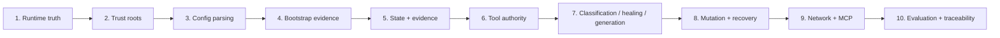

# Technical Walkthrough

> [!IMPORTANT]
> This is the reviewer-oriented implementation path: **trusted objective → deterministic observation → bounded reasoning/action → revision-aware validation → persisted runtime outcome**.

**ƳƤ AI QA Automation Framework** · Designed and engineered by **Ƴunior Ƥortal (ƳƤ)**

[Documentation home](README.md) · [Architecture](ARCHITECTURE.md) · [Security](SECURITY.md) · [Result contract](RESULT_CONTRACT.md)

---

## Reviewer map



If you only have 20 minutes, read sections **1, 2, 6, 8, 9, and 10**.

---

## 1. Start with runtime truth

Read:

- `src/ai_qa_automation/models.py`
- `src/ai_qa_automation/agent.py`
- `src/ai_qa_automation/reporting.py`
- [`RESULT_CONTRACT.md`](RESULT_CONTRACT.md)

`determine_terminal_outcome()` is the central anti-false-PASS rule.

Important consequences:

- Agent SDK result subtype `success` is necessary but not sufficient;
- active deterministic FAIL remains failure;
- non-PASS validations remain non-PASS;
- same-gate same-revision PASS/FAIL → `NOT_VERIFIED`;
- older evidence supersedes only through gate identity + newer revision;
- changed live autonomous tests require patch-safety, **exact-path-bound targeted pytest**, and full regression at the current revision.

This is the first code path to inspect if you want to know whether the framework can manufacture success.

---

## 2. Follow trust before functionality

Read [`ARCHITECTURE.md`](ARCHITECTURE.md).

The control repository owns trusted runtime policy, Skills, hooks, tool definitions, thresholds, and provider registry. The target is an untrusted evidence source even when it ships agent-looking configuration.

`validate_runtime_roots()` rejects overlapping control/target and artifact/target roots.

Therefore target:

```text
CLAUDE.md
.claude/
.mcp.json
source comments
unit/e2e tests
DOM / logs / API responses
```

cannot redefine framework authority.

---

## 3. Inspect trusted configuration parsing

Read `src/ai_qa_automation/config.py` before reviewing any network-capable adapter.

Trusted host configuration is canonicalized before runtime use:

- hostname/IP only;
- no wildcards;
- no URLs;
- no embedded ports;
- no path/query/fragment/user-info;
- no scoped IPv6 zone identifiers;
- no malformed dotted IPv4-looking values;
- deterministic IDNA normalization/deduplication.

Independent execution-budget validation happens at the same boundary.

Repository `.env` files are not auto-loaded as trusted settings.

---

## 4. Follow deterministic bootstrap into evidence

`runtime/bootstrap.py` observes repository state **before** Claude receives the bounded objective context.

It can persist:

- Git SHA + content-sensitive worktree fingerprint;
- explicit base-ref + merge-base provenance;
- committed + dirty + untracked changes;
- risk domains;
- repository/test topology;
- dependency-manifest hashes;
- CODEOWNERS routing;
- explainable test-impact candidates;
- OpenAPI/Swagger drift.

The facts are persisted first. A bounded summary is then labeled as observed data for the model.

See [`CHANGE_INTELLIGENCE.md`](CHANGE_INTELLIGENCE.md).

---

## 5. Follow evidence into durable state

Read:

- `src/ai_qa_automation/evidence.py`
- `src/ai_qa_automation/state.py`
- `src/ai_qa_automation/runtime/journal.py`
- `src/ai_qa_automation/runtime/attestation.py`

### Evidence store

`EvidenceStore` provides:

- confined run/artifact roots;
- immutable evidence/artifact identities;
- supported text sanitization;
- explicit `RAW` binary treatment;
- content hashes + manifests;
- regulated audit chaining when enabled;
- artifact ownership/hash verification in regulated reopen paths.

### Journal

`RunJournal` provides bounded append-only SHA-256 linkage and rejects symlink journal-file ownership.

### Attestation

The unsigned attestation checks owned persisted subjects, journal validity, no pending mutation, and registered artifact bytes before reporting `integrity_verified`.

> [!NOTE]
> Integrity remains separate from identity, signing, correctness, and test PASS.

---

## 6. Inspect the controlled tool and policy surface

Read:

- `src/ai_qa_automation/runtime/internal_tools.py`
- `src/ai_qa_automation/policy.py`
- `src/ai_qa_automation/runtime/runtime_hooks.py`

Review these boundaries:

- exactly 18 narrow internal QA tools;
- unknown tools/namespaces denied;
- generic Bash/Edit/Write/Web authority denied;
- path/network/action policy before execution;
- budget + circuit checks before action;
- workspace fingerprint drift check before mutation;
- rollback-backed transaction prepared before write;
- external MCP output sanitized before model/evidence use;
- provider failures normalized without fabricated evidence.

The live Agent SDK configuration also uses `strict_mcp_config=True`, trusted project settings, and a fixed five-Skill allowlist.

---

## 7. Inspect failure classification before repair

Read `src/ai_qa_automation/intelligence/failure_analysis.py`.

The classifier is evidence-weighted and model-independent across application, automation, locator/UI-contract, data, timing, environment, dependency, authentication, configuration, performance, and insufficient-evidence classes.

The locator path is conservative: a unique candidate is insufficient unless deterministic semantic relationship to the original locator is also established.

That prevents “there is one button on the page” from becoming “this must be the right replacement.”

---

## 8. Inspect self-healing authority

Read together:

- `tools/locators.py`
- `tools/browser_evidence.py`
- `intelligence/self_healing.py`
- `tools/safe_patch.py`
- `.claude/skills/self-heal-test/SKILL.md`

The workflow separates:

1. model proposal;
2. browser observation;
3. deterministic semantic/stability eligibility;
4. mutation authorization;
5. post-change validation.

Playwright measures uniqueness in the same DOM. Deterministic code reparses locator syntax, recomputes semantic overlap, overwrites model stability with policy-owned strategy stability, and rejects weak structural selectors.

> **Unique + model confidence ≠ mutation authority.**

The proposal stays bound to exact test path, original locator, verification evidence, and expected file hash.

---

## 9. Inspect generation provenance

Generation is intentionally provenance-bound:

```text
search_test_coverage
→ observed repository evidence
→ deterministic candidate gaps
→ plan_tests (MODEL_INTERPRETATION)
→ guarded create_test_file
→ deterministic quality + patch safety
→ targeted execution
→ regression closure
```

The crucial asymmetry: a model may annotate a scenario as “already covered,” but unsupported labels cannot suppress deterministic candidates.

Generated tests must contain meaningful assertions; comments/strings that merely look assertion-like do not satisfy observability checks.

Reusable generation/patch components understand Python/JavaScript/TypeScript. **Live autonomous commit authority is narrower:** controlled closure is currently pytest-backed, so autonomous writes are restricted to approved Python test paths.

---

## 10. Inspect mutation and recovery as one security subsystem

Read:

- `runtime/run_control.py`
- `runtime/stale_recovery.py`
- `runtime/recovery.py`
- `runtime/workspace_lease.py`
- [`RUNTIME_CONTROL.md`](RUNTIME_CONTROL.md)

### Live mutation

Requires:

- Git-backed isolated target;
- exclusive OS lease;
- matching content-sensitive fingerprint;
- approved non-symlink path;
- one open transaction at a time;
- trusted rollback snapshot.

### Commit closure

The path subject must match across:

```text
pending mutation path
= patch-safety path
= targeted pytest selected path
```

Full regression must also pass at the same revision.

### Recovery

Stale recovery applies the same ownership philosophy:

- prior run confined beneath trusted artifact root;
- runtime/journal/rollback ownership is non-symlink;
- exact workspace identity;
- exact persisted/current fingerprint match;
- pending target path confined and non-symlink;
- backup bytes match original SHA-256.

`runtime/recovery.py` uses the same exact-path closure standard, so recovery inspection cannot be weaker than terminal truth.

### Lease hardening

Workspace lease storage rejects symlink substitution; no-follow opening is used where supported.

---

## 11. Inspect regression and change intelligence

Read [`CHANGE_INTELLIGENCE.md`](CHANGE_INTELLIGENCE.md).

Important properties:

- clean feature branch still carries committed merge-base risk;
- explicit `AI_QA_BASE_REF` supplies the trusted baseline;
- CODEOWNERS/test impact are advisory evidence, never action authority;
- unsupported ownership grammar remains visible;
- low confidence/truncation broadens regression;
- mandatory/security/safety/regulatory coverage is protected independently.

---

## 12. Inspect network adapters

### API — `tools/api_testing.py`

Enforces:

- exact host authorization;
- method authorization;
- no ambient proxy inheritance;
- no automatic redirect following;
- bounded response capture;
- sanitized evidence.

### Browser — `tools/browser_evidence.py`

Enforces:

- host policy for navigation/subresources/WebSockets;
- service-worker blocking in the evidence context;
- final navigation recheck;
- `RAW` screenshot artifact semantics;
- same-DOM locator evidence.

### k6 — `tools/performance.py`

Enforces:

- explicit non-production classification;
- production-like hostname denial;
- injected target binding;
- controlled import/module surface;
- no local `open()`;
- no unrelated literal host;
- bounded runtime;
- **deployment egress prerequisite for every k6 run**.

Static JavaScript inspection is explicitly treated as defense in depth, not a network sandbox.

---

## 13. Inspect external MCP authorization

Read [`MCP.md`](MCP.md).

External trust has two gates:

1. provider identity/configuration;
2. action-level authorization.

Mixed action names are tokenized conservatively:

```text
destructive > write > recognized read
```

A safe-looking prefix cannot smuggle a create/delete action. Provider failures are normalized, and arbitrary business IDs that resemble HTTP codes are not treated as transport status without status-shaped context.

---

## 14. Inspect process state separately from QA state

```text
state.json              → QA decision/evidence state
runtime.json            → process-control state
evidence-manifest.json  → evidence/artifact registry
journal.jsonl           → runtime chronology
rollback/               → pending transaction recovery bytes
```

This separation prevents lease ownership, recovery metadata, or conversational state from becoming QA evidence by proximity.

---

## 15. Inspect evaluation as software engineering

Read [`EVALUATION.md`](EVALUATION.md).

The design separates:

- unit/integration/policy/security tests;
- fixed 34-scenario primary corpus;
- physically separate H-series holdout;
- browser-marked tests;
- credentialed model tests.

Hard-safety expectations are independent from implementation output. A failing implementation is not “fixed” by weakening the benchmark.

---

## 16. Inspect traceability without confusing it with correctness

```bash
ai-qa lineage artifacts/run-<id>
ai-qa attest artifacts/run-<id>
```

[`TRACEABILITY.md`](TRACEABILITY.md) shows evidence/artifact/hypothesis/validation/runtime relationships.

The attestation is deliberately unsigned and verifies persisted artifact bytes; it still does not certify identity, compliance, provider behavior, or test PASS.

---

## 17. Finish with the evidence/deployment boundary

Read:

- [`VERIFICATION_BOUNDARIES.md`](VERIFICATION_BOUNDARIES.md)
- [`PRODUCTION_READINESS.md`](PRODUCTION_READINESS.md)
- [`LIMITATIONS.md`](LIMITATIONS.md)
- [`SETUP.md`](SETUP.md)
- [`OPERATIONS.md`](OPERATIONS.md)

The intended conclusion is strict:

> **Every claim is bound to its evidence source, and model reasoning never outranks deterministic authority, ownership, or validation.**

---

## Suggested time-boxed review path

| Time | Read |
|---:|---|
| 5 min | root `README.md` + [`RESULT_CONTRACT.md`](RESULT_CONTRACT.md) |
| 10 min | [`ARCHITECTURE.md`](ARCHITECTURE.md) + sections 6/10 above |
| 15 min | [`SECURITY.md`](SECURITY.md) + [`THREAT_MODEL.md`](THREAT_MODEL.md) |
| 20+ min | [`EVALUATION.md`](EVALUATION.md) + [`TRACEABILITY.md`](TRACEABILITY.md) + code paths above |

---

[← Documentation home](README.md) · [Architecture](ARCHITECTURE.md)

Copyright (c) 2026 Ƴunior Ƥortal (ƳƤ). See [`../LICENSE`](../LICENSE).
