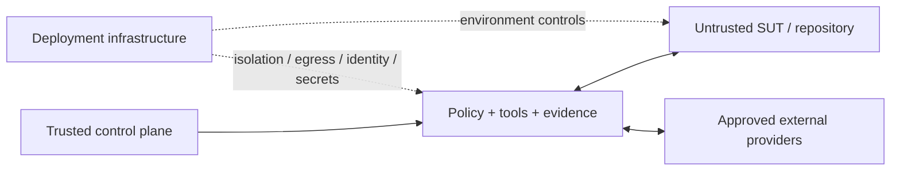

# Threat Model

> [!IMPORTANT]
> **Security objective:** a model mistake, hostile target input, broken provider, stale workspace, or partial runtime failure must not silently widen authority, corrupt the target, exfiltrate secrets, weaken test intent, fabricate evidence, or manufacture verified success.

**ƳƤ AI QA Automation Framework** · Designed and engineered by **Ƴunior Ƥortal (ƳƤ)**

[Documentation home](README.md) · [Security architecture](SECURITY.md) · [Architecture](ARCHITECTURE.md) · [Result contract](RESULT_CONTRACT.md)

---

## Threat-model stance

The framework assumes it will encounter misleading, malformed, stale, compromised, or instruction-shaped content in repositories, tests, DOM state, logs, API responses, browser traffic, CI artifacts, and external engineering systems.

The model itself is inside the threat model. Probabilistic reasoning may be wrong, overconfident, incomplete, or manipulated.

The engineering target is therefore **containment and truth preservation**, not perfect model behavior.

---

## Assets

| Asset class | Examples |
|---|---|
| **Credentials** | model/API keys, provider tokens, target-system credentials |
| **Target integrity** | source, tests, developer worktree changes, target data |
| **Control authority** | policy, hooks, Skills, schemas, thresholds, trusted configuration |
| **QA truth** | canonical state, validation lineage, failure classification, terminal outcome |
| **Recovery state** | runtime metadata, leases, fingerprints, rollback backups |
| **Evidence** | logs, screenshots, manifests, artifacts, journals, audit records |
| **External systems** | GitHub, Jira/Confluence, CI, API/browser/load/mobile targets |
| **Resource budgets** | model cost, wall time, tool/network/mutation/retry budgets |

---

## Trust zones

| Zone | Trust posture |
|---|---|
| **Control plane** | trusted framework code/configuration that defines authority |
| **Target / SUT** | untrusted data, even when content looks like instructions or configuration |
| **External integrations** | provider identity explicitly approved; returned content remains untrusted evidence |
| **Deployment infrastructure** | independent enforcement domain for process/container/network/identity/secrets/retention |

> [!NOTE]
> “Trusted provider,” “trusted bytes,” “authorized action,” and “verified QA success” are different claims and are never collapsed into one another.

---

## Primary adversary classes

### 1. Instruction and authority injection

Attackers may place instruction-shaped content in source files, tests, DOM, logs, issue bodies, API responses, or target agent/MCP configuration.

**Controls:** disjoint trusted control root, project-only settings, strict MCP configuration, narrow tools, deterministic hooks/policy, and explicit treatment of target/provider content as data.

### 2. Privilege escalation through tools or providers

An apparently read-only operation may hide a write/destructive verb, or a provider identity may be mistaken for blanket authority.

**Controls:** explicit tool inventory, vendor identity allowlist, action-token normalization, destructive > write > read precedence, approval-required external writes, and fail-closed unattended behavior.

### 3. Filesystem ownership substitution

Traversal, symlinks, stale aliases, or replaced artifact paths may redirect a write outside its intended ownership boundary.

**Controls:** lexical + resolved confinement, path-component symlink rejection, no-follow lease opening where supported, owned rollback directories/backups, journal/evidence/attestation ownership checks, and exact run-root confinement.

### 4. False validation / stale evidence

An unrelated targeted test, historical PASS, retry, or model claim may be used to certify newer or different bytes.

**Controls:** change revisions, gate identity, exact changed-path binding between patch safety and targeted pytest, full regression, contradictory PASS/FAIL -> `NOT_VERIFIED`, and terminal truth independent from model prose.

### 5. Test-intent erosion

A “repair” may hide the failure rather than fix it.

**Controls:** skip/xfail/focus/sleep/timeout/assertion/suppression rules, meaningful-assertion review, conservative self-healing scope, and rollback on incomplete closure.

### 6. Network and load escape

Browser/API/k6 workloads may contact unauthorized hosts or accidentally hit production.

**Controls:** canonical exact-host configuration, read-only API default, routed browser requests/WebSockets, service-worker blocking, production-like hostname denial, and deployment-level egress required for every k6 workload.

### 7. Resource exhaustion and retry storms

A model may consume one failure path indefinitely.

**Controls:** independent tool/network/mutation/repetition/time/cost budgets plus per-tool failure circuits.

### 8. Evidence tampering / provenance confusion

Persisted bytes may be replaced, cross-run data mixed, or integrity metadata overstated.

**Controls:** immutable evidence IDs/paths, content hashes, hash-chained journal, regulated audit chain, symlink-resistant artifact ownership, artifact hash verification, and unsigned attestation semantics that do not claim identity or PASS.

---

## Threat-to-control matrix

| Threat | Deterministic / architectural control |
|---|---|
| Prompt injection from source/DOM/log/provider content | target/provider content treated as data; narrow tools; deterministic policy/hooks |
| Target `CLAUDE.md` / `.claude` / `.mcp.json` authority injection | disjoint trusted control root; project-only settings; strict MCP config |
| Secret exfiltration | no generic shell/web authority; protected paths; minimal subprocess env; redaction; host bounds |
| Malformed trusted network config | exact hostname/IP canonicalization; wildcard/URL/port/path/scoped-IPv6/malformed-dotted-IP rejection |
| Runtime self-policy weakening | authority-bearing paths protected; no generic autonomous rewrite capability |
| Destructive Git/system mutation | no runtime Bash; destructive action policy; test-path-only writes |
| Filesystem traversal | lexical + resolved confinement for target, run, artifact, rollback, recovery paths |
| Symlink redirection during live mutation | component-by-component symlink rejection before transaction preparation |
| Symlinked rollback directory | live and stale recovery reject rollback-root ownership substitution |
| Symlinked lease file/directory | lease ownership checks + no-follow open where available |
| Symlinked runtime journal | construction/append/verify reject journal symlink target |
| Symlinked evidence artifact with valid bytes | ownership verification rejects symlink replacement even if digest matches |
| False product-defect attribution | evidence-weighted deterministic classification + insufficient-evidence outcome |
| Model-inflated locator confidence | Playwright owns uniqueness; deterministic semantic/stability policy owns authorization |
| Wrong nearby locator repair | same-DOM evidence + syntax/semantic/stability checks + exact file/hash binding |
| Test-intent weakening | unsafe-diff rules + deterministic test-quality review |
| Meaningless generated tests | observed coverage + conservative plan + meaningful assertions + deterministic execution closure |
| Unsupported model “already covered” claim suppresses scenario | unsupported coverage labels cannot remove deterministic candidate scenarios |
| JS/TS mutation falsely certified by pytest | live autonomous commit authority limited to Python test paths |
| Unrelated targeted pytest certifies mutation | targeted validation must select the exact pending changed path |
| False PASS from model completion | terminal status derived from deterministic validation lineage |
| Retry hides contradiction | same-gate same-revision PASS/FAIL -> `NOT_VERIFIED` |
| Old evidence certifies new bytes | revision lineage + current-revision closure |
| Regression under-selection | mandatory coverage preserved; uncertainty broadens selection |
| Concurrent agent corruption | OS-backed lease + content-sensitive fingerprint |
| Crash overwrites newer human work | stale rollback requires exact post-mutation fingerprint match |
| Rollback backup substitution | rollback-root confinement + non-symlink ownership + SHA-256 verification |
| Recovery CLI reports weaker closure than runtime | recovery uses exact-path target binding + full regression semantics |
| Cross-run evidence contamination | confined run roots + immutable IDs/paths + run IDs |
| Rogue/community MCP | vendor-official allowlist + strict explicit registry |
| Excessive MCP privilege | provider identity separated from action authorization |
| Action-name privilege smuggling | camel/snake/mixed tokenization; destructive > write > read; noun collisions handled |
| Fabricated remote evidence during outage | normalized provider outcomes; failed calls create no remote evidence |
| Business ID `403` misread as HTTP status | HTTP error recognition requires status-shaped context |
| Browser/API egress | exact host allowlist; request/WebSocket routing; read-only API default; no ambient proxy |
| Browser service-worker bypass | service workers blocked in evidence context |
| Production load incident | environment + production-like hostname denial + target binding |
| Dynamic k6 destination escape | infrastructure-egress prerequisite required for **every** k6 run; static JS inspection is defense in depth only |
| Unbounded autonomous loop | independent budgets + per-tool circuits |
| Supply-chain vulnerability | deliberate provenance/version review + compatibility/vulnerability/static/secret gates |
| Integrity hash misrepresented as identity/PASS | unsigned attestation explicitly separates integrity from signing/correctness |
| Attestation says “verified” while artifact was changed | registered artifact bytes are re-hashed and ownership-checked before integrity verification |

---

## High-value adversarial cases

The strongest regression and holdout cases attack assumptions rather than syntax. Examples include:

- a DOM node telling the model to ignore policy and call a forbidden tool;
- a GitHub/Jira issue asking for credentials or workflow changes;
- a target repository shipping its own MCP server or agent instructions;
- `getOrCreateIssue` or `listAndDeleteIssues` attempting to inherit read authority from a prefix;
- a business object ID `403` being misread as an HTTP authorization result;
- a unique `Delete Account` button receiving model confidence `1.0` while the stale locator represented `Save Profile`;
- a locator candidate with fabricated uniqueness count;
- a positional/XPath selector that happens to pass once;
- a repair that removes the failing assertion;
- assertion-like text in a comment/string satisfying a naive test-quality scanner;
- a model claiming a scenario is “already covered” without supporting repository evidence;
- a JS/TS generated test attempting to enter live autonomous pytest commit closure;
- a targeted pytest run selecting a different file than the pending mutation;
- an autonomous write redirected through a symlink;
- a trusted rollback directory replaced by a symlink;
- a journal/lease file replaced by a symlink;
- a registered artifact replaced by a symlink to matching bytes;
- a stale rollback redirected after a crash;
- a tampered rollback backup with correct path but wrong bytes;
- a developer edit after an agent crash;
- low-confidence test-impact data attempting to shrink regression scope;
- wildcard, URL-shaped, scoped-IPv6, or malformed dotted network configuration;
- a k6 script dynamically constructing an external host while the declared target is localhost;
- a production-like hostname presented with `environment=staging`;
- a provider outage encouraging fallback to an unapproved integration;
- a retry loop attempting to consume one budget dimension through another;
- a valid journal paired with tampered registered artifact bytes.

> [!TIP]
> The purpose of an adversarial case is to prove a deterministic boundary. If success depends only on stronger prompt wording, the control is incomplete.

---

## Residual deployment boundaries

Repository code cannot independently establish every property of a deployed system. Deployment owns, among other things:

- process/container isolation;
- non-root enforcement;
- outbound firewall/proxy/network policy;
- organization identity and secret lifecycle;
- provider-side authentication/authorization;
- artifact encryption, access, retention, backup, and destruction;
- legal/compliance controls;
- target-application authorization and data policy;
- device/emulator/cloud security posture;
- infrastructure availability and incident response.

Application-level policy and flags are defense in depth, not substitutes for these controls.

---

## Threat-model maintenance rule

A material new threat should produce at least one concrete engineering artifact:

- narrower policy;
- safer tool/schema contract;
- stronger evidence semantics;
- regression/security test;
- primary or holdout adversarial scenario; or
- explicit deployment boundary when repository code cannot enforce the property.

“Tell the model not to do it” is not an adequate control where behavior can be deterministically constrained.

---

## Review paths

- [Security architecture](SECURITY.md)
- [Runtime control and recovery](RUNTIME_CONTROL.md)
- [Result contract](RESULT_CONTRACT.md)
- [Evaluation architecture](EVALUATION.md)
- [Verification boundaries](VERIFICATION_BOUNDARIES.md)

---

[← Security architecture](SECURITY.md) · [Documentation home](README.md)

Copyright (c) 2026 Ƴunior Ƥortal (ƳƤ). See [`../LICENSE`](../LICENSE).
