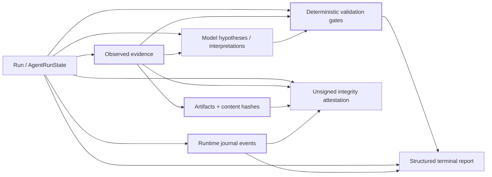

# Traceability and Run Attestation

> **YP AI QA Automation Framework** · Designed and engineered by **Yunior Portal**

The YP AI QA Automation Framework persists enough structured information to inspect **why** a run reached a conclusion without relying on chat history or treating model prose as the audit record.

Traceability is designed around a simple question:

> **Which observed evidence and deterministic validations support this run outcome, and can the persisted records be checked for internal integrity?**

## Persisted lineage



The important boundary is semantic, not visual: a hypothesis can reference evidence, but it does not become observed evidence merely because the model stated it confidently.

## Lineage graph

```bash
ai-qa lineage artifacts/run-<id>
ai-qa lineage artifacts/run-<id> --format dot
```

The graph can connect:

- the run/state root;
- observed evidence;
- registered artifacts;
- hypotheses/interpretations;
- validation gates and their evidence references;
- bounded runtime-journal events.

Validation-to-evidence references are checked while the graph is built. If a validation names evidence that cannot be found in the run manifest, the lineage builder surfaces that gap rather than silently drawing a complete-looking graph.

The DOT export is intended for Graphviz, debugging, review, or downstream visualization. Exporting a graph does not mutate the run or change its terminal status.

## Evidence and artifact integrity

Artifacts are registered with content hashes and run-scoped metadata. Run directories are confined beneath the trusted artifact root; artifact paths are confined beneath the run root; duplicate evidence IDs/artifact paths do not overwrite an existing record. Text evidence that may reach the model is sanitized according to the evidence path; binary artifacts such as screenshots remain explicitly `RAW` and are not falsely described as sanitized text.

`journal.jsonl` uses sequence numbers plus previous/current record hashes to make record reordering, removal, or modification detectable during verification. Hash chaining improves tamper evidence; it does not create an external identity or trusted timestamp by itself.

## Content-addressed attestation

```bash
ai-qa attest artifacts/run-<id>
```

The attestation inspects persisted subjects including:

- `state.json`;
- `evidence-manifest.json`;
- `runtime.json`;
- `journal.jsonl` when present.

It hashes those subjects, verifies the operational journal when possible, records target/configuration/model/SDK provenance available in state, and reports whether a mutation is still pending.

The resulting `attestation_digest` is deliberately **unsigned**. It makes the inspected statement content-addressable, but the repository does not present a SHA-256 digest as:

- an organizational signature;
- proof of actor identity;
- a compliance certification;
- a trusted timestamp; or
- evidence that tests passed.

A deployment that requires trusted identity can wrap the attestation in an external signing mechanism, but that trust anchor is outside this repository.

## Why terminal status remains separate

Traceability answers “what records support this conclusion?” It does not override the validation rules that produce the conclusion.

A perfectly intact journal can describe a failed or `NOT_VERIFIED` run. Likewise, a complete lineage graph can show that required validation evidence is missing. Integrity and correctness are related controls, not interchangeable claims.

## Review workflow

A reviewer investigating a persisted run can use this order:

1. inspect `state.json` for objective, revision, provenance, validation lineage, and terminal status;
2. inspect `evidence-manifest.json` for referenced observations/artifacts and hashes;
3. verify `journal.jsonl` ordering/hash continuity and runtime events;
4. inspect `runtime.json` for budgets, circuits, lease identity, fingerprint, and pending mutation state;
5. export `ai-qa lineage` to identify missing or weak evidence relationships;
6. emit `ai-qa attest` to produce an unsigned integrity summary;
7. compare the resulting evidence with the readiness truth model rather than inferring PASS from record completeness.

## Verification boundary

Lineage and attestation code plus dedicated tests are present in the repository. Current-head execution remains `NOT_VERIFIED` until the applicable deterministic test gate is actually run.

See [`PRODUCTION_READINESS.md`](PRODUCTION_READINESS.md) and [`VERIFICATION_BOUNDARIES.md`](VERIFICATION_BOUNDARIES.md).
