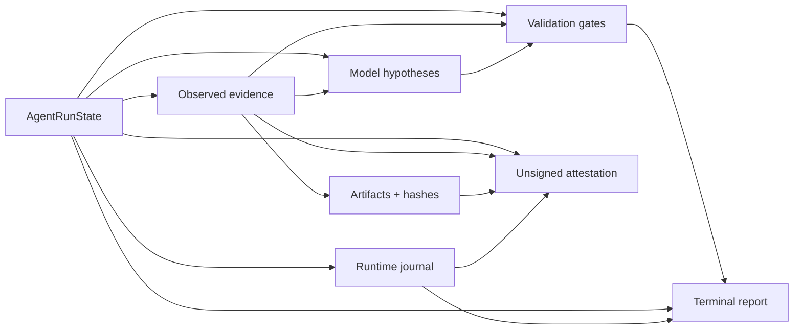

# Traceability and Run Attestation

> **ƳƤ AI QA Automation Framework** · Designed and engineered by **Ƴunior Ƥortal (ƳƤ)**

The ƳƤ AI QA Automation Framework persists enough structured information to reconstruct **why** a run reached a conclusion without relying on chat history or treating model prose as the audit record.

Traceability asks two separate questions:

1. **Which evidence and deterministic validations support the runtime outcome?**
2. **Can the persisted record set be checked for internal integrity?**

These questions are related but not interchangeable.

## Persisted lineage



A hypothesis may reference observed evidence. It does not become an observed fact because the model repeats it or assigns high confidence.

## Evidence identity and confinement

`EvidenceStore` protects the run record structurally:

- run roots remain under trusted artifact storage;
- traversal/absolute/symlink run paths are rejected;
- artifact paths remain under the run root;
- symlink artifact escapes are rejected;
- evidence IDs are immutable;
- artifact identities/paths are immutable;
- reopened manifests reject duplicate identities;
- text evidence is sanitized along supported paths;
- binary screenshots remain explicitly `RAW`.

This prevents later records from silently replacing earlier evidence under the same identity.

## Evidence manifest

`evidence-manifest.json` records evidence and artifact metadata, including run association, source, nature, sanitization treatment, content hash, and artifact references where applicable.

The distinction between `OBSERVED_FACT` and `MODEL_INTERPRETATION` remains visible in persisted state.

## Lineage graph

```bash
ai-qa lineage artifacts/run-<id>
ai-qa lineage artifacts/run-<id> --format dot
```

The graph can connect:

- run/state root;
- evidence records;
- registered artifacts;
- hypotheses/interpretations;
- validation gates and their evidence references;
- bounded runtime journal events.

Validation references are checked while the graph is built. If a gate references evidence missing from the run manifest, the graph surfaces the gap rather than presenting a false complete lineage.

DOT export is observational; it does not mutate the run or change the terminal outcome.

## Operational journal

`journal.jsonl` uses:

- monotonically ordered events;
- previous-record hash linkage;
- current-record SHA-256 hash;
- bounded event count;
- append-oriented runtime semantics.

Verification can therefore detect record reordering/removal/modification under the implemented integrity model.

Hash chaining is not an external signature or trusted timestamp.

## Optional regulated audit chain

When regulated mode is enabled, evidence/artifact registration can append an additional hash-chained audit record and regulated retention classification.

This adds engineering traceability. It does not certify a regulatory regime by itself.

## Content-addressed attestation

```bash
ai-qa attest artifacts/run-<id>
```

The attestation can inspect subjects such as:

- `state.json`;
- `evidence-manifest.json`;
- `runtime.json`;
- `journal.jsonl`.

It hashes the inspected subjects, verifies the operational journal when possible, carries available model/SDK/configuration/target provenance, and reports pending mutation information.

The resulting digest is deliberately **unsigned**.

It is not presented as:

- organization/actor signature;
- identity proof;
- compliance certification;
- notarization;
- trusted timestamp;
- test PASS.

A deployment that needs non-repudiation can wrap this content in an approved external signing/timestamping mechanism.

## Revision and validation lineage

Traceability preserves validation gate identity and `change_revision` so a reviewer can distinguish:

- evidence from the baseline revision;
- a failed historical gate;
- a newer mutation revision;
- patch-safety validation;
- targeted pytest;
- full-regression pytest;
- terminal outcome derived from the active lineage.

A newer unrelated gate does not erase an earlier failed gate merely because both appear in state.

See [`RESULT_CONTRACT.md`](RESULT_CONTRACT.md).

## Runtime/process state separation

`state.json` and `runtime.json` answer different questions.

### `state.json`

Captures QA decision state such as:

- objective;
- evidence references;
- hypotheses/classification;
- validation results;
- change revision;
- model/SDK/configuration provenance;
- terminal outcome.

### `runtime.json`

Captures process-control state such as:

- workspace fingerprint;
- lease identity;
- budgets;
- tool circuits;
- pending mutation metadata;
- journal head.

A process checkpoint therefore does not become a QA conclusion by proximity.

## Review workflow

For a persisted run:

1. inspect `state.json` for objective, revision, provenance, validation lineage, terminal outcome;
2. inspect `evidence-manifest.json` for evidence/artifact identities, sources, and hashes;
3. verify `journal.jsonl` order/hash linkage;
4. inspect `runtime.json` for lease/fingerprint/budgets/circuits/pending mutation;
5. use `ai-qa lineage` to find weak/missing evidence relationships;
6. use `ai-qa attest` for a content-addressed integrity summary;
7. interpret the result under [`RESULT_CONTRACT.md`](RESULT_CONTRACT.md), not from record completeness alone.

## Integrity versus correctness

A perfectly intact journal can document a failed or `NOT_VERIFIED` run. A complete lineage graph can reveal missing required evidence. A matching artifact hash can prove bytes were preserved while those bytes describe the wrong application behavior.

Therefore:

> **Integrity supports trustworthy review; deterministic validation still owns correctness.**

See [`README.md`](README.md), [`RESULT_CONTRACT.md`](RESULT_CONTRACT.md), [`PRODUCTION_READINESS.md`](PRODUCTION_READINESS.md), and [`VERIFICATION_BOUNDARIES.md`](VERIFICATION_BOUNDARIES.md).

Copyright (c) 2026 Ƴunior Ƥortal (ƳƤ). See [`../LICENSE`](../LICENSE).
