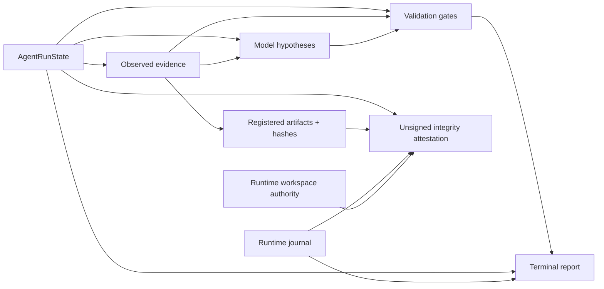

# Traceability and Run Attestation

> [!IMPORTANT]
> Traceability answers two different questions: **which evidence/validations support the QA outcome?** and **are the persisted records internally intact?** Those questions are related, but never interchangeable.

**ƳƤ AI QA Automation Framework** · Designed and engineered by **Ƴunior Ƥortal (ƳƤ)**

[Documentation home](README.md) · [Result contract](RESULT_CONTRACT.md) · [Runtime control](RUNTIME_CONTROL.md) · [Verification boundaries](VERIFICATION_BOUNDARIES.md)

---

## Why traceability exists

The framework persists enough structured information to reconstruct **why** a run reached a conclusion without depending on chat history or treating model prose as the audit record.



A hypothesis may reference observed evidence. It does not become an observed fact because the model repeats it or assigns high confidence.

---

## Evidence identity and confinement

`EvidenceStore` protects the record structurally:

- run roots remain beneath trusted artifact storage;
- absolute/traversal/symlink run paths are rejected;
- artifact paths remain under the run root;
- symlink artifact escapes are rejected;
- evidence IDs are immutable;
- artifact IDs/paths are immutable;
- reopened manifests reject duplicate identities and cross-run evidence;
- authority-bearing JSON rejects duplicate object keys and non-standard numeric constants;
- supported text persistence paths are sanitized;
- binary screenshots remain explicitly `RAW`.

In regulated verification, a registered artifact that has been replaced by a symlink is rejected even if the symlink resolves to bytes with the expected hash. Ownership and bytes are distinct integrity properties.

Trusted artifact storage itself remains a deployment-owned control-plane boundary; repository integrity checks do not claim to survive an operating-system account that already has arbitrary write authority over that trusted root.

---

## Evidence manifest

`evidence-manifest.json` records run-scoped evidence/artifact metadata such as:

- canonical `run_id`;
- source and source identifier;
- evidence nature;
- sanitization treatment;
- content hash;
- artifact reference;
- originating tool;
- retention classification where applicable.

The distinction between `OBSERVED_FACT` and `MODEL_INTERPRETATION` remains visible in persisted state. Consumers that use the manifest for integrity or lineage validate the manifest/run binding rather than accepting neighboring records from another run.

---

## Lineage graph

```bash
ai-qa lineage artifacts/run-<id>
ai-qa lineage artifacts/run-<id> --format dot
```

Lineage can connect:

- run/state root;
- evidence records;
- registered artifacts;
- hypotheses/interpretations;
- validation gates and their evidence references;
- bounded runtime journal events.

Graph construction reuses strict canonical-state parsing and validates evidence/artifact records against the same typed persisted schemas used by the evidence system. The manifest `run_id` must match canonical state, each evidence record must belong to that run, duplicate evidence/artifact identities or artifact paths are rejected, and malformed records are not rendered as provenance.

Validation references are checked during graph construction. Missing referenced evidence is surfaced instead of being rendered as a falsely complete lineage.

DOT export is observational; it does not mutate the run or change terminal truth.

---

## Operational journal

`journal.jsonl` uses:

- monotonic event sequence;
- previous-record hash linkage;
- current-record SHA-256;
- bounded event count and byte ingestion;
- append-oriented durability semantics;
- explicit rejection of symlink journal-file ownership; and
- runtime binding to the persisted journal event count and exact head hash where recovery/attestation depends on the journal.

Verification can detect record modification/reordering/removal under the implemented model. A separately valid journal with a different head/count than `runtime.json` is not accepted as the run authority.

> [!NOTE]
> Hash chaining is tamper evidence within the persisted record model. It is not an external signature or trusted timestamp.

---

## Optional regulated audit chain

With regulated mode enabled, evidence/artifact registration can add a separate hash-chained audit record and regulated retention classification.

Regulated-mode reopening additionally verifies registered artifact bytes and ownership against the manifest and reconciles registry membership with the audit chain.

This is engineering traceability; it does not certify a regulatory regime by itself.

---

## Content-addressed run attestation

```bash
ai-qa attest artifacts/run-<id>
```

The attestation is deliberately **unsigned** and does not alter the QA outcome.

### Core persisted subjects

The attestation inspects subjects such as:

- `state.json`;
- `evidence-manifest.json`;
- `runtime.json`;
- `journal.jsonl`.

### `integrity_verified` requirements

The integrity flag requires all applicable checks to succeed:

1. core persisted subjects are present as owned regular files rather than symlink substitutions;
2. the operational journal verifies its hash chain;
3. the journal event count/head exactly match the authority persisted in `runtime.json`;
4. no mutation transaction remains pending and the `pending_mutation` authority is structurally valid;
5. the evidence manifest is structurally valid, bound to the canonical run, and contains valid typed evidence/artifact records;
6. every registered artifact exists as an owned regular file whose bytes match its recorded SHA-256; and
7. runtime workspace path and persisted workspace-root `(device, inode)` identity match canonical state and the currently observed workspace on platforms where descriptor-relative identity can be verified.

A byte-equivalent replacement directory at the same pathname therefore cannot receive a green workspace-integrity result merely because the path string is unchanged.

The attestation also carries available target/model/SDK/policy/tool-schema/configuration provenance and a content-addressed digest of the attestation core.

### Explicit non-claims

It is **not** presented as:

- organization/actor signature;
- identity proof;
- compliance certificate;
- notarization;
- trusted timestamp;
- provider-authentication proof;
- target-environment proof;
- test PASS.

A deployment requiring non-repudiation can wrap the content in an approved external signing/timestamping mechanism.

---

## Revision and validation lineage

Traceability preserves gate identity and `change_revision` so reviewers can distinguish:

- baseline evidence;
- historical failed gates;
- newer mutation revisions;
- patch-safety validation;
- targeted pytest;
- full-regression pytest;
- terminal outcome derived from active lineage.

For live autonomous mutation, subject binding is explicit: the current patch-safety record identifies the changed path, and the targeted pytest record must show that same path was selected. An unrelated targeted test cannot close the revision.

See [`RESULT_CONTRACT.md`](RESULT_CONTRACT.md).

---

## State separation

| Record | Question answered |
|---|---|
| `state.json` | What QA evidence, hypotheses, validations, revision, provenance, and terminal outcome exist? |
| `runtime.json` | What process-control state exists: lease, workspace-root identity, fingerprint, budgets, circuits, pending mutation, journal head? |
| `journal.jsonl` | What bounded runtime events occurred, and in what hash-linked order? |
| `evidence-manifest.json` | Which run-bound evidence/artifact identities and hashes belong to the run? |

A process checkpoint does not become a QA conclusion by proximity.

---

## Review workflow

For a persisted run:

1. inspect `state.json` for objective, revision, provenance, validation lineage, and terminal outcome;
2. inspect `evidence-manifest.json` for run binding, evidence/artifact identities, sources, and hashes;
3. verify `journal.jsonl` linkage and its exact runtime head/count binding;
4. inspect `runtime.json` for workspace-root identity, fingerprint, budgets, circuits, and pending mutation;
5. use `ai-qa lineage` to find weak or missing evidence relationships;
6. use `ai-qa attest` for the content-integrity and workspace-subject summary;
7. interpret all of it under [`RESULT_CONTRACT.md`](RESULT_CONTRACT.md), not from record completeness alone.

---

## Integrity versus correctness

A perfectly intact journal can document a failed or `NOT_VERIFIED` run. A complete lineage graph can reveal missing required evidence. A matching artifact hash can preserve the wrong behavior perfectly.

> **Integrity supports trustworthy review; deterministic validation still owns correctness.**

---

## Related documentation

- [Runtime result contract](RESULT_CONTRACT.md)
- [Runtime control and recovery](RUNTIME_CONTROL.md)
- [Verification boundaries](VERIFICATION_BOUNDARIES.md)
- [Security architecture](SECURITY.md)
- [Production readiness](PRODUCTION_READINESS.md)

---

[← MCP policy](MCP.md) · [Documentation home](README.md)

Copyright (c) 2026 Ƴunior Ƥortal (ƳƤ). See [`../LICENSE`](../LICENSE).