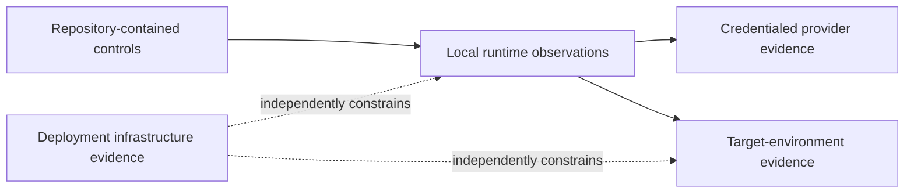

# Verification Boundaries

> [!IMPORTANT]
> Verification is meaningful only when the **evidence source** and **trust owner** are explicit. Implementation presence, configuration presence, and neighboring green signals are not substitutes for evidence that belongs to another trust domain.

**ƳƤ AI QA Automation Framework** · Designed and engineered by **Ƴunior Ƥortal (ƳƤ)**

[Documentation home](README.md) · [Production readiness](PRODUCTION_READINESS.md) · [Result contract](RESULT_CONTRACT.md) · [Traceability](TRACEABILITY.md)

---

## The evidence ownership model

The framework separates five evidence domains:

| Evidence class | Primary owner | Examples |
|---|---|---|
| **Repository-contained** | deterministic framework code/config/tests/evaluators | policy, result logic, state/evidence contracts, change intelligence |
| **Local runtime** | executable/runtime environment | Python, Chromium, Docker, k6, Appium/runtime visibility |
| **Credentialed provider** | authorized provider session | Claude, GitHub MCP, Atlassian MCP interactions |
| **Target environment** | selected SUT/test environment | browser/API behavior, load metrics, app/device behavior |
| **Deployment infrastructure** | organization/platform | process/container isolation, egress, identity, secrets, retention |

A capability may span several classes. The framework keeps those contributions separate rather than declaring the whole capability “verified” from one layer alone.

---

## Repository-contained controls

The codebase defines deterministic contracts for areas including:

- typed state, evidence, validation, provider, policy, and terminal outcomes;
- terminal truth with gate identity + revision supersession;
- exact-path binding between mutation, patch-safety, and targeted pytest evidence;
- failure classification and insufficient-evidence handling;
- deterministic locator parsing/semantic scoring;
- same-DOM Playwright locator verification;
- guarded self-healing authorization;
- coverage search, conservative generation planning, and test-quality review;
- regression prioritization with uncertainty broadening;
- canonical hostname/IP validation;
- path/tool/MCP/API/performance authorization;
- recursive redaction and credential-minimal subprocess environments;
- evidence/artifact confinement and immutability;
- hash-chained journals and regulated audit records;
- workspace lease, fingerprint, transaction, rollback, and stale recovery logic;
- symlink-resistant ownership for mutation, rollback, evidence, journal, lease, recovery, and attestation subjects;
- merge-base change intelligence, CODEOWNERS, test impact, and OpenAPI drift;
- unsigned run-attestation logic with artifact-byte verification;
- fixed primary and independent holdout evaluators;
- deterministic reference-SUT behavior.

These are **framework contracts**. Their existence does not by itself prove a particular runtime/provider/target execution occurred.

---

## Local runtime evidence

Some execution surfaces require locally observable components even when no remote account is involved:

- Python/package environment;
- Playwright browser executable;
- Docker for the configured GitHub MCP container path;
- k6 executable;
- Appium/device tooling;
- Git repository/worktree support.

`ai-qa doctor` reports what the current environment can actually observe. Package/executable presence does not become provider authentication evidence.

---

## Credentialed provider evidence

Credentialed evidence belongs to an authorized interaction:

- Claude Agent SDK behavior with model credentials;
- GitHub MCP behavior with an authorized GitHub identity/token and provider call;
- Atlassian Rovo MCP behavior with an authorized site/session and provider call.

The framework records provider `AVAILABLE` only after an observed successful interaction. Local configuration does not manufacture availability, and a provider outcome does not become the QA terminal outcome.

---

## Target-environment evidence

Target-specific evidence includes:

- Playwright behavior against the selected application;
- API authentication/data/business behavior;
- k6 metrics against the approved workload;
- Appium behavior against a selected app/device environment;
- database/cache/queue/external-dependency behavior;
- application authorization and data-classification rules.

Reference fixtures prove framework mechanics for the fixture behavior they exercise. They do not define arbitrary external systems.

---

## Deployment-infrastructure evidence

Repository code can demand prerequisites and refuse unsafe operations, but it does not pretend to own infrastructure outside its process boundary.

Deployment evidence includes:

- process/container/VM isolation;
- non-root/security context;
- firewall/proxy/egress enforcement;
- identity and secret lifecycle;
- provider-side authentication/authorization;
- artifact encryption/access/retention;
- trusted runner/CI infrastructure;
- device/cloud security posture;
- legal/compliance controls;
- incident-response and availability controls.

> [!CAUTION]
> `AI_QA_K6_EXTERNAL_EGRESS_ENFORCED=true` is a prerequisite assertion, not a firewall. The deployment must actually provide egress containment for every k6 execution.

---

## Capability/evidence matrix

| Capability | Framework-owned contract | Environment/provider-owned evidence |
|---|---|---|
| Claude reasoning loop | Agent SDK orchestration, policy, result semantics | credentialed provider interaction |
| Terminal truth | gate/revision/path lineage and deterministic derivation | actual validation observations for the run |
| Autonomous mutation | Python-path authority, lease/fingerprint, transaction/rollback, exact-path pytest closure | filesystem/process isolation around runtime |
| GitHub MCP | official config, action policy, failure normalization | auth, permissions, provider responses |
| Atlassian MCP | official endpoint config, action policy, failure normalization | auth/session, site permissions, provider responses |
| Network policy | canonical host validation + adapter authorization | DNS/routing/firewall/proxy enforcement |
| Playwright | navigation/subresource/WebSocket policy + locator evidence contract | browser runtime + target app behavior |
| API | host/method policy + bounded evidence capture | target auth/data/service behavior |
| k6 | non-production/host/script/threshold policy + universal egress prerequisite | executable, approved target, actual infrastructure egress |
| Appium | runtime/capability inspection boundary | app/device/emulator/cloud session |
| Secret safety | protected paths, redaction, minimal subprocess env | organization secret manager, rotation, access policy |
| Traceability | manifests, hashes, journal, lineage, artifact-verifying unsigned attestation | external signing/identity/timestamping when required |
| Evaluation | fixed primary/holdout definitions and hard-safety scoring | execution results for a specific revision/environment |

---

## Artifact and attestation boundary

Text evidence is sanitized/redacted on supported model-facing/text persistence paths. Binary screenshots and similar artifacts remain explicitly `RAW` and require deployment-level storage/access/retention controls.

Hashing and hash chaining establish internal integrity properties. The unsigned attestation can additionally verify owned persisted subjects, journal linkage, pending-mutation state, and registered artifact bytes.

Those properties still do **not** create:

- a trusted external signer;
- an external timestamp authority;
- identity attribution;
- test correctness;
- provider authentication;
- environment assurance;
- compliance certification.

---

## Claim discipline

Use the narrowest statement that matches the evidence owner.

| Claim | Required evidence owner |
|---|---|
| “The control exists.” | repository source/configuration |
| “The deterministic behavior occurred.” | execution/evaluation for the exercised path |
| “The provider was available.” | authorized provider interaction |
| “The target behaved this way.” | target-specific observation |
| “The deployment enforces this boundary.” | infrastructure/organization evidence |
| “These persisted bytes are intact.” | owned subject + hash/journal/artifact verification |
| “This run succeeded.” | current deterministic validation closure under [`RESULT_CONTRACT.md`](RESULT_CONTRACT.md) |

> [!TIP]
> Strong architecture should make it easier to say **exactly what is known**, not easier to overclaim.

---

## Reviewer checklist

When reviewing a claim, ask:

1. **What object is being claimed about?**
2. **Which trust domain owns the evidence?**
3. **Was the evidence observed for this revision/environment/provider?**
4. **Can a neighboring green signal be mistaken for this evidence?**
5. **Does integrity prove only bytes, or is someone accidentally treating it as correctness/identity?**
6. **Does configuration state merely permit an action, or prove it occurred?**
7. **If deployment enforcement is required, is it actually external to the application flag?**

---

## Related documentation

- [Production readiness](PRODUCTION_READINESS.md)
- [Runtime result contract](RESULT_CONTRACT.md)
- [Traceability](TRACEABILITY.md)
- [Security architecture](SECURITY.md)
- [Setup](SETUP.md)
- [Operations](OPERATIONS.md)

---

[← Production readiness](PRODUCTION_READINESS.md) · [Documentation home](README.md)

Copyright (c) 2026 Ƴunior Ƥortal (ƳƤ). See [`../LICENSE`](../LICENSE).
